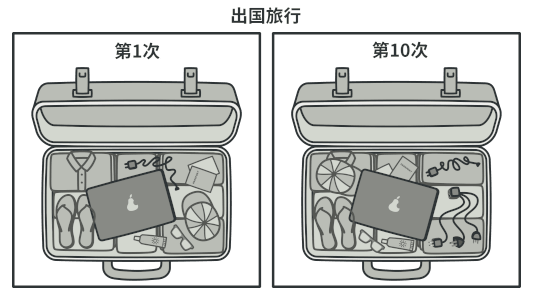

# 适配器模式

亦称：封装器模式、Wrapper、Adapter

&nbsp;

##  意图

**适配器模式**是一种结构型设计模式， 它能使接口不兼容的对象能够相互合作。


&nbsp;

##  问题

假如你正在开发一款股票市场监测程序， 它会从不同来源下载 XML 格式的股票数据， 然后向用户呈现出美观的图表。

在开发过程中， 你决定在程序中整合一个第三方智能分析函数库。 但是遇到了一个问题， 那就是分析函数库只兼容  JSON 格式的数据。


你无法 “直接” 使用分析函数库， 因为它所需的输入数据格式与你的程序不兼容。

你可以修改程序库来支持 XML。 但是， 这可能需要修改部分依赖该程序库的现有代码。 甚至还有更糟糕的情况， 你可能根本没有程序库的源代码， 从而无法对其进行修改。

&nbsp;

##  解决方案

你可以创建一个*Adapter*。 这是一个特殊的对象， 能够转换对象接口， 使其能与其他对象进行交互。

Adapter Pattern 通过封装对象将复杂的转换过程隐藏于幕后。 被封装的对象甚至察觉不到适配器的存在。 例如， 你可以使用一个将所有数据转换为英制单位 （如英尺和英里） 的适配器封装运行于米和千米单位制中的对象。

Adapter 不仅可以转换不同格式的数据， 其还有助于采用不同接口的对象之间的合作。 它的运作方式如下：

1. Adapter 实现与其中一个现有对象兼容的接口。
2. 现有对象可以使用该接口安全地调用 Adapter 方法。
3. Adapter 方法被调用后将以另一个对象兼容的格式和顺序将请求传递给该对象。

&nbsp;

有时你甚至可以创建一个双向适配器来实现双向转换调用。


&nbsp;

让我们回到股票市场程序。 为了解决数据格式不兼容的问题， 你可以为分析函数库中的每个类创建将 XML 转换为 JSON 格式的适配器， 然后让客户端仅通过这些适配器来与函数库进行交流。 当某个适配器被调用时， 它会将传入的 XML 数据转换为 JSON 结构， 并将其传递给被封装分析对象的相应方法。

&nbsp;

##  真实世界类比



出国旅行前后的旅行箱。

如果你是第一次从美国到欧洲旅行， 那么在给笔记本充电时可能会大吃一惊。 不同国家的电源插头和插座标准不同。 美国插头和德国插座不匹配。 同时提供美国标准插座和欧洲标准插头的电源适配器可以解决你的难题。

&nbsp;

##  Adapter Pattern

#### 对象 Adapter

实现时使用了构成原则： Adapter 实现了其中一个对象的接口， 并对另一个对象进行封装。 所有流行的编程语言都可以实现 Adapter。


&nbsp;

1. **客户端** （Client） 是包含当前程序业务逻辑的类。
2. **客户端接口** （Client Interface） 描述了其他类与客户端代码合作时必须遵循的协议。
3. **服务** （Service） 中有一些功能类 （通常来自第三方或遗留系统）。 客户端与其接口不兼容， 因此无法直接调用其功能。
4. **适配器** （Adapter） 是一个可以同时与客户端和服务交互的类： 它在实现客户端接口的同时封装了服务对象。 适配器接受客户端通过适配器接口发起的调用， 并将其转换为适用于被封装服务对象的调用。
5. client 代码只需通过接口与 Adapter 交互即可， 无需与具体的 Adapter 类耦合。 因此， 你可以向程序中添加新类型的 Adapter 而无需修改已有代码。 这在服务类的接口被更改或替换时很有用： 你无需修改 client 代码就可以创建新的 Adapter 类。

&nbsp;

#### 类适配器

这一实现使用了继承机制： 适配器同时继承两个对象的接口。 请注意， 这种方式仅能在支持多重继承的编程语言中实现， 例如 C++。


1. **类Adapter ** 不需要封装任何对象， 因为它同时继承了 Client 和 Server 的行为。 适配功能在重写的方法中完成。 最后生成的 Adapter 可替代已有的 client 类进行使用。

&nbsp;

##  伪代码

下列**适配器**模式演示基于经典的 “方钉和圆孔” 问题。


让方钉适配圆孔。

适配器假扮成一个圆钉 （`Round­Peg`）， 其半径等于方钉 （`Square­Peg`） 横截面对角线的一半 （即能够容纳方钉的最小外接圆的半径）。

```c
// 假设你有两个接口相互兼容的类：圆孔（Round­Hole）和圆钉（Round­Peg）。
class RoundHole is
    constructor RoundHole(radius) { ... }

    method getRadius() is
        // 返回孔的半径。

    method fits(peg: RoundPeg) is
        return this.getRadius() >= peg.getRadius()

class RoundPeg is
    constructor RoundPeg(radius) { ... }

    method getRadius() is
        // 返回钉子的半径。


// 但还有一个不兼容的类：方钉（Square­Peg）。
class SquarePeg is
    constructor SquarePeg(width) { ... }

    method getWidth() is
        // 返回方钉的宽度。


// 适配器类让你能够将方钉放入圆孔中。它会对 RoundPeg 类进行扩展，以接收适
// 配器对象作为圆钉。
class SquarePegAdapter extends RoundPeg is
    // 在实际情况中，适配器中会包含一个 SquarePeg 类的实例。
    private field peg: SquarePeg

    constructor SquarePegAdapter(peg: SquarePeg) is
        this.peg = peg

    method getRadius() is
        // 适配器会假扮为一个圆钉，
        // 其半径刚好能与适配器实际封装的方钉搭配起来。
        return peg.getWidth() * Math.sqrt(2) / 2


// 客户端代码中的某个位置。
hole = new RoundHole(5)
rpeg = new RoundPeg(5)
hole.fits(rpeg) // true

small_sqpeg = new SquarePeg(5)
large_sqpeg = new SquarePeg(10)
hole.fits(small_sqpeg) // 此处无法编译（类型不一致）。

small_sqpeg_adapter = new SquarePegAdapter(small_sqpeg)
large_sqpeg_adapter = new SquarePegAdapter(large_sqpeg)
hole.fits(small_sqpeg_adapter) // true
hole.fits(large_sqpeg_adapter) // false
```

&nbsp;

##  适配器模式适合应用场景

 当你希望使用某个类， 但是其接口与其他代码不兼容时， 可以使用 Adapter 类。

Adapter Pattern 允许你创建一个中间层类， 其可作为代码与遗留类、 第三方类或提供怪异接口的类之间的转换器。

 如果您需要复用这样一些类， 他们处于同一个继承体系， 并且他们又有了额外的一些共同的方法， 但是这些共同的方法不是所有在这一继承体系中的子类所具有的共性。

 你可以扩展每个子类， 将缺少的功能添加到新的子类中。 但是， 你必须在所有新子类中重复添加这些代码， 这样会使得代码有坏味道。

将缺失功能添加到一个适配器类中是一种优雅得多的解决方案。 然后你可以将缺少功能的对象封装在适配器中， 从而动态地获取所需功能。 如要这一点正常运作， 目标类必须要有通用接口， 适配器的成员变量应当遵循该通用接口。 这种方式同 Decorator Pattern 非常相似。

&nbsp;

##  实现方式

1. 确保至少有两个类的接口不兼容：
   - 一个无法修改 （通常是第三方、 遗留系统或者存在众多已有依赖的类） 的功能性*服务*类。
   - 一个或多个将受益于使用服务类的*客户端*类。
2. 声明客户端接口， 描述客户端如何与服务交互。
3. 创建遵循客户端接口的适配器类。 所有方法暂时都为空。
4. 在适配器类中添加一个成员变量用于保存对于服务对象的引用。 通常情况下会通过构造函数对该成员变量进行初始化， 但有时在调用其方法时将该变量传递给适配器会更方便。
5. 依次实现适配器类客户端接口的所有方法。 适配器会将实际工作委派给服务对象， 自身只负责接口或数据格式的转换。
6. 客户端必须通过客户端接口使用适配器。 这样一来， 你就可以在不影响客户端代码的情况下修改或扩展适配器。

&nbsp;

##  适配器模式优缺点

-  √ _单一职责原则_ 你可以将接口或数据转换代码从程序主要业务逻辑中分离。
-  √ *开闭原则*。 只要客户端代码通过客户端接口与适配器进行交互， 你就能在不修改现有客户端代码的情况下在程序中添加新类型的适配器。
-  × 代码整体复杂度增加， 因为你需要新增一系列接口和类。 有时直接更改服务类使其与其他代码兼容会更简单。

&nbsp;

##  与其他模式的关系

-  `Bridge`  通常会于开发前期进行设计， 使你能够将程序的各个部分独立开来以便开发。 另一方面， `Adapter Pattern` 通常在已有程序中使用， 让相互不兼容的类能很好地合作。
-  `Adapter` 可以对已有对象的接口进行修改， Decorator Pattern 则能在不改变对象接口的前提下强化对象功能。 此外， Decorator 还支持递归组合， *Adapter* 则无法实现。
-  `Adapter` 能为被封装对象提供不同的接口，代理模式能为对象提供相同的接口， 装饰则能为对象提供加强的接口。
- 外观模式为现有对象定义了一个新接口，  Adapter 则会试图运用已有的接口。 *Adapter* 通常只封装一个对象， *外观*通常会作用于整个对象子系统上。
- Bridge Pattern、 State Pattern 和 Strategy Pattern （在某种程度上包括 Adapter ） 模式的接口非常相似。 实际上， 它们都基于 Conposite Pattern - 即将工作委派给其他对象， 不过也各自解决了不同的问题。 模式并不只是以特定方式组织代码的配方， 你还可以使用它们来和其他开发者讨论模式所解决的问题。

&nbsp;

##  代码示例

# Java Adapter Pattern 讲解和代码示例

**Adapter** 是一种结构型设计模式， 它能使不兼容的对象能够相互合作。

Adapter 可担任两个对象间的封装器， 它会接收对于一个对象的调用， 并将其转换为另一个对象可识别的格式和接口。

&nbsp;

## 在 Java 中使用模式

**使用示例：** 适配器模式在 Java 代码中很常见。 基于一些遗留代码的系统常常会使用该模式。 在这种情况下， 适配器让遗留代码与现代的类得以相互合作。

Java 核心程序库中有一些标准的适配器：

- [`java.util.Arrays#asList()`](https://docs.oracle.com/javase/8/docs/api/java/util/Arrays.html#asList-T...-)
- [`java.util.Collections#list()`](https://docs.oracle.com/javase/8/docs/api/java/util/Collections.html#list-java.util.Enumeration-)
- [`java.util.Collections#enumeration()`](https://docs.oracle.com/javase/8/docs/api/java/util/Collections.html#enumeration-java.util.Collection-)
- [`java.io.InputStreamReader(InputStream)`](https://docs.oracle.com/javase/8/docs/api/java/io/InputStreamReader.html#InputStreamReader-java.io.InputStream-) （返回 `Reader`对象）
- [`java.io.OutputStreamWriter(OutputStream)`](https://docs.oracle.com/javase/8/docs/api/java/io/OutputStreamWriter.html#OutputStreamWriter-java.io.OutputStream-) （返回 `Writer`对象）
- [`javax.xml.bind.annotation.adapters.XmlAdapter#marshal()`](https://docs.oracle.com/javase/8/docs/api/javax/xml/bind/annotation/adapters/XmlAdapter.html#marshal-BoundType-) 和 `#unmarshal()`

**识别方法：** 适配器可以通过以不同抽象或接口类型实例为参数的构造函数来识别。 当适配器的任何方法被调用时， 它会将参数转换为合适的格式， 然后将调用定向到其封装对象中的一个或多个方法。

&nbsp;

## 让方钉适配圆孔

这个简单的例子展示了适配器如何让不兼容的对象相互合作。

&nbsp;

##  **round**

####  **round/RoundHole.java:** 圆孔

```java
package refactoring_guru.adapter.example.round;

/**
 * RoundHoles are compatible with RoundPegs.
 */
public class RoundHole {
    private double radius;

    public RoundHole(double radius) {
        this.radius = radius;
    }

    public double getRadius() {
        return radius;
    }

    public boolean fits(RoundPeg peg) {
        boolean result;
        result = (this.getRadius() >= peg.getRadius());
        return result;
    }
}
```

&nbsp;

####  **round/RoundPeg.java:** 圆钉

```java
package refactoring_guru.adapter.example.round;

/**
 * RoundPegs are compatible with RoundHoles.
 */
public class RoundPeg {
    private double radius;

    public RoundPeg() {}

    public RoundPeg(double radius) {
        this.radius = radius;
    }

    public double getRadius() {
        return radius;
    }
}
```

&nbsp;

##  **square**

####  **square/SquarePeg.java:** 方钉

```java
package refactoring_guru.adapter.example.square;

/**
 * SquarePegs are not compatible with RoundHoles (they were implemented by
 * previous development team). But we have to integrate them into our program.
 */
public class SquarePeg {
    private double width;

    public SquarePeg(double width) {
        this.width = width;
    }

    public double getWidth() {
        return width;
    }

    public double getSquare() {
        double result;
        result = Math.pow(this.width, 2);
        return result;
    }
}
```

&nbsp;

##  **adapters**

####  **adapters/SquarePegAdapter.java:** 方钉到圆孔的适配器

```java
package refactoring_guru.adapter.example.adapters;

import refactoring_guru.adapter.example.round.RoundPeg;
import refactoring_guru.adapter.example.square.SquarePeg;

/**
 * Adapter allows fitting square pegs into round holes.
 */
public class SquarePegAdapter extends RoundPeg {
    private SquarePeg peg;

    public SquarePegAdapter(SquarePeg peg) {
        this.peg = peg;
    }

    @Override
    public double getRadius() {
        double result;
        // Calculate a minimum circle radius, which can fit this peg.
        result = (Math.sqrt(Math.pow((peg.getWidth() / 2), 2) * 2));
        return result;
    }
}
```

&nbsp;

####  **Demo.java:** 客户端代码

```java
package refactoring_guru.adapter.example;

import refactoring_guru.adapter.example.adapters.SquarePegAdapter;
import refactoring_guru.adapter.example.round.RoundHole;
import refactoring_guru.adapter.example.round.RoundPeg;
import refactoring_guru.adapter.example.square.SquarePeg;

/**
 * Somewhere in client code...
 */
public class Demo {
    public static void main(String[] args) {
        // Round fits round, no surprise.
        RoundHole hole = new RoundHole(5);
        RoundPeg rpeg = new RoundPeg(5);
        if (hole.fits(rpeg)) {
            System.out.println("Round peg r5 fits round hole r5.");
        }

        SquarePeg smallSqPeg = new SquarePeg(2);
        SquarePeg largeSqPeg = new SquarePeg(20);
        // hole.fits(smallSqPeg); // Won't compile.

        // Adapter solves the problem.
        SquarePegAdapter smallSqPegAdapter = new SquarePegAdapter(smallSqPeg);
        SquarePegAdapter largeSqPegAdapter = new SquarePegAdapter(largeSqPeg);
        if (hole.fits(smallSqPegAdapter)) {
            System.out.println("Square peg w2 fits round hole r5.");
        }
        if (!hole.fits(largeSqPegAdapter)) {
            System.out.println("Square peg w20 does not fit into round hole r5.");
        }
    }
}
```

&nbsp;

####  **OutputDemo.txt:** 执行结果

```ABAP
Round peg r5 fits round hole r5.
Square peg w2 fits round hole r5.
Square peg w20 does not fit into round hole r5.
```

