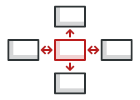

# 行为模式

行为模式负责对象间的高效沟通和职责委派。

- [13 - Chain of Responsibility](design-patterns-chain-of-responsibility.md) 
  - 允许你将请求沿着处理者链进行发送。 收到请求后， 每个处理者均可对请求进行处理， 或将其传递给链上的下个处理者。

&nbsp;

- [14- Command Pattern](design-patterns-command.md)
  - 它可将请求转换为一个包含与请求相关的所有信息的独立对象。 该转换让你能根据不同的请求将方法参数化、 延迟请求执行或将其放入队列中， 且能实现可撤销操作。

&nbsp;

- [15 - Mediator Pattern](design-patterns-mediator.md)
  - 能让你减少对象之间混乱无序的依赖关系。 该模式会限制对象之间的直接交互， 迫使它们通过一个中介者对象进行合作。

&nbsp;

- [16 - Visitor Pattern](design-patterns-visitor.md)
  - Visitor Pattern 将算法与其所作用的对象隔离开来。
  - [访问者和双分派](design-patterns-visitor-double-dispatch.md)

&nbsp;

- [17 - Memento Pattern](design-patterns-memento.md)
  -  `Memento` 允许在不暴露对象实现细节的情况下保存和恢复对象之前的状态。

&nbsp;

- [18 - Observer Pattern](design-patterns-observer.md)
  - `Observer` 允许你定义一种订阅机制， 可在对象事件发生时通知多个 "观察" 该对象的其他对象。

&nbsp;

- [19 - State Pattern](design-patterns-state.md)
  -  `State` 让你能在一个对象的内部状态变化时改变其行为， 使其看上去就像改变了自身所属的类一样。

&nbsp;

- [20 - Iterator Pattern](design-patterns-iterator.md)
  - Iterator 让你能在不暴露集合底层表现形式 （列表、 栈和树等) 的情况下遍历集合中所有的元素。

&nbsp;

- [21 - Strategy Pattern](design-patterns-strategy.md)
  -  `Strategy`  能让你定义一系列算法， 并将每种算法分别放入独立的类中， 以使算法的对象能够相互替换。

&nbsp;

- [22 - Template Method](design-patterns-template-method.md)
  -  `Template Method` 在超类中定义一个算法的框架， 允许子类在不修改结构的情况下重写算法的特定步骤。