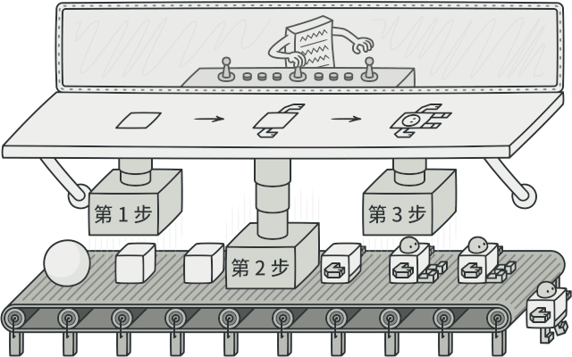
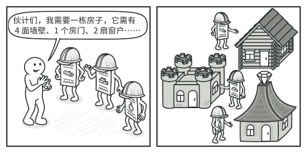
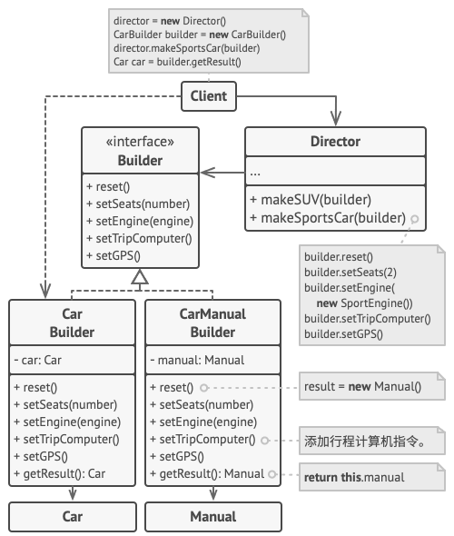

# 生成器模式

亦称：建造者模式、Builder

&nbsp;

##  意图

**Builder 模式** 是一种创建型设计模式， 使你能够分步骤创建复杂对象。 该模式允许你使用相同的创建代码生成不同类型和形式的对象。



&nbsp;

##  问题

假设有这样一个复杂对象， 在对其进行构造时需要对诸多成员变量和嵌套对象进行繁复的初始化工作。 这些初始化代码通常深藏于一个包含众多参数且让人基本看不懂的构造函数中； 甚至还有更糟糕的情况， 那就是这些代码散落在 client 代码的多个位置。

&nbsp;


&nbsp;&nbsp;

如果为每种可能的对象都创建一个子类， 这可能会导致程序变得过于复杂。

例如， 我们来思考如何创建一个 `房屋`House对象。 建造一栋简单的房屋， 首先你需要建造四面墙和地板， 安装房门和一套窗户， 然后再建造一个屋顶。 但是如果你想要一栋更宽敞更明亮的房屋， 还要有院子和其他设施 （例如暖气、 排水和供电设备）， 那又该怎么办呢？

最简单的方法是扩展 `房屋`基类， 然后创建一系列涵盖所有参数组合的子类。 但最终你将面对相当数量的子类。 任何新增的参数 （例如门廊类型） 都会让这个层次结构更加复杂。

另一种方法则无需生成子类。 你可以在 `房屋`基类中创建一个包括所有可能参数的超级构造函数， 并用它来控制房屋对象。 这种方法确实可以避免生成子类， 但它却会造成另外一个问题。


&nbsp;

拥有大量输入参数的构造函数也有缺陷： 这些参数也不是每次都要全部用上的。

通常情况下， 绝大部分的参数都没有使用， 这使得对于构造函数的调用十分不简洁。 例如， 只有很少的房子有游泳池， 因此与游泳池相关的参数十之八九是毫无用处的。

&nbsp;

##  解决方案

生成器模式建议将对象构造代码从产品类中抽取出来， 并将其放在一个名为*生成器*的独立对象中。


&nbsp;

生成器模式让你能够分步骤创建复杂对象。 生成器不允许其他对象访问正在创建中的产品。

该模式会将对象构造过程划分为一组步骤， 比如 `build­Walls` 创建墙壁和 `build­Door` 创建房门创建房门等。 每次创建对象时， 你都需要通过生成器对象执行一系列步骤。 重点在于你无需调用所有步骤， 而只需调用创建特定对象配置所需的那些步骤即可。

当你需要创建不同形式的产品时， 其中的一些构造步骤可能需要不同的实现。 例如， 木屋的房门可能需要使用木头制造， 而城堡的房门则必须使用石头制造。

在这种情况下， 你可以创建多个不同的生成器， 用不同方式实现一组相同的创建步骤。 然后你就可以在创建过程中使用这些生成器 （例如按顺序调用多个构造步骤） 来生成不同类型的对象。



&nbsp;

不同生成器以不同方式执行相同的任务。

例如， 假设第一个建造者使用木头和玻璃制造房屋， 第二个建造者使用石头和钢铁， 而第三个建造者使用黄金和钻石。 在调用同一组步骤后， 第一个建造者会给你一栋普通房屋， 第二个会给你一座小城堡， 而第三个则会给你一座宫殿。 但是， 只有在调用构造步骤的客户端代码可以通过通用接口与建造者进行交互时， 这样的调用才能返回需要的房屋。

&nbsp;

#### 主管

你可以进一步将用于创建产品的一系列生成器步骤调用抽取成为单独的*主管*类。 主管类可定义创建步骤的执行顺序， 而生成器则提供这些步骤的实现。


&nbsp;

主管知道需要哪些创建步骤才能获得可正常使用的产品。

严格来说， 你的程序中并不一定需要主管类。 client 代码可直接以特定顺序调用创建步骤。 不过， 主管类中非常适合放入各种例行构造流程， 以便在程序中反复使用。

此外， 对于 client 代码来说， 主管类完全隐藏了产品构造细节。 client 只需要将一个生成器与主管类关联， 然后使用主管类来构造产品， 就能从生成器处获得构造结果了。

&nbsp;

##  生成器模式结构


1. **生成器** （Builder） 接口声明在所有类型生成器中通用的产品构造步骤。
2. **具体生成器** （Concrete Builders） 提供构造过程的不同实现。 具体生成器也可以构造不遵循通用接口的产品。
3. **产品** （Products） 是最终生成的对象。 由不同生成器构造的产品无需属于同一类层次结构或接口。
4. **主管** （Director） 类定义调用构造步骤的顺序， 这样你就可以创建和复用特定的产品配置。
5. **客户端** （Client） 必须将某个生成器对象与主管类关联。 一般情况下， 你只需通过主管类构造函数的参数进行一次性关联即可。 此后主管类就能使用生成器对象完成后续所有的构造任务。 但在客户端将生成器对象传递给主管类制造方法时还有另一种方式。 在这种情况下， 你在使用主管类生产产品时每次都可以使用不同的生成器。

&nbsp;

##  伪代码

下面关于**生成器**模式的例子演示了你可以如何复用相同的对象构造代码来生成不同类型的产品——例如汽车 （Car）——及其相应的使用手册 （Manual）。



分步骤制造汽车并制作对应型号用户使用手册的示例

汽车是一个复杂对象， 有数百种不同的制造方法。 我们没有在 `汽车`类中塞入一个巨型构造函数， 而是将汽车组装代码抽取到单独的汽车生成器类中。 该类中有一组方法可用来配置汽车的各种部件。

如果客户端代码需要组装一辆与众不同、 精心调教的汽车， 它可以直接调用生成器。 或者， 客户端可以将组装工作委托给主管类， 因为主管类知道如何使用生成器制造最受欢迎的几种型号汽车。

你或许会感到吃惊， 但确实每辆汽车都需要一本使用手册 （说真的， 谁会去读它们呢？）。 使用手册会介绍汽车的每一项功能， 因此不同型号的汽车， 其使用手册内容也不一样。 因此， 你可以复用现有流程来制造实际的汽车及其对应的手册。 当然， 编写手册和制造汽车不是一回事， 所以我们需要另外一个生成器对象来专门编写使用手册。 该类与其制造汽车的兄弟类都实现了相同的制造方法， 但是其功能不是制造汽车部件， 而是描述每个部件。 将这些生成器传递给相同的主管对象， 我们就能够生成一辆汽车或是一本使用手册了。

最后一个部分是获取结果对象。 尽管金属汽车和纸质手册存在关联， 但它们却是完全不同的东西。 我们无法在主管类和具体产品类不发生耦合的情况下， 在主管类中提供获取结果对象的方法。 因此， 我们只能通过负责制造过程的生成器来获取结果对象。

```
// 只有当产品较为复杂且需要详细配置时，使用生成器模式才有意义。下面的两个
// 产品尽管没有同样的接口，但却相互关联。
class Car is
    // 一辆汽车可能配备有 GPS 设备、行车电脑和几个座位。不同型号的汽车（
    // 运动型轿车、SUV 和敞篷车）可能会安装或启用不同的功能。

class Manual is
    // 用户使用手册应该根据汽车配置进行编制，并介绍汽车的所有功能。


// 生成器接口声明了创建产品对象不同部件的方法。
interface Builder is
    method reset()
    method setSeats(...)
    method setEngine(...)
    method setTripComputer(...)
    method setGPS(...)

// 具体生成器类将遵循生成器接口并提供生成步骤的具体实现。你的程序中可能会
// 有多个以不同方式实现的生成器变体。
class CarBuilder implements Builder is
    private field car:Car

    // 一个新的生成器实例必须包含一个在后续组装过程中使用的空产品对象。
    constructor CarBuilder() is
        this.reset()

    // reset（重置）方法可清除正在生成的对象。
    method reset() is
        this.car = new Car()

    // 所有生成步骤都会与同一个产品实例进行交互。
    method setSeats(...) is
        // 设置汽车座位的数量。

    method setEngine(...) is
        // 安装指定的引擎。

    method setTripComputer(...) is
        // 安装行车电脑。

    method setGPS(...) is
        // 安装全球定位系统。

    // 具体生成器需要自行提供获取结果的方法。这是因为不同类型的生成器可能
    // 会创建不遵循相同接口的、完全不同的产品。所以也就无法在生成器接口中
    // 声明这些方法（至少在静态类型的编程语言中是这样的）。
    //
    // 通常在生成器实例将结果返回给客户端后，它们应该做好生成另一个产品的
    // 准备。因此生成器实例通常会在 `getProduct（获取产品）`方法主体末尾
    // 调用重置方法。但是该行为并不是必需的，你也可让生成器等待客户端明确
    // 调用重置方法后再去处理之前的结果。
    method getProduct():Car is
        product = this.car
        this.reset()
        return product

// 生成器与其他创建型模式的不同之处在于：它让你能创建不遵循相同接口的产品。
class CarManualBuilder implements Builder is
    private field manual:Manual

    constructor CarManualBuilder() is
        this.reset()

    method reset() is
        this.manual = new Manual()

    method setSeats(...) is
        // 添加关于汽车座椅功能的文档。

    method setEngine(...) is
        // 添加关于引擎的介绍。

    method setTripComputer(...) is
        // 添加关于行车电脑的介绍。

    method setGPS(...) is
        // 添加关于 GPS 的介绍。

    method getProduct():Manual is
        // 返回使用手册并重置生成器。


// 主管只负责按照特定顺序执行生成步骤。其在根据特定步骤或配置来生成产品时
// 会很有帮助。由于客户端可以直接控制生成器，所以严格意义上来说，主管类并
// 不是必需的。
class Director is
    private field builder:Builder

    // 主管可同由客户端代码传递给自身的任何生成器实例进行交互。客户端可通
    // 过这种方式改变最新组装完毕的产品的最终类型。
    method setBuilder(builder:Builder)
        this.builder = builder

    // 主管可使用同样的生成步骤创建多个产品变体。
    method constructSportsCar(builder: Builder) is
        builder.reset()
        builder.setSeats(2)
        builder.setEngine(new SportEngine())
        builder.setTripComputer(true)
        builder.setGPS(true)

    method constructSUV(builder: Builder) is
        // ...


// 客户端代码会创建生成器对象并将其传递给主管，然后执行构造过程。最终结果
// 将需要从生成器对象中获取。
class Application is

    method makeCar() is
        director = new Director()

        CarBuilder builder = new CarBuilder()
        director.constructSportsCar(builder)
        Car car = builder.getProduct()

        CarManualBuilder builder = new CarManualBuilder()
        director.constructSportsCar(builder)

        // 最终产品通常需要从生成器对象中获取，因为主管不知晓具体生成器和
        // 产品的存在，也不会对其产生依赖。
        Manual manual = builder.getProduct()
```

&nbsp;

##  Builder 模式适合应用场景

 使用 Builder 模式可避免 “重叠构造函数 （telescopic constructor）” 的出现。

 假设你的构造函数中有十个可选参数， 那么调用该函数会非常不方便； 因此， 你需要重载这个构造函数， 新建几个只有较少参数的简化版。 但这些构造函数仍需调用主构造函数， 传递一些默认数值来替代省略掉的参数。

```
class Pizza {
    Pizza(int size) { ... }
    Pizza(int size, boolean cheese) { ... }
    Pizza(int size, boolean cheese, boolean pepperoni) { ... }
    // ...
```

只有在 C# 或 Java 等支持方法重载的编程语言中才能写出如此复杂的构造函数。

生成器模式让你可以分步骤生成对象， 而且允许你仅使用必须的步骤。 应用该模式后， 你再也不需要将几十个参数塞进构造函数里了。

 当你希望使用代码创建不同形式的产品 （例如石头或木头房屋） 时， 可使用生成器模式。

 如果你需要创建的各种形式的产品， 它们的制造过程相似且仅有细节上的差异， 此时可使用生成器模式。

基本生成器接口中定义了所有可能的制造步骤， 具体生成器将实现这些步骤来制造特定形式的产品。 同时， 主管类将负责管理制造步骤的顺序。

 使用 Builder 构造 [组合](design-patterns-composite.md) 树或其他复杂对象。

 生成器模式让你能分步骤构造产品。 你可以延迟执行某些步骤而不会影响最终产品。 你甚至可以递归调用这些步骤， 这在创建对象树时非常方便。

生成器在执行制造步骤时， 不能对外发布未完成的产品。 这可以避免客户端代码获取到不完整结果对象的情况。

&nbsp;

## 实现方法

1. 清晰地定义通用步骤， 确保它们可以制造所有形式的产品。 否则你将无法进一步实施该模式。

2. 在基本生成器接口中声明这些步骤。

3. 为每个形式的产品创建具体生成器类， 并实现其构造步骤。

   不要忘记实现获取构造结果对象的方法。 你不能在生成器接口中声明该方法， 因为不同生成器构造的产品可能没有公共接口， 因此你就不知道该方法返回的对象类型。 但是， 如果所有产品都位于单一类层次中， 你就可以安全地在基本接口中添加获取生成对象的方法。

4. 考虑创建主管类。 它可以使用同一生成器对象来封装多种构造产品的方式。

5. 客户端代码会同时创建生成器和主管对象。 构造开始前， 客户端必须将生成器对象传递给主管对象。 通常情况下， 客户端只需调用主管类构造函数一次即可。 主管类使用生成器对象完成后续所有制造任务。 还有另一种方式， 那就是客户端可以将生成器对象直接传递给主管类的制造方法。

6. 只有在所有产品都遵循相同接口的情况下， 构造结果可以直接通过主管类获取。 否则， 客户端应当通过生成器获取构造结果。

&nbsp;

##  生成器模式优缺点

-  √ 你可以分步创建对象， 暂缓创建步骤或递归运行创建步骤。
-  √ 生成不同形式的产品时， 你可以复用相同的制造代码。
-  √ *单一职责原则*。 你可以将复杂构造代码从产品的业务逻辑中分离出来。
-  x 由于该模式需要新增多个类， 因此代码整体复杂程度会有所增加。

&nbsp;

##  与其他模式的关系

- 在许多设计工作的初期都会使用 [工厂方法模式](design-patterns-factory-method-pattern.md) （较为简单， 而且可以更方便地通过子类进行定制）， 随后演化为使用 [抽象工厂模式](design-patterns-abstract-factory.md)、 [原型模式](design-patterns-prototype.md) 或 Builder 模式（更灵活但更加复杂）。
- Builder重点关注如何分步生成复杂对象。 [抽象工厂](design-patterns-abstract-factory.md) 专门用于生产一系列相关对象。 *抽象工厂*会马上返回产品， 生成器则允许你在获取产品前执行一些额外构造步骤。
- 你可以在创建复杂 [组合模式](design-patterns-composite.md) 树时使用 Builder， 因为这可使其构造步骤以递归的方式运行。
- 你可以结合使用 Builder 和 [桥接模式](design-patterns-bridge.md)： *主管*类负责抽象工作， 各种不同的 Builder 负责实现工作。
- [抽象工厂](design-patterns-abstract-factory.md)、 Builder 和 [原型](design-patterns-prototype.md) 都可以用 [单例模式](design-patterns-singleton.md) 来实现。

&nbsp;

# **Builder** in Java

**Builder** is a creational design pattern, which allows constructing complex objects step by step.

Unlike other creational patterns, Builder doesn’t require products to have a common interface. That makes it possible to produce different products using the same construction process.

&nbsp;

## Usage of the pattern in Java

**Usage examples:** The Builder pattern is a well-known pattern in Java world. It’s especially useful when you need to create an object with lots of possible configuration options.

Builder is widely used in Java core libraries:

- [`java.lang.StringBuilder#append()`](https://docs.oracle.com/javase/8/docs/api/java/lang/StringBuilder.html#append-boolean-) (`unsynchronized`)
- [`java.lang.StringBuffer#append()`](https://docs.oracle.com/javase/8/docs/api/java/lang/StringBuffer.html#append-boolean-) (`synchronized`)
- [`java.nio.ByteBuffer#put()`](https://docs.oracle.com/javase/8/docs/api/java/nio/ByteBuffer.html#put-byte-) (also in [`CharBuffer`](https://docs.oracle.com/javase/8/docs/api/java/nio/CharBuffer.html#put-char-), [`ShortBuffer`](https://docs.oracle.com/javase/8/docs/api/java/nio/ShortBuffer.html#put-short-), [`IntBuffer`](https://docs.oracle.com/javase/8/docs/api/java/nio/IntBuffer.html#put-int-), [`LongBuffer`](https://docs.oracle.com/javase/8/docs/api/java/nio/LongBuffer.html#put-long-), [`FloatBuffer`](https://docs.oracle.com/javase/8/docs/api/java/nio/FloatBuffer.html#put-float-) and [`DoubleBuffer`](https://docs.oracle.com/javase/8/docs/api/java/nio/DoubleBuffer.html#put-double-))
- [`javax.swing.GroupLayout.Group#addComponent()`](https://docs.oracle.com/javase/8/docs/api/javax/swing/GroupLayout.Group.html#addComponent-java.awt.Component-)
- All implementations [`java.lang.Appendable`](https://docs.oracle.com/javase/8/docs/api/java/lang/Appendable.html)

**Identification:** The Builder pattern can be recognized in a class, which has a single creation method and several methods to configure the resulting object. Builder methods often support chaining (for example, `someBuilder->setValueA(1)->setValueB(2)->create()`).

&nbsp;

## Step-by-step car production

In this example, the Builder pattern allows step by step construction of different car models.

The example also shows how Builder produces products of different kinds (car manual) using the same building steps.

The Director controls the order of the construction. It knows which building steps to call to produce this or that car model. It works with builders only via their common interface. This allows passing different types of builders to the director.

The end result is retrieved from the builder object because the director can’t know the type of resulting product. Only the Builder object knows what does it build exactly.

&nbsp;

##  **builders**

####  **builders/Builder.java:** Common builder interface

```java
package refactoring_guru.builder.example.builders;

import refactoring_guru.builder.example.cars.CarType;
import refactoring_guru.builder.example.components.Engine;
import refactoring_guru.builder.example.components.GPSNavigator;
import refactoring_guru.builder.example.components.Transmission;
import refactoring_guru.builder.example.components.TripComputer;

/**
 * Builder interface defines all possible ways to configure a product.
 */
public interface Builder {
    void setCarType(CarType type);
    void setSeats(int seats);
    void setEngine(Engine engine);
    void setTransmission(Transmission transmission);
    void setTripComputer(TripComputer tripComputer);
    void setGPSNavigator(GPSNavigator gpsNavigator);
}
```

&nbsp;

####  **builders/CarBuilder.java:** Builder of car

```java
package refactoring_guru.builder.example.builders;

import refactoring_guru.builder.example.cars.Car;
import refactoring_guru.builder.example.cars.CarType;
import refactoring_guru.builder.example.components.Engine;
import refactoring_guru.builder.example.components.GPSNavigator;
import refactoring_guru.builder.example.components.Transmission;
import refactoring_guru.builder.example.components.TripComputer;

/**
 * Concrete builders implement steps defined in the common interface.
 */
public class CarBuilder implements Builder {
    private CarType type;
    private int seats;
    private Engine engine;
    private Transmission transmission;
    private TripComputer tripComputer;
    private GPSNavigator gpsNavigator;

    public void setCarType(CarType type) {
        this.type = type;
    }

    @Override
    public void setSeats(int seats) {
        this.seats = seats;
    }

    @Override
    public void setEngine(Engine engine) {
        this.engine = engine;
    }

    @Override
    public void setTransmission(Transmission transmission) {
        this.transmission = transmission;
    }

    @Override
    public void setTripComputer(TripComputer tripComputer) {
        this.tripComputer = tripComputer;
    }

    @Override
    public void setGPSNavigator(GPSNavigator gpsNavigator) {
        this.gpsNavigator = gpsNavigator;
    }

    public Car getResult() {
        return new Car(type, seats, engine, transmission, tripComputer, gpsNavigator);
    }
}
```

&nbsp;

####  **builders/CarManualBuilder.java:** Builder of a car manual

```java
package refactoring_guru.builder.example.builders;

import refactoring_guru.builder.example.cars.Manual;
import refactoring_guru.builder.example.cars.CarType;
import refactoring_guru.builder.example.components.Engine;
import refactoring_guru.builder.example.components.GPSNavigator;
import refactoring_guru.builder.example.components.Transmission;
import refactoring_guru.builder.example.components.TripComputer;

/**
 * Unlike other creational patterns, Builder can construct unrelated products,
 * which don't have the common interface.
 *
 * In this case we build a user manual for a car, using the same steps as we
 * built a car. This allows to produce manuals for specific car models,
 * configured with different features.
 */
public class CarManualBuilder implements Builder{
    private CarType type;
    private int seats;
    private Engine engine;
    private Transmission transmission;
    private TripComputer tripComputer;
    private GPSNavigator gpsNavigator;

    @Override
    public void setCarType(CarType type) {
        this.type = type;
    }

    @Override
    public void setSeats(int seats) {
        this.seats = seats;
    }

    @Override
    public void setEngine(Engine engine) {
        this.engine = engine;
    }

    @Override
    public void setTransmission(Transmission transmission) {
        this.transmission = transmission;
    }

    @Override
    public void setTripComputer(TripComputer tripComputer) {
        this.tripComputer = tripComputer;
    }

    @Override
    public void setGPSNavigator(GPSNavigator gpsNavigator) {
        this.gpsNavigator = gpsNavigator;
    }

    public Manual getResult() {
        return new Manual(type, seats, engine, transmission, tripComputer, gpsNavigator);
    }
}
```

&nbsp;

##  **cars**

####  **cars/Car.java:** Car product

```java
package refactoring_guru.builder.example.cars;

import refactoring_guru.builder.example.components.Engine;
import refactoring_guru.builder.example.components.GPSNavigator;
import refactoring_guru.builder.example.components.Transmission;
import refactoring_guru.builder.example.components.TripComputer;

/**
 * Car is a product class.
 */
public class Car {
    private final CarType carType;
    private final int seats;
    private final Engine engine;
    private final Transmission transmission;
    private final TripComputer tripComputer;
    private final GPSNavigator gpsNavigator;
    private double fuel = 0;

    public Car(CarType carType, int seats, Engine engine, Transmission transmission,
               TripComputer tripComputer, GPSNavigator gpsNavigator) {
        this.carType = carType;
        this.seats = seats;
        this.engine = engine;
        this.transmission = transmission;
        this.tripComputer = tripComputer;
        if (this.tripComputer != null) {
            this.tripComputer.setCar(this);
        }
        this.gpsNavigator = gpsNavigator;
    }

    public CarType getCarType() {
        return carType;
    }

    public double getFuel() {
        return fuel;
    }

    public void setFuel(double fuel) {
        this.fuel = fuel;
    }

    public int getSeats() {
        return seats;
    }

    public Engine getEngine() {
        return engine;
    }

    public Transmission getTransmission() {
        return transmission;
    }

    public TripComputer getTripComputer() {
        return tripComputer;
    }

    public GPSNavigator getGpsNavigator() {
        return gpsNavigator;
    }
}
```

&nbsp;

####  **cars/Manual.java:** Manual product

```java
package refactoring_guru.builder.example.cars;

import refactoring_guru.builder.example.components.Engine;
import refactoring_guru.builder.example.components.GPSNavigator;
import refactoring_guru.builder.example.components.Transmission;
import refactoring_guru.builder.example.components.TripComputer;

/**
 * Car manual is another product. Note that it does not have the same ancestor
 * as a Car. They are not related.
 */
public class Manual {
    private final CarType carType;
    private final int seats;
    private final Engine engine;
    private final Transmission transmission;
    private final TripComputer tripComputer;
    private final GPSNavigator gpsNavigator;

    public Manual(CarType carType, int seats, Engine engine, Transmission transmission,
                  TripComputer tripComputer, GPSNavigator gpsNavigator) {
        this.carType = carType;
        this.seats = seats;
        this.engine = engine;
        this.transmission = transmission;
        this.tripComputer = tripComputer;
        this.gpsNavigator = gpsNavigator;
    }

    public String print() {
        String info = "";
        info += "Type of car: " + carType + "\n";
        info += "Count of seats: " + seats + "\n";
        info += "Engine: volume - " + engine.getVolume() + "; mileage - " + engine.getMileage() + "\n";
        info += "Transmission: " + transmission + "\n";
        if (this.tripComputer != null) {
            info += "Trip Computer: Functional" + "\n";
        } else {
            info += "Trip Computer: N/A" + "\n";
        }
        if (this.gpsNavigator != null) {
            info += "GPS Navigator: Functional" + "\n";
        } else {
            info += "GPS Navigator: N/A" + "\n";
        }
        return info;
    }
}
```

&nbsp;

**cars/CarType.java**

```java
package refactoring_guru.builder.example.cars;

public enum CarType {
    CITY_CAR, SPORTS_CAR, SUV
}
```

&nbsp;

##  **components**

####  **components/Engine.java:** Product feature 1

```java
package refactoring_guru.builder.example.components;

/**
 * Just another feature of a car.
 */
public class Engine {
    private final double volume;
    private double mileage;
    private boolean started;

    public Engine(double volume, double mileage) {
        this.volume = volume;
        this.mileage = mileage;
    }

    public void on() {
        started = true;
    }

    public void off() {
        started = false;
    }

    public boolean isStarted() {
        return started;
    }

    public void go(double mileage) {
        if (started) {
            this.mileage += mileage;
        } else {
            System.err.println("Cannot go(), you must start engine first!");
        }
    }

    public double getVolume() {
        return volume;
    }

    public double getMileage() {
        return mileage;
    }
}
```

&nbsp;

####  **components/GPSNavigator.java:** Product feature 2

```java
package refactoring_guru.builder.example.components;

/**
 * Just another feature of a car.
 */
public class GPSNavigator {
    private String route;

    public GPSNavigator() {
        this.route = "221b, Baker Street, London  to Scotland Yard, 8-10 Broadway, London";
    }

    public GPSNavigator(String manualRoute) {
        this.route = manualRoute;
    }

    public String getRoute() {
        return route;
    }
}
```

&nbsp;

####  **components/Transmission.java:** Product feature 3

```java
package refactoring_guru.builder.example.components;

/**
 * Just another feature of a car.
 */
public enum Transmission {
    SINGLE_SPEED, MANUAL, AUTOMATIC, SEMI_AUTOMATIC
}
```

&nbsp;

####  **components/TripComputer.java:** Product feature 4

```java
package refactoring_guru.builder.example.components;

import refactoring_guru.builder.example.cars.Car;

/**
 * Just another feature of a car.
 */
public class TripComputer {

    private Car car;

    public void setCar(Car car) {
        this.car = car;
    }

    public void showFuelLevel() {
        System.out.println("Fuel level: " + car.getFuel());
    }

    public void showStatus() {
        if (this.car.getEngine().isStarted()) {
            System.out.println("Car is started");
        } else {
            System.out.println("Car isn't started");
        }
    }
}
```

&nbsp;

##  **director**

####  **director/Director.java:** Director controls builders

```java
package refactoring_guru.builder.example.director;

import refactoring_guru.builder.example.builders.Builder;
import refactoring_guru.builder.example.cars.CarType;
import refactoring_guru.builder.example.components.Engine;
import refactoring_guru.builder.example.components.GPSNavigator;
import refactoring_guru.builder.example.components.Transmission;
import refactoring_guru.builder.example.components.TripComputer;

/**
 * Director defines the order of building steps. It works with a builder object
 * through common Builder interface. Therefore it may not know what product is
 * being built.
 */
public class Director {

    public void constructSportsCar(Builder builder) {
        builder.setCarType(CarType.SPORTS_CAR);
        builder.setSeats(2);
        builder.setEngine(new Engine(3.0, 0));
        builder.setTransmission(Transmission.SEMI_AUTOMATIC);
        builder.setTripComputer(new TripComputer());
        builder.setGPSNavigator(new GPSNavigator());
    }

    public void constructCityCar(Builder builder) {
        builder.setCarType(CarType.CITY_CAR);
        builder.setSeats(2);
        builder.setEngine(new Engine(1.2, 0));
        builder.setTransmission(Transmission.AUTOMATIC);
        builder.setTripComputer(new TripComputer());
        builder.setGPSNavigator(new GPSNavigator());
    }

    public void constructSUV(Builder builder) {
        builder.setCarType(CarType.SUV);
        builder.setSeats(4);
        builder.setEngine(new Engine(2.5, 0));
        builder.setTransmission(Transmission.MANUAL);
        builder.setGPSNavigator(new GPSNavigator());
    }
}
```

&nbsp;

####  **Demo.java:** Client code

```java
package refactoring_guru.builder.example;

import refactoring_guru.builder.example.builders.CarBuilder;
import refactoring_guru.builder.example.builders.CarManualBuilder;
import refactoring_guru.builder.example.cars.Car;
import refactoring_guru.builder.example.cars.Manual;
import refactoring_guru.builder.example.director.Director;

/**
 * Demo class. Everything comes together here.
 */
public class Demo {

    public static void main(String[] args) {
        Director director = new Director();

        // Director gets the concrete builder object from the client
        // (application code). That's because application knows better which
        // builder to use to get a specific product.
        CarBuilder builder = new CarBuilder();
        director.constructSportsCar(builder);

        // The final product is often retrieved from a builder object, since
        // Director is not aware and not dependent on concrete builders and
        // products.
        Car car = builder.getResult();
        System.out.println("Car built:\n" + car.getCarType());


        CarManualBuilder manualBuilder = new CarManualBuilder();

        // Director may know several building recipes.
        director.constructSportsCar(manualBuilder);
        Manual carManual = manualBuilder.getResult();
        System.out.println("\nCar manual built:\n" + carManual.print());
    }

}
```

&nbsp;

####  **OutputDemo.txt:** Execution result

```ABAP
Car built:
SPORTS_CAR

Car manual built:
Type of car: SPORTS_CAR
Count of seats: 2
Engine: volume - 3.0; mileage - 0.0
Transmission: SEMI_AUTOMATIC
Trip Computer: Functional
GPS Navigator: Functional
```