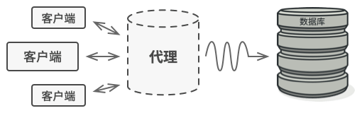

# 代理模式

亦称：Proxy

&nbsp;

##  意图

**代理模式**是一种结构型设计模式， 让你能够提供对象的替代品或其占位符。 代理控制着对于原对象的访问， 并允许在将请求提交给对象前后进行一些处理。


&nbsp;

##  问题

为什么要控制对于某个对象的访问呢？ 举个例子： 有这样一个消耗大量系统资源的巨型对象， 你只是偶尔需要使用它， 并非总是需要。


&nbsp;

数据库查询有可能会非常缓慢。

你可以实现延迟初始化： 在实际有需要时再创建该对象。 对象的所有客户端都要执行延迟初始代码。 不幸的是， 这很可能会带来很多重复代码。

在理想情况下， 我们希望将代码直接放入对象的类中， 但这并非总是能实现： 比如类可能是第三方封闭库的一部分。

&nbsp;

##  解决方案

Proxy Pattern 建议新建一个与原服务对象接口相同的代理类， 然后更新应用以将代理对象传递给所有原始对象  client。 代理类接收到 client 请求后会创建实际的服务对象， 并将所有工作委派给它。



&nbsp;

代理将自己伪装成数据库对象， 可在客户端或实际数据库对象不知情的情况下处理延迟初始化和缓存查询结果的工作。

这有什么好处呢？ 如果需要在类的主要业务逻辑前后执行一些工作， 你无需修改类就能完成这项工作。 由于代理实现的接口与原类相同， 因此你可将其传递给任何一个使用实际服务对象的 client 。

&nbsp;

##  真实世界类比


&nbsp;

信用卡和现金在支付过程中的用处相同。

Credit Card 是银行账户的代理， 银行账户则是一大捆现金的代理。 它们都实现了同样的接口， 均可用于进行支付。 消费者会非常满意， 因为不必随身携带大量现金； 商店老板同样会十分高兴， 因为交易收入能以电子化的方式进入商店的银行账户中， 无需担心存款时出现现金丢失或被抢劫的情况。

&nbsp;

##  代理模式结构


&nbsp;

1. **服务接口** （Service Interface） 声明了服务接口。 代理必须遵循该接口才能伪装成服务对象。
2. **服务** （Service） 类提供了一些实用的业务逻辑。
3. **代理** （Proxy） 类包含一个指向服务对象的引用成员变量。 代理完成其任务 （例如延迟初始化、 记录日志、 访问控制和缓存等） 后会将请求传递给服务对象。 通常情况下， 代理会对其服务对象的整个生命周期进行管理。
4. **客户端** （Client） 能通过同一接口与服务或代理进行交互， 所以你可在一切需要服务对象的代码中使用代理。

&nbsp;

##  伪代码

本例演示如何使用**代理**模式在第三方腾讯视频 （TencentVideo， 代码示例中记为 TV） 程序库中添加延迟初始化和缓存。


&nbsp;

使用代理缓冲服务结果。

程序库提供了视频下载类。 但是该类的效率非常低。 如果客户端程序多次请求同一视频， 程序库会反复下载该视频， 而不会将首次下载的文件缓存下来复用。

代理类实现和原下载器相同的接口， 并将所有工作委派给原下载器。 不过， 代理类会保存所有的文件下载记录， 如果程序多次请求同一文件， 它会返回缓存的文件。

```c
// 远程服务接口
interface ThirdPartyTVLib is
    method listVideos()
    method getVideoInfo(id)
    method downloadVideo(id)

// 服务连接器的具体实现。该类的方法可以向腾讯视频请求信息。请求速度取决于
// 用户和腾讯视频的互联网连接情况。如果同时发送大量请求，即使所请求的信息
// 一模一样，程序的速度依然会减慢。
class ThirdPartyTVClass implements ThirdPartyTVLib is
    method listVideos() is
        // 向腾讯视频发送一个 API 请求

    method getVideoInfo(id) is
        // 获取某个视频的元数据

    method downloadVideo(id) is
        // 从腾讯视频下载一个视频文件

// 为了节省网络带宽，我们可以将请求结果缓存下来并保存一段时间。但你可能无
// 法直接将这些代码放入服务类中。比如该类可能是第三方程序库的一部分或其签
// 名是`final（最终）`。因此我们会在一个实现了服务类接口的新代理类中放入
// 缓存代码。当代理类接收到真实请求后，才会将其委派给服务对象。
class CachedTVClass implements ThirdPartyTVLib is
    private field service: ThirdPartyTVLib
    private field listCache, videoCache
    field needReset

    constructor CachedTVClass(service: ThirdPartyTVLib) is
        this.service = service

    method listVideos() is
        if (listCache == null || needReset)
            listCache = service.listVideos()
        return listCache

    method getVideoInfo(id) is
        if (videoCache == null || needReset)
            videoCache = service.getVideoInfo(id)
        return videoCache

    method downloadVideo(id) is
        if (!downloadExists(id) || needReset)
            service.downloadVideo(id)

// 之前直接与服务对象交互的 GUI 类不需要改变，前提是它仅通过接口与服务对
// 象交互。我们可以安全地传递一个代理对象来代替真实服务对象，因为它们都实
// 现了相同的接口。
class TVManager is
    protected field service: ThirdPartyTVLib

    constructor TVManager(service: ThirdPartyTVLib) is
        this.service = service

    method renderVideoPage(id) is
        info = service.getVideoInfo(id)
        // 渲染视频页面。

    method renderListPanel() is
        list = service.listVideos()
        // 渲染视频缩略图列表。

    method reactOnUserInput() is
        renderVideoPage()
        renderListPanel()

// 程序可在运行时对代理进行配置。
class Application is
    method init() is
        aTVService = new ThirdPartyTVClass()
        aTVProxy = new CachedTVClass(aTVService)
        manager = new TVManager(aTVProxy)
        manager.reactOnUserInput()
```

&nbsp;

##  代理模式适合应用场景

使用代理模式的方式多种多样， 我们来看看最常见的几种。

 延迟初始化 （虚拟代理）。 如果你有一个偶尔使用的重量级服务对象， 一直保持该对象运行会消耗系统资源时， 可使用代理模式。

 你无需在程序启动时就创建该对象， 可将对象的初始化延迟到真正有需要的时候。

 访问控制 （保护代理）。 如果你只希望特定客户端使用服务对象， 这里的对象可以是操作系统中非常重要的部分， 而客户端则是各种已启动的程序 （包括恶意程序）， 此时可使用代理模式。

 代理可仅在客户端凭据满足要求时将请求传递给服务对象。

 本地执行远程服务 （远程代理）。 适用于服务对象位于远程服务器上的情形。

 在这种情形中， 代理通过网络传递客户端请求， 负责处理所有与网络相关的复杂细节。

 记录日志请求 （日志记录代理）。 适用于当你需要保存对于服务对象的请求历史记录时。 代理可以在向服务传递请求前进行记录。

 缓存请求结果 （缓存代理）。 适用于需要缓存客户请求结果并对缓存生命周期进行管理时， 特别是当返回结果的体积非常大时。

- 代理可对重复请求所需的相同结果进行缓存， 还可使用请求参数作为索引缓存的键值。

 智能引用。 可在没有客户端使用某个重量级对象时立即销毁该对象。

 代理会将所有获取了指向服务对象或其结果的客户端记录在案。 代理会时不时地遍历各个客户端， 检查它们是否仍在运行。 如果相应的客户端列表为空， 代理就会销毁该服务对象， 释放底层系统资源。

代理还可以记录客户端是否修改了服务对象。 其他客户端还可以复用未修改的对象。

&nbsp;

##  实现方式

1. 如果没有现成的服务接口， 你就需要创建一个接口来实现代理和服务对象的可交换性。 从服务类中抽取接口并非总是可行的， 因为你需要对服务的所有客户端进行修改， 让它们使用接口。 备选计划是将代理作为服务类的子类， 这样代理就能继承服务的所有接口了。
2. 创建代理类， 其中必须包含一个存储指向服务的引用的成员变量。 通常情况下， 代理负责创建服务并对其整个生命周期进行管理。 在一些特殊情况下， 客户端会通过构造函数将服务传递给代理。
3. 根据需求实现代理方法。 在大部分情况下， 代理在完成一些任务后应将工作委派给服务对象。
4. 可以考虑新建一个构建方法来判断 client 可获取的是 proxy 还是实际 server。 你可以在代理类中创建一个简单的静态方法， 也可以创建一个完整的工厂方法。
5. 可以考虑为服务对象实现延迟初始化。

&nbsp;

##  代理模式优缺点

-  √ 你可以在 client 毫无察觉的情况下控制服务对象。
-  √ 如果 client 对服务对象的生命周期没有特殊要求， 你可以对生命周期进行管理。
-  √ 即使服务对象还未准备好或不存在， 代理也可以正常工作。
-  √ *开闭原则*。 你可以在不对 server 或 client 做出修改的情况下创建新代理。
-  × 代码可能会变得复杂， 因为需要新建许多类。
-  × 服务响应可能会延迟。

&nbsp;

##  与其他模式的关系

- Adapter Pattern 能为被封装对象提供不同的接口，Proxy Pattern 能为对象提供相同的接口， Decorator Pattern 则能为对象提供加强的接口。
- Facade 与 Proxy 的相似之处在于它们都缓存了一个复杂实体并自行对其进行初始化。 *代理*与其服务对象遵循同一接口， 使得自己和服务对象可以互换， 在这一点上它与*外观*不同。
- Decorator 和 Proxy 有着相似的结构， 但是其意图却非常不同。 这两个模式的构建都基于组合原则， 也就是说一个对象应该将部分工作委派给另一个对象。 两者之间的不同之处在于 *Proxy* 通常自行管理其服务对象的生命周期， 而 *Decorator* 的生成则总是由 client 进行控制。

&nbsp;

# Java **代理**模式讲解和代码示例

**代理**是一种结构型设计模式， 让你能提供真实服务对象的替代品给客户端使用。 代理接收客户端的请求并进行一些处理 （访问控制和缓存等）， 然后再将请求传递给服务对象。

代理对象拥有和服务对象相同的接口， 这使得当其被传递给客户端时可与真实对象互换。

&nbsp;

## 在 Java 中使用模式

**使用示例：** 尽管代理模式在绝大多数 Java 程序中并不常见， 但它在一些特殊情况下仍然非常方便。 当你希望在无需修改客户代码的前提下于已有类的对象上增加额外行为时， 该模式是无可替代的。

Java 标准程序库中的一些代理模式的示例：

- [`java.lang.reflect.Proxy`](http://docs.oracle.com/javase/8/docs/api/java/lang/reflect/Proxy.html)
- [`java.rmi.*`](http://docs.oracle.com/javase/8/docs/api/java/rmi/package-summary.html)
- [`javax.ejb.EJB`](http://docs.oracle.com/javaee/7/api/javax/ejb/EJB.html) （[查看评论](http://stackoverflow.com/questions/25514361/when-using-ejb-does-each-managed-bean-get-its-own-ejb-instance)）
- [`javax.inject.Inject`](http://docs.oracle.com/javaee/7/api/javax/inject/Inject.html) （[查看评论](http://stackoverflow.com/questions/29651008/field-getobj-returns-all-nulls-on-injected-cdi-managed-beans-while-manually-i/29672591#29672591)）
- [`javax.persistence.PersistenceContext`](http://docs.oracle.com/javaee/7/api/javax/persistence/PersistenceContext.html)

**识别方法：** 代理模式会将所有实际工作委派给一些其他对象。 除非代理是某个服务的子类， 否则每个代理方法最后都应该引用一个服务对象。

&nbsp;

## 缓存代理

在本例中， 代理模式有助于实现延迟初始化， 并对低效的第三方 YouTube 集成程序库进行缓存。

当你需要在无法修改代码的类上新增一些额外行为时， 代理模式的价值无可估量。

&nbsp;

##  **some_cool_media_library**

####  **some_cool_media_library/ThirdPartyYouTubeLib.java:** 远程服务接口

```java
package refactoring_guru.proxy.example.some_cool_media_library;

import java.util.HashMap;

public interface ThirdPartyYouTubeLib {
    HashMap<String, Video> popularVideos();

    Video getVideo(String videoId);
}
```

&nbsp;

####  **some_cool_media_library/ThirdPartyYouTubeClass.java:** 远程服务实现

```java
package refactoring_guru.proxy.example.some_cool_media_library;

import java.util.HashMap;

public class ThirdPartyYouTubeClass implements ThirdPartyYouTubeLib {

    @Override
    public HashMap<String, Video> popularVideos() {
        connectToServer("http://www.youtube.com");
        return getRandomVideos();
    }

    @Override
    public Video getVideo(String videoId) {
        connectToServer("http://www.youtube.com/" + videoId);
        return getSomeVideo(videoId);
    }

    // -----------------------------------------------------------------------
    // Fake methods to simulate network activity. They as slow as a real life.

    private int random(int min, int max) {
        return min + (int) (Math.random() * ((max - min) + 1));
    }

    private void experienceNetworkLatency() {
        int randomLatency = random(5, 10);
        for (int i = 0; i < randomLatency; i++) {
            try {
                Thread.sleep(100);
            } catch (InterruptedException ex) {
                ex.printStackTrace();
            }
        }
    }

    private void connectToServer(String server) {
        System.out.print("Connecting to " + server + "... ");
        experienceNetworkLatency();
        System.out.print("Connected!" + "\n");
    }

    private HashMap<String, Video> getRandomVideos() {
        System.out.print("Downloading populars... ");

        experienceNetworkLatency();
        HashMap<String, Video> hmap = new HashMap<String, Video>();
        hmap.put("catzzzzzzzzz", new Video("sadgahasgdas", "Catzzzz.avi"));
        hmap.put("mkafksangasj", new Video("mkafksangasj", "Dog play with ball.mp4"));
        hmap.put("dancesvideoo", new Video("asdfas3ffasd", "Dancing video.mpq"));
        hmap.put("dlsdk5jfslaf", new Video("dlsdk5jfslaf", "Barcelona vs RealM.mov"));
        hmap.put("3sdfgsd1j333", new Video("3sdfgsd1j333", "Programing lesson#1.avi"));

        System.out.print("Done!" + "\n");
        return hmap;
    }

    private Video getSomeVideo(String videoId) {
        System.out.print("Downloading video... ");

        experienceNetworkLatency();
        Video video = new Video(videoId, "Some video title");

        System.out.print("Done!" + "\n");
        return video;
    }

}
```

&nbsp;

####  **some_cool_media_library/Video.java:** 视频文件

```java
package refactoring_guru.proxy.example.some_cool_media_library;

public class Video {
    public String id;
    public String title;
    public String data;

    Video(String id, String title) {
        this.id = id;
        this.title = title;
        this.data = "Random video.";
    }
}
```

&nbsp;

##  **proxy**

####  **proxy/YouTubeCacheProxy.java:** 缓存代理

```java
package refactoring_guru.proxy.example.proxy;

import refactoring_guru.proxy.example.some_cool_media_library.ThirdPartyYouTubeClass;
import refactoring_guru.proxy.example.some_cool_media_library.ThirdPartyYouTubeLib;
import refactoring_guru.proxy.example.some_cool_media_library.Video;

import java.util.HashMap;

public class YouTubeCacheProxy implements ThirdPartyYouTubeLib {
    private ThirdPartyYouTubeLib youtubeService;
    private HashMap<String, Video> cachePopular = new HashMap<String, Video>();
    private HashMap<String, Video> cacheAll = new HashMap<String, Video>();

    public YouTubeCacheProxy() {
        this.youtubeService = new ThirdPartyYouTubeClass();
    }

    @Override
    public HashMap<String, Video> popularVideos() {
        if (cachePopular.isEmpty()) {
            cachePopular = youtubeService.popularVideos();
        } else {
            System.out.println("Retrieved list from cache.");
        }
        return cachePopular;
    }

    @Override
    public Video getVideo(String videoId) {
        Video video = cacheAll.get(videoId);
        if (video == null) {
            video = youtubeService.getVideo(videoId);
            cacheAll.put(videoId, video);
        } else {
            System.out.println("Retrieved video '" + videoId + "' from cache.");
        }
        return video;
    }

    public void reset() {
        cachePopular.clear();
        cacheAll.clear();
    }
}
```

&nbsp;

## **downloader**

####  **downloader/YouTubeDownloader.java:** 媒体下载应用

```java
package refactoring_guru.proxy.example.downloader;

import refactoring_guru.proxy.example.some_cool_media_library.ThirdPartyYouTubeLib;
import refactoring_guru.proxy.example.some_cool_media_library.Video;

import java.util.HashMap;

public class YouTubeDownloader {
    private ThirdPartyYouTubeLib api;

    public YouTubeDownloader(ThirdPartyYouTubeLib api) {
        this.api = api;
    }

    public void renderVideoPage(String videoId) {
        Video video = api.getVideo(videoId);
        System.out.println("\n-------------------------------");
        System.out.println("Video page (imagine fancy HTML)");
        System.out.println("ID: " + video.id);
        System.out.println("Title: " + video.title);
        System.out.println("Video: " + video.data);
        System.out.println("-------------------------------\n");
    }

    public void renderPopularVideos() {
        HashMap<String, Video> list = api.popularVideos();
        System.out.println("\n-------------------------------");
        System.out.println("Most popular videos on YouTube (imagine fancy HTML)");
        for (Video video : list.values()) {
            System.out.println("ID: " + video.id + " / Title: " + video.title);
        }
        System.out.println("-------------------------------\n");
    }
}
```

&nbsp;

####  **Demo.java:** 初始化代码

```java
package refactoring_guru.proxy.example;

import refactoring_guru.proxy.example.downloader.YouTubeDownloader;
import refactoring_guru.proxy.example.proxy.YouTubeCacheProxy;
import refactoring_guru.proxy.example.some_cool_media_library.ThirdPartyYouTubeClass;

public class Demo {

    public static void main(String[] args) {
        YouTubeDownloader naiveDownloader = new YouTubeDownloader(new ThirdPartyYouTubeClass());
        YouTubeDownloader smartDownloader = new YouTubeDownloader(new YouTubeCacheProxy());

        long naive = test(naiveDownloader);
        long smart = test(smartDownloader);
        System.out.print("Time saved by caching proxy: " + (naive - smart) + "ms");

    }

    private static long test(YouTubeDownloader downloader) {
        long startTime = System.currentTimeMillis();

        // User behavior in our app:
        downloader.renderPopularVideos();
        downloader.renderVideoPage("catzzzzzzzzz");
        downloader.renderPopularVideos();
        downloader.renderVideoPage("dancesvideoo");
        // Users might visit the same page quite often.
        downloader.renderVideoPage("catzzzzzzzzz");
        downloader.renderVideoPage("someothervid");

        long estimatedTime = System.currentTimeMillis() - startTime;
        System.out.print("Time elapsed: " + estimatedTime + "ms\n");
        return estimatedTime;
    }
}
```

&nbsp;

####  **OutputDemo.txt:** 执行结果

```java
Connecting to http://www.youtube.com... Connected!
Downloading populars... Done!

-------------------------------
Most popular videos on YouTube (imagine fancy HTML)
ID: sadgahasgdas / Title: Catzzzz.avi
ID: asdfas3ffasd / Title: Dancing video.mpq
ID: 3sdfgsd1j333 / Title: Programing lesson#1.avi
ID: mkafksangasj / Title: Dog play with ball.mp4
ID: dlsdk5jfslaf / Title: Barcelona vs RealM.mov
-------------------------------

Connecting to http://www.youtube.com/catzzzzzzzzz... Connected!
Downloading video... Done!

-------------------------------
Video page (imagine fancy HTML)
ID: catzzzzzzzzz
Title: Some video title
Video: Random video.
-------------------------------

Connecting to http://www.youtube.com... Connected!
Downloading populars... Done!

-------------------------------
Most popular videos on YouTube (imagine fancy HTML)
ID: sadgahasgdas / Title: Catzzzz.avi
ID: asdfas3ffasd / Title: Dancing video.mpq
ID: 3sdfgsd1j333 / Title: Programing lesson#1.avi
ID: mkafksangasj / Title: Dog play with ball.mp4
ID: dlsdk5jfslaf / Title: Barcelona vs RealM.mov
-------------------------------

Connecting to http://www.youtube.com/dancesvideoo... Connected!
Downloading video... Done!

-------------------------------
Video page (imagine fancy HTML)
ID: dancesvideoo
Title: Some video title
Video: Random video.
-------------------------------

Connecting to http://www.youtube.com/catzzzzzzzzz... Connected!
Downloading video... Done!

-------------------------------
Video page (imagine fancy HTML)
ID: catzzzzzzzzz
Title: Some video title
Video: Random video.
-------------------------------

Connecting to http://www.youtube.com/someothervid... Connected!
Downloading video... Done!

-------------------------------
Video page (imagine fancy HTML)
ID: someothervid
Title: Some video title
Video: Random video.
-------------------------------

Time elapsed: 9354ms
Connecting to http://www.youtube.com... Connected!
Downloading populars... Done!

-------------------------------
Most popular videos on YouTube (imagine fancy HTML)
ID: sadgahasgdas / Title: Catzzzz.avi
ID: asdfas3ffasd / Title: Dancing video.mpq
ID: 3sdfgsd1j333 / Title: Programing lesson#1.avi
ID: mkafksangasj / Title: Dog play with ball.mp4
ID: dlsdk5jfslaf / Title: Barcelona vs RealM.mov
-------------------------------

Connecting to http://www.youtube.com/catzzzzzzzzz... Connected!
Downloading video... Done!

-------------------------------
Video page (imagine fancy HTML)
ID: catzzzzzzzzz
Title: Some video title
Video: Random video.
-------------------------------

Retrieved list from cache.

-------------------------------
Most popular videos on YouTube (imagine fancy HTML)
ID: sadgahasgdas / Title: Catzzzz.avi
ID: asdfas3ffasd / Title: Dancing video.mpq
ID: 3sdfgsd1j333 / Title: Programing lesson#1.avi
ID: mkafksangasj / Title: Dog play with ball.mp4
ID: dlsdk5jfslaf / Title: Barcelona vs RealM.mov
-------------------------------

Connecting to http://www.youtube.com/dancesvideoo... Connected!
Downloading video... Done!

-------------------------------
Video page (imagine fancy HTML)
ID: dancesvideoo
Title: Some video title
Video: Random video.
-------------------------------

Retrieved video 'catzzzzzzzzz' from cache.

-------------------------------
Video page (imagine fancy HTML)
ID: catzzzzzzzzz
Title: Some video title
Video: Random video.
-------------------------------

Connecting to http://www.youtube.com/someothervid... Connected!
Downloading video... Done!

-------------------------------
Video page (imagine fancy HTML)
ID: someothervid
Title: Some video title
Video: Random video.
-------------------------------

Time elapsed: 5875ms
Time saved by caching proxy: 3479ms
```

