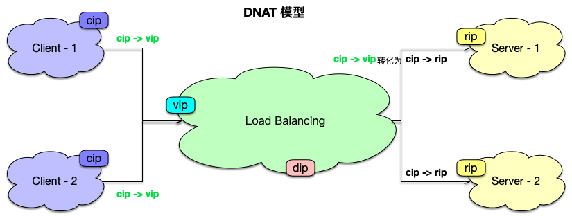
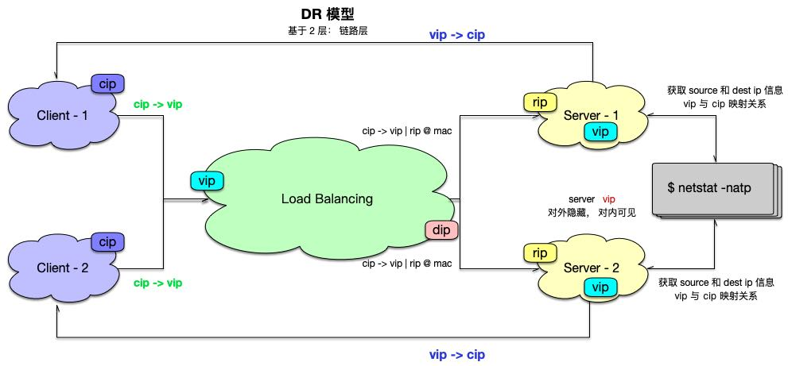
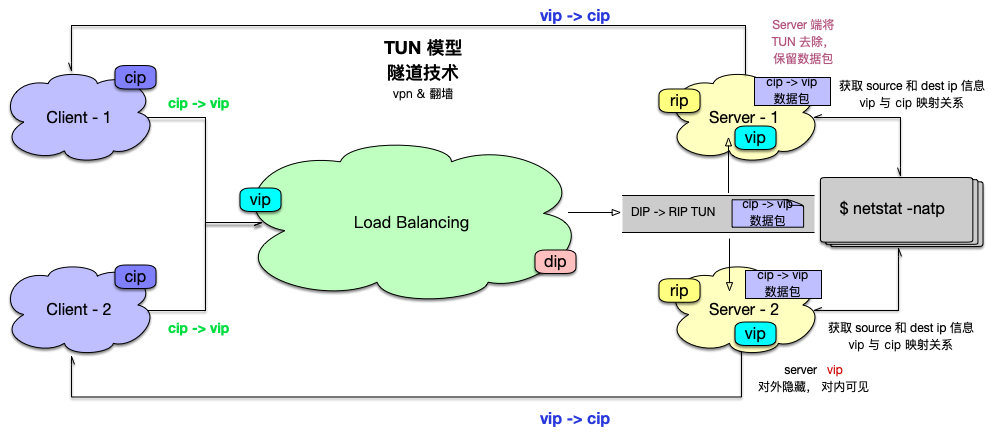

## 负载均衡器模型

#### NAT 模式



- `CIP`: Client IP 
- `VIP` : 虚拟服务器 IP
- `DIP` : 分发流量服务器 IP
- `RIP` : 服务器 IP （真实 IP）

- `D-NAT` ： 
  - 基于 3 - 4 层网络层
  - 目标地址转换， e.g. `CIP -> VIP`  转换为 `CIP -> RIP`
  - 通信时非对称
    - Client 发给 Server 的数据包大小， 一般很小
    - Server 发给 Client 的数据包大小, 一般很大
    - 他们是非对称的
  - 宽带是瓶颈
  - 它需要消耗算力
    - 计算机能力 （CPU 处理能力）
  - 要求 `RealServer` 的 `Gateway` 指向负载均衡服务器, `DIP` 才能寻址到
  - 这些内容在上图中已有标记
- `RIP -> CIP` : 
  - RIP 直接返回给 CIP , CIP 不会接收此数据包
  - RIP -> DIP -> VIP -> CIP
    - 数据包来回都需要经过 load balancing 

&nbsp;

```bash
$ netstat -natp
Proto Recv-Q Send-Q  Local Address          Foreign Address        (state)
tcp4       0      0  localhost.57998        localhost.57999        ESTABLISHED
tcp4       0      0  localhost.57999        localhost.57998        ESTABLISHED
tcp4       0      0  192.168.111.154.57928  78.121.36.59.bro.https ESTABLISHED
tcp4       0      0  192.168.111.154.57843  140.97.135.219.b.https ESTABLISHED
tcp4       0      0  192.168.111.154.57800  183.3.226.52.https     ESTABLISHED
```

&nbsp;

### DR 模型

直接路由模型

&nbsp;



#### 特点

- 基于 2 层
  - 链路层

- mac 地址欺骗
  - `cip -> vip | rip@mac`
    - 将 链路层的 rip@mac 拼接到数据包中
    - 不需要和 `DNAT`  一样将 地址中的 vip 转换为 rip 
    - 网络消耗低

- 速度快
  - 不需要从来的路回去
  - 环形，从 Server 端直接到将请求数据包直接返回给  Client

- 成本低
  - 服务器要求低

- 弊端
  - 因为 2 层限定，将 mac 地址拼接
  - Load Blancing 与 Server 必须在同一局域网
    - 不在同一局域网，这种 “欺骗行为” 走不通
- 目前市面上用的最多的模型

&nbsp;

### TUN 模型



特点： 

- `Load Balancing` 与 `Server` 不需要在同一局域网
- `Load Balancing` 与 `Server` 端之间创建 TUN
- `TUN` 中放入实际的 `cip -> vip` 数据包
- `Server` 端将 `TUN` 去除，保留数据包

&nbsp;