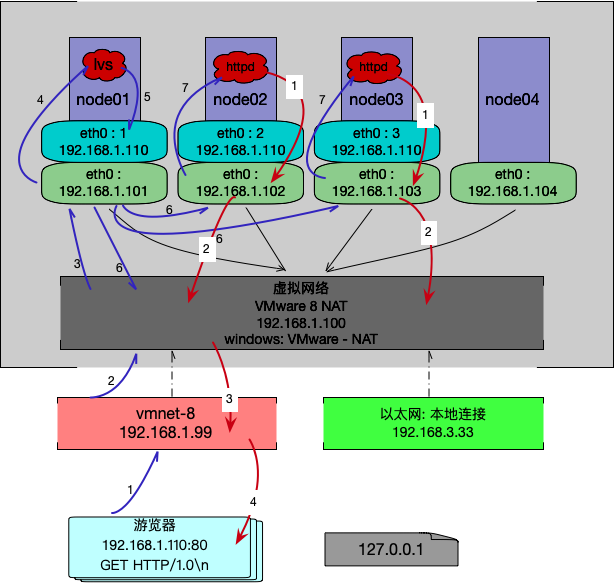

## LVS

`Linux Virtual Server` 的缩写，是一个虚拟的服务器集群系统。 1998 年章文嵩博士成立，是中国国内最早出现的自由软件项目之一。 4 层协议

&nbsp;

在这里普及个知识： 

ARP : 地址解析协议， （`Address Resolution Protocol`）, 是根据 IP 地址获取物理地址的一个 TCP/IP 协议。 

```bash
$ cd /proc/sys/net/ipv4/conf/*IF*/
# /proc/sys/net/ipv4/conf/*IF*/ 从内存映射的文件
# ipv4 协议
```

&nbsp;

上面文件中有以下 2 个文件

arp 的两个参数

- arp_ignore : 
  - 定义接收到 ARP 请求时的响应级别；
    - `0`: 只要本地配置的有相应地址，就给与相应。
    - `1`:  仅在请求的目标（MAC）地址配置请求到达接口上的时候，才给与相应；

- arp_announce : 定义将自己地址向外通告时的通告级别
  - `0` -> 将本地所有接口上的地址向外通告
    - 本机网卡上的所有 ip 地址都向外通告
      - 公共 ip
      - 内部 ip
      - 所有网卡
  - `1` -> 试图仅向目标网络通告预期网络匹配的地址
    - 公共 ip 向外通告
  - `2` -> 仅向与本地接口上地址匹配的网络进行通告
    - 匹配上的

&nbsp;

### 负载均衡调度算法：

首先一个前置知识点： 负载均衡器需要具备 “偷窥” 能力， 才能知道 RIP 的信息。 “只看不动手”

记录 Client 与 Server 信息


&nbsp;

### IPVS 内核模块

Linux 根据 LVS 技术封装在系统的内置内核模块， 它不需要安装

&nbsp;

但是需要安装另外一个和外界交互的 ipvsadm ， 它仅仅是传递者

```bash
$ yum install ipvsadm -y
```

&nbsp;

#### **管理集群服务**

添加： 

- -A : 添加 
  - `-t` :  TCP 协议的集群
  - `-u`: UDP 协议的集群
  - `server-address` :  `ip:port`
  - `-s scheduler` 
    - 负载均衡调度算法
    - 详情见前面内容

`-E` ：修改

`-D`:    删除

&nbsp;

`-t|u|f service-address [-s scheduler]`

e.g. 

```bash
$ ipvsadm -A -t 192.168.1.100:80 -s rr
```

&nbsp;

#### **添加集群服务中的 RS** 

- -a ： 添加
  - `-a -t|u|f service-address -r server-address [-g|i|m] [-w weight]`
  - `-t|u|f service-address` : 事先定义好的某集群服务
  - `-r server-address` : 某 RS 的地址，在 NAT 模型中，可使用 `ip:port` 事先端口映射。
  - `[-g|i|m]`
    - `-g` ： DR 
    - `-i` : TUN
    - `-m` : NAT
    - [-w weight] : 定义服务器权重

```bash
$ ipvsadm -a -t ip1:port1 -r ip2:port2 -g
```

&nbsp;

- `-e` : 修改
- `-d` : 删除
- `-l|L` : 查看
- `-n` : 数字格式显示主机地址和端口
- `--stats` : 统计数据
- `--rate` : 速率
- `--timeout` : 显示 tcp, tcpfin 和 udp 的会话超时时长
- `-:c` : 显示当前的 ipvs 连接状况
  - lvs 不和 RS  连接, 只“偷窥”

删除所有集群服务

- `-C` : 清空 ipvs 规则
- `-S` : 保存

```bash
$ ipvsadm -S > /path/to/somefile
```

载入此前的规则： 

- `-R `

```bash
$ ipvsadm -R < /path/to/somefile
```

&nbsp;

### 实验手册



&nbsp;

## 实操

环境准备

### 协议和网络配置

- 在 lvs 服务器的机器上，设置网络层 （192.168.1.101）

```bash
$ ifconfig
# 设置网络层： eth0:n
# /24 = Mask 255.255.255.0
$ ifconfig eth0:1 192.168.1.110/24
$ ifconfig eth0:1 192.168.1.110 netmask 255.255.255.0
Link encap:Ethernet HWaddr mac address
inet addr:192.168.1.100 Bcast:192.168.1.255 Mask:255.255.255.0
```

&nbsp;

```bash
# 关闭
$ ifconfig eth0:1 down
```

&nbsp;

- Server 机器上，设置不大一样，需要先调协议，然后才能设置网络层。所有 Server 机器一样的配置方式（其它服务机器）

调整协议：

```bash
# 调整协议
$ cd /proc/sys/net/ipv4/conf/eth0
$ cat arp_ignore
0  # 默认级别
# 这里需要修改成 1， 注意不能使用 vi 或 vim 命令，使用它们会报错 
# 'En: Fsync failed'

# 使用 echo 命令来修改
$ echo 1 > arp_ignore

# 同理修改 arp_announce
$ echo 2 > arp_announce
$ cat arp_announce
2 # 0 默认级别

# 为了其它网卡都能生效
$ cd /proc/sys/net/ipv4/conf/all
$ echo 1 > arp_ignore
$ echo 2 > arp_announce
```

&nbsp;

修改网络：

```bash
# 注意 mask 需要 255.255.255.255， 因为实际网络交互时， ip 是需要和 netmask 进行按位 & 操作（路由表）
# 这里的 lo:2 的 2 可以自定义
$ ifconfig lo:2 192.168.1.110 netmask 255.255.255.255
```

&nbsp;

### 搭建 RS 服务器（非 LVS 机器）

```bash
# 首先所有机器安装 httpd 协议,webserver 并启动
$ yum install httpd -y

# 启动
$ service httpd start
```

&nbsp;

在默认主页编辑

```bash
# 以 192.168.1.102 机器为例，加上下列内容
$ vim /var/www/html/index.html
from 192.168.1.102
```

&nbsp;

### LVS  机器服务配置(192.168.1.101)

首先安装 `ipvsadm`

```bash
$ yum install ipvsadm -y
```

&nbsp;

添加入口包

```bash
$ ipvsadm -A -t 192.168.1.110:80 -s rr
## 查看规则
$ ipvsadm -ln

TCP 192.168.1.110:80 rr
```

&nbsp;

添加负载包

```bash
$ ipvsadm -a -t 192.168.1.110:80 -r 192.168.1.102 -g -w 1
$ ipvsadm -a -t 192.168.1.110:80 -r 192.168.1.103 -g -w 1
```

&nbsp;

查看 lvs 入口出口规则信息

```bash
$ ipvsadm -ln
TCP 192.168.1.110:80 rr
-> 192.168.1.102:80 Route 1 0 0
-> 192.168.1.103:80 Route 1 0 0
```

&nbsp;

### 验证 lvs 服务器

游览器访问

- 游览器访问 
  - 192.168.1.110
- 看到负载
  - from 192.168.1.102 或
  - from 192.168.1.103
- 刷新 -> f5 (windows)

&nbsp;

lvs 服务器是看不到刚才验证的活跃连接信息的

102，103 机器可以看到刚才活跃的连接信息

```bash
$ netstat -natp
Active Internet connections (servers and established)
Proto Recv-Q Send-Q Local Address Foreign Address State PID/Program name
```

&nbsp;

上面有说，看不到连接信息，但是可以通过 lvs 查看连接记录(偷窥记录表)

```bash
$ ipvsadm -lnc
pro expire state source virtual destination 
```

&nbsp;

state:

- FIN_WAIT : 代表连接过
- FIN_RECV : lvs 出现此状态记录, 证明 lvs 没事， 一定是后边网络层出问题了


&nbsp;


