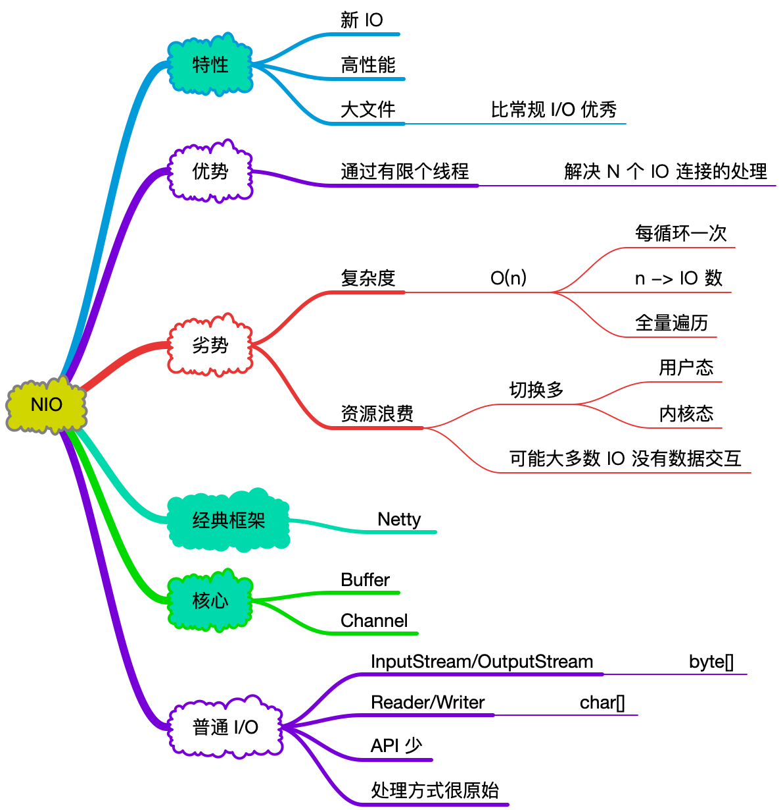

# NIO

&nbsp;

## 概念

- `jdk-nio` 类库
  - `new io`
- `os` - 操作系统
  - `non-blocking`

&nbsp;

## 概览

&nbsp;

## NIO - 模型

&nbsp;

> 以上 NIO 模型
>
> - 同步非阻塞
> - 普通 NIO

&nbsp;

## 多路复用器

> 此知识在介绍完 NIO 核心内容后，再进行阐述
>
> Java 侧则需要用到 Selector,SelectionKey, ServerSocketChannel ， SocketChannel 知识
>
> [NIO- I/O Multiplexing](nio-multiplexing.md)

&nbsp;

&nbsp;

&nbsp;

