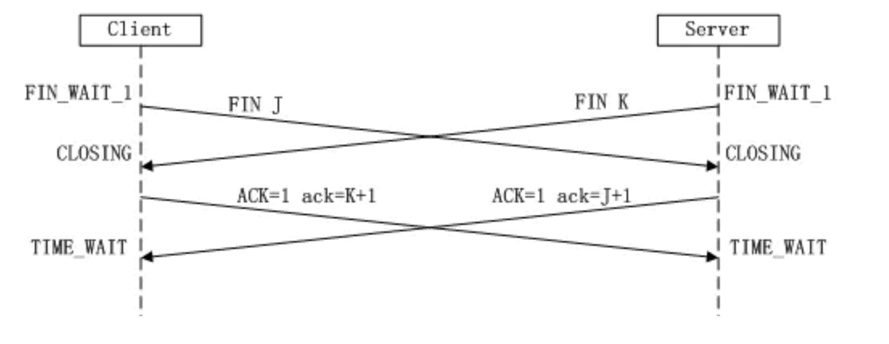

# TCP

&nbsp;

## TCP/IP ？

| TCP/IP 层  | 协议                                                         |
| ---------- | ------------------------------------------------------------ |
| 应用层     | `HTTP`/`FTP`（文件传输） /`SMTP`（电邮） /`DNS`（域名解析） /`Telnet` (远程登录) 等 |
| 传输层     | `TCP`、`UDP`、`UGP` 等                                       |
| 网络层     | `IP`、`ICMP`、`IGMP`  等                                     |
| 数据链路层 | `ARP`、`RARP` 等                                             |

&nbsp;

## TCP vs UDP?

`TCP`(`Transmission Control Protocol`：传输控制协议)

- `TCP`提供IP环境下的数据可靠传输，它提供的服务包括数据流传送、可靠性、有效流控、全双工操作和多路复用。通过面向连接、端到端和可靠的数据包发送。通俗说，它是事先为所发送的数据开辟出连接好的通道，然后再进行数据发送
- TCP 对应的是可靠性要求高的应用
- 应用协议： `Telnet`、`FTP`、`SMTP` 等
-  `TCP/IP` 协议与底层的数据链路层和物理层无关，这也是 `TCP/IP` 的重要特点。

`UDP`(`User Datagram Protocol`：用户数据报协议)协议属于传输层协议。

- `UDP` 则不为 `IP` 提供可靠性、流控或差错恢复功能。
- UDP对应的则是可靠性要求低、传输经济的应用。
- 应用协议： NFS(网络文件系统)、SNMP(简单网络管理协议)、DNS(主域名称系统)、TFTP(通用文件传输协议)等

&nbsp;

## TCP三次握手

> 内核态完成


&nbsp;

- 第一次握手：`Client` 将标志位 `SYN` 置为 `1`，随机产生一个值`seq=J`，并将该数据包发送给 `Server`，`Client` 进入`SYN_SENT`状态，等待 `Server` 确认。
- 第二次握手： 收到数据包后由标志位 `SYN=1` 知道 `Client` 请求建立连接，`Server` 将标志位 `SYN` 和 `ACK` 都置为 1，`ack=J+1`，随机产生一个值 `seq=K` ，并将该数据包发送给 `Client` 以确认连接请求，`Server` 进入`SYN_RCVD`状态。
- 第三次握手：`Client` 收到确认后，检查 `ack` 是否为 `J+1`，`ACK` 是否为 1 ，如果正确则将标志位 `ACK` 置为1， `ack=K+1` ，并将该数据包发送给 `Server`，`Server` 检查 `ack` 是否为 `K+1`，`ACK` 是否为1，如果正确则连接建立成功，`Client` 和 `Server` 进入 `ESTABLISHED` 状态，完成三次握手，随后 Client 与 Server 之间可以开始传输数据了。

 &nbsp;

> **SYN攻击解释：** 三次握手过程中，Server 发送 SYN-ACK 之后，收到 Client 的 ACK 之前的 TCP 连接称为半连接（half-open connect），此时 Server 处于 SYN_RCVD 状态，当收到 ACK 后，Server 转入ESTABLISHED 状态。SYN 攻击就是 Client 在短时间内伪造大量不存在的 IP 地址，并向 Server 不断地发送SYN 包，Server 回复确认包，并等待 Client 的确认，由于源地址是不存在的，因此，Server 需要不断重发直至超时，这些伪造的 SYN 包将产时间占用未连接队列，导致正常的 SYN 请求因为队列满而被丢弃，从而引起网络堵塞甚至系统瘫痪。SYN 攻击时一种典型的 DDOS 攻击，检测 SYN 攻击的方式非常简单，即当 Server 上有大量半连接状态且源 IP 地址是随机的，则可以断定遭到 SYN 攻击了，使用如下命令可以让之现行：
>
> ```bash
> $ netstat -nap | grep SYN_RECV
> ```

&nbsp;

## TCP四次分手

> 内核态完成
>
> 

 

由于 TCP 连接时全双工的，因此，每个方向都必须要单独进行关闭，这一原则是当一方完成数据发送任务后，发送一个 FIN 来终止这一方向的连接，收到一个 FIN 只是意味着这一方向上没有数据流动了，即不会再收到数据了，但是在这个 TCP 连接上仍然能够发送数据，直到这一方向也发送了 FIN 。首先进行关闭的一方将执行主动关闭，而另一方则执行被动关闭，上图描述的即是如此。

- 第一次挥手：`Client` 发送一个 `FIN`，用来关闭 `Client` 到 `Server` 的数据传送，`Client` 进入 `FIN_WAIT_1` 状态。 
- 第二次挥手：`Server` 收到  `FIN`  后，发送一个 `ACK` 给 `Client`，确认序号为收到序号 +1（与 `SYN` 相同，一个 `FIN`占用一个序号），`Server` 进入 `CLOSE_WAIT` 状态。 
- 第三次挥手：`Server` 发送一个 `FIN` ，用来关闭 `Server` 到 `Client` 的数据传送， `Server` 进入 `LAST_ACK` 状态
- 第四次挥手：`Client` 收到 `FIN` 后，`Client` 进入 `TIME_WAIT` 状态，接着发送一个 `ACK` 给 `Server`，`Server` 确认序号为收到序号+1，`Server` 进入 `CLOSED` 状态，完成四次挥手。

 &nbsp;

上面是一方主动关闭，另一方被动关闭的情况（由一方发起挥手），实际中还会出现同时发起主动关闭的情况，具体流程如下图（同时挥手）：



> 注意点：
>
>  一般情况下，当四次握手完成， Server Kernel 需要一定时间（2*报文时间），来最终关闭连接
>
> 在此时，连接资源并未完全释放，相同的 Client （ ip + port）如果想再次重连 Server , 会发生拒绝连接的情况
>
> 以上问题，可以使用 OS  re_use 机制，可以让连接快速被重用。此机制，后续有时间再研究

&nbsp;

## 为什么连接的时候是三次握手，关闭的时候却是四次握手？

 这是因为当 Server 收到 Client 的 SYN 连接请求报文后，可以直接发送 SYN+ACK 报文。其中 ACK 报文是用来应答的，SYN 报文是用来同步的。 

但是关闭连接时，当 Client 发送 FIN 报文仅仅表示它不再发送数据了但是还能接收数据，Server 收到 FIN 报文时，很可能并不会立即关闭 SOCKET，所以只能先回复一个 ACK 报文，告诉 Client，"你发的FIN报文我收到了"。只有等到我 Server 所有的报文都发送完了，我才能发送 FIN 报文，因此不能一起发送。故需要四步握手。

 &nbsp;

&nbsp;

## 什么是长连接和短连接？有状态，无状态？

> TCP是长连接吗？
>
> - tcp只是连接，属于应用层协议
>
> 
>
> 连接是不是一个 “复用” 载体，通俗点说，是否长连接，不在于连接中数据通信时长，而是取决于连接是否能被复用

&nbsp;

短连接： 举一个例子：http 1.0/1.1 没有开启 keepalive 保持，连接只负责一次同步阻塞的请求+响应，短连接！

长连接，无状态： 举一个例子：http 1.0/1.1 开启了 keepalive 保持，同步复用连接：多次(请求+响应)，以上是无状态通信，长连接！

长连接，有状态： 举一个列子：dubbo协议(rpc)，打开连接，同步/异步复用连接：多次（请求+响应）（请求请求）（响应响应），当复用连接的时候，需要消息的 ID(状态属性)，而且 client 和 server 同时需要遵守这个约束进行有状态通信，长连接！（长）

&nbsp;

## 粘包，粘包，拆包

> 有程序，有内核，程序和内核协调工作
>
> 有一些是内核做的事情，三次握手，数据发送，接收，内核，TCP，分包
>
> 到我们自己的程序，即便在一个 socket 里，也可能收到多个消息在一个字节数组中，我们要自己拆解
>
> - 例如，请求合并，serverSocket 接收到请求后，需要对 socket 发送的请求进行分包（拆解），这个没有固定格式，根据业务和请求类型自定义分包规则即可


