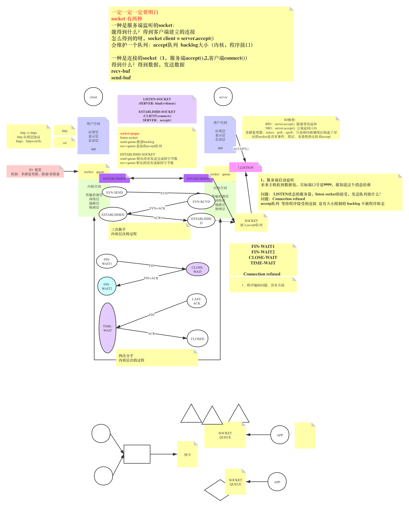

# Socket



&nbsp;

## TCP/IP ？

| TCP/IP 层  | 协议                                                         |
| ---------- | ------------------------------------------------------------ |
| 应用层     | `HTTP`/`FTP`（文件传输） /`SMTP`（电邮） /`DNS`（域名解析） /`Telnet` (远程登录) 等 |
| 传输层     | `TCP`、`UDP`、`UGP` 等                                       |
| 网络层     | `IP`、`ICMP`、`IGMP`  等                                     |
| 数据链路层 | `ARP`、`RARP` 等                                             |

 

### TCP vs UDP?

**`TCP`(Transmission Control Protocol：传输控制协议)和`UDP`(User Datagram Protocol：用户数据报协议)协议属于传输层协议。其中:** 1)`TCP`提供IP环境下的数据可靠传输，它提供的服务包括数据流传送、可靠性、有效流控、全双工操作和多路复用。通过面向连接、端到端和可靠的数据包发送。通俗说，它是事先为所发送的数据开辟出连接好的通道，然后再进行数据发送; 2)`UDP` 则不为 IP 提供可靠性、流控或差错恢复功能。一般来说，TCP对应的是可靠性要求高的应用，而UDP对应的则是可靠性要求低、传输经济的应用。

TCP支持的应用协议主要有：Telnet、FTP、SMTP等; UDP支持的应用层协议主要有：NFS(网络文件系统)、SNMP(简单网络管理协议)、DNS(主域名称系统)、TFTP(通用文件传输协议)等。 TCP/IP协议与低层的数据链路层和物理层无关，这也是TCP/IP的重要特点。

 

## TCP三次握手

> 内核态完成
>
> 

- 1）第一次握手：`Client`将标志位`SYN`置为 `1`，随机产生一个值`seq=J`，并将该数据包发送给`Server`，`Client`进入`SYN_SENT`状态，等待 `Server` 确认。
- 2）第二次握手： 收到数据包后由标志位 `SYN=1` 知道 `Client` 请求建立连接，`Server`将标志位`SYN`和`ACK`都置为1，`ack=J+1`，随机产生一个值`seq=K`，并将该数据包发送给`Client`以确认连接请求，`Server`进入`SYN_RCVD`状态。
- 3）第三次握手：`Client`收到确认后，检查`ack`是否为J+1，`ACK`是否为1，如果正确则将标志位`ACK`置为1，`ack=K+1`，并将该数据包发送给`Server`，`Server`检查`ack`是否为K+1，`ACK`是否为1，如果正确则连接建立成功，`Client`和`Server`进入 `ESTABLISHED` 状态，完成三次握手，随后 Client 与 Server 之间可以开始传输数据了。

 

> **SYN攻击解释：** 三次握手过程中，Server 发送 SYN-ACK 之后，收到 Client 的 ACK 之前的TCP连接称为半连接（half-open connect），此时 Server 处于SYN_RCVD状态，当收到 ACK 后，Server 转入ESTABLISHED状态。SYN攻击就是Client在短时间内伪造大量不存在的IP地址，并向 Server 不断地发送SYN包，Server回复确认包，并等待Client的确认，由于源地址是不存在的，因此，Server需要不断重发直至超时，这些伪造的SYN包将产时间占用未连接队列，导致正常的SYN请求因为队列满而被丢弃，从而引起网络堵塞甚至系统瘫痪。SYN攻击时一种典型的DDOS攻击，检测SYN攻击的方式非常简单，即当Server上有大量半连接状态且源IP地址是随机的，则可以断定遭到SYN攻击了，使用如下命令可以让之现行：
>
> ```
> $ netstat -nap | grep SYN_RECV
> ```

 

## TCP四次分手

> 内核态完成
>
> 

 

由于TCP连接时全双工的，因此，每个方向都必须要单独进行关闭，这一原则是当一方完成数据发送任务后，发送一个FIN来终止这一方向的连接，收到一个FIN只是意味着这一方向上没有数据流动了，即不会再收到数据了，但是在这个TCP连接上仍然能够发送数据，直到这一方向也发送了FIN。首先进行关闭的一方将执行主动关闭，而另一方则执行被动关闭，上图描述的即是如此。 1）第一次挥手：`Client`发送一个`FIN`，用来关闭`Client`到`Server`的数据传送，`Client`进入`FIN_WAIT_1`状态。 2）第二次挥手：`Server`收到 `FIN` 后，发送一个 `ACK` 给`Client`，确认序号为收到序号+1（与`SYN`相同，一个`FIN`占用一个序号），`Server`进入`CLOSE_WAIT`状态。 3）第三次挥手：`Server`发送一个`FIN`，用来关闭`Server`到`Client`的数据传送，`Server`进入`LAST_ACK`状态。 4）第四次挥手：`Client`收到`FIN`后，`Client`进入`TIME_WAIT`状态，接着发送一个`ACK`给`Server`，确认序号为收到序号+1，`Server`进入`CLOSED`状态，完成四次挥手。

 

上面是一方主动关闭，另一方被动关闭的情况（由一方发起挥手），实际中还会出现同时发起主动关闭的情况，具体流程如下图（同时挥手）：


&nbsp; 

## 为什么连接的时候是三次握手，关闭的时候却是四次握手？

 这是因为当Server端收到Client端的SYN连接请求报文后，可以直接发送SYN+ACK报文。其中ACK报文是用来应答的，SYN报文是用来同步的。 但是关闭连接时，当Client端发送FIN报文仅仅表示它不再发送数据了但是还能接收数据，Server端收到FIN报文时，很可能并不会立即关闭SOCKET，所以只能先回复一个ACK报文，告诉Client端，"你发的FIN报文我收到了"。只有等到我Server端所有的报文都发送完了，我才能发送FIN报文，因此不能一起发送。故需要四步握手。

 &nbsp;

## Listen 状态的服务器， listen socket 的接受， 发送队列放什么？

> accept 队列  
>
> - 等待程序接收的连接
>
> - 有大小限制 （backlog）不被程序取走
>
>   - backlog
>
>     - 内核
>
>     - `cat /proc/sys/net/core/somaxconn` 
>
>       -  默认 128
>       -  ACCEPT队列  你可以给出backlog 取 min
>
>       -  每个人顾好自己，每个人处理好对别人的打扰
>
>     - `cat /proc/sys/net/ipv4/tcp_max_syn_backlog  DDOS`
>       - 默认 `2048`
>       - `backlog` 满了 `accept` 队列满了，新 client 直接 `Connection refused`

&nbsp;

```bash
$ nc -l localhost 9999

$ netstat -natp

$ ss -lna
```

&nbsp;

## Connection refused？

> 服务器端口没开
>
> 网络不通
>
> socket 队列满了
>
> - 内核态和用户态交互出现问题

&nbsp;

## 什么是长连接和短连接？有状态，无状态？

> TCP是长连接吗？
>
> tcp只是连接，受应用层协议
>
> 连接是不是一个“复用”载体
>
> 举一个例子：http 1.0 ，1.1 没有开启keepalive保持，连接只负责一次同步阻塞的请求+响应，短连接！
>
> 举一个例子：http 1.0,1.1 开启了keepalive保持，同步复用连接：多次(请求+响应)，以上是无状态通信，长连接！
>
> 举一个列子：dubbo协议(rpc)，打开连接，同步/异步复用连接：多次（请求+响应）（请求请求）（响应响应），当复用连接的时候，需要消息的ID，而且客户端和服务端同时完成这个约束  有状态通信，长连接！

&nbsp;

## IO模型

>0：IO 是程序对内核的 $socket-queue$ 的包装
>
>BIO：读取，一直等queue里有才返回，阻塞模型，每连接对应一个线程
>
>NIO：读取，立刻返回：两种结果，读到，没读到，程序逻辑要自己维护，nio noblock
>
>多路复用器：内核增加select，poll，epoll新增的和数据接收，连接接受实质无关的调用，得到是对应socket的事件(listen socket ，socket)，可以有效地去再次accept，R/W
>
>AIO： 异步 IO

&nbsp;

## 同步阻塞，同步非阻塞

>  BIO,NIO,多路复用器，在IO模型上都是同步的，都是程序自己accpet，R/W

&nbsp;

## 粘包，粘包，拆包

> 有程序，有内核，程序和内核协调工作
>
> 有一些是内核做的事情，三次握手，数据发送出去，接受进来，内核，TCP，分包
>
> 到我们自己的程序，即便在一个socket里，也可能收到多个消息在一个字节数组中，我们要自己拆解


