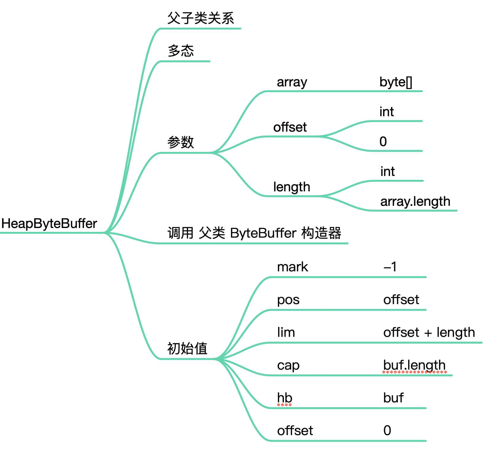
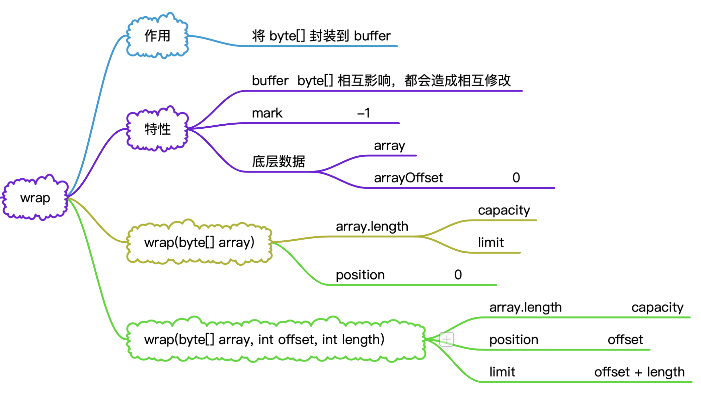
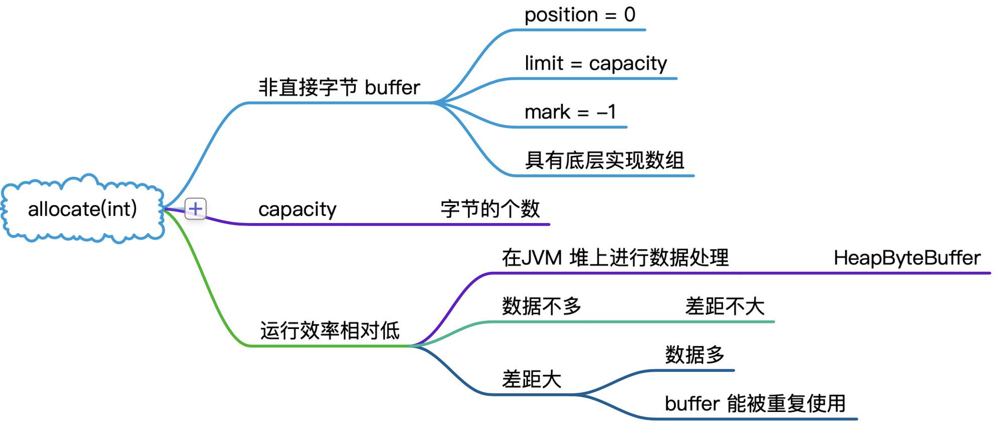
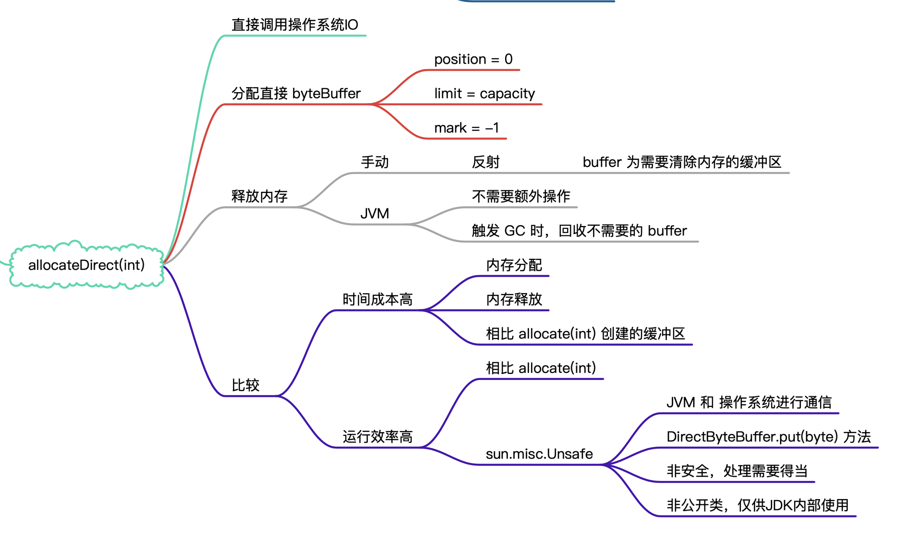
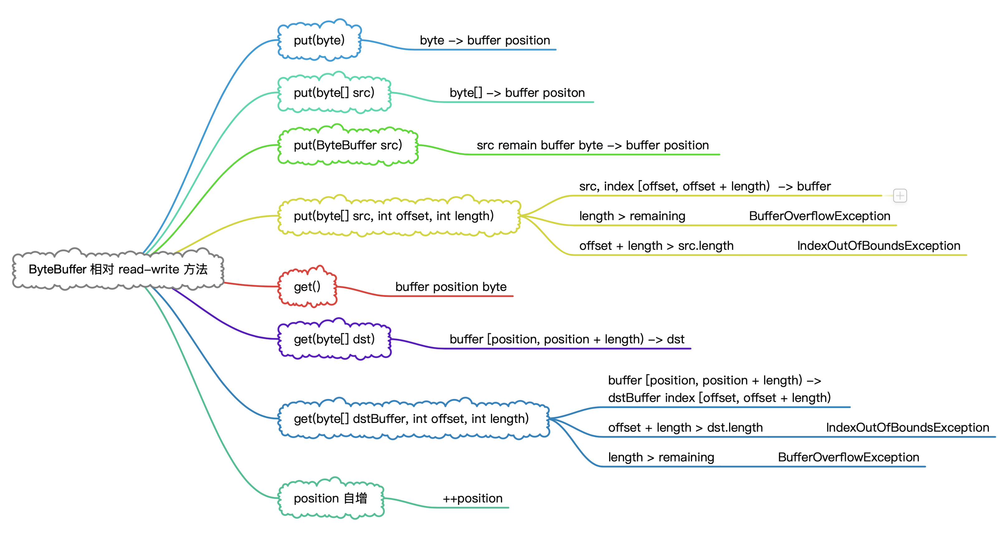
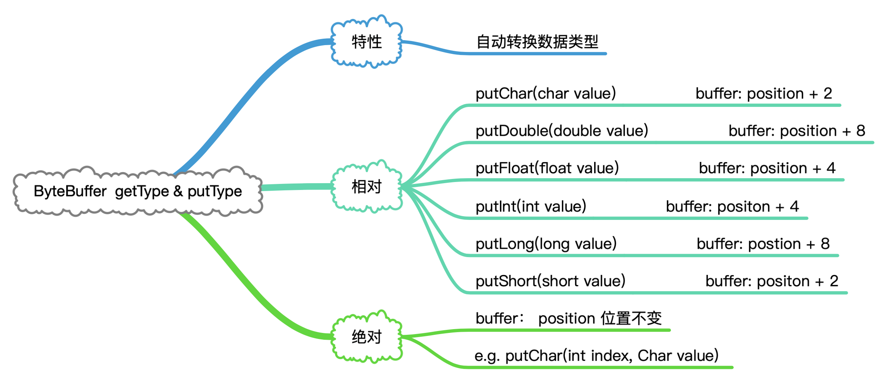
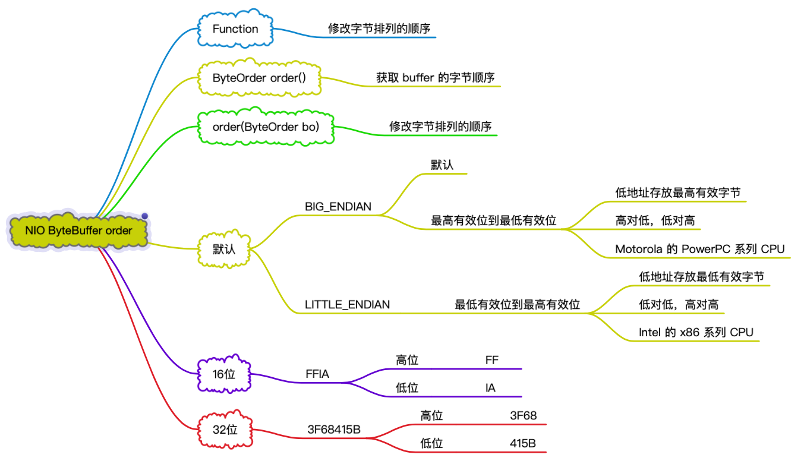
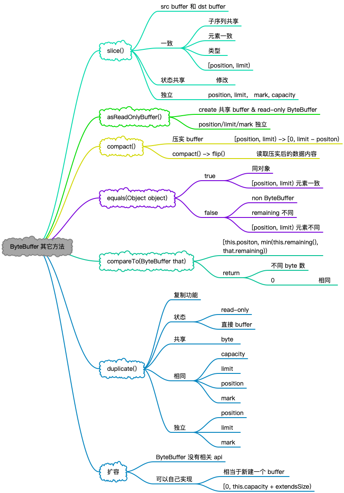

## NIO-Buffer-ByteBuffer 子类方法

&nbsp;

## 概览


&nbsp;

## HeapByteBuffer



&nbsp;

&nbsp;

## 创建 ByteBuffer

&nbsp;

### wrap



&nbsp;

### allocate



&nbsp;

### allocateDirect



通过反射清理需要回收的 Direct buffer 内存： 

```java
Method cleaner = buffer.getClass().getMethod("cleaner");
cleaner.setAccessible(true);
Object returnValue = cleaner.invoke(buffer);
Method clean = returnValue.getClass().getMethod("clean");
clean.setAccessible(true);

// 回收"直接缓冲区"
clean.invoke(returnValue);
```

&nbsp;

## ByteBuffer 读写 

>  以绝对 position 和相对 position 读写单个字节的 get() 和 put() 方法

&nbsp;

### 相对 RW



&nbsp;

### 绝对 RW

`put(int, byte)`: 

- `byte` -> `buffer` `index(int) `

`get(int)`:

- 取 `buffer index(int)` byte

>  注意： position 不变

&nbsp;

## getType & putType



&nbsp;

## 创建 view


中文处理：

```java
"我是中国人".getBytes("utf-16BE");
“”.getBytes(“utf-8”):
Charset.defaultCharset().name()
CharBuffer charBuffer = Charset.forName(“utf-8”).decode(byteBuffer);
```

&nbsp;

## order

> 获取和修改字节排序的顺序，并不是将  byte 重新排序
>
> 原因： 不同 CPU 读字节顺序是不一样的




&nbsp;

## 其它方法



&nbsp;

