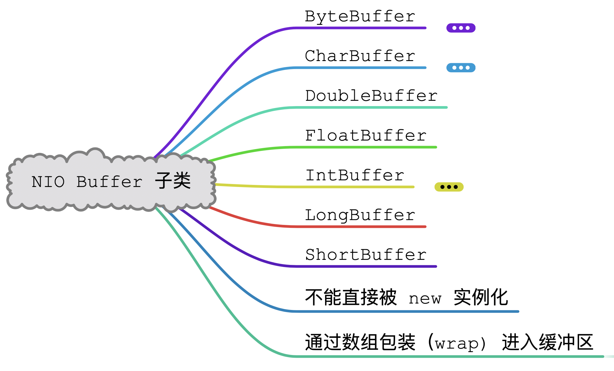
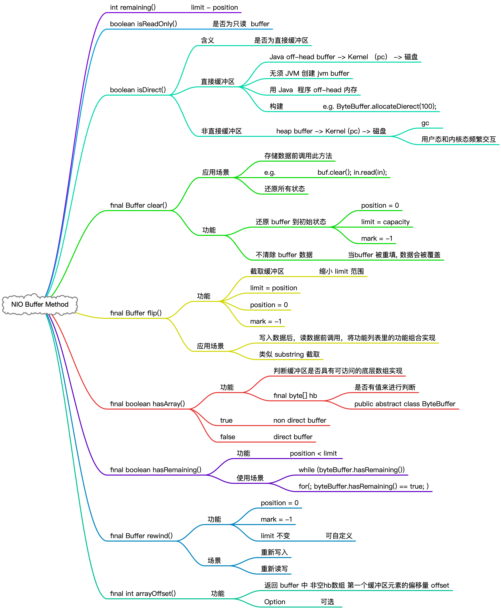

# Java Buffer

&nbsp;

## 概览

&nbsp;

## NIO Buffer 核心属性

&nbsp;

## Buffer 子类

> 有专门的篇章来介绍  [ByteBuffer](nio-buffer-bytebuffer.md) , [CharBuffer](nio-buffer-charbuffer.md) 其它不会一一做介绍，都可以推导规律。实际编写代码，直接运用即可

&nbsp;

## Buffer 方法

&nbsp;

其它方法 byteBuffer 化

list.toArray(T[]) 步骤：

- 利用 List 中 toArray(T[]) 方法，将存在 List 中的 buffer 数组化
- ByteBuffer[] byteBufferArray = ...
- list.toArray(byteBufferArray);

