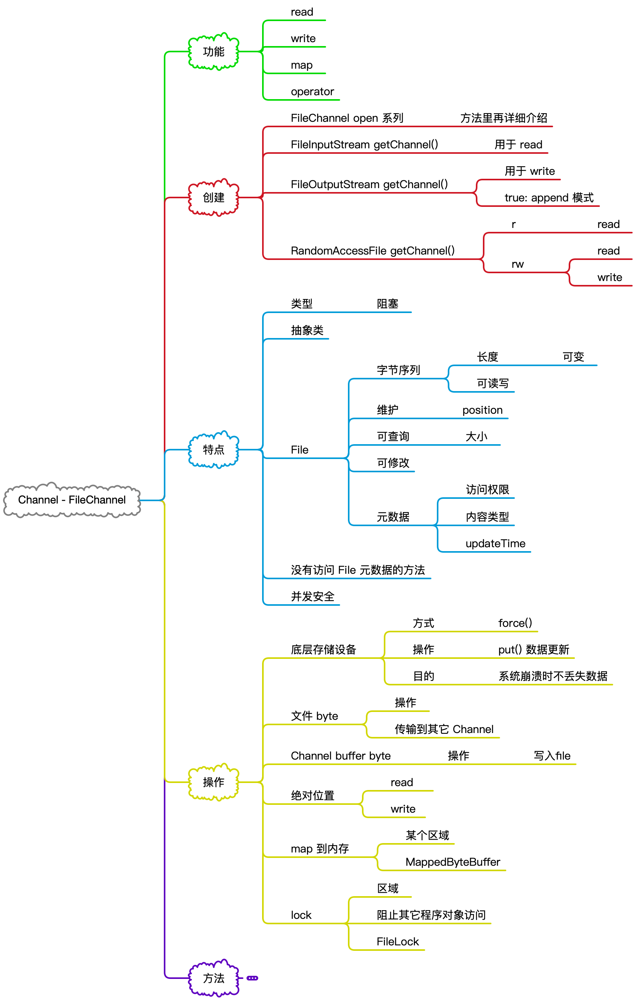
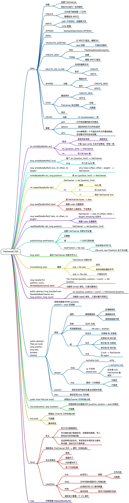
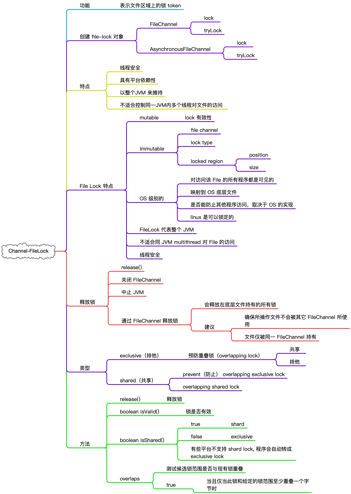

# FileChannel

&nbsp;

## 总体说明

FileChannel 类签名：

```java
public abstract class FileChannel
    extends AbstractInterruptibleChannel
    implements SeekableByteChannel, GatheringByteChannel, ScatteringByteChannel
```

&nbsp;



&nbsp;

## FileChannel 方法



&nbsp;

## FileLock



&nbsp;

## MappedByteBuffer


使用方法 e.g. :

```java
FileChannel rafchannel = raf.getChannel();
//mmap  堆外  和文件映射的   byte  not  objtect
MappedByteBuffer map = rafchannel.map(FileChannel.MapMode.READ_WRITE, 0, 4096);
map.put("ddd".getBytes());
```

&nbsp;

- 可以通过命令来查看映射的文件在内存的状态信息

```bash
$ lsof -p pid
```

&nbsp;