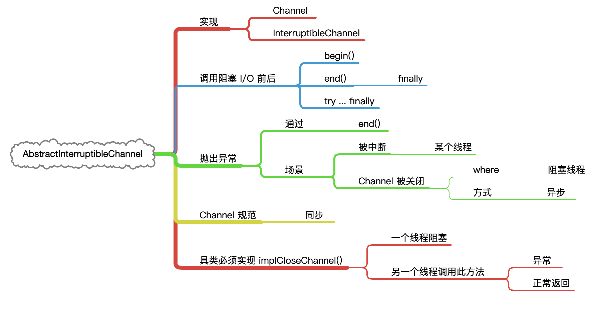

# Channel 实现

&nbsp;

## 概览


&nbsp;

## AbstractInterruptibleChannel

e.g. 

```java
boolean completed = false;
try {
  begin();
  completed = ...;    // Perform blocking I/O operation
  return ...;         // Return result
} finally {
  end(completed);
}
```

end 方法的 completed 参数告诉 `I/O` 操作是否实际完成，也就是说，它是否有任何对调用者可见的效果。例如，对于读取 byte 的操作，当且仅当某些 byte 实际传输到调用程序的目标`buffer` 时，此参数应该为 `true`。

&nbsp;

> 总结



&nbsp;

### FileChannel & FileLock 

> 篇幅大

[FileChannel](nio-channel-filechannel.md)

&nbsp;