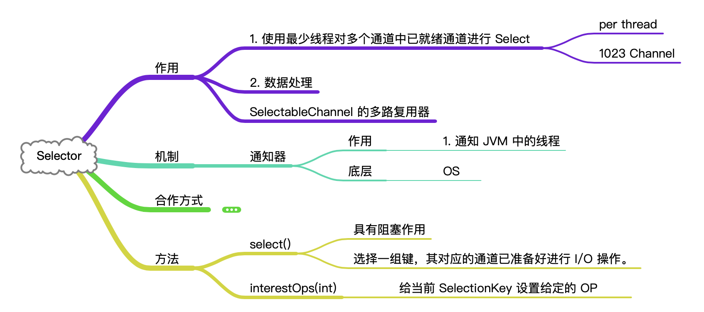
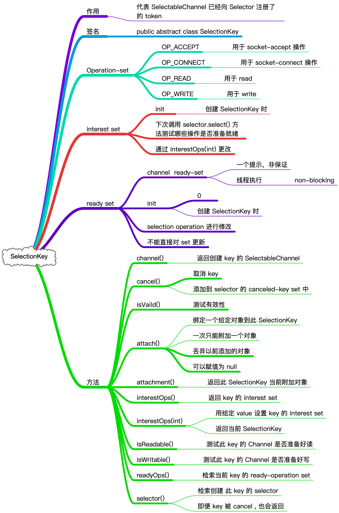
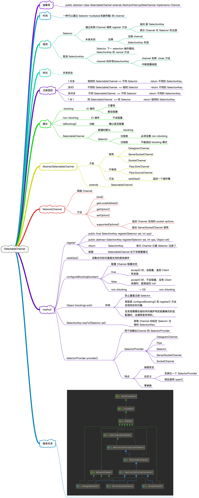

# SelectableChannel

&nbsp;

## Selector

&nbsp;

### Selection

1. 从 `cancelled-key` set 中移除的每个 key, 都将从它所属的每个 key set 中删除， 并注销它的 Channel 。 此操作将使 `canneled-key` set 为空 
2. 从 selection 操作开始的那一刻开始，向底层 OS 查询每个剩余 Channel 执行每个操作的准备情况， 这些操作由其 SelectionKey 的 interest set 确定。 对于为至少一个这样的操作做好准备的 Channel，将执行以下两种操作中第一种:

- 如果 Channel 的 key 还没有在 `selected-key` set 中，那么它就会被添加到该 set 中， 并修改它的线程操作 set，以准确地识别 Channel 现在报告为准备好的操作。任何以前记录在就绪 set 中的信息都将被丢弃。
- 通道的 key 已经在 `selected-key` set 中， 因此它的 read-operation set 将被修改，以识别 Channel 报告为准备好的任何新操作。保存在就绪 set 中先前记录的就绪信息； 换句话说， 底层 OS 返回的就绪 set 按位分离到 key 的当前就绪 set 。
- 如果这个步骤开始时的 key set 中的所有键都有空的兴趣集，那么 `selected-key` set 和任何 key 的 ready-operation 都不会被更新。

3.如果在 `step(1)` 进行过程中有任何 key 被添加到 `cancelled-key`，那么它们将按照 `step(1)` 进行处理。

&nbsp;

## SelectionKey

&nbsp;

## SelectableChannel 细节

> 上面的内容对于理解整个 NIO SelectableChannel 整个层级结构非常有好处。
>
> 声明： 非面面俱到，框架性 + 理论性内容
>
> 后续有实操类的篇章对它进行升华

&nbsp;

## ServerSocketChannel 和  SocketChannel

以上 SelectableChannel 的知识，都在为网络数据传输做铺垫，基础越扎实，学习内容以及在它之上衍生的流行框架会非常有帮助

关于网络的这 2 个 Channel 知识点，在另外篇幅进行讲解

[ServerSocketChannel 和 SocketChannel](nio-channel-serversocket-and-socket-channel.md)

&nbsp;

&nbsp;

&nbsp;

&nbsp;

