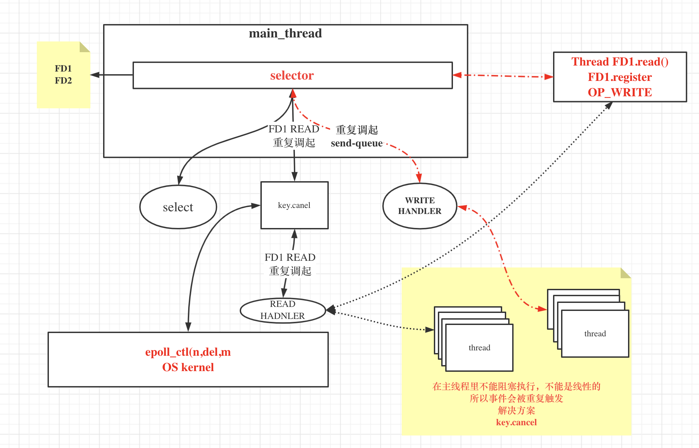
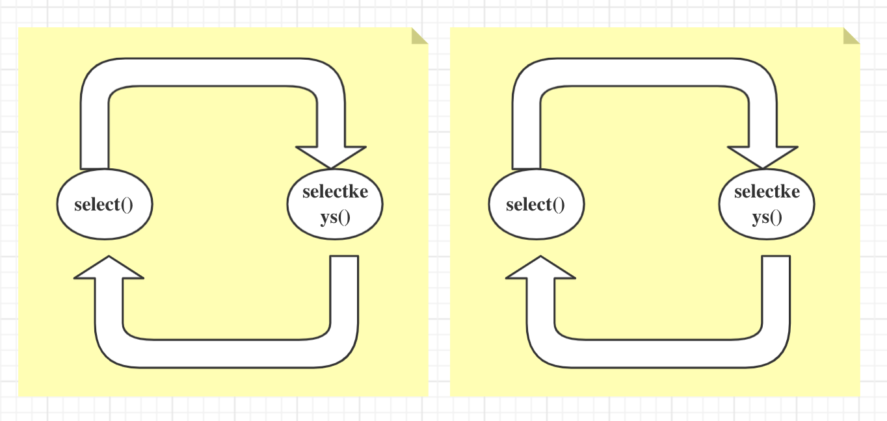

# Java Selector (Multiplex) 

&nbsp;

## Code

目的是为了深入底层，不在于代码本身，代码会有不少 bug， 代码本身没有研究的必要性：

下面直接将代码贴出 ， 在 io-code 里也有：

```java
package com.alton.system.io;

import java.io.IOException;
import java.net.InetSocketAddress;
import java.nio.ByteBuffer;
import java.nio.channels.*;
import java.util.Iterator;
import java.util.Set;

public class SocketMultiplexingSingleThreadv1 {

    //马老师的坦克 一 二期
    private ServerSocketChannel server = null;
    private Selector selector = null;   //linux 多路复用器（select poll    epoll kqueue） nginx  event{}
    int port = 9090;

    public void initServer() {
        try {
            server = ServerSocketChannel.open();
            server.configureBlocking(false);
            server.bind(new InetSocketAddress(port));


            //如果在epoll模型下，open--》  epoll_create -> fd3
            selector = Selector.open();  //  select  poll  *epoll  优先选择：epoll  但是可以 -D修正

            //server 约等于 listen状态的 fd4
            /*
            register
            如果：
            select，poll：jvm里开辟一个数组 fd4 放进去
            epoll：  epoll_ctl(fd3,ADD,fd4,EPOLLIN
             */
            server.register(selector, SelectionKey.OP_ACCEPT);


        } catch (IOException e) {
            e.printStackTrace();
        }
    }

    public void start() {
        initServer();
        System.out.println("服务器启动了。。。。。");
        try {
            while (true) {  //死循环

                Set<SelectionKey> keys = selector.keys();
                System.out.println(keys.size() + "   size");


                //1,调用多路复用器(select,poll  or  epoll  (epoll_wait))
                /*
                select()是啥意思：
                1，select，poll  其实  内核的select（fd4）  poll(fd4)
                2，epoll：  其实 内核的 epoll_wait()
                *, 参数可以带时间：没有时间，0  ：  阻塞，有时间设置一个超时
                selector.wakeup()  结果返回0

                懒加载：
                其实再触碰到selector.select()调用的时候触发了epoll_ctl的调用

                 */
                while (selector.select(500) > 0) {
                    Set<SelectionKey> selectionKeys = selector.selectedKeys();  //返回的有状态的fd集合
                    Iterator<SelectionKey> iter = selectionKeys.iterator();
                    //so，管你啥多路复用器，你呀只能给我状态，我还得一个一个的去处理他们的R/W。同步好辛苦！！！！！！！！
                    //  NIO  自己对着每一个fd调用系统调用，浪费资源，那么你看，这里是不是调用了一次select方法，知道具体的那些可以R/W了？
                    //幕兰，是不是很省力？
                    //我前边可以强调过，socket：  listen   通信 R/W
                    while (iter.hasNext()) {
                        SelectionKey key = iter.next();
                        iter.remove(); //set  不移除会重复循环处理
                        if (key.isAcceptable()) {
                            //看代码的时候，这里是重点，如果要去接受一个新的连接
                            //语义上，accept接受连接且返回新连接的FD对吧？
                            //那新的FD怎么办？
                            //select，poll，因为他们内核没有空间，那么在jvm中保存和前边的fd4那个listen的一起
                            //epoll： 我们希望通过epoll_ctl把新的客户端fd注册到内核空间
                            acceptHandler(key);
                        } else if (key.isReadable()) {
                            readHandler(key);  //连read 还有 write都处理了
                            //在当前线程，这个方法可能会阻塞  ，如果阻塞了十年，其他的IO早就没电了。。。
                            //所以，为什么提出了 IO THREADS
                            //redis  是不是用了epoll，redis是不是有个io threads的概念 ，redis是不是单线程的
                            //tomcat 8,9  异步的处理方式  IO  和   处理上  解耦
                        }
                    }
                }
            }
        } catch (IOException e) {
            e.printStackTrace();
        }
    }

    public void acceptHandler(SelectionKey key) {
        try {
            ServerSocketChannel ssc = (ServerSocketChannel) key.channel();
            SocketChannel client = ssc.accept(); //来啦，目的是调用accept接受客户端  fd7
            client.configureBlocking(false);

            ByteBuffer buffer = ByteBuffer.allocate(8192);  //前边讲过了

            // 0.0  我类个去
            //你看，调用了register
            /*
            select，poll：jvm里开辟一个数组 fd7 放进去
            epoll：  epoll_ctl(fd3,ADD,fd7,EPOLLIN
             */
            client.register(selector, SelectionKey.OP_READ, buffer);
            System.out.println("-------------------------------------------");
            System.out.println("新客户端：" + client.getRemoteAddress());
            System.out.println("-------------------------------------------");

        } catch (IOException e) {
            e.printStackTrace();
        }
    }

    public void readHandler(SelectionKey key) {
        SocketChannel client = (SocketChannel) key.channel();
        ByteBuffer buffer = (ByteBuffer) key.attachment();
        buffer.clear();
        int read = 0;
        try {
            while (true) {
                read = client.read(buffer);
                if (read > 0) {
                    buffer.flip();
                    while (buffer.hasRemaining()) {
                        client.write(buffer);
                    }
                    buffer.clear();
                } else if (read == 0) {
                    break;
                } else {
                    client.close();
                    break;
                }
            }
        } catch (IOException e) {
            e.printStackTrace();

        }
    }

    public static void main(String[] args) {
        SocketMultiplexingSingleThreadv1 service = new SocketMultiplexingSingleThreadv1();
        service.start();
    }
}

```

&nbsp;

## 底层探讨

Java Selector api 是 OS I/O Multiplex 的高级抽象。 在之前阐述的 Selector, SelectableChannel, ServerSocketChannel, SocketChannel 理论中对他们之间的关系都有进行深入的探讨。这里不再重述。

下面的阐述，针对 java 代码和 Kernel 底层交互的系统调用。

&nbsp;

### poll

先来看 poll 版本： 

```bash
javac code.java && strace -ff -o poll java -Djava.nio.channels.spi.SelectorProvider=sun.nio.ch.PollSelectorProvider code
```

| op                  | Java                                               | OS                                                           |
| ------------------- | -------------------------------------------------- | ------------------------------------------------------------ |
| fd(save)            | native 用户空间                                    |                                                              |
| server socket       | `ServerSocketChannel.open();`                      | socket(PF_INET, SOCK_STREAM, IPPROTO_IP) = 4                 |
| is_nonblocking      | `server.configureBlocking(false);`                 | fcntl(4, F_SETFL, O_RDWR\|O_NONBLOCK)  = 0                   |
| bind                | `server.bind(new InetSocketAddress(port));`        | bind(4, {sa_family=AF_INET, sin_port=htons(9090)             |
| listen              | `server.bind(new InetSocketAddress(port));`        | listen(4, 50)                                                |
| 开辟 fd 空间        | server.register(selector, SelectionKey.OP_ACCEPT); |                                                              |
| 调用 I/O Multipluex | `selector.select()`                                | poll([{fd=5, events=POLLIN}, {fd=4, events=POLLIN}], 2, -1) = 1 ([{fd=4, revents=POLLIN}])  // 5 : pipeline fd |
| accept client       | serverSocketChannel.accept();                      | accept(4,  = 7                                               |
| is_blocking         | `client.configureBlocking(false);`                 | fcntl(7, F_SETFL, O_RDWR\|O_NONBLOCK)                        |
| 调用 I/O Multipluex | `selector.select()`                                | poll([{fd=5, events=POLLIN}, {fd=4, events=POLLIN}, {fd=7, events=POLLIN}], 3, -1) |

&nbsp;

`poll([{fd=5, events=POLLIN}, {fd=4, events=POLLIN}, {fd=7, events=POLLIN}], 3, -1)  `

- while 循环中，第二次调用 select , 将上一次创建的 fd = 7（client）, 加入到了 poll 请求 fds 中

- `1`  : 一个fd有事件
- `-1`  : 非阻塞下，没有事件

&nbsp;

### EPOLL

| op                           | Java                                                       | OS                                                           |
| ---------------------------- | ---------------------------------------------------------- | ------------------------------------------------------------ |
| fd(save)                     |                                                            | Kernel epoll fd 空间 和 epoll_wait 等待链表中（有状态）      |
| server socket                | `ServerSocketChannel.open();`                              | socket(PF_INET, SOCK_STREAM, IPPROTO_IP) = 4                 |
| is_blocking                  | `server.configureBlocking(false);`                         | fcntl(4, F_SETFL, O_RDWR\|O_NONBLOCK)  = 0                   |
| bind                         | `server.bind(new InetSocketAddress(port));`                | bind(4, {sa_family=AF_INET, sin_port=htons(9090)             |
| listen                       | `server.bind(new InetSocketAddress(port));`                | listen(4, 50)                                                |
| 开辟 epoll fd 空间(仅一次)   |                                                            | epoll_create(256)                                            |
| 开辟 fd 空间                 | `server.register(selector, SelectionKey.OP_ACCEPT);`       | epoll_ctl(7, EPOLL_CTL_ADD, 4,                               |
| 调用 Multiplex               | `selector.select()`                                        | epoll_wait(7, {{EPOLLIN, {u32=4, u64=2216749036554158084}}}, 4096, -1) = 1 |
|                              |                                                            | // while (selector.select() > 0) {                           |
| accept client                | `serverSocketChannel.accept();`                            | accept(4 =8 //client的fd                                     |
| is_blocking                  | `client.configureBlocking(false);`                         | fcntl(8, F_SETFL, O_RDWR\|O_NONBLOCK)                        |
| client fd copy  到 wait 链表 | `client.register(selector, SelectionKey.OP_READ, buffer);` | epoll_ctl(7, EPOLL_CTL_ADD, 8, {EPOLLIN,                     |
| 调用 Multiplex               | `selector.select()`                                        | epoll_wait(7,                                                |

&nbsp;

## 单线程读写分离

```java
package com.alton.system.io;

import java.io.IOException;
import java.net.InetSocketAddress;
import java.nio.ByteBuffer;
import java.nio.channels.SelectionKey;
import java.nio.channels.Selector;
import java.nio.channels.ServerSocketChannel;
import java.nio.channels.SocketChannel;
import java.util.Iterator;
import java.util.Set;

public class SocketMultiplexingSingleThreadv1_1 {

    private ServerSocketChannel server = null;
    private Selector selector = null;   //linux 多路复用器（select poll epoll） nginx  event{}
    int port = 9090;

    public void initServer() {
        try {
            server = ServerSocketChannel.open();
            server.configureBlocking(false);
            server.bind(new InetSocketAddress(port));
            selector = Selector.open();  //  select  poll  *epoll
            server.register(selector, SelectionKey.OP_ACCEPT);
        } catch (IOException e) {
            e.printStackTrace();
        }
    }

    public void start() {
        initServer();
        System.out.println("服务器启动了。。。。。");
        try {
            while (true) {
//                Set<SelectionKey> keys = selector.keys();
//                System.out.println(keys.size()+"   size");
                while (selector.select() > 0) {
                    Set<SelectionKey> selectionKeys = selector.selectedKeys();
                    Iterator<SelectionKey> iter = selectionKeys.iterator();
                    while (iter.hasNext()) {
                        SelectionKey key = iter.next();
                        iter.remove();
                        if (key.isAcceptable()) {
                            acceptHandler(key);
                        } else if (key.isReadable()) {
//                            key.cancel();
                            readHandler(key);  //只处理了  read  并注册 关心这个key的write事件

                        } else if (key.isWritable()) {  //我之前没讲过写的事件！！！！！
                            //写事件<--  send-queue  只要是空的，就一定会给你返回可以写的事件，就会回调我们的写方法
                            //你真的要明白：你想什么时候写？不是依赖send-queue是不是有空间（多路复用器能不能写是参考send-queue有没有空间）
                            //1，你准备好要写什么了，这是第一步
                            //2，第二步你才关心send-queue是否有空间
                            //3，so，读 read 一开始就要注册，但是write依赖以上关系，什么时候用什么时候注册
                            //4，如果一开始就注册了write的事件，进入死循环，一直调起！！！
//                            key.cancel();
                            writeHandler(key);
                        }
                    }
                }
            }
        } catch (IOException e) {
            e.printStackTrace();
        }
    }

    private void writeHandler(SelectionKey key) {

        System.out.println("write handler...");
        SocketChannel client = (SocketChannel) key.channel();
        ByteBuffer buffer = (ByteBuffer) key.attachment();
        buffer.flip();
        while (buffer.hasRemaining()) {
            try {

                client.write(buffer);
            } catch (IOException e) {
                e.printStackTrace();
            }
        }
        try {
            Thread.sleep(2000);
        } catch (InterruptedException e) {
            e.printStackTrace();
        }
        buffer.clear();
        key.cancel();
        try {
            client.close();
        } catch (IOException e) {
            e.printStackTrace();
        }


    }

    public void acceptHandler(SelectionKey key) {
        try {
            ServerSocketChannel ssc = (ServerSocketChannel) key.channel();
            SocketChannel client = ssc.accept();
            client.configureBlocking(false);
            ByteBuffer buffer = ByteBuffer.allocate(8192);
            client.register(selector, SelectionKey.OP_READ, buffer);
            System.out.println("-------------------------------------------");
            System.out.println("新客户端：" + client.getRemoteAddress());
            System.out.println("-------------------------------------------");

        } catch (IOException e) {
            e.printStackTrace();
        }
    }

    public void readHandler(SelectionKey key) {

        System.out.println("read handler.....");
        SocketChannel client = (SocketChannel) key.channel();
        ByteBuffer buffer = (ByteBuffer) key.attachment();
        buffer.clear();
        int read = 0;
        try {
            while (true) {
                read = client.read(buffer);
                if (read > 0) {
                    client.register(key.selector(), SelectionKey.OP_WRITE, buffer);
                    //关心  OP_WRITE 其实就是关系send-queue是不是有空间
                } else if (read == 0) {
                    break;
                } else {
                    client.close();
                    break;
                }
            }
        } catch (IOException e) {
            e.printStackTrace();
        }


    }

    public static void main(String[] args) {
        SocketMultiplexingSingleThreadv1_1 service = new SocketMultiplexingSingleThreadv1_1();
        service.start();
    }
}
```


> send-queue

```bash
$ netstat -natp
```

&nbsp;

写事件 <--  send queue 只要是空的，就一定会给你返回可以写的事件，就会回调我们的写方法

需要明白的一点： 什么时候写？ 不是依赖 send-queue 是不是有空间

- 第一步: 你准备好了要写什么内容

- 第二步: 你才需要关心 send-queue 是否有空
  - OP_WRITE

- read 一开始就要注册， 但是 write 依赖以上关系，需要用时进行注册
- 如果一开始就注册了 write 事件，会进入死循环，一直调起！！

&nbsp;

> 仔细看代码，可以看出，处理写事件需要待读事件循环处理完后，写事件才会被处理。
>
> 按顺序执行读写事件的方法
>
> - 执行效率慢
> - 所有读事件在先
> - 所有写事件在后

&nbsp;

## 多线程读写分离

```java
package com.alton.system.io;

import java.io.IOException;
import java.net.InetSocketAddress;
import java.nio.ByteBuffer;
import java.nio.channels.*;
import java.util.Iterator;
import java.util.Set;

public class SocketMultiplexingSingleThreadv2 {

    private ServerSocketChannel server = null;
    private Selector selector = null;   //linux 多路复用器（select poll epoll） nginx  event{}
    int port = 9090;

    public void initServer() {
        try {
            server = ServerSocketChannel.open();
            server.configureBlocking(false);
            server.bind(new InetSocketAddress(port));
            selector = Selector.open();  //  select  poll  *epoll
            server.register(selector, SelectionKey.OP_ACCEPT);
        } catch (IOException e) {
            e.printStackTrace();
        }
    }

    public void start() {
        initServer();
        System.out.println("服务器启动了。。。。。");
        try {
            while (true) {
//                Set<SelectionKey> keys = selector.keys();
//                System.out.println(keys.size()+"   size");
                while (selector.select(50) > 0) {
                    Set<SelectionKey> selectionKeys = selector.selectedKeys();
                    Iterator<SelectionKey> iter = selectionKeys.iterator();
                    while (iter.hasNext()) {
                        SelectionKey key = iter.next();
                        iter.remove();
                        if (key.isAcceptable()) {
                            acceptHandler(key);
                        } else if (key.isReadable()) {
//                            key.cancel();  //现在多路复用器里把key  cancel了
                            System.out.println("in.....");
                            key.interestOps(key.interestOps() | ~SelectionKey.OP_READ);

                            readHandler(key);//还是阻塞的嘛？ 即便以抛出了线程去读取，但是在时差里，这个key的read事件会被重复触发

                        } else if (key.isWritable()) {  //我之前没讲过写的事件！！！！！
                            //写事件<--  send-queue  只要是空的，就一定会给你返回可以写的事件，就会回调我们的写方法
                            //你真的要明白：什么时候写？不是依赖send-queue是不是有空间
                            //1，你准备好要写什么了，这是第一步
                            //2，第二步你才关心send-queue是否有空间
                            //3，so，读 read 一开始就要注册，但是write依赖以上关系，什么时候用什么时候注册
                            //4，如果一开始就注册了write的事件，进入死循环，一直调起！！！
//                            key.cancel();
                            key.interestOps(key.interestOps() & ~SelectionKey.OP_WRITE);


                            writeHandler(key);
                        }
                    }
                }
            }
        } catch (IOException e) {
            e.printStackTrace();
        }
    }

    private void writeHandler(SelectionKey key) {
        new Thread(() -> {
            System.out.println("write handler...");
            SocketChannel client = (SocketChannel) key.channel();
            ByteBuffer buffer = (ByteBuffer) key.attachment();
            buffer.flip();
            while (buffer.hasRemaining()) {
                try {

                    client.write(buffer);
                } catch (IOException e) {
                    e.printStackTrace();
                }
            }
            try {
                Thread.sleep(2000);
            } catch (InterruptedException e) {
                e.printStackTrace();
            }
            buffer.clear();
//            key.cancel();

//            try {
////                client.shutdownOutput();
//
////                client.close();
//
//            } catch (IOException e) {
//                e.printStackTrace();
//            }
        }).start();

    }

    public void acceptHandler(SelectionKey key) {
        try {
            ServerSocketChannel ssc = (ServerSocketChannel) key.channel();
            SocketChannel client = ssc.accept();
            client.configureBlocking(false);
            ByteBuffer buffer = ByteBuffer.allocate(8192);
            client.register(selector, SelectionKey.OP_READ, buffer);
            System.out.println("-------------------------------------------");
            System.out.println("新客户端：" + client.getRemoteAddress());
            System.out.println("-------------------------------------------");

        } catch (IOException e) {
            e.printStackTrace();
        }
    }

    public void readHandler(SelectionKey key) {
        new Thread(() -> {
            System.out.println("read handler.....");
            SocketChannel client = (SocketChannel) key.channel();
            ByteBuffer buffer = (ByteBuffer) key.attachment();
            buffer.clear();
            int read = 0;
            try {
                while (true) {
                    read = client.read(buffer);
                    System.out.println(Thread.currentThread().getName() + " " + read);
                    if (read > 0) {
                        key.interestOps(SelectionKey.OP_READ);

                        client.register(key.selector(), SelectionKey.OP_WRITE, buffer);
                    } else if (read == 0) {

                        break;
                    } else {
                        client.close();
                        break;
                    }
                }
            } catch (IOException e) {
                e.printStackTrace();
            }
        }).start();

    }

    public static void main(String[] args) {
        SocketMultiplexingSingleThreadv2 service = new SocketMultiplexingSingleThreadv2();
        service.start();
    }
}
```

&nbsp;



&nbsp;

**我们为啥提出这个模型？**

- 考虑资源利用，充分利用cpu核数

- 考虑有一个fd执行耗时，在一个线性里会阻塞后续FD的处理

- 当有N个 `fd` 有 `R/W` 处理的时候：

- 将N个 `FD` 分组，每一组一个 `selector`，将一个 `selector` 压到一个线程上

- 最好的线程数量是：`cpu` `cpu*2`

- 其实单看一个线程：里面有一个 selector，有一部分 `FD`，且他们是线性的

- 多个线程，他们在各自的 `cpu` 上执行，代表会有多个 `selector` 在并行，且线程内是线性的，最终是并行的`fd` 被处理

- 但是，你得明白，还是一个 `selector` 中的 `fd` 要放到不同的线程并行，从而造成 `cancel` 调用嘛？ 不需要了

- 上边的逻辑其实就是分治，我的程序如果有 `100W` 个连接，如果有 `4` 个线程（ `selector`），每个线程处理   `250000`

- 那么，可不可以拿出一个线程的selector就只关注accpet ，然后把接受的客户端的FD，分配给其他线程的 `selector`



&nbsp;

