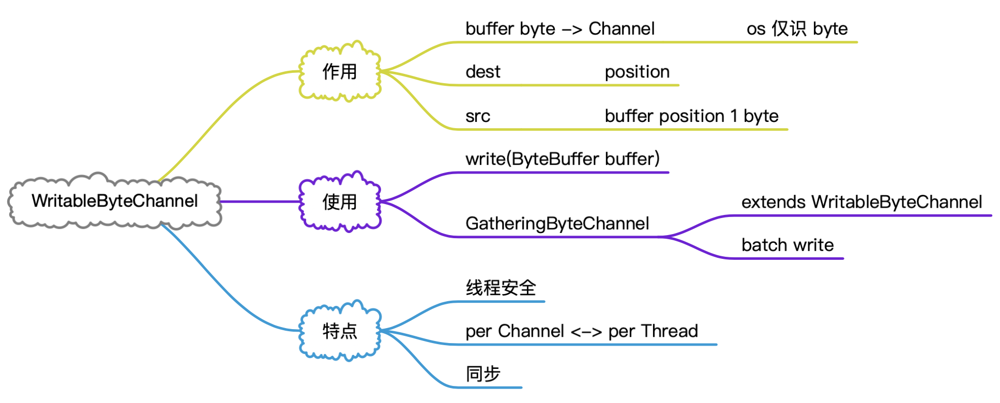
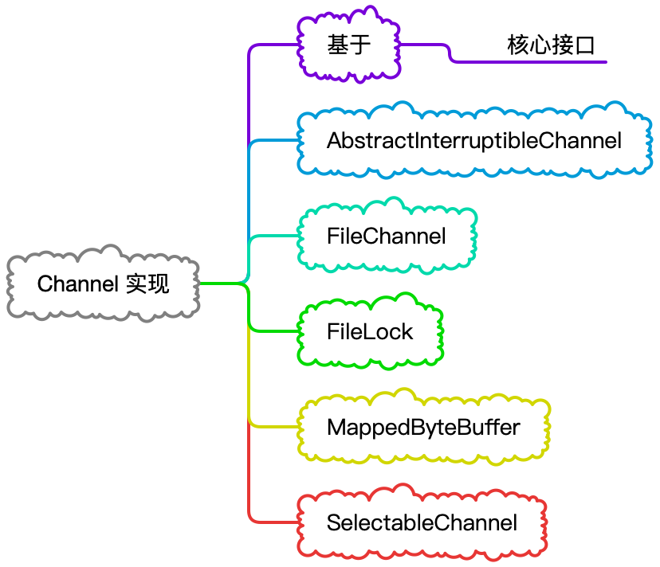
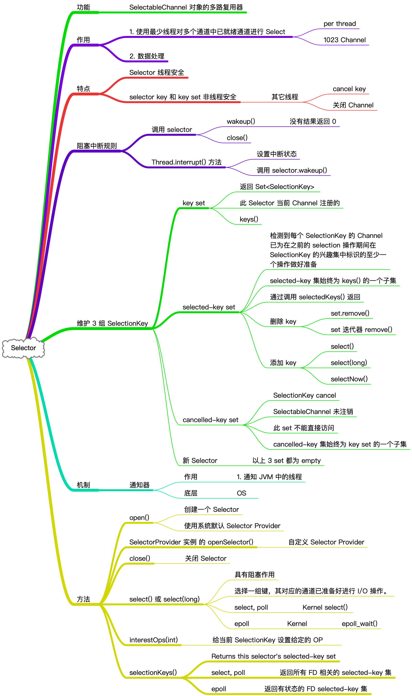

# Channel

&nbsp;

## 概览

&nbsp;

## 核心接口

&nbsp;

> AsynchronousChannel 接口为了支持 AIO 而存在，在 NIO 专题不对它进行展开讲解

&nbsp;

### ReadableByteBuffer

&nbsp;

### WriteableByteBuffer

&nbsp;

### ByteChannel

&nbsp;

### NetworkChannal

&nbsp;

### InterruptibleChannel

&nbsp;

## Channel 实现

> Channel 实现篇幅长，另外讨论
>
> [Chnnel 实现](nio-channel-implement.md)

&nbsp;

## Selector

> Selector 属于 Channel 的核心技术，这里不做多介绍，会起另外一篇来进行专门介绍
>
> [Selector](nio-channel-selector.md)

