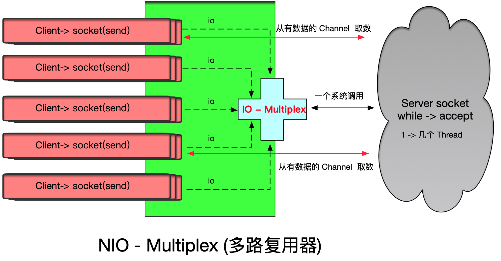
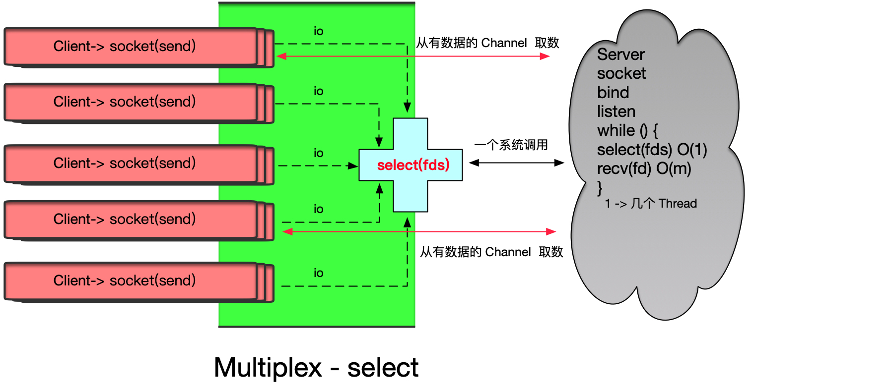
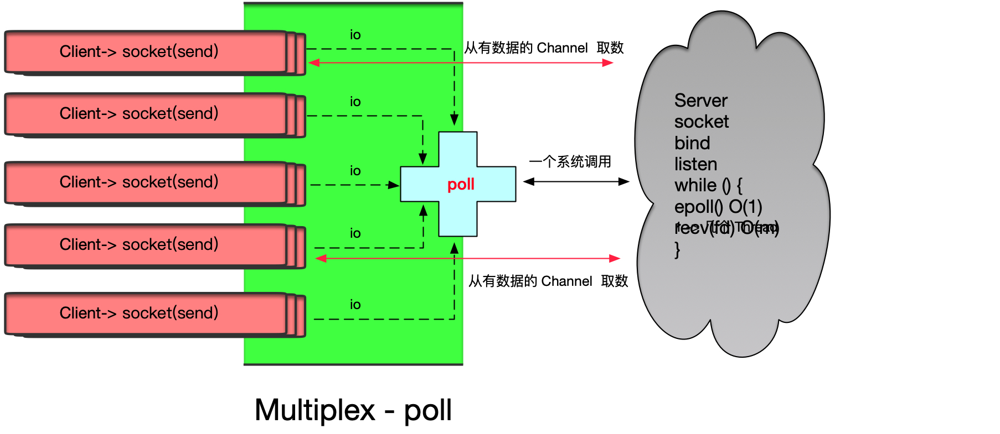
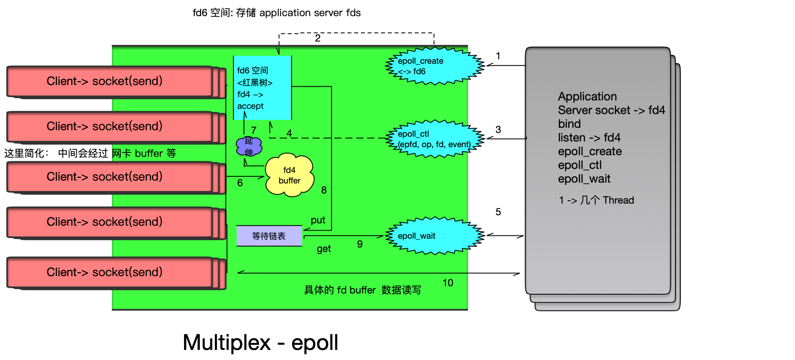

## NIO 多路复用器（IO Multiplexing）

&nbsp;

## Module

同步 non-blocking 模型

只要程序自身完成 RW， IO 模型 -> 同步

&nbsp;

## 概念图



&nbsp;

## I/O Multiplex 种类

- `Select`: 
  - 多路复用器
  - Java 端详情请看 [Selector](nio-channel-selectable-channel.md#Selector) 相关介绍
- `poll`: 功能和 Selector 类似，在 Selector 之上，进行完善和功能升级

- `epoll`

&nbsp;

## select 和 poll

- synchronous I/O multiplexing

&nbsp;

```bash
$ man 2 select
```

&nbsp;

```c
select(int nfds, fd_set readfds, fd_set writefds, fd_set errorfds, struct timeval timeout);
```

- `nfds` : 
  - `FD` 数量
- readfds: 
  - `read FD`  数量

- `writefds`:
  - `write FD`  数量
- `errorfds`
  - `error FD` 数量
- `timeout`
  - 超时时间

&nbsp;

&nbsp;



&nbsp;

### select 优势

`select(fds)` : O(1) 时间复杂度

`recv(fd)` : O(m) 时间复杂度, m 为 m 路 io 有数据

&nbsp;

### select 劣势

受到 fd_set 影响

- linux `FD_SETSIZE` 参数控制
  - 同时可以询问多少 IO
  - 1024 or 2048

&nbsp;

> 假如有 2048 IO， 但 FD_SETSIZE 只有 1024， 相当于应用程序需要循环发送 2 次系统调用到 Kernel， 才能询问完所有的 IO 路线，判断是否有数据

&nbsp;



> poll 没有 select FD 的个数限制
>
> 目前 NIO 模型中，很少有用 select 的

属性： 他们都属于单调用

poll 调用时，仅仅是将所有的 fd 全部传入到 poll, 没有 fd 限制而已。

&nbsp;

### select 和 poll 与 NIO 比对

> 和 普通 NIO（非多路复用器） 相比，其实都是需要遍历所有 IO（程序需要访问的IO），询问状态。
>
> - 只不过， 普通 NIO， 这个遍历的过程成本在用户态和内核态切换
> - select, epoll 模型: 这个遍历的过程仅仅触发了一次系统调用（用户态和内核态的切换），过程中，把 fds 传递给内核，内核重新根据用户这次调用传过来的 fds, 遍历，修改状态。

&nbsp;

### select 和  poll 弊端

1. 每次都要重新传递 fds
2. 每次 Kernel 被调之后，针对这次调用，触发一个遍历 `fds` 全量的复杂度 O(n)

&nbsp;

## system-io 回顾


> cpu 在不同的应用程序之间不断发生时钟切换，哒哒哒，为所有应用程序进行服务

- `interrupt` -> `callback`
- `event` -> `callback 处理事件`

回到 NIO 

- 大小，复杂度
  - 在 epoll 之前的 callback: 只是完成将网卡发来的数据，走内核网络协议栈（2-链路层，3-网络层，4-传输控层）最终关联到 FD 的 buffer
  - 所以，你某时间如果从 `application` 询问内核某个或某些 FD 是否可 R/W (数据)，会有状态返回
  - 如果内存在 callback 处理中加入

&nbsp;

## epoll

> epoll ： Linux , unix, windows
>
> 以下描述中 fd 后面的数字都是虚构的，为了更好的理解原理，跟着理解即可。

&nbsp;



&nbsp;

### epoll 系统调用：

epoll_create

epoll_ctl

- epfd:
  - `epoll fd`
  - int 类型
  - e.g.  `fd6`
- op: 
  - 操作符
  - int 类型
  - e.g. add
- `fd`
  - 需要操作的 fd
  - int 类型
  - e.g. fd4

epoll_wait

- 有状态事件返回

&nbsp;

### epoll 解决 select 和 poll 的弊端

- 每次都要重新传递 fds (开辟 Kernel 空间，存储 fds, 应用程序只要发送一次即可)
- 每次 Kernel 被调之后，针对这次调用，触发一个遍历 `fds` 全量的复杂度 O(n)
  - epoll_wait(wait 链表来解决, 里边仅仅有状态变化的 fd 信息)

&nbsp;