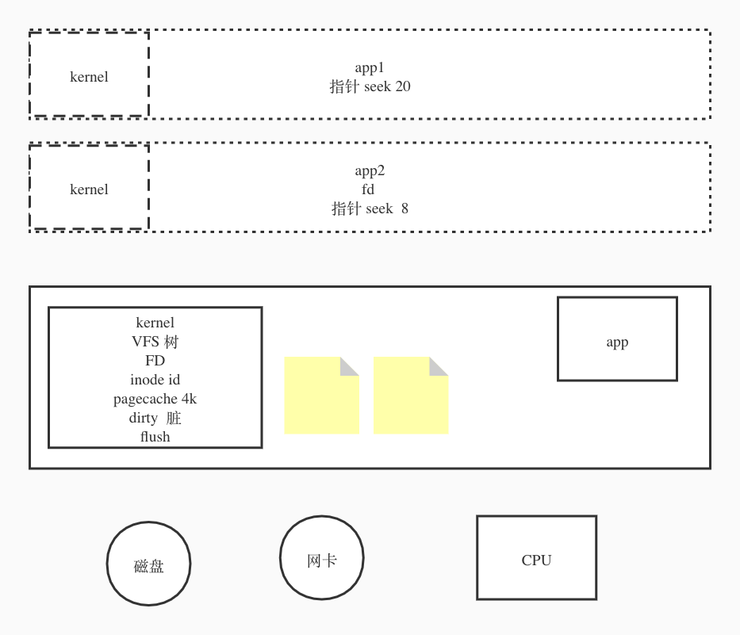
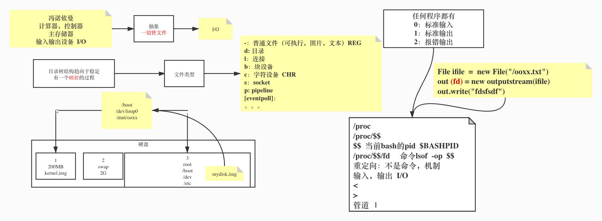

# Sytem IO
&nbsp;
## IO 设备
仅仅列出平常 code 经常关注的 2 种：
- `Disk`
  - 磁盘
- `network interface card`
  - 网卡
    

&nbsp;

## Kernel 



&nbsp;

Kernel 明白点说，就是一个 OS 里的一个控制程序，里面包含了很多内容：
- `VFS`： 
  - 虚拟文件系统
    - 解耦层
    - 为了用户空间更方便使用 OS
  - Tree 结构 
    - 映射具体的物理位置
      - `sda1`
      - `ada3`
      - and so on

&nbsp;

- inode id
  - id， 每个文件都有 inode id
  - e.g. `application` 访问某个文件
    - 首先访问 kernel ，通过 kernel 找到对应路径的文件
    - 文件本身有对应的 inode id,通过 inode id，加载元数据， 来对应真实的磁盘位置

&nbsp;

- `Pagecache`: 缓存页
  - 用来用户空间来读取 IO 设备中的数据
  - 一个 pagecache $4$ k 大小
  - 多个 `appliation` 可共享  pagecache， 都有自个的指针（seek） ,通过偏移来找到对应的位置，然后进行操作。
  - 当 IO 设备的数据被修改， 对应的所有 pagecache 被标记为 dirty
  - 多久被 flush 同步， 可以通过系统参数来优化    

&nbsp;
`Kernel` 和 `application` 被 MRU 转化成 CPU 的物理地址

&nbsp;

一般来说 `application` 不能直接访问硬件来访问数据，需要通过 `Kernel` 间接访问数据。 但也可通过直接 IO 来访问数据，这个后续再补充。

&nbsp;

`FD`： 文件描述符,可通过它的属性来对文件位置进行标记
- e.g. 访问文件时，本质上是通过 `FD` 来找到自个的指针（seek） ,通过偏移来找到对应的位置，然后进行操作。

&nbsp;

## 计算机组成

&nbsp;

### 概念
计算机科学家： "冯诺依曼" 提出： 
- 计算器
- 控制器
- 主存储器
- 输入输出设备

&nbsp;

抽象： 一切皆文件
- IO，对文件进行操作

&nbsp;

### 目录
- 目录树结构趋向于稳定
  - 映射过程
&nbsp;

文件类型：
- `-`： 普通文件（可执行，图片，文本） REG
- `d`: 目录 - DIR
- `l`: 链接  
  - 软链接
  - 硬链接
```bash
$ vim test.txt
## 硬链接，本质上，磁盘就一个文件，只是路径有 2 个而已
## 删掉其中一个，不会影响数据
$ ln test.txt /root/h.txt

# 软链接，删除原文件，软链接会报错
$ ln -s test.txt /root/s.txt 
# 可看到文件元信息， 硬链接对应的文件信息一致，软链接对应的文件信息不同
$ stat test.txt 
```
&nbsp;
- `c`: 字符设备- CHAR
- `s`: socket
- `p`: pipeline
- [eventpoll]: 
- 等等

&nbsp; &nbsp;

## 实操环节
```bash
$ df -h # 找到磁盘以及磁盘里每个分区挂载位置。
$ umount /boot # 卸载目录，卸载 df 命令就看不到之前可看到的 /boot 相关信息，还原了初始化状态，里面的内容也没有了。
$ mount /dev/sda1 /boot # 挂载分区到对应的目录，之前卸载的文件，又会被还原。
```
&nbsp;
```bash
# 生成文件
$ dd if=/dev/zero of=mydisk.img bs=1048576 count=100

# 用生成的磁盘设备，挂载到相应的文件系统去
# /dev/loop0 文件
$losetup /dev/loop0 mydisk.img

# 格式化设备（文件）
$ mke2fs /dev/loop0

# 挂载
$ mount -t ext2 /dev/loop0 /test

$ df
/dev/loop0 信息

# 查看 bash 在哪里
$ whereis bash
$ pwd
/test
$ mkdir bin
$ cp /bin/bash bin
$ cd bin
# 分析 bash 依赖项, 可以看到相关依赖基本都在 /lib64 目录下
$ ldd bash
$ cd ../
$ mkdir lib64
$ cp /lib64/{libtinfo.so.5,libdl.so.2,libc.so.6,ld-linux-x86-64.so.2} lib64/
$ cd lib64
$ cd ../
$ chroot ./
bash-4.1# echo "hello world" > /abc.txt
# root 切换了， /test 目录下就有了 abc.txt 文件
```
解析：

> `dd`:  用指定大小的块拷贝一个文件，并在拷贝的同时进行指定的转换。
>
> 注意：指定数字的地方若以下列字符结尾，则乘以相应的数字：b=512；c=1；k=1024；w=2`if`: input file
> `of`: output file
> `bs`: block size
> `count`: 多少 block

&nbsp;

### IO 

任何程序都有： 

- `0`： stdin
- `1`： stdout
- `2`: error out

&nbsp;

```java
new File("path");
out(fd) = outputStream(ifile);
out.write("hello, world");
```


&nbsp;

```bash
# 当前 bash 
$ lsof -p $$

# 创建一个 8 的 FD
exec 8< test.txt

# stdout 8r REG 8,3 0t0 10227564 /root/text.txt
# 读取 FD 8 对应文件 /root/text.txt 的前 4 个字节赋值给了 a
$ read a 0<& 8

# 然后执行
$ lsof -op $$
8r REG 8,3 0t4 10227564 /root/test.txt

# Kernel 为每个进程维护一套数据，一起访问某个文件时，指针互不影响，e.g. 另外窗口， FD： 6 对相同文件进行访问

```

&nbsp;

FD:

- `cwd`:  当前目录
- `rtd`:  根目录
- `txt`:  文本域 - 可执行程序的代码段
- `mem`: 内存空间- 挂载的执行程序
- `0u`：stdin
- `1u`：
- `2u`：errout
- `255u`：

&nbsp;

```bash
$ /proc # 本机目前所有进程信息，目录下面有 pid
$ /proc/$$ # 当前 bash 的 pid, $BASHPID
$ $$ # 当前 bash 的 pid, $BASHPID
$ proc/$$/fd # 当前进程的所有 fd 信息
$ lsof -op $$
# 重定向，不是命令，是一种机制
$ < # 输入
$ > # 输出
$ read a 0< cat.out # a 变量只有文件里的第一行数据。
```

&nbsp;

### 重定向

- 日志分流

```bash
ls ./ /xx.txt 1>ls01.out 2> ls02.out
```

&nbsp;

- 标准输出与错误输出都输出到同一文件

```bash
# 第一种写法
$ ls ./ ./xx.txt 1> ls.out 2>&1

# 第二种写法
$ ls ./ ./xx.txt > ls.out 2>&1
```

&nbsp;

### 管道

介绍点初步知识： 

```bash
$ ls  # text.txt
```

&nbsp;

- head 默认显示文件前 10， `-n` : 可以指定显示的行数

```bash
$ head -1 text.txt
```

&nbsp;

- 同理， tail 反之

```bash
$ tail -1 text.txt
```

&nbsp;

- 显示中间的行数, e.g. 显示第 8 行
  - 管道符，会将 `|` 前的输出，作为 `|` 后命令的输入

```bash
head -8 text.txt | tail -l
```

&nbsp;



&nbsp;

### 父子进程

- 构建两个进程

```bash
$ echo $$
17731

alton at alton-mac in ~
$ /bin/bash

The default interactive shell is now zsh.
To update your account to use zsh, please run `chsh -s /bin/zsh`.
For more details, please visit https://support.apple.com/kb/HT208050.
bash-3.2$ echo $$
17763
```

&nbsp;

- pstree - 查看进程树

```bash
| \-+- 03485 alton /Users/alton/Library/Application Support/iTerm2/iTermServer
 |   \-+= 17730 root login -fp alton
 |     \-+= 17731 alton -zsh
 |       \-+= 17763 alton /bin/bash
 |         \-+= 17774 alton pstree
 |           \--- 17775 root ps -axwwo user,pid,ppid,pgid,command
```

&nbsp;

- 查看父子进程信息

```bash
bash-3.2$ ps -ef | grep 8445
  502  8445  8444   0  8:16PM ttys000    0:00.57 -zsh
  502 15374  8445   0  5:44PM ttys000    0:00.01 /bin/bash
  502 15392 15374   0  5:45PM ttys000    0:00.00 grep 8445
```

&nbsp;

- 退出子进程

```bash
$ exit
```

&nbsp;

> 通常子进程访问不到父进程的变量值
>
> 如果子进程需要访问父进程的信息，需要将相关变量进行 export

&nbsp;

### 花括号

```bash
$ {echo "123"; echo "456"; }
123
456
```

&nbsp;

> 一般情况下，括号中可以更改同一进程中定义的变量

```bash
alton at alton-mac in ~
$ echo $a
1

alton at alton-mac in ~
$ {a=9; echo "456"; }
456

alton at alton-mac in ~
$ echo $a
9
```

> 这一切，在遇到管道符 | 后，都会发生改变
>
> 下面详解

&nbsp;

### 括号遇到管道符

> 当括号遇到管道符， 会在 {} 中和 | 后新起子进程
>
> a 值不会发生变化

```bash
	alton at alton-mac in ~
$ a=1

alton at alton-mac in ~
$ echo $a
1

alton at alton-mac in ~
$ {echo a=9; echo "456"; } | cat
a=9
456

alton at alton-mac in ~
$ {a=9; echo "456"; } | cat
456

alton at alton-mac in ~
$ echo $a
1
```

&nbsp;

### 特殊情况

```bash
$ echo $$
17731

alton at alton-mac in ~
$ echo $$ | cat
17731
```

> `$$` 优先级高于 `|` ，`echo $$` 会在 `|` 后面命令执行前执行，因此 cat 还是原进程号。

&nbsp;

