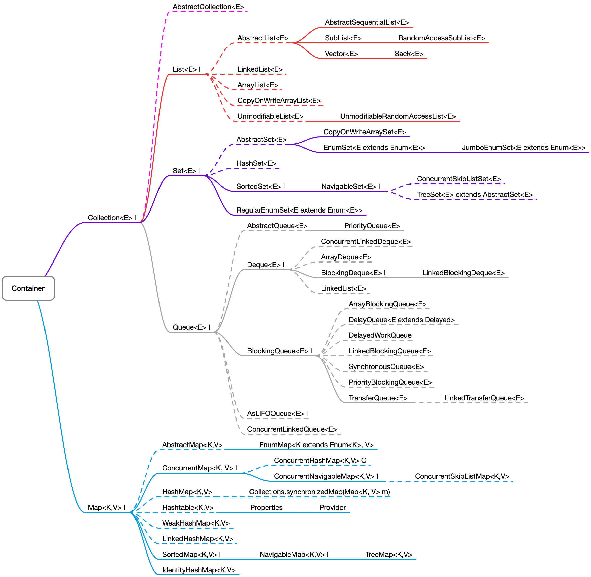

# Java 容器



&nbsp;

## HashTable & Vector 

> 自带锁，线程安全
>
> 基本不需要用了，他们很重

&nbsp;

&nbsp;

## ArrayList vs. Vector

>线程可见性
>
>- ArrayList 线程不安全
>- Vector 线程安全
>  - 读和写都加锁

&nbsp;

## CopyOnWriteArrayList

> 写时复制，后续有时间看源码，继续深化对它的理解
>
> 读的时候不需要加锁
>
> add 时加锁
>
> - 新建数组，copy 原数组并添加新元素（Array 本身 immuable, 因此需要新建 array 来进行添加元素）
> - 这种底层实现其实是低效的。 
> - 完全可以自己实现更加高效的数据结构
>
> 适合场景：
>
> - 读多写少

&nbsp;

## Queue

> 多线程场景下， 多考虑用 `Queue` 中并发安全的容器, 少考虑 List
>
> ConcurrentLinkedQueue<E> 
>
> - 底层采用无锁机制（cas)
>
> 适合场景：
>
> - 线程友好，并发
> - BlockingQueue
> - Producer 和 consumer

&nbsp;

## synchronized 

> 以下场景适合用它:
>
> - 线程中任务执行时间长
> - 线程少

&nbsp;

## TreeMap

>底层： 红黑树
>
>特性： 
>
>- 排序

&nbsp;

&nbsp;

## BlockingQueue

- [blockingQueue](java-blocking-queue.md)

&nbsp;

