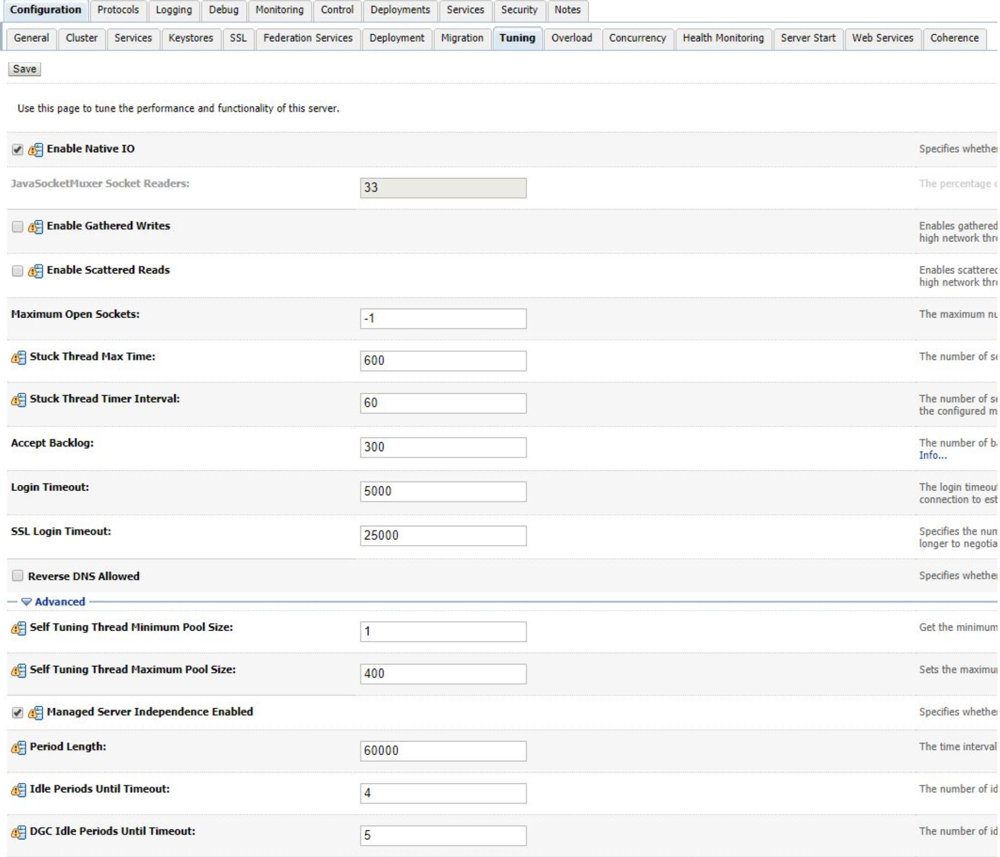

# Java Web 服务 Thread Pools 配置

&nbsp;

## 1. 介绍

在本教程中，我们将看看 Java web 应用程序服务器 (如 Apache Tomcat、Glassfish 服务器 和 Oracle Weblogic)的线程池配置。

&nbsp;

## 2. Server Thread Pool

**[Server thread pools](thread-pool-java-and-guava.md) 由部署的应用程序 web 应用程序服务使用和管理** 这些线程池存在于 web 容器或 servlet 之外，因此他们不受相同的 context 边界约束。

与应用程序线程不同,  服务器线程即使在已部署的应用程序停止后仍然存在。

&nbsp;

## 3. Apache Tomcat

首先，我们可以通过 *server.xml* 中的 *Executor* 配置类来配置 Tomcat 的服务器线程池：

```xml
<Executor name="tomcatThreadPool" namePrefix="catalina-exec-" maxThreads="150" minSpareThreads="25"/>
```

*minSpareThreads* 是线程池最小线程数量，包括在启动时。maxThreads 是服务器开始排队请求之前线程池最大的线程数量。

Tomcat 将它们分别默认为 25 和 200。在这个配置中，我们将线程池的线程设置得比默认值小一些。

&nbsp;

### 3.1. Embedded Tomcat

类似地，我们可以通过设置一个 application 属性来改变 Spring Boot 的 [嵌入式 Tomcat 服务器](spring-boot-configure-tomcat.md)  来配置线程池：

```javascript
server.tomcat.max-threads=250
server.tomcat.max-threads=250
```

&nbsp;

从Boot 2.3开始，属性更改为:

```xml
server.tomcat.threads.max=250
```

&nbsp;

## 4. Glassfish

接下来，让我们更新 Glassfish 服务器。

&nbsp;

Glassfish 使用的是管理命令，而不是 Tomcat 的 XML 配置文件 *server.xml。在提示符中运行:

```shell
create-threadpool
```

&nbsp;

我们可以在 *create-threadpool* 中添加 *maxthreadpoolsize* 和 *minthreadpoolsize* 标记。它们的功能类似于 Tomcat的 *minSpareThreads* 和 *maxThreads*：

```shell
--maxthreadpoolsize 250 --minthreadpoolsize 25
```

&nbsp;

我们还可以指定线程在返还 pool 之前可以空闲多长时间：

```shell
--idletimeout=2
```

&nbsp;

然后，我们在最后提供线程池的名称:

```shell
asadmin> create-threadpool --maxthreadpoolsize 250 --minthreadpoolsize 25 --idletimeout=2 threadpool-1
```

&nbsp;

## 5. Weblogic

Oracle Weblogic 让我们能够使用 WorkManager 更改自调优线程池。

与线程队列类似，WorkManager 将线程池作为队列管理。然而，WorkManager 会根据实时吞吐量添加动态线程。Weblogic 定期对吞吐量进行分析，以优化线程利用率。

这对我们意味着什么? 这意味着，虽然我们可能更改线程池，但 web 服务器最终将决定是否生成新线程。

&nbsp;

我们可以在 Weblogic 管理控制台中配置线程池:



&nbsp;

更新自调优 `Self Tuning Minimum Thread Pool Size` 和  `Self Tuning Thread Maximum Pool Size` 大小值设置 workmanager 的 min 和 max 边界。

注意 “*Stuck Thread Max Time*” 和 “*Stuck Thread Timer Interval*” 值。这可以帮助 WorkManager 对被卡住的线程进行分类。

有时，长时间运行的进程可能会导致卡住的线程累积。WorkManager 将从线程池中生成新的线程来补偿。对这些值的任何更新都可能延长流程完成的时间。

线程卡住可能是代码问题的象征，所以最好是解决根本原因，而不是使用变通方法

&nbsp;

## 6. 总结

在这篇快速文章中，我们讨论了配置应用程序服务器线程池的多种方法。

尽管应用程序服务器管理各种线程池的方式存在差异，但它们使用类似的概念进行配置。

最后，让我们记住，更改web服务器的配置值并不适合修复性能差的代码和糟糕的应用程序设计。