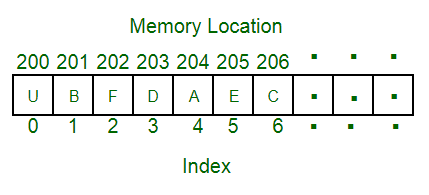

# Data Structure

&nbsp;

## 兴趣

很多童鞋在学习数据结构和算法时，都是别人介绍的经典书籍，教程等方式来开始学习。很简单地认为程序员写代码就是要学习这些课程。

以这种出发点来开始学习知识，笔者认为这种学习方法不大容易 get 到点， 容易走偏，换句话说，这种方式是在扼杀学习知识的内心 “欲望”。 久而久之就会认为学习是被动的，学习这些是理所应当的， 有几位同学在学习知识前，问过自己，学习它的动机是啥？是否值得自己学习？自己能付出多少代价来学习？学习后能为自己带来多少价值？ 

笔者认为首先得知道即将要学习的知识本身的核心价值体现在哪里？ 它能解决什么问题？ 希望读者能通过下文内容反过来来问问自己，是否找到了答案？ 或者能对它产生浓郁的学习兴趣呢？

&nbsp;

下文都是笔者简单的总结，如果想了解更多前世今生可以 google 学习。

&nbsp;

## 背景

首先来介绍下数据结构产生的原因和目的：

- 原因： 简而言之， 按我理解，所谓的数据结构被正式提出之前，肯定是当时的方法对数据的处理手段极为有限，效率不高，不够便捷，消耗资源多等，才构建出了各种针对数据处理的结构。
- 目的:   和原因是相呼应的，数据结构学科就是为了让计算机能够以更高效，便捷的行为方式来对数据进行状态改变（位置，表现形式等），存储，获取。通常情况下，精心选择的数据结构可以带来更高的运行或者存储效率。数据结构往往同高效的检索算法和索引技术有关。
  - 随着应用程序变得越来越复杂和数据越来越丰富，几百万、几十亿甚至几百亿的数据就会出现，而对这么大对数据进行搜索、插入或者排序等的操作就越来越慢，数据结构就是用来解决这些问题的。

&nbsp;

## 概念

数据结构是计算机存储、组织数据的方式，指相互之间存在一种或多种特定关系的数据元素的集合。

&nbsp;

## 前置知识

前置知识：

- 内存的数据存储模式，顺序存储
  - 也就是说，内存中的数据是起点是 0 ，终点根据内存的大小和操作系统而定的一个顺序的序列。0 被占用，后面存入的数据则依次存入。
- 程序在一个线程中，一次只能从一个地址来取数据。所以，除了 `Graph` 之外，所有的数据结构有且只有唯一的取数入口。所以，必须从一个入口来进行取数。

- 数据内存空间非连续性
  - 内存中的数据存取大多数情况下都非单线程，经过一段时间，几乎很难找到比较大的连续的内存空间（跟使用了一段时间的磁盘空间一样）

- 学习数据结构最关键的是理解各种数据结构。
  - 每种数据结构:
    - 设计目的
    - 优势
    - 区别
  - 结构理解透测了，各种算法的掌握都能得心应手。（除了遍历算法, 往往理解了还不够，还需要掌握算法本质）

&nbsp;

## 特点

- 存取效率
- 可扩展性
- 顺序性
- 可排序性

&nbsp;

## 类型

### 线性表

>Array
>
>Linked List
>
>Stack
>
>Queue
>
>Hash Table


线性表是为了解决单线存储而出现的。

数组：就是最简单粗暴的存储方法。就是直接拉出一大块数据存在那里。数组的快速存取其实只是一个副作用，因为所有的数据都在一起， 可以直接算出来数据的地址。

链表：则是为了解决可以无线增长的需求的。因为找不到一大块可以连续的存入数据，甚至也不知道程序可能使用的数据总量，所以就没办法划分一块数据来使用，划小了不够用，划大了浪费（这在早年是非常大的事情）。所以必须想办法解决问题。最后采用的方法就是从入口开始，**每一个数据块不仅仅有数据，还会有指向下一个数据块的线索，用来寻找下一个数据。**这就是链表。

所谓的双向链表，只是加了一个向前的线索的链表而已。不仅如此，队列，栈，都是线性表的特殊形态。进行了操作上的限制罢了。既可以是数组，也可以是链表。

&nbsp;

## Tree

- Tree
- Heap

树是为了解决单一入口下的非线性关联性的数据存储或者排序这样的功能而来的。

最常见的应用是编程时候的 map，就是利用了二叉树的可排序和可以快速插入并且保持序列完整的特性来构建键值数据对，来实现数据的插入增加以及快速查找的能力的。

还有做语法解析，文字处理等等很多场景也会用到树。这就不一一赘述了。当然在吃透线性表的基础上，再去理解树也并不难。因为在本质上，树相对于链表，就是**每个节点不止有一个后续节点但是只有一个前置节点。**

&nbsp;

### **Graph**: 

**Graph** 是数据结构里最难的一部分，但是很多学校并不作为重点，因为确实大部分人不会用到。

**Graph** 的本质其实就是把线性表进一步扩展，**每个节点会有不止一个前置和后缀节点，而且前置和后缀的概念也不再明晰，变成了关联节点**。

具体的应用主要是一些特殊的算法和图形学上的一些使用。我自己也没有用过。没办法细讲了。

总之数据结构的前期学习要重理解。


## 数据结构

### Array

array 是存储在连续内存空间的 item 集合。想法是将相同类型的多个 item 存储在一起。通过简单地将 offset 添加到基本 value （ i.e.， array 的第一个元素的内存位置（通常由数组的名称表示）），这使得计算每个元素的位置更加容易。 基本值为索引0，两个索引之间的差为 offset。

为简单起见，我们可以将 array 视为一排阶梯，在每个阶梯上都放置一个值（假设是一个朋友）。在这里，只需知道朋友走过的步数即可确定他们的位置。 
请记住：“下一个 index 的位置取决于我们使用的数据类型”。 

&nbsp;



&nbsp;

上图可以看作是楼梯的顶层视图，你在楼梯的底部。每个元素都可以通过 `array` 中的 `index` 唯一地标识。（就像在上一个示例中通过步数确定朋友的方式类似）。 

&nbsp;

#### **数组大小**

&nbsp;

在 C 语言中，`array` 具有固定的大小，这意味着一旦为其指定了大小，就无法更改它，即，您不能缩小它，也无法对其进行扩展。原因是如果我们更改大小来进行扩展，我们将无法确保（不可能每次都）免费获得下一个内存位置。缩小将不起作用，因为数组在声明时会静态获取内存，因此 `compiler` 是唯一能破坏该 `array` 的， 但 `compiler` 一般都提前封装好了，除非人为的修改它， 可以忽略这种可能性，因此完全可以将 array 理解为一种固定大小的数据结构。

 &nbsp;

- 0（zero-based 的索引）：array 的第一个元素由下标 0 索引
- 1（one-based 的索引）：array 的第一个元素由下标 1 索引
- n（n-based 的索引）：array 的基础索引可以自由选择。通常，允许基于 n 索引的编程语言也允许负索引值，并且其他标量数据类型（例如 `enumeration` 或 `character`）也可以用作 array 索引。

&nbsp;


&nbsp;

**使用数组的优点：** 

- 数组允许随机访问元素。这样可以更快地按位置访问元素。
- 阵列具有更好的 [缓存局部性](https://en.wikipedia.org/wiki/Locality_of_reference) ，可以在性能上产生很大的不同。
- 数组使用单个名称表示相同类型的多个数据项。

**使用数组的缺点：** 
您无法更改大小，即一旦声明了数组，由于分配给它的静态内存，就无法更改其大小。由于元素存储在连续的存储位置中，因此插入和删除都很困难，并且移位操作也很昂贵。
现在，以使用数组实现数据结构Stack的示例为例，存在一些明显的缺陷。 

让我们来看一下堆栈的POP操作。该算法将是这样的。 

1. 检查堆栈下溢
2. 将顶部减1

因此，我们正在做的事情是指向最上方元素的指针是递减的，这意味着我们实际上只是在限制我们的视图，即如果您有任何原始数据类型，则该元素会停留在谈论内存空间的位置，那么可能就可以了，但是数组会占用大量内存。

**例子 -** 

```
// C / C ++ / Java中的字符数组
char arr1 [] = {'g'，'e'，'e'，'k'，'s'};

// C / C ++ / Java中的Integer数组
int arr2 [] = {10，20，30，40，50};

//通常访问数组第i个索引处的项目
//作为“ arr [i]”。例如arr1 [0]给我们'g'
//和arr2 [3]给我们40。
```

通常，字符数组称为“字符串”，而整数或浮点数的数组简称为数组。

**阵列上的应用**

1. 数组存储相同数据类型的数据元素。
2. 数组可用于CPU调度。
3. 用于实现其他数据结构，例如堆栈，队列，堆，哈希表等。

如果您喜欢GeeksforGeeks并希望做出贡献，则还可以使用contribution.geeksforgeeks.org撰写文章，或将您的文章邮寄到contribution@geeksforgeeks.org。查看您的文章出现在GeeksforGeeks主页上，并帮助其他Geeks。 

如果发现任何不正确的地方，或者想分享有关上述主题的更多信息，请写评论。 

注意读者！现在不要停止学习。[**DSA自我**](https://practice.geeksforgeeks.org/courses/dsa-self-paced?utm_source=geeksforgeeks&utm_medium=article&utm_campaign=gfg_article_dsa_content_bottom)定价[**课程**](https://practice.geeksforgeeks.org/courses/dsa-self-paced?utm_source=geeksforgeeks&utm_medium=article&utm_campaign=gfg_article_dsa_content_bottom)以学生友善的价格掌握所有重要的DSA概念，并为行业做好准备。


&nbsp;

## 资料

外文的一些经典网站: 

http://www.geeksforgeeks.org/fundamentals-of-algorithms/
http://www.geeksforgeeks.org/data-structures/


可视化的方式，利于更好的理解数据结构：

https://www.cs.usfca.edu/~galles/visualization/Algorithms.html


