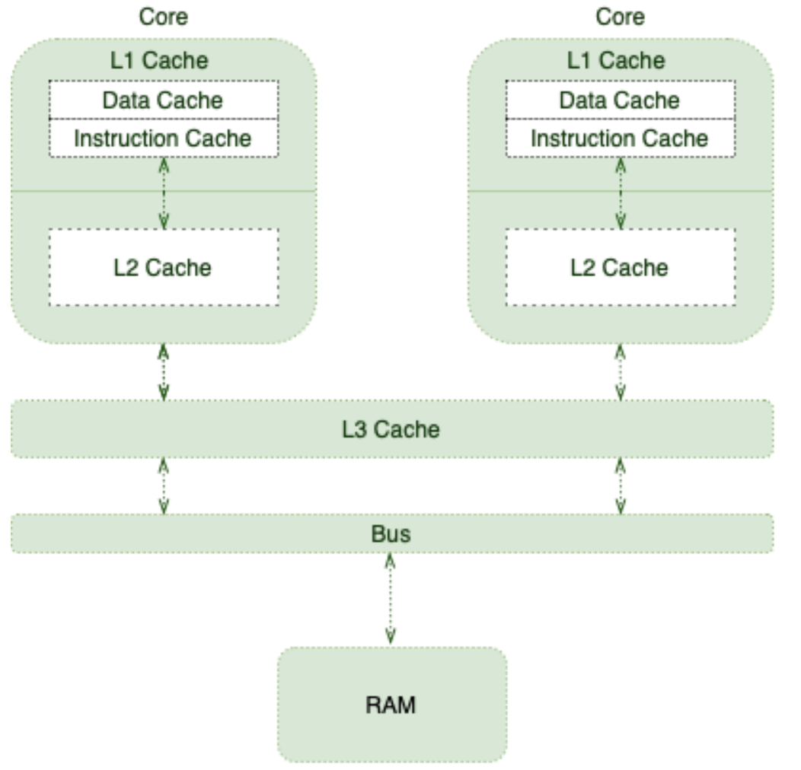

# Java Volatile 关键字


## 1. 概览

如果没有必要的同步，compiler、runtime 或 processor 可能会应用各种优化。尽管这些优化在大多数情况下都是有益的，但有时它们也会导致一些微妙的问题。

cache（内存可见性） 和 reorder（指令重排序） 是在并发 context 中可能让我们惊讶的优化之一。Java 和 JVM 提供了许多方法来控制 [内存顺序](java-variable-handlesmd#memory-ordering)， *volatile* 关键字就是其中之一。

在本文中，我们将重点讨论 Java 语言中这个基本但经常被误解的概念——*volatile* 关键字。首先，我们将从底层计算机体系结构如何工作的背景知识开始，然后我们将熟悉 Java 中的内存顺序。

&nbsp;

## 2. Shared Multiprocessor Architecture

Processor 负责执行程序指令(instruction)。因此，它们需要从 RAM（平常接触的基本概念： memory） 中检索程序指令和所需的数据。

由于 cpu 每秒可以执行相当数量的指令，因此从 RAM 中获取数据对它们来说并不理想。为了改善这种情况，Processor 使用了一些技巧，如 [无序执行(Out of Order Execution)](https://en.wikipedia.org/wiki/Out-of-order_execution)、[分支预测(Branch Prediction)](https://en.wikipedia.org/wiki/Branch_predictor)、[推测执行(Speculative Execution)](https://en.wikipedia.org/wiki/Speculative_execution)，当然还有 Cache。

这就是下面的内存层次结构发挥作用的地方：



&nbsp;

随着不同 Core 执行更多的指令和操作更多的数据，它们用更多相关的数据和指令填充缓存。这将在引入 [cache coherence](https://en.wikipedia.org/wiki/Cache_coherence) 挑战的基础上提高整体性能。

简单地说，当一个线程更新一个缓存值时，我们应该三思

&nbsp;

## 3. 什么时候使用 volatile？

为了解释更多关于缓存一致性， 借一个来自 [《Java Concurrency in Practice》](https://www.oreilly.com/library/view/java-concurrency-in/0321349601/) 书中的一个例子：

```java
public class TaskRunner {

    private static int number;
    private static boolean ready;

    private static class Reader extends Thread {

        @Override
        public void run() {
            while (!ready) {
                Thread.yield();
            }

            System.out.println(number);
        }
    }

    public static void main(String[] args) {
        new Reader().start();
        number = 42;
        ready = true;
    }
}
```

&nbsp;

*TaskRunner* 类维护两个简单的变量。在它的main方法中，只要变量为 $false$，它就会创建另一个线程在 *ready*变量上旋转。当变量变为 $true$ 时，线程将简单地打印变量 $number$。

许多人可能期望这个程序在短时间延迟后只打印 $42$。然而，实际上，推迟的时间可能会更长。它甚至可能永远挂起，或者甚至打印为零!

这些异常的原因是缺乏适当的内存可见性($memory-visibility$)  和重新排序($reordering$)。让我们更详细地评估它们。

&nbsp;

### 3.1. Memory Visibility

在这个简单的示例中，我们有两个应用程序线程:主线程和读取器线程。让我们想象这样一个场景:操作系统在两个不同的CPU核上调度这些线程:

- 主线程在其 Core 缓存中有它的 *ready* 和 *number* 变量的副本
- reader 线程也以它的副本结束
- 主线程更新缓存的值

&nbsp;

在大多数现代 Processor 上，写请求在发出后不会立即应用。事实上，**Processor 倾向于将这些写操作排在一个特殊的 write buffer 中**。一段时间后，它们会同时将这些 write 操作应用到 main memory。

说了这么多，**当 main thread 更新 $number$ 和 $ready$ 变量时，并不能保证 $reader-thread$ 会看到什么。换句话说，$reade-thread$ 可能马上看到更新后的值，或者有一些延迟，或者根本看不到!**

这种内存可见性可能会导致依赖于可见性的程序出现和自己预期结果不一致的问题。

&nbsp;

### 3.2. Reordering

To make matters even worse, **the reader thread may see those writes in any order other than the actual program order**. For instance, since we first update the *number* variable:

更糟糕的是，**reader thread 可能会看到这些 write 操作的任何顺序，而不是实际程序的顺序**。例如，因为我们第一次更新了 *number* 变量:

```java
public static void main(String[] args) { 
    new Reader().start();
    number = 42; 
    ready = true; 
}
```

我们可能期望读取线程打印 `42`。但是，实际上可以看到打印的值为 `0`

&nbsp;

重新排序是一种改进性能的优化技术。有趣的是，不同的组件可能会应用这种优化:

- Processor 可以以除 program 顺序以外的任何顺序刷新它的 write buffer
- Processor 可能会应用 `out-of-order` 执行技术
- JIT compiler 可以通过重新排序来优化

&nbsp;

### 3.3. *volatile* Memory Order

**To ensure that updates to variables propagate predictably to other threads, we should apply the \*volatile\* modifier to those variables:**

为了确保对变量的更新可以预期地传播到其他线程，我们应该对这些变量应用 $volatile$ 修饰符

```java
public class TaskRunner {

    private volatile static int number;
    private volatile static boolean ready;

    // same as before
}
```

通过这种方式，我们与 Runtime 和 Processor 通信，不对任何涉及 *volatile* 变量的指令进行重排序操作。而且，Processor 知道它们应该立即刷新对这些变量的任何更新。

&nbsp;

## 4. volatile 和 Thread 同步

对于多线程应用程序，我们需要确保一些行为一致的规则:

- `Mutual Exclusion(互斥)` - 同一时间只有一个线程执行临界段
- `Visibility` - 一个线程对共享数据的修改对其他线程可见，以保持数据的一致性

*synchronized* 方法和 block 同时提供了上述两个属性，但代价是导致应用程序性能降低。

volatile 是一个非常有用的关键字，因为它可以帮助确保数据更改的可见性，当然，不需要提供互斥。因此，在多线程并行执行代码块的情况下，它很有用，但我们需要确保可见性属性。

&nbsp;

## **5. Happens-Before Ordering**

$volatile$ 变量的内存可见性影响超出了 *volatile* 变量本身。

为了更具体地说明问题，我们假设线程 $A$ 写一个 *volatile* 变量，然后线程 $B$ 读同一个 $volatile$ 变量。在这种情况下，在写入 $volatile$ 变量之前对 $A$  可见的值在读取 $volatile$ 变量之后对 $B$ 可见:


从技术上讲，对 volatile 字段的任何 write 操作都发生在以后对同一字段的每次读取之前。这是 Java 内存模型([JMM](https://docs.oracle.com/javase/specs/jls/se8/html/jls-17.html)) 的 *volatile* 变量规则。

&nbsp;

### 5.1. Piggybacking

由于 `happens-before` 内存排序的优点，有时我们可以利用另一个 $volatile$ 变量的可见性属性。例如，在我们的例子中，我们只需要将 *ready* 变量标记为 *volatile*:

```java
public class TaskRunner {

    private static int number; // not volatile
    private volatile static boolean ready;

    // same as before
}
```

在 *ready* 变量写入 *true* 之前的任何内容在读取 *ready* 变量之后都是可见的。因此，*number* 变量背上了由 *ready* 变量强制的内存可见性。简单地说，即使它不是一个 $volatile$ 的变量，它也表现出 $volatile$ 的行为。

通过使用这些语义，我们可以只将类中的少数变量定义为 *volatile*，并优化可见性保证。

&nbsp;

## **6. 总结**

在本教程中，我们探索了更多关于 *volatile* 关键字及其功能的内容，以及从 Java 5 开始对其进行的改进。 

作用

> 保证线程可见性
>
> - MESI: 缓存一致性协议
>
> 保证指令重排序
>
> - CPU
> - DSL 单例
> - Double Check Lock
> - Mgr06.java
> - loadfence 指定原语
> - storefence 指令原语言
> - Happens-Before 原语
>   - 读 *volatile* 变量前，会先对 $volatile$ 变量进行 write 操作。
> - e.g. 
> - a = 0; a = 8;  b = 8;
> - new object 时， 发生指令重排序， b 可能赋值为 0
> - 加了 volatile ，就不会再发生指令重排序
> - volatile 不能代替 synchronized 
>   - volatile 能保证线程可见性
>   - 但如果操作本身不是原子的（a++），也会有问题，如果 主线程 int a ; a = 8; 然后很多线程一起 a++; 这时候会发生什么？
>   - a = 8; 多个线程都能马上读到，但很多线程操作一次 a++ 后，值都为 9， 然后将 9 写回内存空间，这时候的结果可想而知了。跟想要的结果完全不同。
> - 资源争用的时候，锁初化
> - 大部分情况，锁细化能带来性能提升。


&nbsp;

### Unsafe

> CAS 相关：
>
> weekCompareAndSetObejct Int Long 
>
> JDK 11, 此类可以直接拿来用
>
> JDK 8， 此类不是 public, 除非反射，或者 JVM 作者才能使用