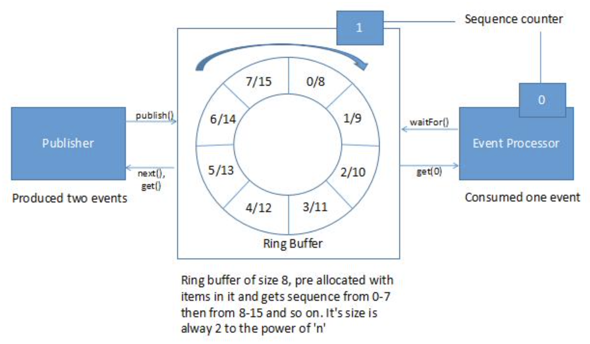

# LMAX Disruptor 并发 – 介绍

&nbsp;

## 1. 概述

​		本文介绍了  [LMAX Disruptor](https://lmax-exchange.github.io/disruptor/)  ， 并讨论它如何帮助实现低延迟的软件并发。我们还讲看到 Disruptor 库的基本用法。

&nbsp;

## 2. 什么是 Disruptor ?

​		Disruptor 是一个由 LMAX 编写的开源 java 库。它是一个用于处理大量事务的并发编程框架，具有低延迟（并且没有并发代码的复杂性）。 性能优化是通过利用底层硬件效率的软件设计来实现的。

&nbsp;

### 2.1. Mechanical Sympathy

​		让我们从 [mechanical sympathy](https://www.infoq.com/presentations/mechanical-sympathy) 概念开始 – 这都是关于理解底层硬件如何运行，以及如何以一种更适合于该硬件的方式编程。

​		例如，让我们看看 CPU 和 内存组织如何影响软件性能。CPU 在它和主存之间有几个缓存层。当 CPU 执行一个操作时，它首先在 L1 中查找数据，然后是 L2, 然后是 L3， 最后是主存。 走的越远，操作 take 时间越长。

​		如何同一个操作在一段数据上执行了多次（例如， 一个 loop counter), 那么该数据加载到非常接近 CPU 的位置是有意义的。

​		一些关于缓存 cost 的指示性数据：

&nbsp;

| Latency from CPU to | CPU cycles    | Time            |
| ------------------- | ------------- | --------------- |
| Main memory         | Multiple      | ~60-80 ns       |
| L3 cache            | ~40-45 cycles | ~15 ns          |
| L2 cache            | ~10 cycles    | ~3 ns           |
| L1 cache            | ~3-4 cycles   | ~1 ns           |
| Register            | 1 cycle       | Very very quick |

&nbsp;

### 2.2. 为什么不用 Queue？

​		Queue 实现往往在 head，tail， size 变量上存在写争用。由于 Consumer 和 Producer 之间的速度差异， Queue 通常总是接近于 full 或接近于 empty。他们很少在生产和消费速度相等的平衡中间地带运作。

​		为了处理写争用， Queue 通常使用锁， 这可能导致使用内核来完成上下文切换。当这种情况发生时，涉及的  Processor 很可能丢失其缓存中的数据。

​		为了获得最佳的缓存行为，设计中应该只有一个 core 对任何内存位置进行写入（多个 reader 是可以的，因为 Processor 经常在他们的缓存之间使用特殊的 high-speed 链接）。 Queue 不符合 one-writer 原则。

​		如何两个独立的线程在写两个不同的值，每个 Core 会使另一个的缓存线失效（数据在主存和缓存之间以固定大小的块传输，称为缓存线）。即使他们写的是两个不同的变量，这是两个线程之间的写争用。这称为假共享，因为每次访问 head 时，  tail 也会被访问，反之亦然。

&nbsp;

### 2.3. Disruptor 工作机制？



​		`Disruptor `有一个基于数组的循环数据结构（`Ring Buffer`）。它是一个指针指向下一个可用槽位的数组。它填充了预先分配的传输对象。`Producer` 和 `Consumer` 在没有`lock` 或争用的场景下对环执行数据的读写操作。

​		在 `Disruptor` 中，所有的事件都被发布给所有的 `Consumer` （`Multicast`（组播）），通过单独的下游 Queue 进行并行消费。由于 `Consumer` 的并行处理， 有必要协调 `Consumer` 之间的依赖关系（依赖关系图）

​		`Producer` 和 `Consumer` 有一个 `sequence counter` 来指示当前正在 buffer 中那个 slot 上工作。每个 `Producer` / `Consumer` 可以写入自己的 `sequence counter`， 但可以读取对方的 `sequence counter`。`Producer` 和 `Consumer` 读取 `counter` ，以确保它想写入的 slot 在没有任何 Lock 的情况下可用。

&nbsp;

## 3. 使用 Disruptor 库

### **3.1. Maven 依赖

让我们从在 pom.xml 文件中添加 Disruptor 库依赖开始： 

```xml
<dependency>
    <groupId>com.lmax</groupId>
    <artifactId>disruptor</artifactId>
    <version>3.3.6</version>
</dependency>
```

最新版本可到 Maven 中央仓库去查询。

&nbsp;

### 3.2. 定义 Event

让我们定义带数据的 event： 

```java
import org.apache.commons.lang3.builder.ToStringBuilder;

import com.lmax.disruptor.EventFactory;

public final class ValueEvent {

    private int value;

    public int getValue() {
        return value;
    }

    public void setValue(int value) {
        this.value = value;
    }

    public final static EventFactory<ValueEvent> EVENT_FACTORY = () -> new ValueEvent();

    @Override
    public String toString() {
        return ToStringBuilder.reflectionToString(this);
    }
}
```

`EventFactory` 给 `Disruptor` 预分配事件。

&nbsp;

### **3.3. Consumer**

`Consumer` 从 ring buffer 中读取数据。让我们一个处理事件的 Consumer：

```java
import com.lmax.disruptor.EventHandler;

/**
 * Consumer that consumes event from ring buffer. 
 */
public interface EventConsumer {
    /**
     * One or more event handler to handle event from ring buffer. 
     */
    public EventHandler<ValueEvent>[] getEventHandler();
}

import org.slf4j.Logger;
import org.slf4j.LoggerFactory;

import com.lmax.disruptor.EventHandler;

public class SingleEventPrintConsumer implements EventConsumer {

    private final Logger logger = LoggerFactory.getLogger(this.getClass());

    @Override
    @SuppressWarnings("unchecked")
    public EventHandler<ValueEvent>[] getEventHandler() {
        final EventHandler<ValueEvent> eventHandler = (event, sequence, endOfBatch) -> print(event.getValue(), sequence);
        return new EventHandler[] { eventHandler };
    }

    private void print(final int id, final long sequenceId) {
        logger.info("Id is " + id + " sequence id that was used is " + sequenceId);
    }
}

import org.slf4j.Logger;
import org.slf4j.LoggerFactory;

import com.lmax.disruptor.EventHandler;

public class MultiEventPrintConsumer implements EventConsumer {

    private final Logger logger = LoggerFactory.getLogger(this.getClass());

    @Override
    @SuppressWarnings("unchecked")
    public EventHandler<ValueEvent>[] getEventHandler() {
        final EventHandler<ValueEvent> eventHandler = (event, sequence, endOfBatch) -> print(event.getValue(), sequence);
        final EventHandler<ValueEvent> otherEventHandler = (event, sequence, endOfBatch) -> print(event.getValue(), sequence);
        return new EventHandler[] { eventHandler, otherEventHandler };
    }

    private void print(final int id, final long sequenceId) {
        logger.info("Id is " + id + " sequence id that was used is " + sequenceId);
    }
}
```

在这个示例中， Consumer 仅仅打印一个 log。

&nbsp;

### 3.4. 构造 Disruptor

构造 Disruptor:

```java
ThreadFactory threadFactory = DaemonThreadFactory.INSTANCE;

WaitStrategy waitStrategy = new BusySpinWaitStrategy();
Disruptor<ValueEvent> disruptor 
  = new Disruptor<>(
    ValueEvent.EVENT_FACTORY, 
    16, 
    threadFactory, 
    ProducerType.SINGLE, 
    waitStrategy);
```

在 Disruptor 的构造函数中定义如下：

- `Event Factory` - 负责生产对象， 这些对象将在初始化时存储在 `Ring Buffer`
- `Ring Buffer` 大小 - 16， 它必须是 2 的幂，否则它会在初始化的时候抛出异常。这一点很重要，因为使用逻辑二进制操作符（例如 mod 操作）很容易执行大多数操作
- `Thread Factory` - 为事件 Processor 创建线程的工厂
- `Producer` 类型 - 指定 single 或 multiple Producer
- `Wait Strategy` - 定义了我们如何处理跟不上 Producer 步伐的 `subscriber`

&nbsp;

关联 Consumer 处理器：

```java
disruptor.handleEventsWith(getEventHandler());
```

Disruptor 可以向多个 Consumer 提供 Disruptor 来处理 Producer 产生的数据。在上面的例子中，我们只有一个 Consumer, 也就是 Event Handler。

&nbsp;

### 3.5. 开始 Disruptor

开始 Disruptor:

```java
RingBuffer<ValueEvent> ringBuffer = disruptor.start();
```

&nbsp;

### 3.6. 生产和发布 Event

Producer 按顺序将数据放入 Ring Buffer。Producer 必须知道下一个可用的 Slot，这样它们就不会覆盖尚未消费的数据。

使用来自 Disruptor 的 RingBuffer 来发布： 

```java

import com.lmax.disruptor.RingBuffer;

public class SingleEventProducer implements EventProducer {

    @Override
    public void startProducing(RingBuffer<ValueEvent> ringBuffer, int count) {
        final Runnable producer = () -> produce(ringBuffer, count);
        new Thread(producer).start();
    }

    private void produce(final RingBuffer<ValueEvent> ringBuffer, final int count) {
        for (int i = 0; i < count; i++) {
            final long seq = ringBuffer.next();
            final ValueEvent valueEvent = ringBuffer.get(seq);
            valueEvent.setValue(i);
            ringBuffer.publish(seq);
        }
    }

}
```

```java
import com.lmax.disruptor.RingBuffer;

public class DelayedMultiEventProducer implements EventProducer {

    @Override
    public void startProducing(final RingBuffer<ValueEvent> ringBuffer, final int count) {
        final Runnable simpleProducer = () -> produce(ringBuffer, count, false);
        final Runnable delayedProducer = () -> produce(ringBuffer, count, true);
        new Thread(simpleProducer).start();
        new Thread(delayedProducer).start();
    }

    private void produce(final RingBuffer<ValueEvent> ringBuffer, final int count, final boolean addDelay) {
        for (int i = 0; i < count; i++) {
            final long seq = ringBuffer.next();
            final ValueEvent valueEvent = ringBuffer.get(seq);
            valueEvent.setValue(i);
            ringBuffer.publish(seq);
            if (addDelay) {
                addDelay();
            }
        }
    }

    private void addDelay() {
        try {
            Thread.sleep(1000);
        } catch (InterruptedException interruptedException) {
            // No-Op lets swallow it
        }
    }
}
```


这里， *Producer* 按照顺序生产和发布 item，这里需要注意的是，Disruptor 的工作原理类似于 2 阶段提交协议。 它读取一个新的 *sequenceId* 并发布。下一次， 它应该获得 *sequenceId + 1* 作为 下一个 *sequenceId*。

&nbsp;

## 4. 总结

在本篇文章中，我们了解了什么是 Disruptor ， 以及它如何在低延迟的情况下实现并发。我们已经看到了 mechanical sympathy 的概念以及如何利用它来实现低延迟。然后我们看到一个使用 `Disruptor` 库的例子。

