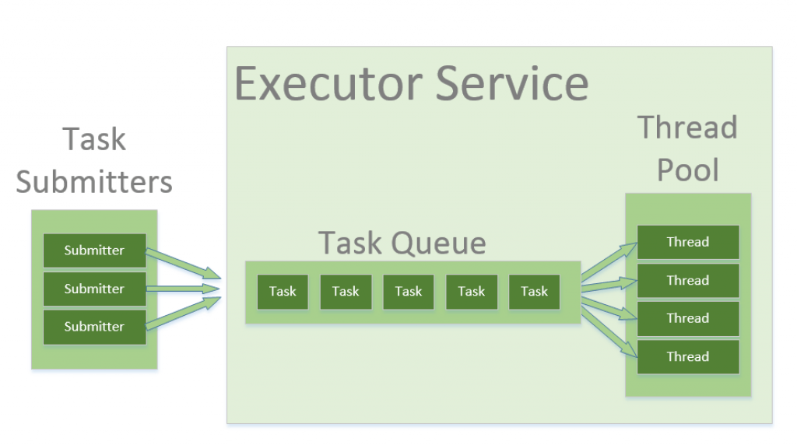

# Java  Thread Pool 介绍

&nbsp;

## 1. 介绍

本文着眼于 Java 中的线程池 - 从标准 Java 库中的不同实现开始，然后看看谷歌的 Guava 库。

&nbsp;

## 2. Thread Pool

在 Java 中，线程被映射到系统级线程，它们是操作系统的资源。如果不受控制地创建线程，则可能会很快耗尽这些资源。

线程之间的 context 切换也是由操作系统完成的 - 为了模拟并行性。一个简单的观点是 - 产生的线程越多，每个线程花在实际工作上的时间就越少。

`Thread Pool` 模式有助于在多线程应用程序中节省资源，还可以在某些预定义的限制中包含并行性。

当使用线程池时，以并行任务的形式编写并发代码，并将它们提交到线程池的实例中执行。这个实例控制几个用于执行这些任务的 re-use 线程。



该模式允许控制 application 正在创建的线程的数量，它们的生命周期，以及调度任务的执行和将传入的任务保持在队列中。

&nbsp;

## 3. Java Thread Pools

&nbsp;

### 3.1. Executors, Executor and ExecutorService

*Executors* helper 类包含几个用于创建预配置线程池实例的方法。这些类是一个很好的开始 - 如果不需要应用任何自定义微调，可以使用它。

在 Java 中，*`Executor`* 和 `ExecutorService` 接口用于处理不同的线程池实现。通常，你应该**保持你的代码与线程池的实际实现解耦**，并在整个应用程序中使用这些接口。

Executor 接口有一个单独的 execute 方法来提交可运行的实例来执行

&nbsp;

这里有一个快速的例子，你可以使用 *Executor* API 来获取一个由单个线程池和 unbounded queue 支持的*Executor* 实例，以便按顺序执行任务。这里，我们执行一个简单的任务，在屏幕上打印 “*Hello World*”。该任务作为 lambda (Java 8的一个特性) 提交，它被推断为 *Runnable*。

```java
Executor executor = Executors.newSingleThreadExecutor();
executor.execute(() -> System.out.println("Hello World"));
```

&nbsp;

*ExecutorService* 接口包含了大量的方法，用于控制任务的进度和管理服务的终止。使用这个接口，您可以提交要执行的任务，也可以使用返回的 *Future* 实例控制它们的执行。

在下面的例子中，我们创建了一个 *ExecutorService* ，提交一个任务，然后使用返回的 *Future* 的 *get* 方法等待提交的任务完成并返回值：

```java
ExecutorService executorService = Executors.newFixedThreadPool(10);
Future<String> future = executorService.submit(() -> "Hello World");
// some operations
String result = future.get();
```

&nbsp;

当然，在真实的场景中，您通常不想马上调用 *future.get()*，但要等到实际需要计算值时才调用它。

*submit* 方法被重载以接受 *Runnable* 或 *Callable* ，这两个都是函数接口，可以作为 lambda 传递(从 Java 8 开始)。

*Runnable* 的单一方法不抛出异常，也不返回值。*Callable* 接口可能更方便，因为它允许我们抛出异常并返回值。

最后 - 为了让编译器推断 *Callable* 类型，只需从 lambda 返回一个值。

更多使用 *ExecutorService* 接口和 future 的例子，请查看 “[Java ExecutorService指南](java-executor-service-tutorial.md)”。

&nbsp;

### 3.2. ThreadPoolExecutor

*$ThreadPoolExecutor$* 是一个可扩展的线程池实现，具有许多参数和钩子，可以进行微调(fine-tuning)。

&nbsp;

我们将在这里讨论的主要配置参数是:  $corePoolSize$， $maximumPoolSize$, 和 $keepAliveTime$。

池中包含固定数量的始终保持在内部的核心线程，以及一些可能生成并在不再需要时终止的过多线程。

- *corePoolSize* 参数是将被实例化并保存在池中的核心线程的数量。当一个新的任务进入时，如果所有的核心线程都很忙，并且内部 queue 已经满了，那么这个池就被允许增长到最大值。
- *keepAliveTime* : 是允许在空闲状态下存在过多线程(实例化的线程超过了 *corePoolSize* ) 的时间间隔。默认情况下，*ThreadPoolExecutor* 只考虑移除非核心线程。为了将相同的删除策略应用到核心线程，我们可以使用 *[allowCoreThreadTimeOut(true)](https://docs.oracle.com/javase/8/docs/api/java/util/concurrent/ThreadPoolExecutor.html#allowCoreThreadTimeOut-boolean-)* 方法。

&nbsp;

这些参数涵盖了广泛的场景，但是最典型的配置是在 Executors static method 中预定义的。

**例如**，*newFixedThreadPool* 方法创建一个 *ThreadPoolExecutor* 具有相同的 corePoolSize 和 *maximumPoolSize* 参数值和 0 *keepAliveTime。*这意味着线程池中的线程数总是相同的：

&nbsp;

```java
ThreadPoolExecutor executor = 
  (ThreadPoolExecutor) Executors.newFixedThreadPool(2);
executor.submit(() -> {
    Thread.sleep(1000);
    return null;
});
executor.submit(() -> {
    Thread.sleep(1000);
    return null;
});
executor.submit(() -> {
    Thread.sleep(1000);
    return null;
});

assertEquals(2, executor.getPoolSize());
assertEquals(1, executor.getQueue().size());
```

在上面的例子中，我们实例化了一个固定线程数为 $2$ 的 *$ThreadPoolExecutor$* 。这意味着，如果同时运行的任务数量始终小于或等于两个，那么它们将立即执行。否则，**其中一些任务可能会被放入 queue 中等待轮到它们**。

我们创建了三个*可调用的*任务，通过睡眠 1000 毫秒来模拟繁重的工作。前两个任务将同时执行，第三个任务必须在队列中等待。我们可以在提交任务后立即调用 *getPoolSize()* 和 *getQueue().size()* 方法来验证它。

&nbsp;

另一个预配置的 *ThreadPoolExecutor* 可以用 *Executors.newCachedThreadPool()* 方法创建。这个方法根本不接收线程数。在这个实例中 *corePoolSize* 实际上设置为 $0$，*maximumPoolSize* 设置为 `Integer.MAX_VALUE`。 这里的*keepAliveTime* 是 $60$ 秒。

这些参数值意味着，缓存的线程池可以无限制地增长，以容纳任何数量的提交任务。但当线程不再需要时，它们将在 60 秒不活动后被处理。一个典型的用例是当您的应用程序中有许多短期任务时。

&nbsp;

```java
ThreadPoolExecutor executor = 
  (ThreadPoolExecutor) Executors.newCachedThreadPool();
executor.submit(() -> {
    Thread.sleep(1000);
    return null;
});
executor.submit(() -> {
    Thread.sleep(1000);
    return null;
});
executor.submit(() -> {
    Thread.sleep(1000);
    return null;
});

assertEquals(3, executor.getPoolSize());
assertEquals(0, executor.getQueue().size());
```

上面示例中的队列大小将始终为零，因为在内部使用了一个 *SynchronousQueue* 实例。在一个 *SynchronousQueue* 中，对 *insert* 和 *remove* 操作总是同时发生，所以队列中不会实际包含任何东西。

&nbsp;

*Executors.newSingleThreadExecutor()* API创建了另一种典型的包含单个线程的 *ThreadPoolExecutor*。**单线程执行器是创建事件循环的理想选择。**参数 *corePoolSize* 和 *maximumPoolSize* 等于 $1$，*keepAliveTime* 为 $0$。

下面例子中的任务将按顺序执行，所以任务完成后，flag 值为 2：

```java
AtomicInteger counter = new AtomicInteger();

ExecutorService executor = Executors.newSingleThreadExecutor();
executor.submit(() -> {
    counter.set(1);
});
executor.submit(() -> {
    counter.compareAndSet(1, 2);
});
```

此外，这个 *ThreadPoolExecutor* 用一个不可变的 wrapper 装饰，因此在创建后不能重新配置。请注意，这也是我们不能将其转换为 *ThreadPoolExecutor* 的原因。

&nbsp;

### 3.3. ScheduledThreadPoolExecutor

*$ScheduledThreadPoolExecutor$* 扩展了 *$ThreadPoolExecutor$* 类，并实现了 *$ScheduledExecutorService$* 接口和几个额外的方法：

- *schedule* 方法允许在指定的延迟后执行一个任务;
- *scheduleAtFixedRate* 方法允许在指定的初始延迟后执行一个任务，然后在一定的时间内重复执行它; 参数 *period* 是在任务开始时间**之间度量的时间**，所以执行率是固定的;
- *scheduleWithFixedDelay* 方法类似于 *scheduleAtFixedRate* 重复执行给定的任务，但是指定的延迟是在前一个任务结束和下一个任务开始之间度量的; 执行速率可能会根据执行任何给定任务所需的时间而变化。

$Executurs.newScheduledThreadPool()$ 方法通常用于创建一个带有给定 $corePoolSize$ ，unbounded $maximumPoolSize$ 以及 0 $keepAliveTime$ 的 $ScheduledThreadPoolExecutor$。 下面是如何安排一个任务在500毫秒内执行:

```java
ScheduledExecutorService executor = Executors.newScheduledThreadPool(5);
executor.schedule(() -> {
    System.out.println("Hello World");
}, 500, TimeUnit.MILLISECONDS);
```

&nbsp;

下面的代码展示了如何在延迟 500 毫秒后执行任务，然后每 100 毫秒重复一次。在调度任务之后，我们使用 *CountDownLatch* lock 等待它触发三次，然后使用 *Future.cancel()* 方法取消它。

```java
CountDownLatch lock = new CountDownLatch(3);

ScheduledExecutorService executor = Executors.newScheduledThreadPool(5);
ScheduledFuture<?> future = executor.scheduleAtFixedRate(() -> {
    System.out.println("Hello World");
    lock.countDown();
}, 500, 100, TimeUnit.MILLISECONDS);

lock.await(1000, TimeUnit.MILLISECONDS);
future.cancel(true);
```

&nbsp;

### 3.4. ForkJoinPool

*ForkJoinPool* 是 Java 7 中引入的 *fork/join* 框架的核心部分。它解决了在递归算法中产生多个任务的常见问题。使用简单的 *ThreadPoolExecutor* ，将很快耗尽线程，因为每个 task 或 subtask 都需要自己的线程来运行。

在 *fork/join* 框架中，任何任务都可以产生 (*fork*) 大量的子任务，并使用 *join* 方法等待它们的完成。 *fork/join* 框架的好处是它不会为每个任务或子任务创建一个新的线程，而是实现了 Work 窃取算法。这个框架在文章  “[Java Fork/Join框架指南](java-fork-join.md)” 中有详细的描述。

&nbsp;

让我们看一个使用 *ForkJoinPool* 遍历节点树并计算所有叶子值的总和的简单示例。下面是一个简单的树实现，它由一个节点、一个 *int* 值和一组子节点组成:

```java
static class TreeNode {

    int value;

    Set<TreeNode> children;

    TreeNode(int value, TreeNode... children) {
        this.value = value;
        this.children = Sets.newHashSet(children);
    }
}
```

&nbsp;

现在，我们想并行求和树中的所有值，我们需要实现一个 *RecursiveTask<Integer>* 接口。每个任务接收它自己的节点，并将其值与它的 children 的值相加。为了计算 *children* 值的总和，任务执行过程如下:

- children set 流
- 映射这个流，为每个元素创建一个新的 *CountingTask*，
- 通过 fork 来执行每个子任务，
- 通过调用每个 fork 任务的 *join* 方法来收集结果，
- 使用 $Collectors.summingInt$ 收集器统计 sum 结果

```java
public static class CountingTask extends RecursiveTask<Integer> {

    private final TreeNode node;

    public CountingTask(TreeNode node) {
        this.node = node;
    }

    @Override
    protected Integer compute() {
        return node.value + node.children.stream()
          .map(childNode -> new CountingTask(childNode).fork())
          .collect(Collectors.summingInt(ForkJoinTask::join));
    }
}
```

&nbsp;

在实际  tree 上运行计算的代码非常简单：

```java
TreeNode tree = new TreeNode(5,
  new TreeNode(3), new TreeNode(2,
    new TreeNode(2), new TreeNode(8)));

ForkJoinPool forkJoinPool = ForkJoinPool.commonPool();
int sum = forkJoinPool.invoke(new CountingTask(tree));
```

&nbsp;

## 4. Guava Thread Pool 实现

[Guava](https://github.com/google/guava) 是一个流行的谷歌使用程序库。它有许多有用的并发类， 包括几个方便的 ExecutorService 实现。 实现类不能直接实例化或子类化， 所以创建它们实例的唯一入口是 MoreExecutors helper 类。

&nbsp;

### 4.1. 添加 Guava Maven 依赖

将以下依赖项添加到 Maven pom 文件中，以将 Guava 库包含到项目中。可以在 Maven 中央存储库找到最新版本的 Guava 在 [Maven中央](https://search.maven.org/classic/#search|gav|1|g%3A"com.google.guava" AND a%3A"guava") 存储库:

```java
<dependency>
    <groupId>com.google.guava</groupId>
    <artifactId>guava</artifactId>
    <version>19.0</version>
</dependency>
```

&nbsp;

### 4.2. Direct Executor and Direct Executor Service

有时您希望在当前线程或线程池中执行任务，这取决于某些条件。你可能更喜欢使用单个 *Executor* 接口，并直接切换实现。尽管实现 *Executor* 或 *ExecutorService* 来执行当前线程中的任务并不难，但仍然需要编写一些样板代码。

很高兴，Guava 为我们提供了预定义的实例。

这里有一个例子，演示了在同一个线程中执行一个任务。虽然提供的任务休眠 500 毫秒，但它 **阻塞当前线程**，结果在 *execute* 调用结束后立即可用:

```java
Executor executor = MoreExecutors.directExecutor();

AtomicBoolean executed = new AtomicBoolean();

executor.execute(() -> {
    try {
        Thread.sleep(500);
    } catch (InterruptedException e) {
        e.printStackTrace();
    }
    executed.set(true);
});

assertTrue(executed.get());
```

由 *directExecutor()* 方法返回的实例实际上是一个静态单例，所以使用这个方法在创建对象时根本没有提供任何开销。

与 *MoreExecutors.newDirectExecutorService()* 相比，您应该更喜欢这个方法，因为这个 API 在每次调用时都会创建一个成熟的 executor 服务实现。

&nbsp;

### 4.3. Exiting Executor Service

另一个常见的问题是 **关闭虚拟机** 而线程池仍在运行它的任务。即使有了取消机制，也不能保证任务会表现良好，并在 executor 服务关闭时停止它们的工作。这可能会导致 JVM 在任务继续执行它们的工作时无限期挂起。

为了解决这个问题，Guava 引入了一系列现有的执行器服务。它们基于与 JVM 一起终止的守护进程线程。

这些服务还通过 *Runtime.getRuntime(). addshutdownhook()* 方法添加了一个关机钩子，在放弃挂起的任务之前，防止虚拟机在配置的时间内终止。

在下面的示例中，我们正在提交一个包含无限循环的任务，但我们使用一个配置时间为 100 毫秒的现有 executor服务来等待VM终止后的任务。如果没有 *exitingExecutorService*，这个任务将导致VM无限期挂起：

```java
ThreadPoolExecutor executor = 
  (ThreadPoolExecutor) Executors.newFixedThreadPool(5);
ExecutorService executorService = 
  MoreExecutors.getExitingExecutorService(executor, 
    100, TimeUnit.MILLISECONDS);

executorService.submit(() -> {
    while (true) {
    }
});
```

&nbsp;

### 4.4. Listen 装饰器

监听装饰器允许你包装 *ExecutorService* 并在任务提交时接收 *ListenableFuture* 实例，而不是简单的 *Future* 实例。*ListenableFuture* 接口扩展了 *Future*，并有一个额外的方法 *addListener*。这个方法允许添加一个在以后完成时调用的监听器。

你很少想直接使用 *ListenableFuture.addListener()* 方法，但是它对于 *Futures* 实用程序类**中的大多数帮助器方法是**必要的。例如，使用 *Futures.allAsList()*  方法，你可以将几个 *ListenableFuture* 实例合并到一个 *ListenableFuture*中，当所有的 future 都成功完成时，这个实例就会完成：

```java
ExecutorService executorService = Executors.newCachedThreadPool();
ListeningExecutorService listeningExecutorService = 
  MoreExecutors.listeningDecorator(executorService);

ListenableFuture<String> future1 = 
  listeningExecutorService.submit(() -> "Hello");
ListenableFuture<String> future2 = 
  listeningExecutorService.submit(() -> "World");

String greeting = Futures.allAsList(future1, future2).get()
  .stream()
  .collect(Collectors.joining(" "));
assertEquals("Hello World", greeting);
```

&nbsp;

## 5. 总结

在本文中，我们讨论了 Thread Pool 模式及其在标准 Java 库和谷歌的 Guava 库中的实现。

>  线程数估算： 
>
> $N_t$ = $N_c$ * $U_c$ * (1 + W/C)
>
> - $N_c$ -> Core nuber
> - $U_c$ -> 期望的 CPU  利用率
> - W/C 是 wait 和 computor 时间的比率

&nbsp;

>调度器
>
>- quartz
>
>- crontab

&nbsp;

>假如提供一个闹钟服务，订阅这个服务的人特别多，10亿人， 怎么优化？