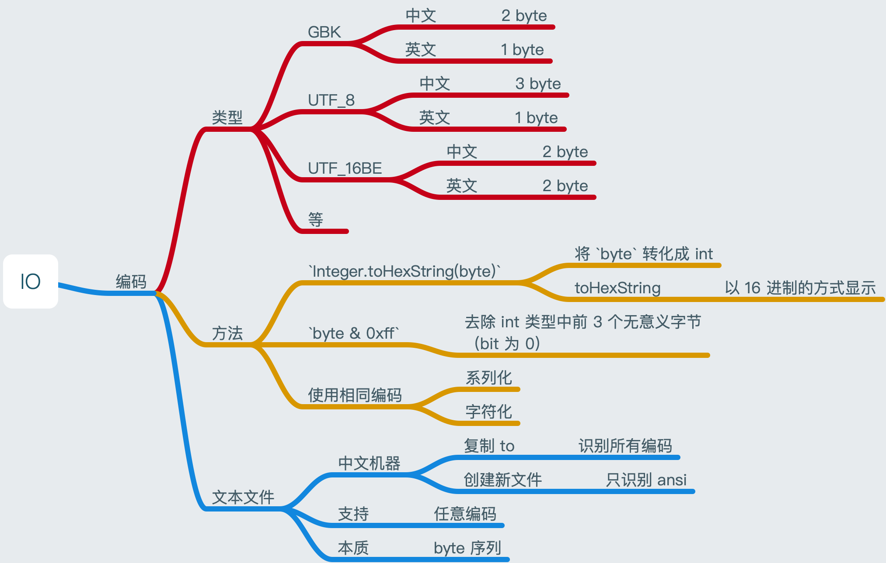

# IO

&nbsp;

## 编码

&nbsp;



&nbsp;

```java
package io;

import java.nio.charset.StandardCharsets;

/**
 * @Author: alton
 * @Date: Created in 2020/12/19 8:03 下午
 * @Description:
 */
public class Encode {

    public static void main(String[] args) throws Exception {

        String str = "郑A";
        byte[] defaultBytes = str.getBytes();

        for (byte defaultByte : defaultBytes) {
            System.out.print(Integer.toHexString(defaultByte & 0xff) + " ");
        }

        /*
         * result: 默认编码 utf-8
         * e9 83 91 41
         */

        System.out.println();
        System.out.println("==================");
        byte[] gbkBytes = str.getBytes("GBK");
        for (byte gbkByte : gbkBytes) {
            System.out.print(Integer.toHexString(gbkByte & 0xff) + " ");
        }

        /*
         * result: 编码 gbk
         * d6 a3 41
         */

        System.out.println();
        System.out.println("==================");
        byte[] utf16beBytes = str.getBytes(StandardCharsets.UTF_16BE);
        for (byte utf16beByte : utf16beBytes) {
            System.out.print(Integer.toHexString(utf16beByte & 0xff) + " ");
        }

        /*
         * result: 编码 gbk
         * 90 d1 0 41
         */

        System.out.println();
        System.out.println("==================");
        String utf16beString = new String(utf16beBytes, StandardCharsets.UTF_16BE);
        System.out.println(utf16beString);
        
    }
}
```

&nbsp;

## File

- `java.io.File` 表示 `directory` 或 `file`, 访问他们的元信息（名称，大小，类型等），不能读文件

&nbsp;

```java
package io;

import java.io.File;
import java.io.IOException;

/**
 * @Author: alton
 * @Date: Created in 2020/12/20 6:38 下午
 * @Description: 列出 File 的常用操作，比如过滤，遍历等操作
 */
public class FileUtils {

    /**
     * 列出 dir 的目录或文件名称
     * @param dir
     * @throws IOException
     */
    public static void listDirectory(File dir) throws IOException {
        if (!dir.exists() && !dir.isDirectory()) {
            throw new IllegalArgumentException("目录： " + dir + "不存在或者不是目录");
        }

        String[] fileList = dir.list();
        for (String s : fileList) {
            System.out.println(s);
        }
    }
}

```

&nbsp;

```java
package io;

import java.io.File;

/**
 * @Author: alton
 * @Date: Created in 2020/12/20 11:31 上午
 * @Description:
 */
public class FileDemo {

    public static void main(String[] args) throws Exception {
        File file = new File("demo/");

        System.out.println(file.exists());
        if (!file.exists()) {
            file.mkdir();
            // file.mkdirs();
        }

        System.out.println(file.isFile());
        System.out.println(file.isDirectory());

        File fileDemo = new File("demo");

        if (!fileDemo.exists()) {
            fileDemo.createNewFile();
        }

        System.out.println(fileDemo);
        System.out.println(fileDemo.getAbsolutePath());
        System.out.println(fileDemo.getPath());
        System.out.println(fileDemo.getName());

        FileUtils.listDirectory(fileDemo);


    }
}
```

&nbsp;

### RandomAccessFile

功能

- 文件
  - 读写
  - 随机访问

&nbsp;

模式

- `rw`
- `r`

&nbsp;

构造

- `new RandomAcessFile(file, "rw")`
- 默认为 index = 0;


注意

- 资源用完必须关闭

```java
package io;

import java.io.File;
import java.io.RandomAccessFile;
import java.nio.charset.StandardCharsets;

/**
 * @Author: alton
 * @Date: Created in 2020/12/20 6:53 下午
 * @Description:
 */
public class RandomAccessFileDemo {
    public static void main(String[] args) throws Exception {

        File demo = new File("demo/randomAccessFile.txt");
        if (!demo.exists()) {
            demo.createNewFile();
        }

        RandomAccessFile raf = new RandomAccessFile(demo, "rw");

        raf.write('A');
        raf.write('B');

        System.out.println(raf.getFilePointer());

        int i = 124;

        // 用 write 方法只能一次写一个字节，如果要把i 写进去就得写 4 次
        /*raf.write((i >>> 24) & 0xff);
        raf.write((i >>> 16) & 0xff);
        raf.write((i >>> 8) & 0xff);
        raf.write((i >>> 0) & 0xff);*/
        // 或者直接写 int
        raf.writeInt(i);
        System.out.println(raf.getFilePointer());

        // 直接用 write byte[]
        String s = "郑";
        byte[] sByte = s.getBytes(StandardCharsets.UTF_8);
        raf.write(sByte);

        System.out.println(raf.getFilePointer());

        // 读， 必须将指针移到头部
        raf.seek(0);
        System.out.println(raf.read());
        System.out.println(raf.readInt());

        // 或者用 byte[] 读
        raf.seek(0);
        byte[] buf = new byte[(int) raf.length()];
        raf.read(buf);

      	// 用完关闭资源
        raf.close();

    }
}
```

&nbsp;

## 字节流

### InputStream 和 OutputStream

`InputStream`

- 抽象类
- 应用程序读取数据的方式
- 方法
  - read
    - `read()`
      - 从 stream 中读取一个 byte
    - `read(byte[] buf)`
      - 从 stream 中读取数据写入到 buf 中
    - `read(byte[] buf, int start, int size)`
      - 从 stream 中读取数据到 buf 的 [start, start + size) 

- byte 级别

&nbsp;

`OutputStream`

- 抽象类
- 应用程序写数据的方式
- read
  - `write(b)`
    - 写入一个 `byte` 到流， `byte` 的低8位
  - `write(byte[] buf)`
    - 将 `buf` 数组写入到流
  - `write(byte[] buf, int start, int size)`
    - 将 buf 数据 [start, start + size) 写入到流

&nbsp;

### FileInputStream 和 FileOutputStream

`InputStream` 和 `OutputStream` 的 File 实现类

- 对文件进行读写操作， byte 级别

```java
package io;

import java.io.File;
import java.io.FileInputStream;
import java.io.FileOutputStream;
import java.io.IOException;

/**
 * @Author: alton
 * @Date: Created in 2020/12/20 6:38 下午
 * @Description: 列出 File 的常用操作，比如过滤，遍历等操作
 */
public class FileUtils {

    /**
     * 列出 dir 的目录或文件名称
     *
     * @param dir
     * @throws IOException
     */
    public static void listDirectory(File dir) throws IOException {
        if (!dir.exists() && !dir.isDirectory()) {
            throw new IllegalArgumentException("目录： " + dir + "不存在或者不是目录");
        }

        String[] fileList = dir.list();
        for (String s : fileList) {
            System.out.println(s);
        }
    }

    public static void printHexByRead(File file) throws IOException {
        FileInputStream fis = new FileInputStream(file);

        int b;
        int i = 1;

        while ((b = fis.read()) != -1) {

            // 字节 b的 16 进值的第一位为0时，只会展示第二位，因此，当遇到这种字节时，前面补 "0"
            if (b < 0xf) {
                System.out.print("0");
            }
            System.out.print(Integer.toHexString(b) + " ");

            if (i++ % 10 == 0) {
                System.out.println();
            }

        }

        fis.close();

    }

    public static void printHexByReadByteArray(File file) throws IOException {

        FileInputStream fis = new FileInputStream(file);

        byte[] buf = new byte[20 * 1024];

        /*int length = fis.read(buf);

        int j = 1;
        for (int i = 0; i < length; i++) {

            if (buf[i] < 0xf) {
                System.out.print("0");
            }

            System.out.print(Integer.toHexString(buf[i] & 0xff) + " ");

            if (j++ % 10 == 0) {
                System.out.println();
            }

        }*/

        // 下面这种写法， buf 可以反复用， 但也有缺陷，这种不再说明，有兴趣的可以自己试试
        int i;
        int j = 1;
        while ((i = fis.read(buf, 0, buf.length)) != -1) {
            for (int i1 = 0; i1 < i; i1++) {
                if (buf[i1] < 0xf) {
                    System.out.print("0");
                }
                System.out.print(Integer.toHexString(buf[i1] & 0xff) + " ");

                if (j++ % 10 == 0) {
                    System.out.println();
                }
            }
        }

        fis.close();
    }

    public static void copyFile(File srcFile, File destFile) throws IOException {
        if (!srcFile.exists() || !srcFile.isFile()) {
            throw new IllegalArgumentException("文件" + srcFile + " 不存在或不是文件");
        }

        FileInputStream fis = new FileInputStream(srcFile);
        FileOutputStream fos = new FileOutputStream(destFile);

        byte[] buf = new byte[8 * 1024];

        int b;
        while ((b = fis.read(buf, 0, buf.length)) != -1) {
            fos.write(buf, 0, b);
            fos.flush();
        }

        fos.close();
        fis.close();

    }

}
```

&nbsp;

```java
package io;

import java.io.File;
import java.io.FileOutputStream;
import java.io.IOException;

/**
 * @Author: alton
 * @Date: Created in 2020/12/21 8:58 下午
 * @Description:
 */
public class FileStreamDemo {

    public static void main(String[] args) throws IOException  {

        // file 存在删除再创建，不存在直接创建， 第二个参数为 true ， 意味着追加数据到文件后面，不会重建文件
        FileOutputStream fos = new FileOutputStream("demo/fileDemoOutPut.txt");
        fos.write('A'); // 写 A 的 低8位
        fos.write('B'); // 写 B 的 低8位
        int i = 10;
        fos.write(i >>> 24);
        fos.write(i >>> 16);
        fos.write(i >>> 8);
        fos.write(i);
        fos.write("中国".getBytes());
        fos.close();

        FileUtils.printHexByRead(new File("demo/fileDemoOutput.txt"));

        FileUtils.copyFile(new File("demo/fileDemo.txt"), new File("demo/fileDemo2.txt"));

    }

}
```


 &nbsp;

### DataInputStream 和 DataOutputStream

对 Stream 功能的扩展，可以更加方便的读写 int, long, 字符等数据，主要为了方便对类型数据进行操作

- 相当于一勺一勺，从源拿出来，放到目的地

```java
package io;

import java.io.*;

/**
 * @Author: alton
 * @Date: Created in 2020/12/22 4:57 下午
 * @Description:
 */
public class DataStreamDemo {

    public static void main(String[] args) throws IOException  {

        String file = "demo/dataStreamDemo.txt";
        DataOutputStream dos = new DataOutputStream(new FileOutputStream(file));

        dos.writeInt(123);
        dos.writeUTF("中国");
        dos.writeLong(131231231313131L);
        dos.writeBoolean(false);
        dos.writeChars("中国");
        dos.flush();
        dos.close();

        DataInputStream dis = new DataInputStream(new FileInputStream(file));

        System.out.println(dis.readInt());
        System.out.println(dis.readUTF());
        System.out.println(dis.readLong());
        System.out.println(dis.readBoolean());

        dis.close();

    }
}
```

&nbsp;

### BufferedInputStream 和 BufferedOutputStream

为 `InputStream` 和 `OutputStream` 提供了缓冲功能

- 相当于将数据拿出来，放进一个桶中，一桶一桶地对数据进行处理或放到目的地

```java
    public static void copyFileByBuffer(File src, File dest) throws IOException {

        if (!src.exists() || !src.isFile()) {
            throw new IllegalArgumentException("文件" + src + " 不存在或不是文件");
        }

        BufferedInputStream bis = new BufferedInputStream(new FileInputStream(src));
        BufferedOutputStream bos = new BufferedOutputStream(new FileOutputStream(dest));

        // 下面的实现方式根据要求自己实现即可，有很多方式能够实现。很多时间，越简单越好
        byte[] bytes = new byte[8 * 1024];
        int b;

        while ((b = bis.read(bytes, 0, bytes.length)) != -1) {
            bos.write(bytes, 0, b);
            bos.flush();
        }

        bos.close();
        bis.close();

    }
```

&nbsp;

```java
package io;

import java.io.File;
import java.io.IOException;

/**
 * @Author: alton
 * @Date: Created in 2020/12/22 5:15 下午
 * @Description:
 */
public class BufferedStreamDemo {

    public static void main(String[] args) throws IOException  {

        FileUtils.copyFileByBuffer(
                new File("demo/fileDemo.txt"),
                new File("demo/filedemo3.txt")
        );
    }
}
```

&nbsp;

##  字符流

- 编码
- 文本
  - `16 bit`
  - 无符号整数
  - 字符
    - unicode 编码(双字节编码)
- 文件
  - byte 数据序列
  - 文本
    - `char`
    - 某种编码方案（utf-8, utf-16be, gbk） 序列化为 byte 的存储
- 操作对象
  - 字符
    - byte 序列组成的
  - 文本文件

&nbsp;

### InputStreamReader 和 OutputStreamWriter

- `InputStreamReader`
  -  byte 流 -> char 流
  - 按照对应的编码解析

&nbsp;

- `OutputStreamReader`
  - char 流 ->  byte 流
  - 按照对应的编码进行处理

&nbsp;

```java
    public static void copyFileByReaderAndWriter(File src, File dest) throws IOException {

        if (!src.exists() || !src.isFile()) {
            throw new IllegalArgumentException("文件" + src + " 不存在或不是文件");
        }

        InputStreamReader isr = new InputStreamReader(new FileInputStream(src));
        OutputStreamWriter osw = new OutputStreamWriter(new FileOutputStream(dest));

        char[] charArray = new char[8 * 1024];
        int b;
        while ((b = isr.read(charArray, 0, charArray.length)) != -1) {
            osw.write(charArray, 0, b);
            osw.flush();
        }

        osw.close();
        isr.close();
    }
```

&nbsp;

```java
package io;

import java.io.File;
import java.io.IOException;

/**
 * @Author: alton
 * @Date: Created in 2020/12/22 5:15 下午
 * @Description:
 */
public class BufferedStreamDemo {

    public static void main(String[] args) throws IOException  {

        FileUtils.copyFileByBuffer(
                new File("demo/fileDemo.txt"),
                new File("demo/filedemo3.txt")
        );
    }
}
```

&nbsp;

### FileReader 和 FileWriter

方便对文件进行字符级别的读写操作

```java
public static void copyFileByFileReaderAndFileWriter(File src, File dest) throws IOException {      

    if (!src.exists() || !src.isFile()) {                                                           
        throw new IllegalArgumentException("文件" + src + " 不存在或不是文件");                               
    }                                                                                               

    FileReader fr = new FileReader(src);                                                            
    FileWriter fw = new FileWriter(dest);                                                           

    char[] buffer = new char[1024];                                                                 
    int c;                                                                                          
    while ((c = fr.read(buffer, 0, buffer.length)) != -1) {                                         
        fw.write(buffer, 0, c);                                                                     
        fw.flush();                                                                                 
    }                                                                                               

    fw.close();                                                                                     
    fr.close();                                                                                     

}                                                                                   
```

&nbsp;

### BufferedReader BufferedWriter 和 PrintWriter

相对其它字符流而言，它几乎封装字符流所有方法和它自身独有的 `readLine()`, 对文本的读写性能更好。

```java
public static void copyFileByBrAndBw(File src, File dest) throws IOException {
                                                                              
    if (!src.exists() || !src.isFile()) {                                     
        throw new IllegalArgumentException("文件" + src + " 不存在或不是文件");         
    }                                                                         
                                                                              
    BufferedReader br = new BufferedReader(new FileReader(src));              
    /*BufferedWriter bw = new BufferedWriter(new FileWriter(dest));           
                                                                              
    // 以 readLine() 为例                                                        
    String str;                                                               
    while ((str = br.readLine()) != null) {                                   
        bw.write(str, 0, str.length());                                       
        //bw.write("\n");                                                     
        bw.newLine();                                                         
        bw.flush();                                                           
    }*/                                                                       
                                                                              
    PrintWriter pw = new PrintWriter(new FileWriter(dest), true);             
                                                                              
    String str;                                                               
                                                                              
    while((str = br.readLine()) != null) {                                    
        pw.println(str);                                                      
    }                                                                         
    pw.close();                                                               
    br.close();                                                               
                                                                              
}                                                                             
```

&nbsp;

## 对象的序列化和反序列化

&nbsp;

对象

- 序列化
  - object -> byte 序列
  - `ObjectOutputStream`
    - `writeObject()`
  - 实现接口（条件）
    - `Serializable`
      - 没有任何方法
      - 只是一个规定/约定

&nbsp;

- 反序列化
  - byte 序列 -> object
  - `ObjectInputStream`
    - `readObject()`

&nbsp;

- 注意：
  - 对象中的变量标记为 `transient` 的变量，不能被 JVM 默认的序列化机制序列化。反序列化会变为默认值。
    - string -> null
    - int -> 0
  - 可以自定义序列化，包含 `transient` 关键字的变量
    - 对象中添加以下 2 个方法
      - `writeObject`
      - `readObject`
  - 父子类序列化问题
    - 父类实现了 `Serializable` 接口，子类可以直接进行序列化
    - 子类被反序列化时
      - 没有实现 `Serializable` 接口的父类，构造方法会被显示调用
      - 实现了 `Serializable` 接口的父类，父类不会被显示调用，可以直接在子类序列化的字节中直接读到


```java
package io;

import java.io.*;

/**
 * @Author: alton
 * @Date: Created in 2020/12/22 8:36 下午
 * @Description:
 */
public class SerializableDemo {
    public static void main(String[] args) throws IOException, ClassNotFoundException  {

        String file = "demo/object.txt";

        Student student = new Student("alton", "男", 30);

        ObjectOutputStream oos = new ObjectOutputStream(new FileOutputStream(file));
        oos.writeObject(student);
        oos.flush();
        oos.close();

        ObjectInputStream ois = new ObjectInputStream(new FileInputStream(file));
        Student s = (Student) ois.readObject();
        System.out.println(s.toString());

        /*
         * 添加 writeObject, readObject 的方法前
         * Student{name='alton', sex='男', age=0}
         * 添加 writeObject, readObject 的方法后， 定义了 transient 关键字的 age 也能够正常进行反序列化
         * Student{name='alton', sex='男', age=30}
         */
        ois.close();
    }
}

class Student implements Serializable  {

    String name;
    String sex;

    // 标注 transient 的变量，保持为默认值 age = 0
    transient int age;

    public Student(String name, String sex, int age) {
        this.name = name;
        this.sex = sex;
        this.age = age;
    }

    public String getName() {
        return name;
    }

    public void setName(String name) {
        this.name = name;
    }

    public String getSex() {
        return sex;
    }

    public void setSex(String sex) {
        this.sex = sex;
    }

    public int getAge() {
        return age;
    }

    public void setAge(int age) {
        this.age = age;
    }

    @Override
    public String toString() {
        return "Student{" +
                "name='" + name + '\'' +
                ", sex='" + sex + '\'' +
                ", age=" + age +
                '}';
    }

    private void writeObject(ObjectOutputStream s) throws IOException {

        // 将 JVM 能序列化的元素进行序列化
        s.defaultWriteObject();

        // 可以序列化 transient 关键字的元素，当然也可以按照自定义的序列化规则来序列化普通元素，来提高性能（ArrayList 就是这样的例子）
        s.writeInt(age);
    }

    private void readObject(ObjectInputStream ois) throws IOException, ClassNotFoundException {

        // 将 JVM 能反序列化的元素进行反序列化
        ois.defaultReadObject();

        // 可以反序列化 transient 关键字的元素
        this.age = ois.readInt();

    }

}
```


