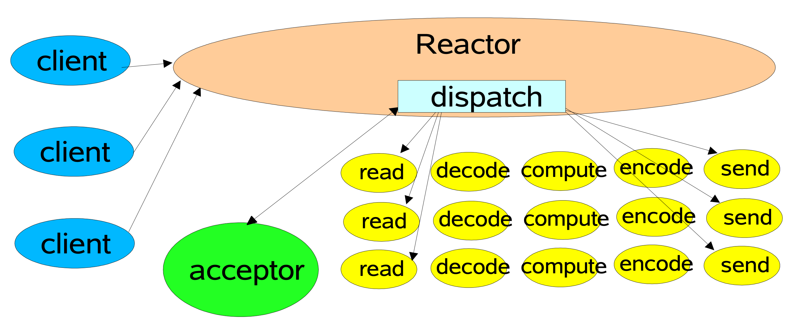

## Netty Reactor 线程模型

&nbsp;

### 概览

Netty 的 I/O 线程 NioEventLoop 由于整合了 Multiplux Selector，可以同时并发处理成百上千个客户端 SocketChannel。由于读写操作都是非阻塞的，这就可以充分提升 I/O 线程的运行效率，避免由频繁的 I/O 阻塞导致的线程挂起。另外，由于 Netty 采用了异步通信模式，一个 I/O 线程可以并发处理 N 个 client 连接和 read-write 操作，这从根本上解决了传统同步阻塞 I/O 一连接一线程模型，架构的性能、弹性伸缩能力和可靠性都得到了极大的提升。以下所阐述的 Reactor 模型适用于所有的 I/O 操作，不仅仅是 Netty。在这里进行 Netty Reactor ，仅仅是恰逢其时而已。

&nbsp;

### 高效的 Reactor 线程模型

常见的 Reactor 线程模型有三种，分别如下：

- Reactor single-threaded Pattern 
  - `Basic Reactor Design`

- Reactor MultiThreaded Pattern 
  - `Multithreaded Designs`

- 主从 Reactor MultiThreaded Pattern 
  -  `Multiple Reactor Threads`

> Reactor 线程模型由 Java 大神  Doug Lea 做出了很好的阐述。在这里站在巨人的肩膀结合 Netty，对它进行深层次的探讨。

Netty 是典型的 Reactor 模型结构，关于 Reactor 的详尽阐释，可参考 POSA2, 这里不做概念性的解释。

&nbsp;

### Reactor single-threaded Pattern

`Reactor single-threaded Pattern`，指的是所有的 I/O 操作都在同一个线程上面完成，在Netty 中， I/O non-blocking 。线程的职责如下：

1. 作为 NIO Server，接收 Client 的 TCP 连接；
2. 作为 NIO Client，向 Server 端发起 TCP 连接；
3. 读取通信对端的 Request 或者 Response 消息；
4. 向 Server 发送消息 Request 或者 接收 Response 消息；

&nbsp;

Reactor 线程是个多面手，负责多路分离 Socket，Accept 新连接，并由 Dispatcher 分派请求到 Handler 链中。该模型适用于 handler 链中业务处理组件能快速完成的场景。不过，这种单线程模型不能充分利用多 core 资源，所以实际 pro 环境中使用的不多。

&nbsp;

对于一些小容量应用场景，可以使用此模型，但是对于高负载、大并发的应用场景不合适，主要原因如下：

- 一个线程同时处理成百上千的链路，性能上无法支撑。即便线程的 CPU 负荷达到 100%，也无法满足海量消息的编码、解码、读取和发送；
- 当线程负载过重之后，处理速度将变慢，这会导致大量 Client 连接超时，超时之后往往都会进行重发，这更加重了线程的负载，最终导致大量 message 积压和处理超时，线程会成为系统的性能瓶颈；
- 可靠性问题。一旦线程意外跑飞，或者进入死循环，会导致整个系统通信模块不可用，不能接收和处理外部信息，造成节点故障。

为了解决这些问题，演进出了 Reactor 多线程模型，下面我们一起学习下 Reactor 多线程模型。

&nbsp;

### Reactor multi-threaded Pattern

&nbsp;

`Reactor multi-threaded pattern` 与 `Reactor single-threaded pattern` 最大区别就是有一组线程 (Thread Pool) 处理 I/O 操作，它的特点如下：

- 有一个专门的线程 - acceptor 用于 listen Server，接收 client 的 TCP 连接 Request；
- 网络 I/O 操作 - read-write 等由一个 Thread Pool 负责，线程池可以采用标准的 JDK 线程池实现，它包含一个任务队列和 N 个可用的线程（具体实现需根据 Java 不同 Thread Pool来看），由这些线程负责消息的读取、解码、编码和发送；
- 1 个线程可以同时处理一组消息事件，一个消息事件在实际应用中只能对应  1 个线程，防止发生并发操作问题。

&nbsp;

在绝大多数场景下，`Reactor multi-threaded Pattern` 都可以满足性能需求；

但是，在极特殊应用场景中，一个线程负责 listen 和处理所有的 Client 连接会存在性能问题。

- 例如百万 Client 并发连接，
- 或者 Server 需要对 Client 的握手信息进行安全认证，认证本身非常损耗性能。

这类场景下，单独一个 acceptor 线程可能会存在性能不足问题，为了解决性能问题，产生了第三种 Reactor thread Pattern - 主从Reactor 多线程模型， 也称为 `Multi-Reactor Pattern`。

&nbsp;

### 主从 Reactor Multithread Pattern

特点是：Server 用于接收 Client 连接的不再是 1 个单独的线程，而是一个独立的 Thread Pool 。

Acceptor 接收到 Client TCP 连接请求处理完成后（可能包含接入认证等），将新创建的 SocketChannel 注册到 I/O 线程池（sub reactor 线程池）的某个 I/O 线程上，由它负责 SocketChannel 的 read-write 和编解码工作。

mainReactor 只用于 Client 的 login、handshake 和安全认证，一旦连接建立成功，就将 event 注册到后端 subReactor 线程池的I/O 线程上，由 I/O 线程负责后续的I/O操作。

&nbsp;

第三种模型比起第二种模型，是将 Reactor 分成两部分：

- `mainReactor` 负责监听 Server socket，accept 新连接，并将建立的 socket 连接 dispatch 给 subReactor。
- `subReactor` 负责多路分离已连接的 socket，读写网络数据，对业务处理功能，其扔给 worker 线程池完成。通常，subReactor个数可与 CPU个数等同，具体情况得看 event 是 I/O 密集型还是 CPU 密集型，这里不对此进行阐述了。

 