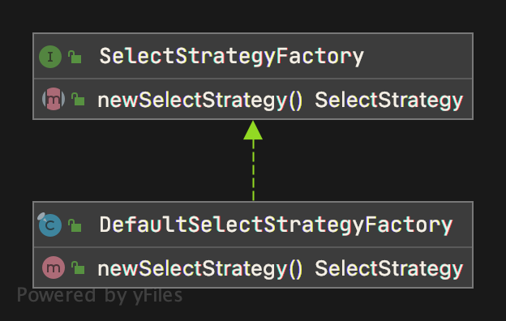
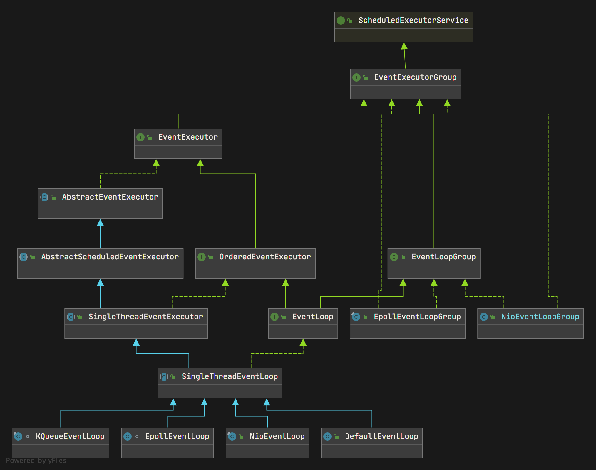
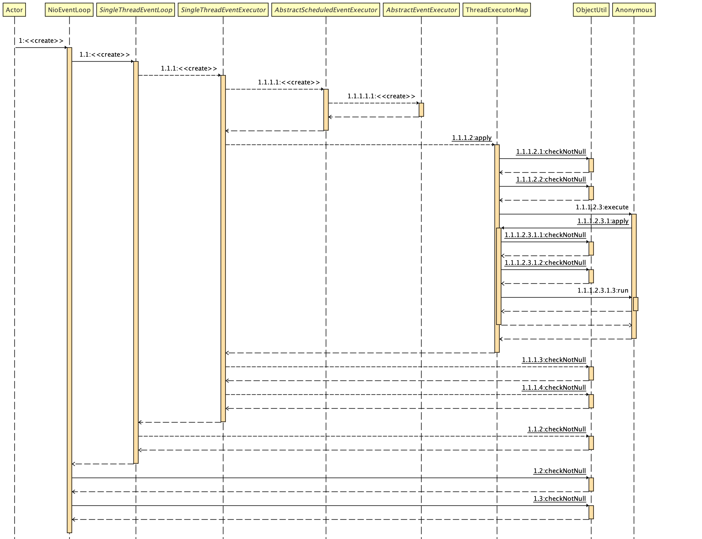

## Netty 源码深入剖析 - EventExecutor

&nbsp;

示例中， EventExecutor 实例初始化入口，请见 [MultithreadEventExecutorGroup 专题](netty-source-analysis-multithread-eventloop-group.md)

```java
                // 使用 executor 和 参数 args 初始化 children 元素
                // newChild 方法以示例中来说，在 NioEventLoopGroup 中覆写。这里为 EventExecutor 专题入口
                children[i] = newChild(executor, args);
```

&nbsp;

### SelectStrategy

在讲解 newChild 方法前， 先剖析下 `DefaultSelectStrategyFactory` 如何创建一个新的 SelectStrategy 实例（为下面讲解 newChild 方法铺垫）。 看了 `DefaultSelectStrategyFactory` 专题的朋友， 应该记得此工厂类中有一个 newSelectStrategy 方法（之前示例还为执行到此方法，当前并未讲解它）， 现在正是剖析它的最好时机。



根据上图不难看出 `newSelectStrategy()` 方法来自其父类 `SelectStrategyFactory` 。  `DefaultSelectStrategyFactory`  对它进行了复写（override）。为了加深印象，这里再次将次工厂类源码贴出。

```java
public final class DefaultSelectStrategyFactory implements SelectStrategyFactory {
    public static final SelectStrategyFactory INSTANCE = new DefaultSelectStrategyFactory();

    // 工厂模式， 构建 DefaultSelectStrategyFactory 实例
    private DefaultSelectStrategyFactory() { }

    @Override
    public SelectStrategy newSelectStrategy() {
        return DefaultSelectStrategy.INSTANCE;
    }
}
```

&nbsp;

下面剖析此方法如何构建 `SelectStrategy` 实例，以及如何通过 SelectStrategy 控制潜在的 select 调用的结果。

```java
package io.netty.channel;

import io.netty.util.IntSupplier;

final class DefaultSelectStrategy implements SelectStrategy {

    /**
     * 示例代码， 源码剖析入口，构建一个 DefaultSelectStategy 实例
     */
    static final SelectStrategy INSTANCE = new DefaultSelectStrategy();

    private DefaultSelectStrategy() { }

    /**
     *
     * @param selectSupplier 具有 select 结果的 supplier 函数， () -> int
     * @param hasTasks  如果任务正在等待处理，则为 true。也就是说，此时有需要等待处理的任务
     * @return 如果下一步应该 blocking ， 那么选择 CONTINUE， 如果下一步应该是不选择，
     *         而是跳回 IO 循环，并再次尝试。任何值 >= 0 都被视为需要完成工作的指示符
     *
     * @throws Exception
     */
    @Override
    public int calculateStrategy(IntSupplier selectSupplier, boolean hasTasks) throws Exception {
        /**
         * hasTasks
         * true: 则获取 IntSupplier, 至于传入何种实现，根据具体场景，大家不妨猜猜，示例代码用的是什么实现
         * false: 返回 -1 值，代表此时没有正在正在执行的任务需要处理
         *        SelectStrategy.SELECT = -1
         */
        return hasTasks ? selectSupplier.get() : SelectStrategy.SELECT;
    }
}

```

看源码时，学会猜和推敲它的代码实际用处是很有必要的，上面有说过 `calculateStrategy` 猜猜哪里用，其实反过头看 newChild 方法如何在 NioEventLoopGroup 用就能看出来了。 这里不是关键点，只是提下如何看源码的一种方法罢了。

&nbsp;

### NioEventLoop

下面返回到 `NioEventLoopGroup` 类中的 `newChild` 方法。

```java
    /**
     * 示例中，初始化 EventExecutor 实例入口 （MultithreadEventExecutorGroup 类中进行初始化） ， EventLoop 继承自 EventExecutor
     * @param executor 基于 FastThreadLocalThread 运行 task 的 executor
     * @param args
     *        示例中的 SelectorProvider;
     *        DefaultSelectStrategyFactory.INSTANCE;
     *        RejectedExecutionHandlers.reject(); 默认处理方式 new RejectedExecutionException() 异常
     * @return EventLoop
     * @throws Exception
     */
    @Override
    protected EventLoop newChild(Executor executor, Object... args) throws Exception {

        // 源码示例中 args 只有 3 个参数，因此在这里 EventLoopTaskQueueFactory 实例 queryFactory 为 null
        EventLoopTaskQueueFactory queueFactory = args.length == 4 ? (EventLoopTaskQueueFactory) args[3] : null;

        /**
         * 将此 NioEventLoopGroup ,
         * 基于 FastThreadLocalThread 运行 task 的 executor ,
         * args 3个对象,
         * 以及 null queryFactory 传入 NioEventLoop 构造器中，创建实例。
         * 注意： 这里传入的是 args 中 DefaultSelectStrategyFactory 工厂类创建的 DefaultSelectStrategy
         * 
         */
        return new NioEventLoop(this, executor, (SelectorProvider) args[0],
            ((SelectStrategyFactory) args[1]).newSelectStrategy(), (RejectedExecutionHandler) args[2], queueFactory);
    }
```

&nbsp;

好了废话不多说， 现在来讲解 NioEventLoop (核心： EventLoop) 实例如何在示例代码中被创建。EventLoop 会在此带出来。

源码剖析到此，对于整个代码层级应该有些概览了，下面用将它们继承和实现层级以图的形式展示出来。不仅仅包含示例代码部分，还包含了实现了 EventLoop 的 SingleThreadEventLoop 类，以及继承自 SingleThreadEventLoop 类的所有子类（包含 NioEventLoop）。具体自行看下图： 



&nbsp;

下面来看如何构建 NioEventLoop 实例。  在代码讲解的过程中会遇到很多之前没剖析过的类和接口，在学习过程中请对照上图来进行剖析。



&nbsp;

上面图可以看出， 构建 NioEventLoop 实例中，不断地寻父，从 `SingleThreadEventExecutor` 开始属于 Java 原生库中关于高并发，线程核心库，这里不对它进行阐述（在这里只要知道它是 Java 单个线程的线程池即可，想要了解更多 `SingleThreadEventExecutor` 的信息，请看 Java Concurrency 相关知识）。

&nbsp;

下面先介绍下 NioEventLoop 示例构建过程中， 需要了解的内容

&nbsp;

### Netty Selector

构建 `NioEventLoop` 实例过程中，将 Selector 经过优化，组合进来，如何组合的呢？首先来看看 `SelectedSelectionKeySet`  

&nbsp;

#### SelectedSelectionKeySet

SelectedSelectionKeySet 内部很简单，使用数组代替原 Selector 的中的 HashSet，提高性能。数组默认大小为1024，容量不够，扩容 2 倍。里边包装了 SelectionKey 数组

```java
package io.netty.channel.nio;

import java.nio.channels.SelectionKey;
import java.util.AbstractSet;
import java.util.Arrays;
import java.util.Iterator;
import java.util.NoSuchElementException;


final class SelectedSelectionKeySet extends AbstractSet<SelectionKey> {

    SelectionKey[] keys;
    int size;

    // 无参构造，初始化 SelectionKey[] 数组
    SelectedSelectionKeySet() {
        keys = new SelectionKey[1024];
    }

    @Override
    public boolean add(SelectionKey o) {
        if (o == null) {
            return false;
        }

        keys[size++] = o;

        // 当大小等于 SelectionKey[] 长度时，进行扩容
        if (size == keys.length) {
            increaseCapacity();
        }

        return true;
    }

    @Override
    public boolean remove(Object o) {
        return false;
    }

    @Override
    public boolean contains(Object o) {
        return false;
    }

    @Override
    public int size() {
        return size;
    }

    @Override
    public Iterator<SelectionKey> iterator() {
        return new Iterator<SelectionKey>() {
            private int idx;

            @Override
            public boolean hasNext() {
                return idx < size;
            }

            @Override
            public SelectionKey next() {
                if (!hasNext()) {
                    throw new NoSuchElementException();
                }
                return keys[idx++];
            }

            @Override
            public void remove() {
                throw new UnsupportedOperationException();
            }
        };
    }

    /**
     * 重置
     */
    void reset() {
        reset(0);
    }

    /**
     * 重置 为 null
     * @param start
     */
    void reset(int start) {
        // 将 keys 所有元素置为 null
        Arrays.fill(keys, start, size, null);
        size = 0;
    }

    /**
     * 增容，扩大 2 倍
     */
    private void increaseCapacity() {
        SelectionKey[] newKeys = new SelectionKey[keys.length << 1];
        System.arraycopy(keys, 0, newKeys, 0, size);
        keys = newKeys;
    }
}
```

&nbsp;

#### SelectedSelectionKeySetSelector

那么 `SelectedSelectionKeySet` 是如何被 Netty 组合的呢，其实吧， 它有属于为自己设计的 Selector 子类，在此类中，它能被很好的集成。 主角： `SelectedSelectionKeySetSelector` 

对此类的注释， 对于 Selector 认识不深的小伙伴可以仔细看看，对 Selector 和 SelectedSelectionKeySet 熟悉的，可以略过，仅仅对他们进行了简单的包装处理

```java
/**
 * 它是 Selector 的子类， 包装了上面对 Selector 优化的 SelectedSelectionKeySet 和 原生 Selector.
 */
final class SelectedSelectionKeySetSelector extends Selector {
    private final SelectedSelectionKeySet selectionKeys;
    private final Selector delegate;

    /**
     * 构造器
     * 示例代码入口
     * @param delegate 原生 Selector
     * @param selectionKeys SelectedSelectionKeySet (数组数据结构来换取更优越的性能)
     */
    SelectedSelectionKeySetSelector(Selector delegate, SelectedSelectionKeySet selectionKeys) {
        this.delegate = delegate;
        this.selectionKeys = selectionKeys;
    }


    /**
     * 覆写了 Selector 的 isOpen() 方法
     * 判断 Selector 是否打开
     * Selector 需要 open 才能正式进行 IO 操作
     * @return
     */
    @Override
    public boolean isOpen() {
        return delegate.isOpen();
    }

    /**
     * 覆写 Selector 的 provider
     * 返回此 Selector 的 SelectorProvider
     * 通俗点说，返回 Selector 的提供者
     * @return
     */
    @Override
    public SelectorProvider provider() {
        return delegate.provider();
    }

    /**
     * 覆写 Selector 的 keys 方法
     * 非线程安全
     * 返回 Selector 的 SelectionKey 集合
     * 集合中的 key, 不能直接修改。 key 只有在它被取消并且它的通道被注销之后才会被删除。
     * 任何修改 key set 的行为都会导致抛出 UnsupportedOperationException
     *
     * @return
     */
    @Override
    public Set<SelectionKey> keys() {
        return delegate.keys();
    }

    /**
     * 覆写 Selector 的 selectedKeys 方法
     * 非线程安全
     * 此 set 的 SelectionKey 可以从 Set 中删除，但不能直接添加到该 Set 中.
     * 任何向 Set 添加元素的行为都会导致抛出 UnsupportedOperationException.
     * @return
     */
    @Override
    public Set<SelectionKey> selectedKeys() {
        return delegate.selectedKeys();
    }

    /**
     * 覆写 Selector 的 selectNow 方法
     * 选择对应的 Channel 已准备好进行 I/O 操作的一组 key
     * 此方法执行 non-blocking select 操作
     * 如果自上一个 select 操作以来没有可选择的 Channel, 则此方法立即返回 0
     * 调用此方法将清除之前调用 wakeup 方法的效果
     * @return 返回 select 操作更新其准备操作集 key 的数目，可能为 0
     * @throws IOException I/O 操作过程中发生异常时，抛出
     */
    @Override
    public int selectNow() throws IOException {

        // 调用 Selector#selectNow() 方法前, 重置 selectionKeys,
        // 具体实现在 SelectedSelectionKeySet 类中
        selectionKeys.reset();
        return delegate.selectNow();
    }


    /**
     * 覆写 Selector select(int timeout) 方法
     * 选择一组 key，其对应的通道已准备好进行I/O操作。
     * 这个方法执行 blocking 选择操作。
     * 只有在选择了至少一个 channel、调用了该 selector 的 wakeup 方法、中断了当前线程或给定的超时时间过期(以先到者为例)之后，它才返回。
     *
     * @param timeout 如果为正，在等待通道就绪时，阻塞时间最多为 timeout 毫秒，如果为零，无限阻塞; 一定不能是负数
     * @return 已更新其准备操作集的键的数目，可能为零
     * @throws IOException I/O 操作发生异常时，抛出此异常
     */
    @Override
    public int select(long timeout) throws IOException {

        // 调用 Selector#select() 方法前, 重置 selectionKeys,
        // 具体实现在 SelectedSelectionKeySet 类中
        selectionKeys.reset();
        return delegate.select(timeout);
    }

    /**
     * 与 select(long timeout) 功能一样，这里没有 timeout 时间
     * @return 已更新其准备操作集的键的数目，可能为零
     * @throws IOException 发生异常时，抛出
     */
    @Override
    public int select() throws IOException {
        selectionKeys.reset();
        return delegate.select();
    }

    /**
     * 覆写 Select#wakeup() 方法
     * 使尚未返回的第一个 select 操作立即返回。
     * 如果另一个线程在 select() 或 #select(long) 方法的调用中被阻塞，那么该调用将立即返回。
     * 如果当前没有进行任何 select 操作，那么这些方法中的一个的下一个调用将立即返回，除非同时调用 #selectNow() 方法。
     * 在任何情况下，该调用返回的值都可能是非零的。
     * 后续调用 #select() 或 #select(long) 方法将像往常一样阻塞，除非在此期间再次调用该方法。
     * 在两个连续的 select 操作之间多次调用此方法与只调用一次具有相同的效果。
     * @return 当前 Selector
     */
    @Override
    public Selector wakeup() {
        return delegate.wakeup();
    }

    /**
     * 覆写 Selector 的 close() 方法
     * 关闭这个 Selector。
     * 如果一个线程当前在这个 Selector 的 select 方法中被阻塞，那么它将被中断，就像调用 Selector 的 wakeup() 方法一样。
     * 任何仍与此 Selector 关联的未取消 key 将失效，它们的 Channel 将被注销，与此 Selector 关联的任何其他资源将被释放。
     * 如果此 Selector 已经关闭，则调用此方法无效。
     * 关闭 Selector 后，除了调用此方法或 wakeup 方法外，任何进一步使用它的行为都会引发 ClosedSelectorException 异常。
     * @throws IOException I/O 操作过程中，如果发生异常，将抛出此异常。
     */
    @Override
    public void close() throws IOException {
        delegate.close();
    }
}
```

&nbsp;

#### NioEventLoop 源码

```java
public final class NioEventLoop extends SingleThreadEventLoop {

    private static final InternalLogger logger = InternalLoggerFactory.getInstance(NioEventLoop.class);

    private static final int CLEANUP_INTERVAL = 256; // XXX Hard-coded value, but won't need customization.


    // Netty 对于 JDK SelectionKey 的一种优化，
    // io.netty.noKeySetOptimization 默认关闭,设置 true 开启,性能优化开关， 实际用户无感知
    private static final boolean DISABLE_KEY_SET_OPTIMIZATION =
            SystemPropertyUtil.getBoolean("io.netty.noKeySetOptimization", false);

    private static final int MIN_PREMATURE_SELECTOR_RETURNS = 3;
    private static final int SELECTOR_AUTO_REBUILD_THRESHOLD;

    private final IntSupplier selectNowSupplier = new IntSupplier() {
        @Override
        public int get() throws Exception {
            return selectNow();
        }
    };

    // Workaround for JDK NIO bug.
    //
    // See:
    // - https://bugs.java.com/view_bug.do?bug_id=6427854
    // - https://github.com/netty/netty/issues/203
    static {
        final String key = "sun.nio.ch.bugLevel";
        final String bugLevel = SystemPropertyUtil.get(key);
        if (bugLevel == null) {
            try {
                AccessController.doPrivileged(new PrivilegedAction<Void>() {
                    @Override
                    public Void run() {
                        System.setProperty(key, "");
                        return null;
                    }
                });
            } catch (final SecurityException e) {
                logger.debug("Unable to get/set System Property: " + key, e);
            }
        }

        int selectorAutoRebuildThreshold = SystemPropertyUtil.getInt("io.netty.selectorAutoRebuildThreshold", 512);
        if (selectorAutoRebuildThreshold < MIN_PREMATURE_SELECTOR_RETURNS) {
            selectorAutoRebuildThreshold = 0;
        }

        SELECTOR_AUTO_REBUILD_THRESHOLD = selectorAutoRebuildThreshold;

        if (logger.isDebugEnabled()) {
            logger.debug("-Dio.netty.noKeySetOptimization: {}", DISABLE_KEY_SET_OPTIMIZATION);
            logger.debug("-Dio.netty.selectorAutoRebuildThreshold: {}", SELECTOR_AUTO_REBUILD_THRESHOLD);
        }
    }

    /**
     * The NIO {@link Selector}.
     */
    private Selector selector;
    private Selector unwrappedSelector;
    private SelectedSelectionKeySet selectedKeys;

    private final SelectorProvider provider;

    private static final long AWAKE = -1L;
    private static final long NONE = Long.MAX_VALUE;

    // nextWakeupNanos is:
    //    AWAKE            when EL is awake
    //    NONE             when EL is waiting with no wakeup scheduled
    //    other value T    when EL is waiting with wakeup scheduled at time T
    private final AtomicLong nextWakeupNanos = new AtomicLong(AWAKE);

    private final SelectStrategy selectStrategy;

    private volatile int ioRatio = 50;
    private int cancelledKeys;
    private boolean needsToSelectAgain;

    /**
     * 示例代码入口
     * @param parent NioEventLoopGroup 实例，在它 newChild 方法中传入
     * @param executor 将此 NioEventLoopGroup 基于 FastThreadLocalThread 运行 task 的 executor
     * @param selectorProvider 示例中的 SelectorProvider; sun.nio.ch.EPollSelectorProvider (linux)
     * @param strategy DeaultSelectStrategy
     * @param rejectedExecutionHandler RejectedExecutionHandlers.reject(); 默认处理方式 new RejectedExecutionException() 异常
     * @param queueFactory 示例代码，这里传 null
     */
    NioEventLoop(NioEventLoopGroup parent, Executor executor, SelectorProvider selectorProvider,
                 SelectStrategy strategy, RejectedExecutionHandler rejectedExecutionHandler,
                 EventLoopTaskQueueFactory queueFactory) {

        /**
         * 示例代码，传入的 EventLoopQueueFactory 为 null, 根据方法名可以推断出，会构建一个默认的 Queue 来给 NioEventLoop 来使用
         * 根据代码也可以看出，这里构建了 2 个 queue （无锁队列： 有专题专门讲解，这里不过多解释了）, 2个队列有不同的用途
         * super: SingleThreadEventLoop (继承实现图，可以轻易的找出它)
         */
        super(parent, executor, false, newTaskQueue(queueFactory), newTaskQueue(queueFactory),
                rejectedExecutionHandler);

        // 下面两行检查 selectProvider， selectStrategy 并将初始化 provider 和 selectStategy
        // 为空抛出空指针异常
        this.provider = ObjectUtil.checkNotNull(selectorProvider, "selectorProvider");
        this.selectStrategy = ObjectUtil.checkNotNull(strategy, "selectStrategy");

        // 获取 SelectorTuple
        // 在这里先简单介绍下， Netty 将原生 Selector 进行包装，包装成 SelectorTuple 对象。
        // 不是简单的包装，里边包含 2 个 field ， 一个原生 Selector , 一个用来 Netty 包装处理后（优化）的 Selector
        // 它是 NioEventLoop 的一个内部私有静态类
        // openSelector() 用来 Netty 对 SelectorTuple 中 selector field 优化包装，具体请看 SelectorTuple 内部类的源码
        final SelectorTuple selectorTuple = openSelector();

        // 获取 selector （原生的，还是 Netty 优化的， 请看 openSelector() 的源码）
        this.selector = selectorTuple.selector;

        // 获取 没经过特殊处理的 Selector， 未包装的
        this.unwrappedSelector = selectorTuple.unwrappedSelector;
    }

    /**
     * 创建 EventLoop 任务 Queue
     * @param queueFactory 示例代码传入的为 null
     * @return {@link Queue} EventLoop 任务 Queue
     */
    private static Queue<Runnable> newTaskQueue(
            EventLoopTaskQueueFactory queueFactory) {

        if (queueFactory == null) {

            /**
             * 示例代码走此路线
             * DEFAULT_MAX_PENDING_TASKS : max(16, io.netty.eventLoop.maxPendingTasks 配置的值)，
             * 无 io.netty.eventLoop.maxPendingTasks 系统配置时，取 Integer.MAX_VALUE
             */
            return newTaskQueue0(DEFAULT_MAX_PENDING_TASKS);
        }

        // 如果传入进来的 queueFactory 不为空，则用 EventLoopTaskQueueFactory 的实现创建任务队列，
        return queueFactory.newTaskQueue(DEFAULT_MAX_PENDING_TASKS);
    }

    private static final class SelectorTuple {

        // 未包装的 Selector
        final Selector unwrappedSelector;

        final Selector selector;

        SelectorTuple(Selector unwrappedSelector) {
            this.unwrappedSelector = unwrappedSelector;
            this.selector = unwrappedSelector;
        }

        SelectorTuple(Selector unwrappedSelector, Selector selector) {
            this.unwrappedSelector = unwrappedSelector;
            this.selector = selector;
        }
    }

    /**
     * NioEventLoop 组合 Selector
     * @return SelectorTuple （unwrappedSelector, Selector）
     */
    private SelectorTuple openSelector() {

        // 定义 Selector 变量 unwrappedSelector
        final Selector unwrappedSelector;


        try {
            // 使用 SelectorProver.openSelector() 方法，获取 selector
            // 这里调用的是 EPollSelectorProvider 中的 openSelector() 方法 （Unix ， Linux）
            // 这里定义的 unwrappedSelector 就是没做任何处理的 Epoll Selector
            unwrappedSelector = provider.openSelector();

        } catch (IOException e) {
            throw new ChannelException("failed to open a new selector", e);
        }

        // io.netty.noKeySetOptimization 设置为 true , 直接用 单参数构造 SelectorTuple
        if (DISABLE_KEY_SET_OPTIMIZATION) {
            return new SelectorTuple(unwrappedSelector);
        }

        /**
         * AccessController.doPrivileged 负责对它的可得资源的访问请求
         * 一个调用者在调用doPrivileged方法时，就被标识为 "特权"， 在 Netty 中调用它时，绕开权限检测
         * 在这里获取的是
         * 用 Java PlatformDependent.getSystemClassLoader 系统类加载器加载的 sun.nio.ch.SelectorImpl
         */
        Object maybeSelectorImplClass = AccessController.doPrivileged(new PrivilegedAction<Object>() {
            @Override
            public Object run() {
                try {
                    return Class.forName(
                            "sun.nio.ch.SelectorImpl",
                            false,
                            PlatformDependent.getSystemClassLoader());
                } catch (Throwable cause) {
                    return cause;
                }
            }
        });

        /**
         * 当 sun.nio.ch.SelectorImpl 配置的非 Class 或者 加载类不能从 Selector 转化而成时
         * 抛出异常并打印日志
         * 俗话一点，没办法了，只能使用 new SelectorTuple(unwrappedSelector); 创建 SelectorTuple 实例了
         */
        if (!(maybeSelectorImplClass instanceof Class) ||
            // ensure the current selector implementation is what we can instrument.
            !((Class<?>) maybeSelectorImplClass).isAssignableFrom(unwrappedSelector.getClass())) {
            if (maybeSelectorImplClass instanceof Throwable) {
                Throwable t = (Throwable) maybeSelectorImplClass;
                logger.trace("failed to instrument a special java.util.Set into: {}", unwrappedSelector, t);
            }
            return new SelectorTuple(unwrappedSelector);
        }

        // 定义从 sun.nio.ch.SelectorImpl 加载出来的可转化成 Selector 的类
        final Class<?> selectorImplClass = (Class<?>) maybeSelectorImplClass;


        // SelectedSelectionKeySet 无参构造： new SelectionKey[1024] 初始化 SelectionKey[]
        // SelectedSelectionKeySet内部很简单，使用数组代替原 Selector 的中的 HashSet，提高性能。数组默认大小为1024，不够用时容量*2。
        final SelectedSelectionKeySet selectedKeySet = new SelectedSelectionKeySet();

        // 利用 Unsafe 对 Selector 优化，将 SelectedSelectionKeySet 替换原生 Selector
        // 在此过程中，可能也会抛出异常
        Object maybeException = AccessController.doPrivileged(new PrivilegedAction<Object>() {
            @Override
            public Object run() {
                try {

                    // 根据从 sun.nio.ch.SelectorImpl 加载的 Selector 实现类获取 selectedKeys 变量（字段）
                    Field selectedKeysField = selectorImplClass.getDeclaredField("selectedKeys");

                    // 根据从 sun.nio.ch.SelectorImpl 加载的 Selector 实现类获取 publicSelectedKeys 变量 field (字段)
                    Field publicSelectedKeysField = selectorImplClass.getDeclaredField("publicSelectedKeys");

                    // 当 Java 版本在 9 或以上, 并且程序不是安卓，.net 平台，以及程序拥有访问 Unsafe 类的权限时，做以下优化
                    if (PlatformDependent.javaVersion() >= 9 && PlatformDependent.hasUnsafe()) {


                        // Let us try to use sun.misc.Unsafe to replace the SelectionKeySet.
                        // This allows us to also do this in Java9+ without any extra flags.

                        /**
                         * 在这里，看官方注释，也能大概知道，Netty 在 Java 9 以后，针对 Selector 做了哪些操作
                         * 尝试用 sun.misc.Unsafe 代替 SelectionKeySet.
                         * 当然了，这是 Netty 针对 Selector 做的优化点之一（Java version >= 9）
                         * 这个不需要什么标记来提示 Netty 来优化，而是内置了。
                         * 虽然目前而言，大部分大厂和中小型企业用 Java 8 多，但也有很多公司用了高版本，所以这里咱们也不放过
                         * 一起来剖析下，>= Java9 Netty 针对 SelectionKeySet 利用 sun.misc.Unsafe 做了哪些优化
                         * 至于 Unsafe 类都有哪些作用，这里就不多阐述了，只能说功能很强大。 性能上达到和 C 代码同等的层次
                         */
                        // 利用 Unsafe 直接操作对象偏移量
                        // 获取 selectedKeysField 偏移量
                        long selectedKeysFieldOffset = PlatformDependent.objectFieldOffset(selectedKeysField);

                        // 获取 publicSelectedKeysField 偏移量
                        long publicSelectedKeysFieldOffset =
                                PlatformDependent.objectFieldOffset(publicSelectedKeysField);

                        // selectedKeysFieldOffset 和 publicSelectedKeysFieldOffset 有效才对 Selector
                        if (selectedKeysFieldOffset != -1 && publicSelectedKeysFieldOffset != -1) {


                            /**
                             * 下列用的是 Unsafe 中内存管理部分
                             * Unsafe.putObject 修改非基本类型的值， 使用： putObject(object, offset, value)
                             * putObject 脱离了 Netty 源码分析的范畴，这里不对它深入了
                             * 简单明了说明下面代码的含义，大家就能明白 putObject 的作用了。
                             * 根据从 sun.nio.ch.SelectorImpl 加载的 Selector 实现类（内核 Selector） selectedKeys 字段的 selectedKeyField
                             * selectedKeyField 的 selectedKeysFieldOffset 内存位置，
                             * 替换成 SelectedSelectionKeySet 的 实现： selectedKeySet
                             */
                            PlatformDependent.putObject(
                                    unwrappedSelector, selectedKeysFieldOffset, selectedKeySet);

                            // 这里同理， publicSelectedKeys 偏移量位置，替换成 selectedKeySet 
                            PlatformDependent.putObject(
                                    unwrappedSelector, publicSelectedKeysFieldOffset, selectedKeySet);

                            // 处理完后，直接返回 null, 不再需要通过下面 reflection 来处理
                            return null;
                        }
                        // We could not retrieve the offset, lets try reflection as last-resort.
                        // 上面 offset 不满足要求时， 只能通过下列反射来进行处理
                    }

                    // 用 Netty 的反射工具类对 selectedKeyField 和 publicSelectedKeysField 尝试设置可访问权限
                    // 尝试失败，抛出 Throwable 异常。
                    // 这里可能抛出的异常包括：SecurityException 和 InaccessibleObjectException
                    Throwable cause = ReflectionUtil.trySetAccessible(selectedKeysField, true);
                    if (cause != null) {
                        return cause;
                    }
                    cause = ReflectionUtil.trySetAccessible(publicSelectedKeysField, true);
                    if (cause != null) {
                        return cause;
                    }

                    // 达到和 Unsafe 类内存管理相同效果
                    // 利用反射将 selectedKeysField 内存空间设置为 selectedKeySet
                    selectedKeysField.set(unwrappedSelector, selectedKeySet);

                    // 利用反射将 publicSelectedKeysField 内存空间，替换成 selectedKeySet
                    publicSelectedKeysField.set(unwrappedSelector, selectedKeySet);
                    return null;
                } catch (NoSuchFieldException e) {
                    return e;
                } catch (IllegalAccessException e) {
                    return e;
                }
            }
        });

        // 一旦抛出异常，将 （selectedKeys）SelectedSelectionKeySet 设置成 null
        if (maybeException instanceof Exception) {
            selectedKeys = null;
            Exception e = (Exception) maybeException;

            // 打印异常
            logger.trace("failed to instrument a special java.util.Set into: {}", unwrappedSelector, e);
            // 到了这里， Netty 放弃对 Selector 优化，使用原生 Selector ， SelectorTuple对象
            return new SelectorTuple(unwrappedSelector);
        }

        // 没有异常时， 将 selectedKeys 设置成 selectedKeySet
        selectedKeys = selectedKeySet;

        // 打印日志
        logger.trace("instrumented a special java.util.Set into: {}", unwrappedSelector);

        // 返回使用 SelectedSelectionKeySetSelector 对象（参数， 原生 Selector 对象 unwrappedSelector, selectedKeySet）
        // 构造出的 Selector 子类实现 SelectorTuple 对象
        return new SelectorTuple(unwrappedSelector,
                                 new SelectedSelectionKeySetSelector(unwrappedSelector, selectedKeySet));
    }

    /**
     * Returns the {@link SelectorProvider} used by this {@link NioEventLoop} to obtain the {@link Selector}.
     */
    public SelectorProvider selectorProvider() {
        return provider;
    }

    @Override
    protected Queue<Runnable> newTaskQueue(int maxPendingTasks) {
        return newTaskQueue0(maxPendingTasks);
    }

    /**
     * 示例代码走路线
     * @param maxPendingTasks 最大等待任务数， 示例代码的取值，请看上面剖析结果，这里不再赘述
     * @return {@link Queue<Runnable>} task 队列
     */
    private static Queue<Runnable> newTaskQueue0(int maxPendingTasks) {
        // This event loop never calls takeTask()
        /**
         * 默认情况下， Netty 不会配置 io.netty.eventLoop.maxPendingTasks 属性值，所以 maxPendingTasks 默认值为Integer.MAX_VALUE；
         * 在这种情况下，自然而然地使用 Netty PlatformDependent 的 无参构造队列的方法 newMpscQueue()
         * 既然咱们要剖析 Netty 源码，这两种情况都剖析下
         * 先在这里说明下： PlatformDependent.newMpscQueue 方法构造的队列最核心的内容（无锁队列： MpscUnboundedArrayQueue ）
         * 在这里， 不对它深入了，会另外专题来专门讲解它
         * 抛出专题： 无锁队列
         */
        return maxPendingTasks == Integer.MAX_VALUE ? PlatformDependent.<Runnable>newMpscQueue()
                : PlatformDependent.<Runnable>newMpscQueue(maxPendingTasks);
    }
}
```

&nbsp;

#### SingleThreadEventLoop 

NioEventLoop 父类名称和源码介绍解析，可以明显的看出 NioEventLoop ， EpollEventLoop, KQueueEventLoop 等 EventLoop 实现类都是在单个线程中执行其提交的所有任务。看到这里，大家又有疑问了，示例代码中， new NioEventLoopGroup (n), n 明明显示地说明要构建出有多少线程的示例，怎么这里又说是单线程呢？ 先别急，有此疑问的，多看几遍，就能想明白了，在源码注释中，已经有很清晰的描述。

```java
/**
 * 所有 EventLoop 实现类的抽象基类，它在单个线程中执行其提交的所有任务。
 */
public abstract class SingleThreadEventLoop extends SingleThreadEventExecutor implements EventLoop {

    protected static final int DEFAULT_MAX_PENDING_TASKS = Math.max(16,
            SystemPropertyUtil.getInt("io.netty.eventLoop.maxPendingTasks", Integer.MAX_VALUE));

    /**
     * tailTasks 真正用来做什么的，后续再谈
     */
    private final Queue<Runnable> tailTasks;

    /**
     * 示例代码，入口
     * @param parent NioEventLoopGroup 实例，在它 newChild 方法中传入
     * @param executor 将此 NioEventLoopGroup 基于 FastThreadLocalThread 运行 task 的 executor
     * @param addTaskWakesUp false
     * @param taskQueue 示例代码，传入的是 MpscUnboundedArrayQueue 无锁队列
     * @param tailTaskQueue 示例代码，传入的是 MpscUnboundedArrayQueue 无锁队列
     * @param rejectedExecutionHandler RejectedExecutionHandlers.reject(); 默认处理方式 new RejectedExecutionException() 异常
     */
    protected SingleThreadEventLoop(EventLoopGroup parent, Executor executor,
                                    boolean addTaskWakesUp, Queue<Runnable> taskQueue, Queue<Runnable> tailTaskQueue,
                                    RejectedExecutionHandler rejectedExecutionHandler) {
        // super : SingleThreadEventExecutor
        super(parent, executor, addTaskWakesUp, taskQueue, rejectedExecutionHandler);

        // 检测 tailTasks 是否为空， 为空抛出 NullPointException
        // 初始化 tailTasks
        tailTasks = ObjectUtil.checkNotNull(tailTaskQueue, "tailTaskQueue");
    }
}
```

&nbsp;

#### SingleThreadEventExecutor 构造器

```java
public abstract class SingleThreadEventExecutor extends AbstractScheduledEventExecutor implements OrderedEventExecutor {

    /**
     * 用来初始化最大等待执行的任务数
     * 如果没有通过 "io.netty.eventexecutor.maxPendingTasks" 参数指定积压的最大消息个数，则默认取值为 0x7fffffff，长时间的积压将导致内存溢出
     * 这里特别注意下， Netty 优化点
     */
    static final int DEFAULT_MAX_PENDING_EXECUTOR_TASKS = Math.max(16,
            SystemPropertyUtil.getInt("io.netty.eventexecutor.maxPendingTasks", Integer.MAX_VALUE));

    private static final InternalLogger logger =
            InternalLoggerFactory.getInstance(SingleThreadEventExecutor.class);

    /**
     * 示例代码入口
     * 此类，从 Netty 角度来说，它属于最底层的了，父类属于 Java 范畴，不讨论
     * 一些重要的内容，都会在 Netty 相关源码中剖析清楚
     * 在此构造方法中，先剖析到下列注释程度
     * @param parent NioEventLoopGroup 实例，在它 newChild 方法中传入
     * @param executor 将此 NioEventLoopGroup 基于 FastThreadLocalThread 运行 task 的 executor
     * @param addTaskWakesUp false
     * @param taskQueue  示例代码，传入的是 MpscUnboundedArrayQueue 无锁队列
     * @param rejectedHandler RejectedExecutionHandlers.reject(); 默认处理方式 new RejectedExecutionException() 异常
     */
    protected SingleThreadEventExecutor(EventExecutorGroup parent, Executor executor,
                                        boolean addTaskWakesUp, Queue<Runnable> taskQueue,
                                        RejectedExecutionHandler rejectedHandler) {
        super(parent);
        // 初始化 addTaskWakesUp 标记
        this.addTaskWakesUp = addTaskWakesUp;

        // 初始化 （maxPendingTasks）最大等待任务数为 DEFAULT_MAX_PENDING_EXECUTOR_TASKS
        this.maxPendingTasks = DEFAULT_MAX_PENDING_EXECUTOR_TASKS;

        // 使用基于 parent FastThreadLocalThread 运行 task 的 executor 初始化 executor(Executor) field
        this.executor = ThreadExecutorMap.apply(executor, this);

        // 检查 taskQueue 并初始化 taskQueue， 为空时，抛出 NullPointException
        // 用来放 Netty 任务的数据结构（Queue）,在示例代码中，它被初始化为无锁队列
        this.taskQueue = ObjectUtil.checkNotNull(taskQueue, "taskQueue");

        // 检查 rejectedHandler ，并初始化 rejectedExecutionHandler , 为空时，抛出 NullPointException
        this.rejectedExecutionHandler = ObjectUtil.checkNotNull(rejectedHandler, "rejectedHandler");
    }
}
```

&nbsp;

此专题分享到这里，如有其它内容，还会继续更新和充实。 

&nbsp;

上一篇： [Netty 源码深入剖析 - ThreadFactory](netty-source-analysis-thread-factory.md)

下一篇：[Netty-源码深入剖析 - MpscUnboundedArrayQueue](netty-source-analysis-mpsc-unbounded-array-queue.md)