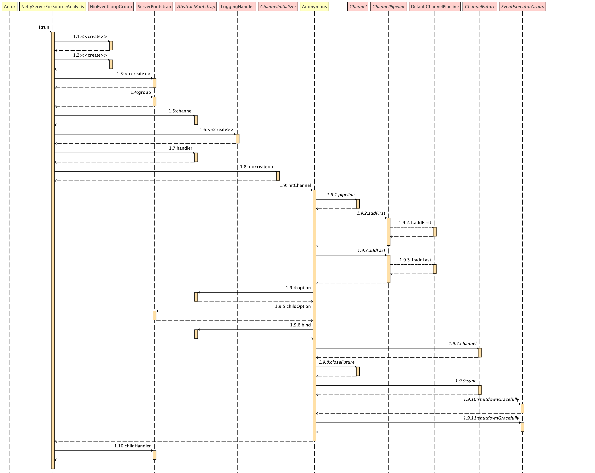

## Netty 源码深入剖析之旅- 示例

源码深入剖析之旅将以一个简单示例来进行阐述，**「根据 Request 将两个操作数，根据操作符进行处理」**。首先将示例的 Server 代码贴出：

&nbsp;

### Operation Class

注意，此类需要实现 `Serializable` ， 在网络通信中，对 `Operation` 对象进行序列化和反序列化。

```java
package com.alton.netty;

import java.io.Serializable;

public class Operation implements Serializable {

    private Integer fist;
    private Integer second;
    private String operator;

    public Operation(Integer fist, Integer second, String operator) {
        this.fist = fist;
        this.second = second;
        this.operator = operator;
    }

    public Integer getFist() {
        return fist;
    }

    public void setFist(Integer fist) {
        this.fist = fist;
    }

    public Integer getSecond() {
        return second;
    }

    public void setSecond(Integer second) {
        this.second = second;
    }

    public String getOperator() {
        return operator;
    }

    public void setOperator(String operator) {
        this.operator = operator;
    }

    @Override
    public String toString() {
        return "Operation{" +
                "number1=" + fist +
                ", number2=" + second +
                ", operator='" + operator + '\'' +
                '}';
    }
}
```

&nbsp;

## 自定义 HTTP Server Handler

此类处理 Http `Request` 数据

```java
package com.alton.netty;

import io.netty.channel.ChannelHandlerContext;
import io.netty.channel.SimpleChannelInboundHandler;
import io.netty.handler.codec.http.FullHttpRequest;
import io.netty.handler.codec.http.HttpHeaders;
import io.netty.handler.codec.http.HttpMethod;

public class HttpRequstHandler extends SimpleChannelInboundHandler<FullHttpRequest> {

    protected void channelRead0(ChannelHandlerContext ctx, FullHttpRequest msg) throws Exception {

        String uri = msg.uri();
        HttpMethod httpMethod = msg.method();
        HttpHeaders headers = msg.headers();

        if (HttpMethod.GET == httpMethod) {

            String[] uriComponents = uri.split("[?]");
            String endpoint = uriComponents[0];
            String[] queryParams = uriComponents[1].split("&");

            if ("/calculate".equalsIgnoreCase(endpoint)) {

                String[] firstKeyValue = queryParams[0].split("=");
                String[] secondKeyValue = queryParams[1].split("=");

                Integer first = Integer.valueOf(firstKeyValue[1]);
                Integer second = Integer.valueOf(secondKeyValue[1]);
                String operator = headers.get("Operator");

                Operation operation = new Operation(first, second, operator);
                ctx.fireChannelRead(operation);
            }
        } else {
            throw new UnsupportedOperationException("HTTP method not supported");
        }

    }
}

```

&nbsp;

### 自定义操作计算 Handler

此类对两操作数根据操作符进行处理，response 会 Client 

```java
package com.alton.netty;

import io.netty.buffer.ByteBuf;
import io.netty.buffer.Unpooled;
import io.netty.channel.ChannelHandlerContext;
import io.netty.channel.SimpleChannelInboundHandler;
import io.netty.handler.codec.http.*;
import io.netty.util.CharsetUtil;

public class CalculatorOperationHandler extends SimpleChannelInboundHandler<Operation> {

    protected void channelRead0(ChannelHandlerContext ctx, Operation msg) throws Exception {
        Long result = calculateEndpoint(msg);
        sendHttpResponse(ctx, new DefaultFullHttpResponse(HttpVersion.HTTP_1_1, HttpResponseStatus.CREATED), result.toString());
        ctx.fireChannelRead(result);
    }

    private long calculateEndpoint(Operation operation) {

        String operator = operation.getOperator().toLowerCase().trim();
        switch (operator) {
            case "add":
                return operation.getFist() + operation.getSecond();
            case "multiply":
                return (long) operation.getFist() * operation.getSecond();
            default:
                throw new IllegalArgumentException("Operation not defined");
        }
    }

    public static void sendHttpResponse(ChannelHandlerContext ctx, FullHttpResponse res, String content) {

        // Generate an error page if response getStatus code is not OK (200).
        ByteBuf buf = Unpooled.copiedBuffer(content, CharsetUtil.UTF_8);
        res.content().writeBytes(buf);
        HttpUtil.setContentLength(res, res.content().readableBytes());
        ctx.channel().writeAndFlush(res);
    }

    public void exceptionCaught(ChannelHandlerContext ctx, Throwable cause)
            throws Exception {

        sendHttpResponse(ctx, new DefaultFullHttpResponse(HttpVersion.HTTP_1_1, HttpResponseStatus.INTERNAL_SERVER_ERROR), "Operation not defined");
        ctx.fireExceptionCaught(cause);
    }

}
```

&nbsp;

### Server 启动

为了更好的深入剖析源码， 编写此 run() 尽量的将代码分开，可以更好的进行阐述！

```java
package com.alton.netty;

import io.netty.bootstrap.ServerBootstrap;
import io.netty.channel.ChannelFuture;
import io.netty.channel.ChannelInitializer;
import io.netty.channel.ChannelOption;
import io.netty.channel.EventLoopGroup;
import io.netty.channel.nio.NioEventLoopGroup;
import io.netty.channel.socket.SocketChannel;
import io.netty.channel.socket.nio.NioServerSocketChannel;
import io.netty.handler.logging.LoggingHandler;

public class NettyServerForSourceAnalysis {

    private int port;

    private NettyServerForSourceAnalysis(int port) {
        this.port = port;
    }

    private void run() throws Exception {

        EventLoopGroup bossGroup = new NioEventLoopGroup(1);
        EventLoopGroup workerGroup = new NioEventLoopGroup();

        try {
            ServerBootstrap b = new ServerBootstrap();
            b.group(bossGroup, workerGroup);
            b.channel(NioServerSocketChannel.class);
            b.handler(new LoggingHandler());
            b.childHandler(new ChannelInitializer<SocketChannel>() {
                public void initChannel(SocketChannel ch) throws Exception {
                    ch.pipeline().addFirst(new HttpRequstHandler()).addLast(new CalculatorOperationHandler());
                }
            });
            b.option(ChannelOption.SO_BACKLOG, 128);
            b.childOption(ChannelOption.SO_KEEPALIVE, true);
            ChannelFuture f = b.bind(port); // (7)
            f.channel().closeFuture().sync();
        } finally {
            workerGroup.shutdownGracefully();
            bossGroup.shutdownGracefully();
        }
    }

    public static void main(String[] args) throws Exception {
        new NettyServerForSourceAnalysis(8080).run();
    }
}
```

&nbsp;

### 测试

既然要以上面的示例为起点来剖析源码，首先测试下它。保证它能正常处理 Client 请求

- run Server
- curl 模拟 Client 访问

```bash
$ 
```

&nbsp;

### Server run() 运行步骤图

后续源码编写会按照此步骤，一点点扣，一点点剖析。将每一步骤剖析

以下图为原图，没有对清晰度进行模糊处理，自己可以根据上面代码比对下面图提前了解整个执行路径：



> - 图头为每一步的原 class 和目标 class 
>
> - 步骤每一步的描述，展示的是 类方法。结合所属类，即可知道那个 class 中的那个方法
> - 后续补充