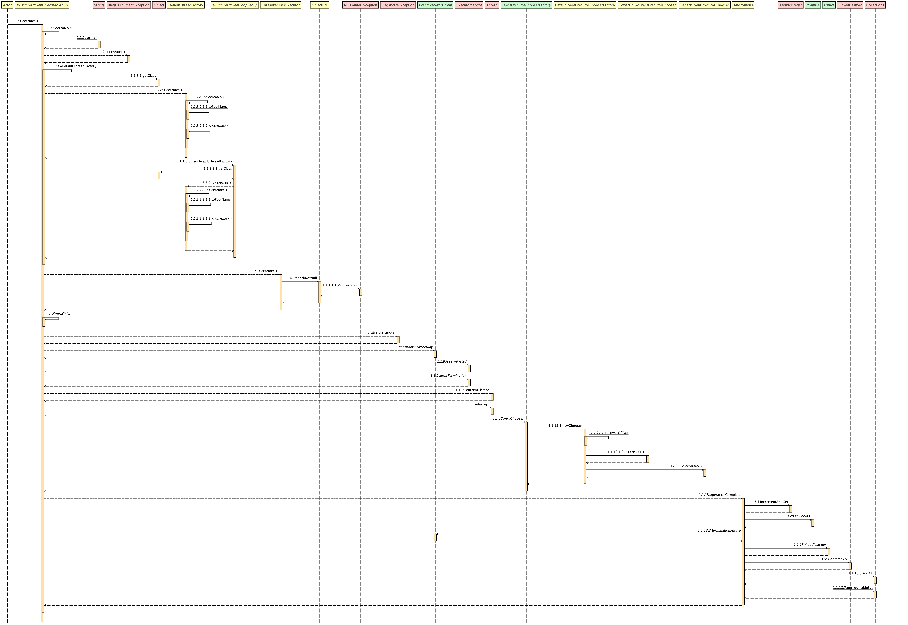

## Netty 源码深入剖析 - MultithreadEventLoopGroup

&nbsp;

### 概览

Netty 框架中的下列 EventLoopGroup 都继承自 `MultithreadEventLoopGroup` : 

- `DefaultEventLoopGroup`
- `EpollEventLoopGroup`
- `KQueueEventLoopGroup`
- `NioEventLoopGroup`  （示例中所用的 Group ）

它是一个抽象 base 类， 目的是在并发环境中，多个线程可以一起处理 task。 

&nbsp;

### MultithreadEventLoopGroup  ->  MultithreadEventExecutorGroup


&nbsp;

- MultithreadEventLoopGroup

```java
public abstract class MultithreadEventLoopGroup extends MultithreadEventExecutorGroup implements EventLoopGroup {
  
    private static final InternalLogger logger = InternalLoggerFactory.getInstance(MultithreadEventLoopGroup.class);

    private static final int DEFAULT_EVENT_LOOP_THREADS;

    static {

        // 取 1 和 core数乘以2 的最大数作为默认 event loop 线程数
        DEFAULT_EVENT_LOOP_THREADS = Math.max(1, SystemPropertyUtil.getInt(
                "io.netty.eventLoopThreads", NettyRuntime.availableProcessors() * 2));

        // 如果 Netty 日志级别将 Debug 打开，这里则会将默认的 event loop 线程数通过日志方法打印
        if (logger.isDebugEnabled()) {
            logger.debug("-Dio.netty.eventLoopThreads: {}", DEFAULT_EVENT_LOOP_THREADS);
        }
    }
 
    /**
     * @see MultithreadEventExecutorGroup#MultithreadEventExecutorGroup(int, Executor, Object...)
     * 示例代码，在此类的调用入口
     * 1
     */
    protected MultithreadEventLoopGroup(int nThreads, Executor executor, Object... args) {
        /**
         * 1.1 : <<create>>
         * 调用父类 {@link MultithreadEventExecutorGroup MultithreadEventExecutorGroup} 的构造器
         *
         * 在子类中获取的资源 selectorProvider, selectStrategyFactory, RejectedExecutionHandlers.reject()
         * 以 Object... args 的方式作为参数传入其父类的构造器方法中
         *
         * nThreads 在示例中为 0 ，在实际环境中是不被允许的，Netty 针对这种情况，将 nThreads 赋值为 DEFAULT_EVENT_LOOP_THREADS
         * DEFAULT_EVENT_LOOP_THREADS: 取 1 和 core数乘以2 的最大数作为默认 event loop 线程数 

         */
        super(nThreads == 0 ? DEFAULT_EVENT_LOOP_THREADS : nThreads, executor, args);
    }
}
```

&nbsp;

### Step 1.1.1 MultithreadEventExecutorGroup



以上 UML 几乎包含了所有调用链路，有兴趣的可以扩大来看，但过于复杂，下面先对主线进行剖析，剖析完后会遗留 3 个问题，在另外专题进行细致的剖析（主线代码和重要内容不作任何妥协）

&nbsp;

主线剖析：


```java
public abstract class MultithreadEventExecutorGroup extends AbstractEventExecutorGroup {

    /* EventExecutor 数组*/
    private final EventExecutor[] children;
    
    // 迭代用
    private final Set<EventExecutor> readonlyChildren;
    private final AtomicInteger terminatedChildren = new AtomicInteger();
    private final Promise<?> terminationFuture = new DefaultPromise(GlobalEventExecutor.INSTANCE);

    // Event Executor 选择工厂， 俗话一点就是如何选择 EventExecutor 用的
    private final EventExecutorChooserFactory.EventExecutorChooser chooser;

    /**
     * Create a new instance.
     *
     * @param nThreads          the number of threads that will be used by this instance.
     * @param threadFactory     the ThreadFactory to use, or {@code null} if the default should be used.
     * @param args              arguments which will passed to each {@link #newChild(Executor, Object...)} call
     */
    protected MultithreadEventExecutorGroup(int nThreads, ThreadFactory threadFactory, Object... args) {
        this(nThreads, threadFactory == null ? null : new ThreadPerTaskExecutor(threadFactory), args);
    }

    /**
     * Create a new instance.
     * 1. 示例代码，在此类中的调用入口
     *
     * @param nThreads          the number of threads that will be used by this instance.
     * @param executor          the Executor to use, or {@code null} if the default should be used.
     * @param args              arguments which will passed to each {@link #newChild(Executor, Object...)} call
     */
    protected MultithreadEventExecutorGroup(int nThreads, Executor executor, Object... args) {

        /**
         * 以  {@link DefaultEventExecutorChooserFactory.INSTANCE} 默认 event executor chooser 工厂
         * 创建默认的 EventExecutorChooserFactory
         * 然后调用此实例中的另一个构造器
         */
        this(nThreads, executor, DefaultEventExecutorChooserFactory.INSTANCE, args);
    }

    /**
     * Create a new instance.
     * 2. 此类入口处所调用的构造器
     * 作用：
     * 1) 初始化 Executor
     * 2）初始化 EventExecutor 数组（children）
     * 3）选择 EventExecutorChoose
     * 4) 为 children 添加 listener
     * 5) 将 children 添加到迭代器里，为后续遍历 EventExecutor 做准备
     * @param nThreads          the number of threads that will be used by this instance.
     *                          示例： cores * 2
     * @param executor          the Executor to use, or {@code null} if the default should be used.
     *                          示例： null
     * @param chooserFactory    the {@link EventExecutorChooserFactory} to use.
     *                          示例： DefaultEventExecutorChooserFactory.INSTANCE
     * @param args              arguments which will passed to each {@link #newChild(Executor, Object...)} call
     *                          示例中的 selectorProvider, selectStrategyFactory, RejectedExecutionHandlers.reject()
     */
    protected MultithreadEventExecutorGroup(int nThreads, Executor executor,
                                            EventExecutorChooserFactory chooserFactory, Object... args) {

        /**
         * 示例代码执行到这里，nThreads 为 cores * 2。
         * 但是如果在 NioEventLoopGroup 中传入的 nThreads 为负数， 则抛出
         * IllegalArgumentException
         */

        if (nThreads <= 0) {
            throw new IllegalArgumentException(String.format("nThreads: %d (expected: > 0)", nThreads));
        }

        /**
         * 示例代码，走到这， executor 为 null
         * Executor ： 默认实现 ThreadPerTaskExecutor，现在简单理解为使用 thread factory 新建 thread 的 Executor
         * 仅仅赋值一次，每个 MultithreadEventExecutorGroup 公用一个 executor。
         * thread factory : 在另外专题讲解
         *
         * 这里抛出 1 个未剖析点：
         * 1. Thread Factory
         */
        if (executor == null) {
            executor = new ThreadPerTaskExecutor(newDefaultThreadFactory());
        }

        // EventExecutor 先简单理解为 判断线程 在eventloop 中的状态
        // 有专题讲解它，随着源码深入，对它会有更深刻的认识。
        // 这里初始化 EventExecutor 数组，元素个数为 nThreads。
        /**
         * 这里抛出 1 个未分析点
         * 专题讲解：
         * 2. EventExecutor
         */
        children = new EventExecutor[nThreads];

        // 对每个 children 元素赋值
        for (int i = 0; i < nThreads; i ++) {
            boolean success = false;
            try {
                // 使用 executor 和 参数 args 初始化 children 元素
                // newChild 方法以示例中来说，在 NioEventLoopGroup 中覆写。
                children[i] = newChild(executor, args);
                success = true;
            } catch (Exception e) {
                // TODO: Think about if this is a good exception type
                throw new IllegalStateException("failed to create a child event loop", e);
            } finally {
                if (!success) {

                    // children 元素初始化失败时，将children 所有 EventExecutor 关闭。
                    for (int j = 0; j < i; j ++) {
                        children[j].shutdownGracefully();
                    }

                    // 执行上面命令后，还需要确保所有 EventExecutor 里的 task 被执行完成， 在这里指确保所有 task 都完成后 EventExecutor 被关闭
                    for (int j = 0; j < i; j ++) {
                        EventExecutor e = children[j];
                        try {
                            while (!e.isTerminated()) {
                                e.awaitTermination(Integer.MAX_VALUE, TimeUnit.SECONDS);
                            }
                        } catch (InterruptedException interrupted) {
                            // Let the caller handle the interruption.
                            Thread.currentThread().interrupt();
                            break;
                        }
                    }
                }
            }
        }

        // 用 DefaultEventExecutorChooserFactory.INSTANCE 和 children 创建一个 Chooser
        // Chooser 是如何创建的，这里不在赘述，会在下面进行剖析
        /**
         * 这里抛出一个未 剖析点：
         * 3. EventExecutorChooser
         */
        chooser = chooserFactory.newChooser(children);

        /**
         * 这个 listener 是指定的，仅当所有的 EventExecutor 都完成了，才设置 terminationFuture 状态为 success
         */
        final FutureListener<Object> terminationListener = new FutureListener<Object>() {
            @Override
            public void operationComplete(Future<Object> future) throws Exception {
                if (terminatedChildren.incrementAndGet() == children.length) {
                    terminationFuture.setSuccess(null);
                }
            }
        };

        /**
         * 首先忽略 terminationFuture() 是个啥
         * 这里的重点
         * 为每个 EventExecutor 添加 Listener
         * 作用：
         * 将指定的 listener 添加到此future。
         * 当该 future 完成时，将通知指定的 listener。如果该 future 已经完成，则立即通知指定的 listener。
         */
        for (EventExecutor e: children) {
            e.terminationFuture().addListener(terminationListener);
        }

        /**
         * 初始化 readonlyChildren Set<EventExecutor>
         * 将所有 children 元素都放入到此 Set 中，并将 readonlyChilren 设置为只读，不可修改。
         * 用来迭代用。
         */
        Set<EventExecutor> childrenSet = new LinkedHashSet<EventExecutor>(children.length);
        Collections.addAll(childrenSet, children);
        readonlyChildren = Collections.unmodifiableSet(childrenSet);
    }

    protected ThreadFactory newDefaultThreadFactory() {
        return new DefaultThreadFactory(getClass());
    }

    @Override
    public Iterator<EventExecutor> iterator() {
        return readonlyChildren.iterator();
    }

    @Override
    public boolean isTerminated() {
        for (EventExecutor l: children) {
            if (!l.isTerminated()) {
                return false;
            }
        }
        return true;
    }

    /**
     *
     * @param timeout
     * @param unit
     * @return
     * @throws InterruptedException
     */
    @Override
    public boolean awaitTermination(long timeout, TimeUnit unit)
            throws InterruptedException {
        long deadline = System.nanoTime() + unit.toNanos(timeout);

        loop: for (EventExecutor l: children) {
            for (;;) {
                long timeLeft = deadline - System.nanoTime();
                if (timeLeft <= 0) {
                    break loop;
                }

                if (l.awaitTermination(timeLeft, TimeUnit.NANOSECONDS)) {
                    break;
                }
            }
        }
        return isTerminated();
    }
}

```

&nbsp;

源码分析到目前，大家都应该知道了 NioEventLoopGroup 实例构建过程都做了什么事了。

下面将上面遗留的 3 个知识盲点拎出来，单独专题讲解： 

- [ThreadFactory](netty-source-analysis-thread-factory.md)
  - 线程工厂
- [EventExecutor](netty-source-analysis-thread-factory.md)
  - Netty event loop 执行器
  - 核心
- [EventExecutorChooser](netty-source-analysis-event-executor-chooser.md)
  - Event Executor 选择器

&nbsp;

> 上一篇： 1.1.2.1.1 《create》: 提供 `RejectedExecutionHandlers` 《[Netty 源码深入剖析之 - RejectedExecutionHandlers](netty-source-analysis-rejected-execution-handlers.md)》
>
> 下一篇：EventLoopGroup  《[Netty 源码深入剖析之 - ThreadFactory](netty-source-analysis-thread-factory.md)》