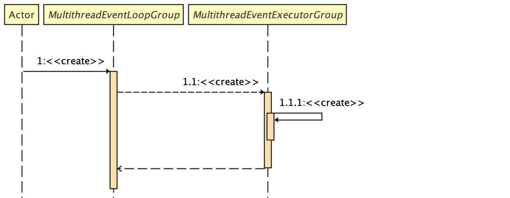

## Netty 源码深入剖析之 - MultithreadEventLoopGroup

&nbsp;

### 概览

Netty 框架中的下列 EventLoopGroup 都继承自 `MultithreadEventLoopGroup` : 

- `DefaultEventLoopGroup`
- `EpollEventLoopGroup`
- `KQueueEventLoopGroup`
- `NioEventLoopGroup`  （示例中所用的 Group ）

它是一个抽象 base 类， 目的是在并发环境中，多个线程可以一起处理 task。 

&nbsp;

### MultithreadEventLoopGroup 和  MultithreadEventExecutorGroup



&nbsp;

- MultithreadEventLoopGroup

```java
public abstract class MultithreadEventLoopGroup extends MultithreadEventExecutorGroup implements EventLoopGroup {
 
	protected MultithreadEventLoopGroup(int nThreads, Executor executor, Object... args) {
        /**
         * 1.1 : <<create>>
         * 调用父类 {@link MultithreadEventExecutorGroup} 的构造器 
         * 在子类中获取的资源 selectorProvider, selectStrategyFactory, RejectedExecutionHandlers.reject()
         * 以 Object... args 的方式作为参数传入其父类的构造器方法中
         */
        super(nThreads == 0 ? DEFAULT_EVENT_LOOP_THREADS : nThreads, executor, args);
    }
}
```

&nbsp;

> 1.1.1 在这里不描述，放在下一小节

&nbsp;

### Step 1.1.1 MultithreadEventExecutorGroup

- DefaultEventExecutorChooserFactory

```java
@UnstableApi
public final class DefaultEventExecutorChooserFactory implements EventExecutorChooserFactory {
    
    // 示例代码创建此类示例的入口
    public static final DefaultEventExecutorChooserFactory INSTANCE = new DefaultEventExecutorChooserFactory();

    private DefaultEventExecutorChooserFactory() { }
}
```

&nbsp;

- MultithreadEventExecutorGroup

```java
public abstract class MultithreadEventExecutorGroup extends AbstractEventExecutorGroup {

    private final EventExecutor[] children;
    private final Set<EventExecutor> readonlyChildren;
    private final AtomicInteger terminatedChildren = new AtomicInteger();
    private final Promise<?> terminationFuture = new DefaultPromise(GlobalEventExecutor.INSTANCE);
    private final EventExecutorChooserFactory.EventExecutorChooser chooser;
  
    /**
     * Create a new instance.
     * 示例代码，在此类中的调用入口
     * 然后调用此实例中的另一个构造器
     * @param nThreads          the number of threads that will be used by this instance.
     * @param executor          the Executor to use, or {@code null} if the default should be used.
     * @param args              arguments which will passed to each {@link #newChild(Executor, Object...)} call
     */
    protected MultithreadEventExecutorGroup(int nThreads, Executor executor, Object... args) {

        /**
         * 以  {@link DefaultEventExecutorChooserFactory.INSTANCE} 默认 event executor chooser 工厂
         * 创建默认的 EventExecutorChooserFactory
         */
        this(nThreads, executor, DefaultEventExecutorChooserFactory.INSTANCE, args);
    }
```


> 上一篇： 1.1.2.1.1 《create》: 提供 `RejectedExecutionHandlers` 《[Netty 源码深入剖析之 - RejectedExecutionHandlers](netty-source-analysis-rejected-execution-handlers.md)》
>
> 下一篇：EventLoopGroup  《[Netty 源码深入剖析之 - MultithreadEventLoopGroup](netty-source-analysis-multithread-event-loop-group.md)》