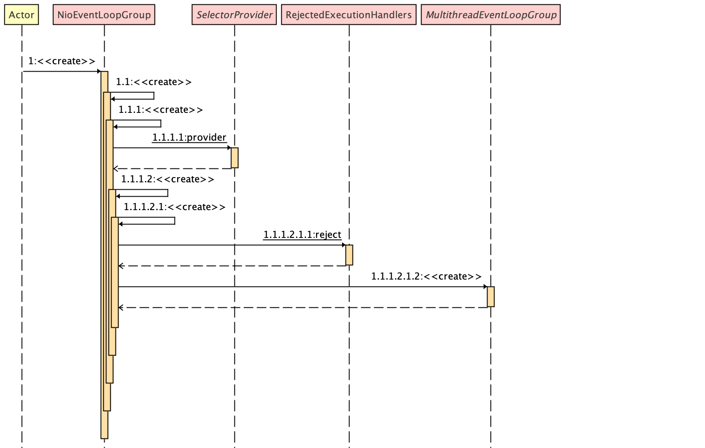

## Netty 源码深入剖析之 - 提供 RejectedExecutionHandlers

&nbsp;



&nbsp;

### Step: 1.1.1.2.1.1

### 选择 Select 策略工厂

跟随示例主题，继续走： 

示例中的仅需要选择默认 Select 策略工厂即可

- `DefaultSelectStrategyFactory.INSTANCE`

```java
public final class DefaultSelectStrategyFactory implements SelectStrategyFactory {

  /* 工厂模式， 构建 DefaultSelectStrategyFactory 实例*/  
  public static final SelectStrategyFactory INSTANCE = new DefaultSelectStrategyFactory();

    private DefaultSelectStrategyFactory() { }
}
```

&nbsp;

下面来介绍各种策略工厂，后续补充，先这样！

&nbsp;

RejectedExecutionHandler 接口 

- Executor 拒绝执行 Handler 

- 当有人试图将一个 task 添加到 SingleThreadEventExecutor，但由于容量限制而失败时调用。

```java
package io.netty.util.concurrent;

public interface RejectedExecutionHandler {
    void rejected(Runnable task, SingleThreadEventExecutor executor);
}
```

&nbsp;

- 用来创建不同的 RejectedExecutionHandlers 公开 `helper` 方法。
- 当由于配置的时间限制无法添加 task 时，尝试 backoff。只有当 task 是从 event loop 外部添加的时候才会这样做，这意味着 EventExecutor.inEventLoop() 返回false。

```java
public final class RejectedExecutionHandlers {

    private static final RejectedExecutionHandler REJECT = new RejectedExecutionHandler() {

        /**
         * 重写 RejectedExecutionHandler rejected 方法
         * 当尝试调用 reject() 方式时， return RejectedExecutionHandler
         */
        @Override
        public void rejected(Runnable task, SingleThreadEventExecutor executor) {
            throw new RejectedExecutionException();
        }
    };

    private RejectedExecutionHandlers() {
    }

    // 示例中所调用的方法， 默认处理方式，直接抛出异常
    public static RejectedExecutionHandler reject() {
        return REJECT;
    }

    /**
     * Tries to backoff when the task can not be added due restrictions for an configured amount of time. This
     * is only done if the task was added from outside of the event loop which means
     * 此方法俗称补偿策略
     * 另一种 RejectedExecutionHandler ， 当由于配置的时间限制无法添加 task 时，尝试 backoff。
     * 被调用的场景： 只有当 task 是从 event loop 外部添加的时候才会这样做，这意味着 EventExecutor.inEventLoop() 返回false。
     *
     * {@link EventExecutor#inEventLoop()} returns {@code false}.
     */
    public static RejectedExecutionHandler backoff(final int retries, long backoffAmount, TimeUnit unit) {

        /**
         * 确保参数 retries 重试次数为整数（positive），
         * ObjectUtil 工具类，这里就不展开了，不在讨论范围.
         * ObjectUtil 它是一个很简单的一个 Java 工具类，有兴趣自己看看
         */
        ObjectUtil.checkPositive(retries, "retries");
        final long backOffNanos = unit.toNanos(backoffAmount);
        return new RejectedExecutionHandler() {
            @Override
            public void rejected(Runnable task, SingleThreadEventExecutor executor) {

                /**
                 * 判断 executor 是否在 event loop 中
                 */
                if (!executor.inEventLoop()) {
                    for (int i = 0; i < retries; i++) {
                        // Try to wake up the executor so it will empty its task queue.
                        // 尝试唤醒 executor，使其清空任务队列。详情请看 Java 多线程知识。不在讨论范围
                        executor.wakeup(false);

                        // 阻塞当前线程，阻塞时间  backOffNanos (纳秒)
                        LockSupport.parkNanos(backOffNanos);

                        /**
                         *
                         * 尝试通过 {@link SingleThreadEventExecutor#offerTask offerTask} 添加 task 到 executor
                         * 一旦添加成功（说明补偿 task 成功），直接退出 {@link RejectedExecutionHandlers.backoff backoff} 方法
                          */
                        if (executor.offerTask(task)) {
                            return;
                        }
                    }
                }

                // Either we tried to add the task from within the EventLoop or we was not able to add it even with
                // backoff.
                /**
                 * executor 不在 event loop 中
                 * 或者在尝试 retries 次后，仍无法添加 task 到 executor 时
                 * 抛出 {@link RejectedExecutionHandler}
                 */
                throw new RejectedExecutionException();
            }
        };
    }
}
```

&nbsp;

这里非常简单， 这些内容会被后续的内容贯穿。尽请关注！

&nbsp;

>  上一篇： 《[Netty 源码深入剖析之 - SelectorProvider (Multiplux)](netty-source-analysis-selector-provider.md)》
>
> 下一篇：EventLoopGroup  《[Netty 源码深入剖析之 - MultithreadEventLoopGroup](netty-source-analysis-multithread-eventloop-group.md)》