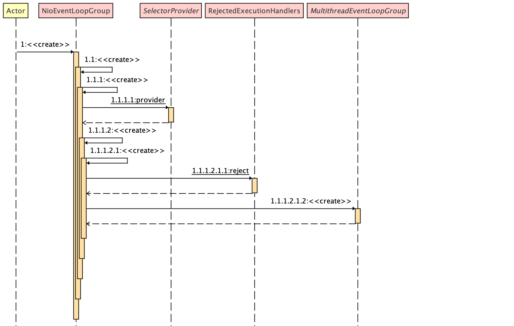

## Netty 源码深入剖析 EventLoopGroup 之 - SelectorProvider (Multiplux)

&nbsp;

### 概览

Netty 使用 Bootstrap 引导 Server 或 Client 启动，在此过程中 Bootstrap 通过 group() 方法绑定指定或选择默认参数的 EventLoopGroup 来实现不同的 Reactor thread Pattern。 关于 [Reactor thread Pattern](netty-reactor-thread-pattern.md) 的概念，请自行回看。

而 `Reactor thread Pattern` 中的 thread 概念在 Netty 中对应 NioEventLoop（它里面封装了 thread） , 

那么问题来了， NioEventLoop： 

-  在 Netty 中的主要负责什么呢？ 

- 怎么帮助 Netty 实现 event loop 的高效处理和性能呢？
- 怎么处理和 Java Native IO 的关系呢？
- 又是如何如何规避 Java 繁杂的 NIO api 呢？

在本系列中源码深入剖析之旅中，咱们来一一揭晓。

今天的主角为 SelectorProvider ， 是实现 event loop 的核心内容。

&nbsp;

### EventLoopGroup

```java
        EventLoopGroup bossGroup = new NioEventLoopGroup(1);
        EventLoopGroup workerGroup = new NioEventLoopGroup();
```

在被 bootstrap 绑定前，咱们先来看看这两行代码做的事情。

一眼望上去，他们之间的区别除了变量名和参数不同，没其它区别。

下面咱们来解读他们： 



&nbsp;

根据上图可以很明显的看出， 此步骤以 `NioEventLoopGroup` 为调用点，根据其不同的构造方法为起点，调用其重载方法。

```java
public class NioEventLoopGroup extends MultithreadEventLoopGroup {
    /**
     * 示例代码，以此构造器为入口
     * 1.1 使用默认线程数创建 `NioEventLoopGroup` 实例。如何创建后续再讨论
     */
    public NioEventLoopGroup() {

        //  `nThreads` 置为 0， 为后续使用默认线程数铺垫
        this(0);
    }

    /**
     * 1.1.1
     */
    public NioEventLoopGroup(int nThreads) {
        // 将默认线程 Executor （Java Executor）置为 null。为后续使用默认 Exceutor 铺垫
        this(nThreads, (Executor) null);
    }

    /**
     * 1.1.1.1
     * 当然了，用户也可以直接使用此构造器，传入 nThreads 和 Executor (Java 和 自定义的都可以)
     * 如何使用最优 Executor 和甚至使用自定义的 Executor ，不在此进行讨论，它跟咱们的主题无关
     * @param nThreads 0
     * @param executor null
     */
    public NioEventLoopGroup(int nThreads, Executor executor) {

        // 使用 `SelectorProvider.provider()` 提供  `SelectorProvider`， 细节下文进行描述
        this(nThreads, executor, SelectorProvider.provider());
    }

    /**
     * 1.1.1.2
     * @param nThreads 0
     * @param executor null
     * @param selectorProvider SelectorProvider.provider()
     */
    public NioEventLoopGroup(
            int nThreads, Executor executor, final SelectorProvider selectorProvider) {
        //  使用 `DefaultSelectStrategyFactory.INSTANCE` 为 NioEventLoopGroup 提供默认的 `SelectStrategyFactory`。
        this(nThreads, executor, selectorProvider, DefaultSelectStrategyFactory.INSTANCE);
    }


    /**
     * 1.1.1.2.1
     * @param nThreads 0
     * @param executor null
     * @param selectorProvider SelectorProvider.provider() 下面源码讲解
     * @param selectStrategyFactory  DefaultSelectStrategyFactory.INSTANCE 下面源码中讲解
     */
    public NioEventLoopGroup(int nThreads, Executor executor, final SelectorProvider selectorProvider,
                             final SelectStrategyFactory selectStrategyFactory) {

        /**
         * 以以下内容为内容调用父类 MultithreadEventLoopGroup 的构造器
         * 将上面所定义出的 nThreads, executor, selectorProvider, selectStrategyFactory
         * 以及 此处提供 `RejectedExecutionHandler`
         */
        super(nThreads, executor, selectorProvider, selectStrategyFactory, RejectedExecutionHandlers.reject());
    }
}

```

上面的代码为此步骤中 NioEventLoopGroup 涉及到的代码， 和上面描述的一致。不断地调用其重载方法，这本身没什么？ 

仔细看此类描述： `NioEventLoopGroup` 用于基于 NIO Selector 的 Channel 的实现。毫无疑问，此类必定用到了 Java NIO 核心组件 Selector，以及 Netty 基于 Java Native Channel 实现的 Channel。 

对于 1、1.1， 1.1.1 这里不在描述，后续会用到他们

&nbsp;

### Step 1.1.1.1  SelectorProvider

这里阐述 `SelectorProvider`：

java doc 的描述： 用于 selector 和 selectable channel 的 `Service-provider` 类。不熟悉 Selector 底层原理，对这句话理解不到真髓。

这里对它进行深入剖析，其实就是此 Java VM 选择 OS 内核不同的 (Kernel) Multiplux 来对 I/O 进行操作。对于其他的 OS 本文不多作赘述，Linux 那么多路复用器都有哪些呢？

- `epoll`

- `poll`

- `select`

主题为 Netty 源码， 对于 OS 底层的知识这里就不多作介绍，有兴趣的，可以自行查阅相关知识进行学习。

&nbsp;

回归正题，以上源码为 1.1.1.1 所调用的。现在来揭秘它，揭秘信息我在源码中贴出来，在源码外面描述一些跟源码本身无关的内容，后续源码分析，默认都以这种方式。

```java
public abstract class SelectorProvider {
  
  /*定义一个 lock 对象（new Object()）*/
  private static final Object lock = new Object();
  
  /*定义 SelectorProvider, 初始化为 null */
  private static SelectorProvider provider = null;
  
  /**
   * 如果定义了系统属性 java.nio.channels.spi.SelectorProvider， 则将属性值 类加载作为 selector provider。 
   * 定义方法： 
   * e.g. -Djava.nio.channels.spi.SelectorProvider=sun.nio.ch.EPollSelectorProvider
   */
  private static boolean loadProviderFromProperty() {
    String cn = System.getProperty("java.nio.channels.spi.SelectorProvider");
    if (cn == null)
      return false;
    try {
      
      /**
       * 根据定义的系统属性值，加载类信息
       * 然后创建它的属性作为 SelectorProvider
       */
      Class<?> c = Class.forName(cn, true,
                                 ClassLoader.getSystemClassLoader());
      provider = (SelectorProvider)c.newInstance();
      return true;
    } catch (ClassNotFoundException x) {
      throw new ServiceConfigurationError(null, x);
    } catch (IllegalAccessException x) {
      throw new ServiceConfigurationError(null, x);
    } catch (InstantiationException x) {
      throw new ServiceConfigurationError(null, x);
    } catch (SecurityException x) {
      throw new ServiceConfigurationError(null, x);
    }
  }
  
  /**
   * 定义方法： 
   * provider-configuration
   * resource/META-INF/ 目录下 命令为  java.nio.channels.spi.SelectorProvider 的文件中定义
   * 这种方法一般在生产环境中不采用
   */
  private static boolean loadProviderAsService() {

    /* 定义一个指定为 SelectorProvider 类的 ServiceLoader。 */
    ServiceLoader<SelectorProvider> sl =
      ServiceLoader.load(SelectorProvider.class,
                         ClassLoader.getSystemClassLoader());
    
    /* 获取 ServiceLoader 中包含所有 SelectorProvider 的迭代器*/
    Iterator<SelectorProvider> i = sl.iterator();
    for (;;) {
      try {
        
        /*迭代器中没有值，直接返回 false*/
        if (!i.hasNext())
          return false;
        
        /**
         * 根据逻辑可以看出，在没有错误发生的情况下
         * 直接取迭代器中的第一个作为 SelectorLoader
         */ 
        provider = i.next();
        return true;
      } catch (ServiceConfigurationError sce) {
        if (sce.getCause() instanceof SecurityException) {
         
          // 如果获取到安全异常， 尝试迭代器中的下一个
          continue;
        }
        throw sce;
      }
    }
  }
  
  /*方法返回此 Java VM 调用的 system-wide 默认 selector provider。*/
  public static SelectorProvider provider() {
    
    /*此 Java VM 仅能有一个 thread 来获取此 lock */
    synchronized (lock) {
      /* selector provider 不为 null, 直接返回，意味着 selector provider 在一个 java vm 只能成功获取一次*/
      if (provider != null)
        return provider;
      return AccessController.doPrivileged(
        new PrivilegedAction<SelectorProvider>() {
          public SelectorProvider run() {
            
            /*见方法 loadProviderFromProperty() 备注*/
            if (loadProviderFromProperty())
              return provider;
            
            /*JVM 没有设置 SelectorProvider 系统属性的情况下，执行*/
            if (loadProviderAsService())
              return provider;
            
            /**
             * mac os 默认获取 sun.nio.ch.KQueueSelectorProvider 作为 SelectorProvider
             * Linux 默认获取 sun.nio.ch.EPollSelectorProvider 作为 SelectorProvider
             */
            provider = sun.nio.ch.DefaultSelectorProvider.create();
            return provider;
          }
        });
    }
  }
 
}
```

> 注意： 
>
> -  Netty 在不同 OS 中编译， DefaultSelectorProvider 是不同的

&nbsp;

下面针对不同系统，将 `DefaultSelectorProvider.create()` 方法源码进行剖析！

- mac

```java
package sun.nio.ch;

import java.nio.channels.spi.SelectorProvider;

public class DefaultSelectorProvider {
    private DefaultSelectorProvider() {
    }

    public static SelectorProvider create() {
        return new KQueueSelectorProvider();
    }
}

package sun.nio.ch;

import java.io.IOException;
import java.nio.channels.spi.AbstractSelector;

public class KQueueSelectorProvider extends SelectorProviderImpl {
    public KQueueSelectorProvider() {
    }

    public AbstractSelector openSelector() throws IOException {
        return new KQueueSelectorImpl(this);
    }
}
```

&nbsp;

- Windows

```java
public class DefaultSelectorProvider {
    public static SelectorProvider create() {
        return new sun.nio.ch.WindowsSelectorProvider();
    }
}

public class WindowsSelectorProvider extends SelectorProviderImpl {
    public AbstractSelector openSelector() throws IOException {
        return new WindowsSelectorImpl(this);
    }
}
```

&nbsp;

- Unix

```java
public class DefaultSelectorProvider {
    public static SelectorProvider create() {
        String osname = AccessController
            .doPrivileged(new GetPropertyAction("os.name"));
        if (osname.equals("SunOS"))
            return createProvider("sun.nio.ch.DevPollSelectorProvider");
        if (osname.equals("Linux"))
            return createProvider("sun.nio.ch.EPollSelectorProvider");
        return new sun.nio.ch.PollSelectorProvider();
    }
}

public class EPollSelectorProvider extends SelectorProviderImpl {
    public AbstractSelector openSelector() throws IOException {
        return new EPollSelectorImpl(this);
    }

    public Channel inheritedChannel() throws IOException {
        return InheritedChannel.getChannel();
    }
}
```

> 根据上面类描述，可以看到不同平台，默认的 Multiplux 都不同， 但他们都继承了 SelectorProviderImpl 
>
> 再根据自身系统， 实现各自的 SelectorProvider 特性，解决兼容性的问题，不再继续往 OS 深究了。有兴趣的可以自行了解。
>
> 项目中的服务器一般都搭建在 Linux OS 中， 关于 Epoll 相关系统，可看 system io 专题。 

&nbsp;

至此，`NioEventLoopGroup` 中的 JNI  `SelectorProvider.provider()` 已经剖析完成 （Java 原生的 SelectorProvider）。 

即便不设置系统属性，使用 JNI 默认的 SelectorProvider 也够用了。如果 JNI 默认的 SelectorProvider 无法达到大家的使用场景要求可通过下面方式优化。

&nbsp;

#### Netty Native 传输

以 `SelectorProvider` 来扩展 `Netty` 的 `SelectorProvider` 知识点，一点扩面，加深对 Netty 底层的理解

Netty提供了以下平台特定的 JNI 传输：

- Linux (since 4.0.16)
- MacOS/BSD (since 4.1.11)

与基于 NIO 的传输相比，这些 JNI 传输添加了针对平台本身的特性，优势如下：

- 生成的垃圾更少
- 通常性能更高

&nbsp;

##### 使用 Linux native 传输

因为 Netty Native 传输 与 NIO 传输是兼容的， 你可以放心在使用下面左边的类时，替换为右边的类，进行使用。

- `NioEventLoopGroup` → `EpollEventLoopGroup`
- `NioEventLoop` → `EpollEventLoop`
- `NioServerSocketChannel` → `EpollServerSocketChannel`
- `NioSocketChannel` → `EpollSocketChannel`

&nbsp;

因为 Netty native 传输不是 Netty 核心的一部分， 你需要在 pom.xml 文件中添加相应的依赖（`netty-transport-native-epoll`），将 native jar 加载到环境变量中进行使用。

```xml
<!-- https://mvnrepository.com/artifact/io.netty/netty-transport-native-epoll -->
<dependency>
    <groupId>io.netty</groupId>
    <artifactId>netty-transport-native-epoll</artifactId>
    <version>4.1.63.Final</version>
    <classifier>linux-x86_64</classifier>
</dependency>
```

&nbsp;

- sbt

```shell
"io.netty" % "netty-transport-native-epoll" % "4.1.63.Final" classifier "linux-x86_64"
```

&nbsp;

##### 使用 MacOS/BSD native 传输

因为 Netty Native 传输 与 NIO 传输是兼容的， 你可以放心在使用下面左边的类时，替换为右边的类，进行使用。

- `NioEventLoopGroup` → `KQueueEventLoopGroup`
- `NioEventLoop` → `KQueueEventLoop`
- `NioServerSocketChannel` → `KQueueServerSocketChannel`
- `NioSocketChannel` → `KQueueSocketChannel`

&nbsp;

因为 Netty native 传输不是 Netty 核心的一部分， 你需要在 pom.xml 文件中添加相应的依赖（`netty-transport-native-epoll`），将 native jar 加载到环境变量中进行使用。

```xml
 <!-- https://mvnrepository.com/artifact/io.netty/netty-transport-native-epoll -->
    <dependency>
      <groupId>io.netty</groupId>
      <artifactId>netty-transport-native-kqueue</artifactId>
      <version>4.1.63.Final</version>
      <classifier>osx-x86_64</classifier>
    </dependency>
```


- sbt

```shell
"io.netty" % "netty-transport-native-kqueue" % "${project.version}" classifier "osx-x86_64"
```

&nbsp;

一般通过添加依赖加载就可以用了，如果因特殊原因不能够进行上面操作，可以自行 build (不建议)

&nbsp;

##### Build Linux native 传输

要构建 native 传输，您需要使用 64位 kernel 2.6 或更高版本的 Linux 系统。还需要安装需要的工具和类库： 

```bash
# RHEL/CentOS/Fedora:
$ sudo yum install autoconf automake libtool make tar \
                 glibc-devel \
                 libgcc.i686 glibc-devel.i686
# Debian/Ubuntu:
$ sudo apt-get install autoconf automake libtool make tar \
                     gcc
```

&nbsp;

##### Building MacOS/BSD native 传输

build 原生传输， 你需要使用 MacOS 10.12 或更高版本， 同样需要安装需要的工具的类库： 

```bash
$ brew install autoconf automake libtool
```

&nbsp;

回归正题， SelectorProvider 的介绍到此为止了。 对它的讲解可以说已经非常深入了。至于不同 OS 的不同 Multiplux 的原理，不在 Netty 的讨论范围内。

&nbsp;

>  下一篇： 1.1.1.2.1 《create》: 提供 `RejectedExecutionHandlers` 《[Netty 源码深入剖析之 - RejectedExecutionHandlers](netty-source-analysis-rejected-execution-handlers.md)》

