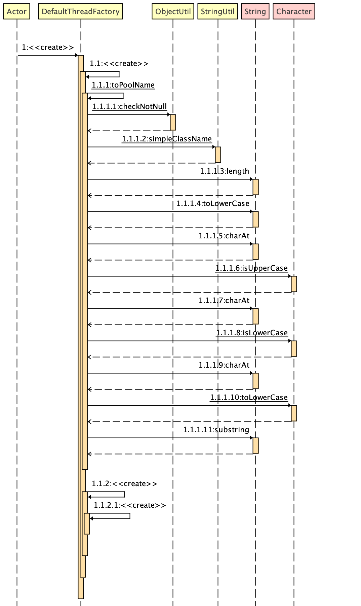
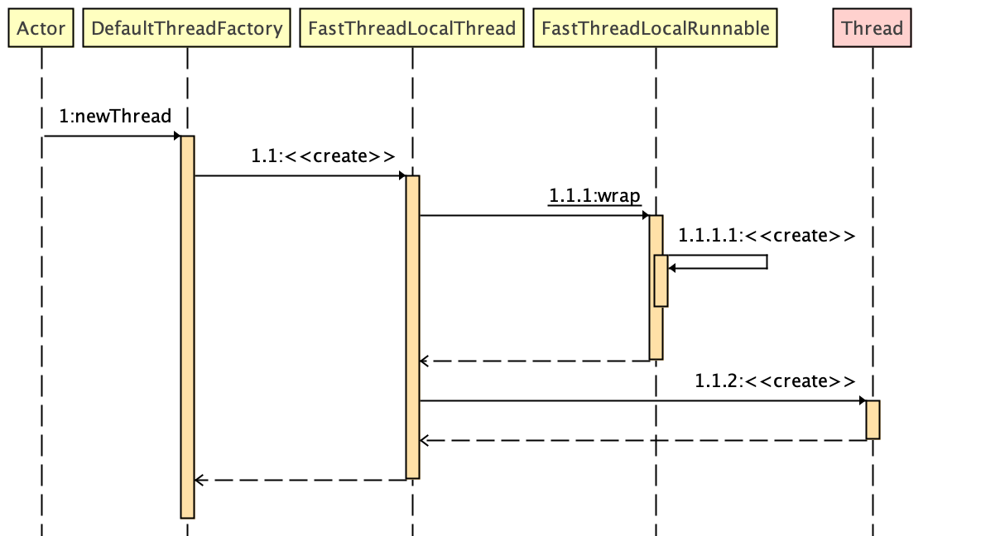

## Netty Thread Factor

&nbsp;

### 简介

Netty ThreadFactory 为 Event Loop 提供创建新线程的功能。在 `MultithreadEventExecutorGroup` 的构造器中会用到 ThreadFactory 。

为了更好让大家理解 Netty 源码底层逻辑，本文先对 Netty `Thread Factor` 进行深入剖析。 在这里简单描述下 Thread 工厂的作用： 

- 按需创建新 thread 的对象。
- 使用 Thread Factor 消除了对新建 thread 调用的硬编码，使应用程序能够使用特殊的 thread subclass、`priority` 等。

这个接口最简单的实现是:

```java
 class SimpleThreadFactory implements ThreadFactory {
   @Override
   public Thread newThread(Runnable r) {
     return new Thread(r);
   }
 }
```

&nbsp;

### Netty ThreadFactory 源码分析

Netty 源码剖析的以咱们的示例代码来描述，有更强的代入感，描述的同时，将扩展知识带出来一起描述。

下面的内容主题为示例中需要用到 DefaultThreadFactory, 在代码中描述了如何构建它并使用它来创建新 Thread。

下面为构建 DefaultThreadFactory  UML 图。不包含如何创建 thread， 仅为 ThreadFactory 默认实现



```java
public class DefaultThreadFactory implements ThreadFactory {

    // 创建 DefaultThreadFactory 新实例递增
    private static final AtomicInteger poolId = new AtomicInteger();

    // 每个实例中，新建 thread 都递增
    private final AtomicInteger nextId = new AtomicInteger();

    // `multithreadEventExecutorGroup-poolId(每次递增)-`
    private final String prefix;

    // false
    private final boolean daemon;

    // 5
    private final int priority;

    /**
     * thread group 代表一组 thread。
     * 此外，thread group 还可以包括其他 thread group。
     * thread group 形成一个树，其中除了初始 thread group 外，每个 thread group 都有一个父 thread group。
     * 示例中： threadGroup : null
     */
    protected final ThreadGroup threadGroup;

    // Step.1
    public DefaultThreadFactory(Class<?> poolType) {
        // Thread.NORM_PRIORITY : 5
        this(poolType, false, Thread.NORM_PRIORITY);
    }

    // Step.2

    /**
     * Step.2
     * @param poolType MultithreadEventExecutorGroup.class
     * @param daemon false
     * @param priority 5
     */
    public DefaultThreadFactory(Class<?> poolType, boolean daemon, int priority) {
        this(toPoolName(poolType), daemon, priority);
    }

    /**
     *
     * @param poolType Class<?> 示例中，为 MultithreadEventExecutorGroup.class
     * @return  multithreadEventExecutorGroup
     */
    public static String toPoolName(Class<?> poolType) {

        // 检查 poolType, 为空时，抛出 poolType NullPointerException
        ObjectUtil.checkNotNull(poolType, "poolType");

        // 获取 poolName,代码就不深入了， 直接说结果， 去除包名，只去类本身的名称
        // 在示例中， poolName 为 multithreadEventExecutorGroup
        String poolName = StringUtil.simpleClassName(poolType);
        switch (poolName.length()) {
            case 0:
                return "unknown";
            case 1:
                return poolName.toLowerCase(Locale.US);
            default:
                if (Character.isUpperCase(poolName.charAt(0)) && Character.isLowerCase(poolName.charAt(1))) {
                    // 示例走此逻辑
                    return Character.toLowerCase(poolName.charAt(0)) + poolName.substring(1);
                } else {
                    return poolName;
                }
        }
    }

    /**
     * Step 4
     * 到第4步位置，为构建此 DefaultThreadFactory
     * @param poolName multithreadEventExecutorGroup
     * @param daemon false
     * @param priority 5
     * @param threadGroup null
     */
    public DefaultThreadFactory(String poolName, boolean daemon, int priority, ThreadGroup threadGroup) {
        ObjectUtil.checkNotNull(poolName, "poolName");

        // priority 5 为中等优先级，不会越界
        if (priority < Thread.MIN_PRIORITY || priority > Thread.MAX_PRIORITY) {
            throw new IllegalArgumentException(
                    "priority: " + priority + " (expected: Thread.MIN_PRIORITY <= priority <= Thread.MAX_PRIORITY)");
        }

        // prefix 为 `multithreadEventExecutorGroup-number(递增，1 开始)-`
        prefix = poolName + '-' + poolId.incrementAndGet() + '-';
        this.daemon = daemon;
        this.priority = priority;
        this.threadGroup = threadGroup;
    }

    /**
     * Step 3
     * @param poolName  multithreadEventExecutorGroup
     * @param daemon    false
     * @param priority  5
     */
    public DefaultThreadFactory(String poolName, boolean daemon, int priority) {
        // threadGroup 赋值为 null
        this(poolName, daemon, priority, null);
    }

    /**
     * Netty Override 的 newThread 方法
     * 从这里的代码开始为如何创建新 thread 的逻辑。
     * @param r 这个不多做解释
     * @return 返回新 thread
     */
    @Override
    public Thread newThread(Runnable r) {

        // 这里不会运行，仅仅创建新 thread 实例
        // FastThreadLocalRunnable.wrap(r) 这里简单的检查下 r, 排查 null 场景
        Thread t = newThread(FastThreadLocalRunnable.wrap(r), prefix + nextId.incrementAndGet());

        try {
            // 将新创建的 thread daemon 等于此工厂 daemon 值
            if (t.isDaemon() != daemon) {
                t.setDaemon(daemon);
            }

            // 将新创建的 thread priority 等于此工厂 priority
            if (t.getPriority() != priority) {
                t.setPriority(priority);
            }
        } catch (Exception ignored) {
            // Doesn't matter even if failed to set.
        }
        return t;
    }

    /**
     *
     * @param r
     * @param name  multithreadEventExecutorGroup-poolId-nextId
     * @return
     */
    protected Thread newThread(Runnable r, String name) {

        // threadGroup ： null
        // 创建 Thread 的实现类 FastThreadLocalThread 实例
        return new FastThreadLocalThread(threadGroup, r, name);
    }
}

```

&nbsp;

下面的内容为线程工程实际创建新 thread 的入口

 `DefaultThreadFactory.newThread`: 



&nbsp;

到了这里，就不得不谈谈 Netty 创建 thread  相比 Java 原生 thread 的优势了，FastThreadLocalThread  优越点（ Netty 官方）： 

- 不再有内存泄漏的问题
- 读性能比 Java 原生的快 5 倍
- 写性能比 Java 原生快 20% 左右。

在这里就不对 Java ThreadLocal 的概念进行讲解，有兴趣可以看 Java 并发系列 - [ThreadLocal 简单介绍（英文）](../../java-concurrency/java-concurrency-threadlocal.md)

&nbsp;

#### FastThreadLocal 源码剖析

```java
package io.netty.util.concurrent;

import io.netty.util.internal.InternalThreadLocalMap;
import io.netty.util.internal.PlatformDependent;

import java.util.Collections;
import java.util.IdentityHashMap;
import java.util.Set;

/**
 * 一个特殊的 ThreadLocal 变体，当从 FastThreadLocalThread 访问时，可以产生更高的访问性能。
 * 在内部，FastThreadLocal 使用数组中的常量索引来查找变量，而不是使用 hashcode 和 hash table。
 * 虽然看起来非常微妙，但它比使用 hashcode 有轻微的性能优势，并且在频繁访问时非常有用。
 * 要利用这个线程局部变量，你的线程必须是 FastThreadLocalThread 或它的 subclass。
 * 由于这个原因，默认情况下，DefaultThreadFactory 创建的所有线程都是 FastThreadLocalThread。
 * 请注意，快速路径只适用于扩展了 FastThreadLocalThread 的线程，因为它需要一个特殊的字段来存储必要的状态。
 * 任何其他类型的线程的访问都返回到常规的 ThreadLocal。
 */
public class FastThreadLocal<V> {

    // 下一个变量索引位置
    private static final int variablesToRemoveIndex = InternalThreadLocalMap.nextVariableIndex();

    /**
     * Removes all {@link FastThreadLocal} variables bound to the current thread.  This operation is useful when you
     * are in a container environment, and you don't want to leave the thread local variables in the threads you do not
     * manage.
     */
    public static void removeAll() {

        // 获取 thread 是否有 FastThreadLocal
        InternalThreadLocalMap threadLocalMap = InternalThreadLocalMap.getIfSet();

        // 为空，直接返回
        // 说明，当前线程并没有 FastThreadLocal, 也就没有清理 FastThreadLocal 之说
        if (threadLocalMap == null) {
            return;
        }

        try {
            // v 获取下一个变量索引位置的对象
            Object v = threadLocalMap.indexedVariable(variablesToRemoveIndex);

            // 如果 v 不为空且 v 不等于 new Object()
            if (v != null && v != InternalThreadLocalMap.UNSET) {

                // 获取需要移除的所有 FastThreadLocal
                @SuppressWarnings("unchecked")
                Set<FastThreadLocal<?>> variablesToRemove = (Set<FastThreadLocal<?>>) v;
                FastThreadLocal<?>[] variablesToRemoveArray =
                        variablesToRemove.toArray(new FastThreadLocal[0]);
                for (FastThreadLocal<?> tlv: variablesToRemoveArray) {

                    // 并不是真正意义上的将 FastThreadLocal 数组删除，而是
                    // tlv -> new Object[];
                    tlv.remove(threadLocalMap);
                }
            }
        } finally {
            // 最后将 threadLocalMap 移除（赋值为 Null）
            InternalThreadLocalMap.remove();
        }
    }

}

```

代码描述中已经将 Netty FastThreadLocal 相比 Java Thread Local 的不同点，在这里根据场景细化下： 

- 使用单纯的数组操作替代了 ThreadLocal 的 hash 表操作，所以在高并发的场景下速度更快
- set 操作底层通过数组的 index 进行数组 set。相比 ThreadLocal 的 hashcode 算法更优，hashcode 容易发生 hash 冲突，而且时间复杂度为 log 级别。
- get 类似原理，不再赘述
- remove 同上原理，不再赘述

&nbsp;

#### FastThreadLocalRunnable 源码剖析

```java
package io.netty.util.concurrent;

import io.netty.util.internal.ObjectUtil;

final class FastThreadLocalRunnable implements Runnable {
    private final Runnable runnable;

    /**
     * 第一点优势： 构造时，检查 NullPointerException
     * @param runnable Java Runnable
     */
    private FastThreadLocalRunnable(Runnable runnable) {
        this.runnable = ObjectUtil.checkNotNull(runnable, "runnable");
    }

    @Override
    public void run() {
        try {
            runnable.run();
        } finally {
            // 第二点优势： 逻辑执行完后，自动清理 FastThreadLocal
            FastThreadLocal.removeAll();
        }
    }

    /**
     *
     * @param runnable java Runnable 示例
     * @return 返回 FastThreadLocalRunnable
     */
    static Runnable wrap(Runnable runnable) {
        return runnable instanceof FastThreadLocalRunnable ? runnable : new FastThreadLocalRunnable(runnable);
    }
}

```

&nbsp;

#### `FastThreadLocalThread` 源码剖析

```java
package io.netty.util.concurrent;

import io.netty.util.internal.InternalThreadLocalMap;
import io.netty.util.internal.UnstableApi;

public class FastThreadLocalThread extends Thread {

    // This will be set to true if we have a chance to wrap the Runnable.
    // 对于此变量，官方已经解释了意思，简单而言，如果 Runnable 被 wrap 的话， 此变量会在代码中设置为 true
    // 这里仅仅是一个标志位，说明 Runnable 被 Netty wrap 成 FastThreadLocalThread 了。
    private final boolean cleanupFastThreadLocals;

    private InternalThreadLocalMap threadLocalMap;

    ...

    /**
     * 源码分析示例构建入口
     * 1
     * @param group null
     * @param target r 线程需要执行的内容
     * @param name multithreadEventExecutorGroup-poolId-nextId
     */
    public FastThreadLocalThread(ThreadGroup group, Runnable target, String name) {

        /**
         * 将 target 通用化，优势已在 FastThreadLocalRunnable 源码中进行标注
         * 然后调用父类 Thread 创建 thread ,至于怎么创建的，脱离了 Netty 源码范围，想了解的自行去看。
         */
        super(group, FastThreadLocalRunnable.wrap(target), name);
        cleanupFastThreadLocals = true;
    }

    /**
     * Returns the internal data structure that keeps the thread-local variables bound to this thread.
     * Note that this method is for internal use only, and thus is subject to change at any time.
     */
    public final InternalThreadLocalMap threadLocalMap() {
        return threadLocalMap;
    }

    /**
     * Sets the internal data structure that keeps the thread-local variables bound to this thread.
     * Note that this method is for internal use only, and thus is subject to change at any time.
     */
    public final void setThreadLocalMap(InternalThreadLocalMap threadLocalMap) {
        this.threadLocalMap = threadLocalMap;
    }

    /**
     * Returns {@code true} if {@link FastThreadLocal#removeAll()} will be called once {@link #run()} completes.
     */
    @UnstableApi
    public boolean willCleanupFastThreadLocals() {
        return cleanupFastThreadLocals;
    }

    /**
     * Returns {@code true} if {@link FastThreadLocal#removeAll()} will be called once {@link Thread#run()} completes.
     */
    @UnstableApi
    public static boolean willCleanupFastThreadLocals(Thread thread) {
        return thread instanceof FastThreadLocalThread &&
                ((FastThreadLocalThread) thread).willCleanupFastThreadLocals();
    }
}

```

每个 `FastThreadLocalThread` 内部有一个 `InternalThreadLocalMap` ， 它的 key 存储 `FastThreadLocal`

> 每当有一个 FastThreadLocal 的 value 添加到其数组中时， 所有将 FastThreadLocal 对象添加到 Object[0] 的 set 集合中，然后将 FastThreadLocal 的 value 值存如 object[] （除 0 以外）的位置中。而位置 index ,刚好与 set 集合中的 index 一致。

&nbsp;

> 上一篇： 1.1.2.1.1 《create》: 提供 `RejectedExecutionHandlers` 《[Netty 源码深入剖析之 - RejectedExecutionHandlers](netty-source-analysis-rejected-execution-handlers.md)》
>
> 下一篇：EventLoopGroup  《[Netty 源码深入剖析之 - MultithreadEventLoopGroup](netty-source-analysis-multithread-event-loop-group.md)》

