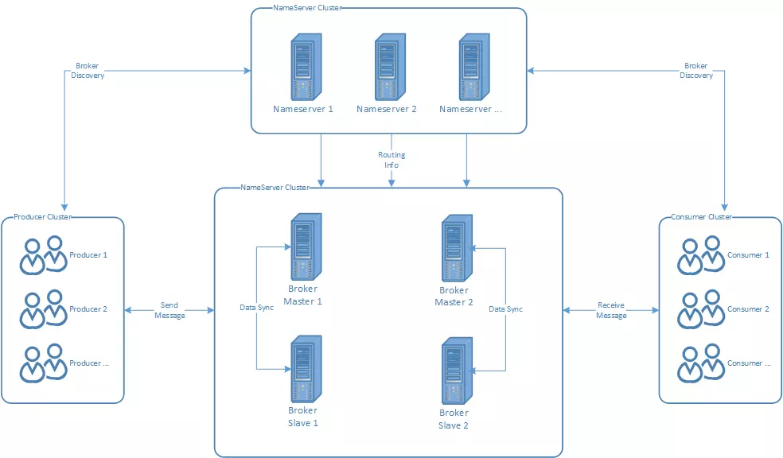
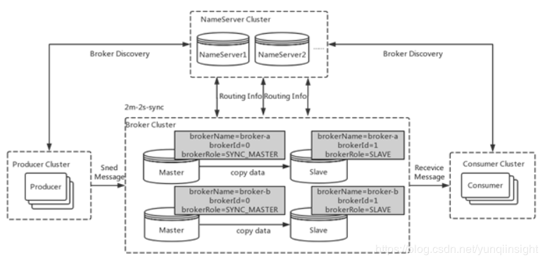

# RocketMQ 08 集群

**单Master模式**

​    只有一个 Master节点

​    优点：配置简单，方便部署

​    缺点：这种方式风险较大，一旦Broker重启或者宕机时，会导致整个服务不可用，不建议线上环境使用

**多Master模式**

​    一个集群无 Slave，全是 Master，例如 2 个 Master 或者 3 个 Master

​    优点：配置简单，单个Master 宕机或重启维护对应用无影响，在磁盘配置为RAID10 时，即使机器宕机不可恢复情况下，由与 RAID10磁盘非常可靠，消息也不会丢（异步刷盘丢失少量消息，同步刷盘一条不丢）。性能最高。多 Master 多 Slave 模式，异步复制

​    缺点：单台机器宕机期间，这台机器上未被消费的消息在机器恢复之前不可订阅，消息实时性会受到受到影响

**多Master多Slave模式（异步复制）**

​    每个 Master 配置一个 Slave，有多对Master-Slave， HA，采用异步复制方式，主备有短暂消息延迟，毫秒级。

​    优点：即使磁盘损坏，消息丢失的非常少，且消息实时性不会受影响，因为Master 宕机后，消费者仍然可以从 Slave消费，此过程对应用透明。不需要人工干预。性能同多 Master 模式几乎一样。

​    缺点： Master 宕机，磁盘损坏情况，会丢失少量消息。

**多Master多Slave模式（同步双写）**

​    每个 Master 配置一个 Slave，有多对Master-Slave， HA采用同步双写方式，主备都写成功，向应用返回成功。

​    优点：数据与服务都无单点， Master宕机情况下，消息无延迟，服务可用性与数据可用性都非常高

​    缺点：性能比异步复制模式略低，大约低 10%左右，发送单个消息的 RT会略高。目前主宕机后，备机不能自动切换为主机，后续会支持自动切换功能



&nbsp;

## 双主双从集群搭建

### 准备

1. 4台虚拟机
   1. `rm -rf /etc/udev/rules.d/70-persistent-net.rules`
   2. `vi /etc/sysconfig/network-scripts/ifcfg-eth0`
2. 配置好网络
3. 准备好RocketMQ服务端程序

### 启动NameServer

4台机器分别启动

## Broker配置

### Broker configuration

| Property Name          |           Default value           |                                                      Details |
| :--------------------- | :-------------------------------: | -----------------------------------------------------------: |
| listenPort             |               10911               |                                       listen port for client |
| namesrvAddr            |               null                |                                          name server address |
| brokerIP1              | InetAddress for network interface |            Should be configured if having multiple addresses |
| brokerName             |               null                |                                                  broker name |
| brokerClusterName      |          DefaultCluster           |                         this broker belongs to which cluster |
| brokerId               |                 0                 |      broker id, 0 means master, positive integers mean slave |
| storePathCommitLog     |      $HOME/store/commitlog/       |                                     file path for commit log |
| storePathConsumerQueue |     $HOME/store/consumequeue/     |                                  file path for consume queue |
| mapedFileSizeCommitLog |      1024 * 1024 * 1024(1G)       |                              mapped file size for commit log |
| deleteWhen             |                04                 | When to delete the commitlog which is out of the reserve time |
| fileReserverdTime      |                72                 |   The number of hours to keep a commitlog before deleting it |
| brokerRole             |           ASYNC_MASTER            |                               SYNC_MASTER/ASYNC_MASTER/SLAVE |
| flushDiskType          |            ASYNC_FLUSH            | {SYNC_FLUSH/ASYNC_FLUSH}. Broker of SYNC_FLUSH mode flushes each message onto disk before acknowledging producer. Broker of ASYNC_FLUSH mode, on the other hand, takes advantage of group-committing, achieving better performance |

**brokerClusterName：**同一个集群中，brokerClusterName需一致

**brokerId：**0 表示 Master，>0 表示 Slave

**namesrvAddr：**配置多个用分号分隔

**brokerIP1**：默认系统自动识别，但是某些多网卡机器会存在识别错误的情况，建议都手工指定

**brokerRole：**选择Broker的角色

**flushDiskType：**选择刷盘方式

**deleteWhen：** 过期文件真正删除时间

**fileReservedTime：**Commitlog、ConsumeQueue文件，如果非当前写文件在一定时间间隔内没有再次被更新，则认为是过期文件，可以被删除，RocketMQ不会管这个这个文件上的消息是否被全部消费


## 主备切换 故障转移模式



在 RocketMQ 4.5 版本之前，RocketMQ 只有 Master/Slave 一种部署方式，一组 broker 中有一个 Master ，有零到多个 
Slave，Slave 通过同步复制或异步复制的方式去同步 Master 数据。Master/Slave 部署模式，提供了一定的高可用性。 
但这样的部署模式，有一定缺陷。比如故障转移方面，如果主节点挂了，还需要人为手动进行重启或者切换，无法自动将一个从节点转换为主节点。因此，我们希望能有一个新的多副本架构，去解决这个问题。

新的多副本架构首先需要解决自动故障转移的问题，本质上来说是自动选主的问题。这个问题的解决方案基本可以分为两种：

利用第三方协调服务集群完成选主，比如 zookeeper 或者 etcd（raft）。这种方案会引入了重量级外部组件，加重部署，运维和故障诊断成本，比如在维护 RocketMQ 集群还需要维护 zookeeper 集群，并且 zookeeper 集群故障会影响到 RocketMQ 集群。
利用 raft 协议来完成一个自动选主，raft 协议相比前者的优点是不需要引入外部组件，自动选主逻辑集成到各个节点的进程中，节点之间通过通信就可以完成选主。


### DLedger

至少要组件3台服务器集群，不然无法提供选举

broker配置

```
# dleger
enableDLegerCommitLog = true
dLegerGroup = broker-a
dLegerPeers = n0-192.168.150.210:40911;n1-192.168.150.211:40911
dLegerSelfId = n0
sendMessageThreadPoolNums = 4

```

## Topic中的Queue分布

### 手动创建topic

topic可以在producer发送消息时自动创建或使用console手动创建，但还有很多细节参数无法指定 ，在生成环境中，通常我们会使用MQAdmin工具指定具体参数，

命令

```
[root@node-01 bin]# ./mqadmin updateTopic
usage: mqadmin updateTopic -b <arg> | -c <arg>  [-h] [-n <arg>] [-o <arg>] [-p <arg>] [-r <arg>] [-s <arg>] -t
       <arg> [-u <arg>] [-w <arg>]
 -b,--brokerAddr <arg>       create topic to which broker
 -c,--clusterName <arg>      create topic to which cluster
 -h,--help                   Print help
 -n,--namesrvAddr <arg>      Name server address list, eg: 192.168.0.1:9876;192.168.0.2:9876
 -o,--order <arg>            set topic's order(true|false)
 -p,--perm <arg>             set topic's permission(2|4|6), intro[2:W 4:R; 6:RW]
 -r,--readQueueNums <arg>    set read queue nums
 -s,--hasUnitSub <arg>       has unit sub (true|false)
 -t,--topic <arg>            topic name
 -u,--unit <arg>             is unit topic (true|false)
 -w,--writeQueueNums <arg>   set write queue nums

```

