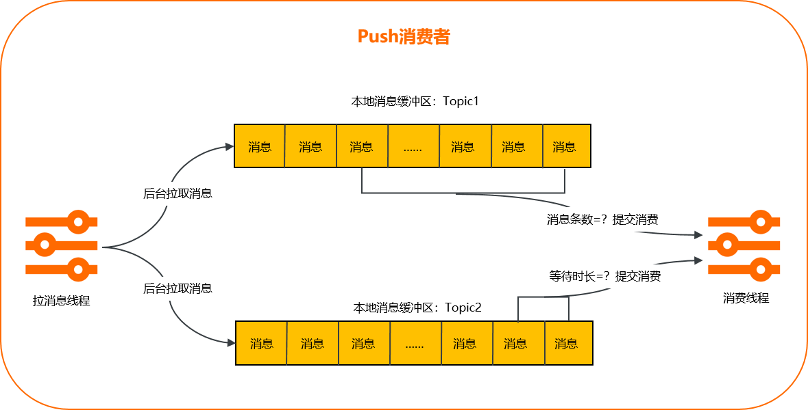

# 批量消费

如需提高消息的处理效率，或降低下游资源的API调用频率，您可使用批量消费功能。本文介绍批量消费的定义、优势与场景、使用限制和示例代码等信息。

&nbsp;

## 什么是批量消费

- 定义

  批量消费是消息队列RocketMQ版通过Push消费者提供的、将消息分批次消费的功能。

  **说明** 根据消息获取方式，消息队列RocketMQ版提供Push和Pull两种类型的消费者，更多信息，请参见[名词解释](https://www.alibabacloud.com/help/zh/doc-detail/29533.htm#concept2655)。

- 功能原理

  批量消费主要分为以下两个阶段：

  1. 消息从生产者发布至消息队列RocketMQ版后，Push消费者中的拉消息线程通过长轮询将消息拉到后台缓存。
  2. Push消费者根据缓存情况是否满足任一批量条件，判断是否将消息提交给消费线程完成消费。

  具体示意图如下所示。

  

## 使用限制

- 请确保您使用的SDK是商业版TCP Java SDK，且版本在1.8.7.3.Final或以上，详细的版本说明和获取方式，请参见[商业版TCP Java SDK版本说明](https://www.alibabacloud.com/help/zh/doc-detail/114448.htm#concept-2335081)。
- 支持一次提交最多1024条消息，支持攒批等待最多450秒。

## 功能优势及场景示例

批量消费的功能优势和场景示例说明如下：

- 优势一：提高消息的吞吐能力和处理效率

  场景示例：上游订单系统和下游Elasticsearch系统间通过消息队列RocketMQ版解耦，Elasticsearch消费订单系统的10条日志消息，每一条消息对于Elasticsearch系统而言都是一次RPC请求，假设一次RPC请求耗时10毫秒，那么不使用批量消费的耗时为10×10=100毫秒；理想状态下，使用批量消费的耗时可缩短至10毫秒，因为10条消息合并为一次消费，大大提高消息的处理效率。

- 优势二：降低下游资源的API调用频率

  场景示例：给数据库中插入数据，每更新一条数据执行一次插入任务，如果数据更新较频繁，可能会对数据库造成较大压力。此时，您可以设置每10条数据批量插入一次或每5秒执行一次插入任务，降低系统运行压力。

## 示例代码

批量消费的示例代码如下所示。

```java
import com.aliyun.openservices.ons.api.Action;
import com.aliyun.openservices.ons.api.ConsumeContext;
import com.aliyun.openservices.ons.api.Message;
import com.aliyun.openservices.ons.api.batch.BatchConsumer;
import com.aliyun.openservices.ons.api.batch.BatchMessageListener;
import java.util.List;
import java.util.Properties;

import com.aliyun.openservices.ons.api.ONSFactory;
import com.aliyun.openservices.ons.api.PropertyKeyConst;
import com.aliyun.openservices.tcp.example.MqConfig;

public class SimpleBatchConsumer {

    public static void main(String[] args) {
        Properties consumerProperties = new Properties();
        consumerProperties.setProperty(PropertyKeyConst.GROUP_ID, MqConfig.GROUP_ID);
        consumerProperties.setProperty(PropertyKeyConst.AccessKey, MqConfig.ACCESS_KEY);
        consumerProperties.setProperty(PropertyKeyConst.SecretKey, MqConfig.SECRET_KEY);
        consumerProperties.setProperty(PropertyKeyConst.NAMESRV_ADDR, MqConfig.NAMESRV_ADDR);

        // 设置批量消费最大消息数量，当指定Topic的消息数量已经攒够128条，SDK立即执行回调进行消费。默认值：32，取值范围：1~1024。
        consumerProperties.setProperty(PropertyKeyConst.ConsumeMessageBatchMaxSize, String.valueOf(128));
        // 设置批量消费最大等待时长，当等待时间达到10秒，SDK立即执行回调进行消费。默认值：0，取值范围：0~450，单位：秒。
        consumerProperties.setProperty(PropertyKeyConst.BatchConsumeMaxAwaitDurationInSeconds, String.valueOf(10));

        BatchConsumer batchConsumer = ONSFactory.createBatchConsumer(consumerProperties);
        batchConsumer.subscribe(MqConfig.TOPIC, MqConfig.TAG, new BatchMessageListener() {

             @Override
            public Action consume(final List<Message> messages, ConsumeContext context) {
                System.out.printf("Batch-size: %d\n", messages.size());
                // 批量消息处理。
                return Action.CommitMessage;
            }
        });
        //启动batchConsumer。
        batchConsumer.start();
        System.out.println("Consumer start success.");

        //等待固定时间防止进程退出。
        try {
            Thread.sleep(200000);
        } catch (InterruptedException e) {
            e.printStackTrace();
        }
    }
}         
```

参数描述如下表所示。

| 参数名                                | 参数类型 | 是否必选                                                     | 描述                                                         |
| :------------------------------------ | :------- | :----------------------------------------------------------- | :----------------------------------------------------------- |
| ConsumeMessageBatchMaxSize            | String   | 否**说明** 如未指定参数值，则使用默认值。                    | 批量消费的最大消息数量，缓存的消息数量达到参数设置的值，Push消费者SDK会将缓存的消息统一提交给消费线程，实现批量消费。取值范围：[1, 1024]，默认值：32，单位：条。 |
| BatchConsumeMaxAwaitDurationInSeconds | String   | 批量消费的最大等待时长，等待时长达到参数设置的值，会将缓存的消息统一推送给消费者进行批量消费。取值范围：[1, 1024]，默认值：0，单位：秒。 |                                                              |

**说明**

- 具体的示例代码，请以[消息队列RocketMQ版代码库](https://code.aliyun.com/aliware_rocketmq/rocketmq-demo/tree/master)为准。
- 更多参数信息，请参见[接口和参数说明](https://www.alibabacloud.com/help/zh/doc-detail/52591.htm#concept1481)。

## 最佳实践

请合理设置**ConsumeMessageBatchMaxSize**和**BatchConsumeMaxAwaitDurationInSeconds**参数的取值，只要达到任一参数设置的批量条件，即会触发提交批量消费。例如**ConsumeMessageBatchMaxSize**设置为128，**BatchConsumeMaxAwaitDurationInSeconds**设置为1，1秒内虽然没有积攒到128条消息，仍然会触发批量消费，此时返回的**Batch-size**会小于128。

此外，为了获得更好的批量消费效果，强烈推荐您实现消息幂等，保证消息有且仅被处理1次。幂等处理的具体信息，请参见[消费幂等](https://www.alibabacloud.com/help/zh/doc-detail/44397.htm#concept-2047147)。