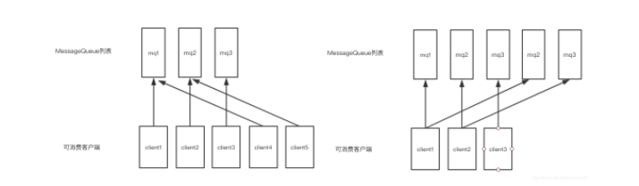

# RocketMQ 面试FAQ

&nbsp;

## 说说你们公司线上生产环境用的是什么消息中间件?

- `Kafka`
- `RocketMQ`

&nbsp;

## 为什么要使用 MQ？

因为项目比较大，做了分布式系统，所有远程服务调用请求都是**同步执行**经常出问题，所以引入了 mq

- **解耦**
  - 系统耦合度降低，没有强依赖关系
- **异步**
  - 不需要同步执行的远程调用可以有效提高响应时间
- **削峰**
  - 请求达到峰值后，后端service还可以保持固定消费速率消费，不会被压垮

&nbsp;

## 多个mq如何选型？

- **RabbitMQ**
  - erlang 开发，延迟比较低
- **RocketMQ**
  - java开发，面向互联网集群化功能丰富
- **kafka**
  - Scala开发，面向日志功能丰富
  - 大数据生态
  - Hadoop 生态
- **ActiveMQ**
  - java开发，简单，稳定
  - 对分布式支持差

&nbsp;

小项目：ActiveMQ

大项目：RocketMQ或 Kafka、RabbitMQ

&nbsp;

## RocketMQ 由哪些角色组成，每个角色作用和特点是什么？

- Name Server 
  - 无状态
  - 动态列表
  - 分布式
  - 路由
    - Broker
    - Producer
    - Consumer
  - 它不需要保证数据一致性
- Broker
  - 接收 Producer 发送的消息
  - 接收 Consumer 消费请求
  - 分布式

- Producer
  - 发消息到 Broker
- Consumer
  - 消费消息

&nbsp;

## RocketMQ中的Topic和ActiveMQ有什么区别？

### ActiveMQ 

有 destination 的概念，即消息目的地

destination分为两类：

- topic
  - 广播消息
- queue
  - 队列消息

### RocketMQ

RocketMQ 的 Topic 是一组 Message Queue （开发的对象）的集合 底层 ConsumeQueue 

一条消息是广播消息还是队列消息由客户端消费决定

&nbsp;

## RocketMQ Broker 中的消息被消费后会立即删除吗？

不会，每条消息都会持久化到 `CommitLog` 中，每个 `Consumer` 连接到 Broker 后会维持消费进度信息，当有消息消费后只是当前 Consumer 的消费进度（CommitLog 的 offset）更新了。

&nbsp;

### 那么消息会堆积吗？什么时候清理过期消息？

4.6版本默认 48 小时后会删除不再使用的 CommitLog 文件

- 检查这个文件最后访问时间
- 判断是否大于过期时间
- 指定时间删除，默认凌晨 4 点

&nbsp;

## RocketMQ消费模式有几种？

消费模型由 Consumer 决定，消费维度为 Topic

### 集群消费

- 一组 Consumer 同时消费一个 Topic，可以分配消费负载均衡策略分配 Consumer 对应消费 Topic 下的哪些queue

- 多个 Group 同时消费一个 Topic 时，每个 Group 都会消费到数据

- 一条消息只会被一个 Group 中的 consumer 消费

&nbsp;

### 广播消费

消息将对 一个 Consumer Group 下的各个 Consumer  实例都消费一遍。即使这些 Consumer 属于同一个Consumer Group ，消息也会被 Consumer Group 中的每个 Consumer 都消费一次。

&nbsp;

## 消费消息时使用的是 push 还是 pull？

在刚开始的时候就要决定使用哪种方式消费

两种：

- `DefaultLitePullConsumerImpl`  拉

- `DefaultMQPushConsumerImpl` 推

两个实现 `DefaultLitePullConsumerImpl` `DefaultMQPushConsumerImpl` 都实现了 MQConsumerInner 接口接口

名称上看起来是一个推，一个拉，但实际底层实现都是采用的 **长轮询机制**，即拉取方式

Broker 端属性 longPollingEnable 标记是否开启长轮询。默认开启

- 长轮询 5s 一次

&nbsp;

### 为什么要主动拉取消息而不使用事件监听方式？

事件驱动方式是建立好长连接，由事件（发送数据）的方式来实时推送。

如果broker主动推送消息的话有可能push速度快，消费速度慢的情况，那么就会造成消息在consumer端堆积过多，同时又不能被其他consumer消费的情况

#### 说一说几种常见的消息同步机制？

push：

如果broker主动推送消息的话有可能push速度快，消费速度慢的情况，那么就会造成消息在consumer端堆积过多，同时又不能被其他consumer消费的情况

pull：

轮训时间间隔，固定值的话会造成资源浪费

长轮询：

- 上连接 短连接（每秒） 长轮询

&nbsp;

### broker如何处理拉取请求的？

Consumer首次请求 Broker

- Broker 中是否有符合条件的消息
- 有 -> 
  - 响应 Consumer
  - 等待下次 Consumer 的请求
- 没有 ->
  - 挂起 Consumer 的请求，即不断开连接，也不返回数据
  - 挂起时间长短，写死在代码里的吗？长轮询写死，短轮询可以配
  - 使用 Consumer 的 offset，
    - `DefaultMessageStore#ReputMessageService#run()` 方法
      - 每隔 1ms 检查 `commitLog` 中是否有新消息，有的话写入到 `pullRequestTable`
      - 当有新消息的时候返回请求
    - `PullRequestHoldService` 来Hold连接，每个 `5s` 执行一次检查 `pullRequestTable` 有没有消息，有的话立即推送

&nbsp;

## RocketMQ 如何做负载均衡？

通过Topic在多 broker 种分布式存储实现

### Producer 端

发送端指定 Target message queue 发送消息到相应的 Broker，来达到写入时的负载均衡

- 提升写入吞吐量，当多个 Producer 同时向一个 Broker 写入数据的时候，性能会下降
- 消息分布在多 Broker ，为负载消费做准备

每 30 秒从 Name Server 获取 Topic 跟 Broker 的映射关系，近实时获取最新数据存储单元，queue 落地在哪个 Broker 中

在使用 api 中 send  方法的时候，可以指定 Target message queue 写入或者使用  MessageQueueSelector

&nbsp;

#### 默认策略是随机选择：

- Producer 维护一个 index
- 每次取节点会自增
- index 向所有 Broker 个数取余
- 自带容错策略

&nbsp;

#### 其他实现

- `SelectMessageQueueByHash`
  - `hash` 的是传入的 `args`
- `SelectMessageQueueByRandom`
- `SelectMessageQueueByMachineRoom` 没有实现

也可以自定义实现 **`MessageQueueSelector`**  接口中的select方法

```
MessageQueue select(final List<MessageQueue> mqs, final Message msg, final Object arg);
```

可以自定义规则来选择mqs

&nbsp;

#### 如何知道 mqs 的，mqs 的数据从哪儿来？

`producer.start()` 方法

参考源码

- 启动 `Producer` 的时候会向 nameserver 发送心跳包
- 获取 Nameserver 中的 Topic 列表
- 使用 Topic 向 Name Server 获取 topicRouteData

**TopicRouteData** 对象表示与某一个 `topic` 有关系的 `Broker` 节点信息，内部包含多个 `QueueData` 对象（可以有多个 `Broker` 集群支持该 Topic）和多个 BrokerData 信息（多个集群的多个节点信息都在该列表中）

Producer 加工 TopicRouteData，对应的多节点信息后返回 mqs。

&nbsp;

### Consumer 端

客户端完成负载均衡

- 获取集群其他节点
- 当前节点消费哪些 queue
- **负载粒度直到 Message Queue**
- **Consumer 的数量最好和 Message Queue 的数量对等或者是倍数，不然可能会有消费倾斜**
- 每个 Consumer 通过 **balanced** 维护 processQueueTable
  - processQueueTable 为当前 Consumer 的消费 queue
  - processQueueTable 中有 
    - ProcessQueue ：维护消费进度，从 Broker 中拉取回来的消息缓冲
    - MessageQueue ： 用来定位查找 queue

`DefaultMQPushConsumer` 默认 使用AllocateMessageQueueAveragely（平均分配）

&nbsp;

### 当消费负载均衡 Consumer 和 Queue 不对等的时候会发生什么？

#### 平均分配



&nbsp;

#### 环形分配


&nbsp;

#### 负载均衡算法

平均分配策略(默认)

- `AllocateMessageQueueAveragely`

环形分配策略

- `AllocateMessageQueueAveragelyByCircle`

手动配置分配策略

- `AllocateMessageQueueByConfig`

机房分配策略

- `AllocateMessageQueueByMachineRoom`

一致性哈希分配策略

- `AllocateMessageQueueConsistentHash`

靠近机房策略

- `AllocateMachineRoomNearby`

Consumer 启动流程参考源码

&nbsp;

## 消息丢失

#### SendResult

Producer 在发送同步/异步可靠消息后，会接收到 SendResult，表示消息发送成功

SendResult 其中属性 sendStatus 表示了 Broker 是否真正完成了消息存储

当 sendStatus!="ok" 的时候，应该重新发送消息，避免丢失

当 producer.setRetryAnotherBrokerWhenNotStoreOK

&nbsp;

## 消息重复消费

影响消息正常发送和消费的重要原因是网络的不确定性。

**可能是因为 Consumer 首次启动引起重复消费**

需要设置 `consumer.setConsumeFromWhere`

只对一个新的 consumeGroup 第一次启动时有效,设置从头消费还是从维护开始消费

**你们怎么保证投递出去的消息只有一条且仅仅一条，不会出现重复的数据?**

绑定业务key

**如果消费了重复的消息怎么保证数据的准确性?**

&nbsp;

### 引起重复消费的原因

#### **ACK**

正常情况下在 Consumer 真正消费完消息后应该发送 ack，通知 Broker 该消息已正常消费，从 queue 中剔除

当 Ack 因为网络原因无法发送到 Broker，Broker 会认为词条消息没有被消费，此后会开启消息重投机制把消息再次投递到 Consumer

&nbsp;

#### **group**

在 CLUSTERING 模式下，消息在 Broker 中会保证相同 Group 的 Consumer 消费一次，但是针对不同 Group 的Consumer 同样会推送

&nbsp;

### 解决方案

#### 数据库表

处理消息前，使用消息主键在表中带有约束的字段中 insert

&nbsp;

#### Map

单机时可以使用 map *ConcurrentHashMap* -> putIfAbsent   guava cache

&nbsp;

#### Redis

使用主键或set操作


> 注意，采用什么方法不重要，重要的是，此方法能保证相同的消息，即便在处理后也不会造成消息重复即可。保证数据一致性。

&nbsp;

## 如何让 RocketMQ 保证消息的顺序消费

**你们线上业务用消息中间件的时候，是否需要保证消息的顺序性?**

**如果不需要保证消息顺序，为什么不需要? 假如我有一个场景要保证消息的顺序，你们应该如何保证?**

- 同一topic
- 同一个QUEUE
- 发消息的时候一个线程去发送消息
- 消费的时候 一个线程 消费一个 queue 里的消息或者使用 MessageListenerOrderly
- 多个 queue 只能保证单个 queue 里的顺序

&nbsp;

### 应用场景是啥？

应用系统和现实的生产业务绑定，避免在分布式系统中多端消费业务消息造成顺序混乱

比如需要严格按照顺序处理的数据或业务

&nbsp;

**数据包装**/清洗

数据：

```
import java.nio.ByteBuffer;
import java.nio.charset.Charset;
import java.util.HashMap;
import java.util.Iterator;
import java.util.Map;
```


1. 去掉 import
2. 统计某个字符出现次数

&nbsp;

**业务流程处理**

返修过程

1. 收件录入信息
2. 信息核对
3. 送入检修系统处理

电商订单

1. 创建订单
2. 检查库存预扣库存
3. 支付
4. 真扣库存

binlog同步

&nbsp;

## RocketMQ 如何保证消息不丢失

1. 生产端如何保证投递出去的消息不丢失：消息在半路丢失，或者在MQ内存中宕机导致丢失，此时你如何基于MQ的功能保证消息不要丢失？
2. MQ自身如何保证消息不丢失？
3. 消费端如何保证消费到的消息不丢失：如果你处理到一半消费端宕机，导致消息丢失，此时怎么办？

&nbsp;

### 解耦的思路

#### 发送方

发送消息时做消息备份（记日志或同步到数据库），判断 sendResult 是否正常返回

&nbsp;

#### broker

**节点保证**

- master 接受到消息后同步刷盘，保证了数据持久化到了本机磁盘中
- 同步写入 slave
- 写入完成后返回 SendResult

&nbsp;

#### consumer

- 记日志
- 同步执行业务逻辑，最后返回 ack
- 异常控制 

**磁盘保证**

使用 Raid 磁盘阵列保证数据磁盘安全

**网络数据篡改**

内置 TLS 可以开启，默认使用crc32校验数据

&nbsp;

### 消息刷盘机制底层实现

每间隔10ms，执行一次数据持久化操作

两种， 同步刷、异步刷

```
   public void run() {
            CommitLog.log.info(this.getServiceName() + " service started");

            while (!this.isStopped()) {
                try {
                    this.waitForRunning(10);
                    this.doCommit();
                } catch (Exception e) {
                    CommitLog.log.warn(this.getServiceName() + " service has exception. ", e);
                }
            }

```

&nbsp;

## rocketMq 的消息堆积如何处理

下游消费系统如果宕机了，导致几百万条消息在消息中间件里积压，此时怎么处理?

你们线上是否遇到过消息积压的生产故障?如果没遇到过，你考虑一下如何应对?

具体表现为 ui 中转圈圈

对于大规模消息发送接收可以使用 pull 模式，手动处理消息拉取速度, 消费的时候统计消费时间以供参考

保证消息消费速度固定，即可通过上线更多 Consumer 临时解决消息堆积问题

&nbsp;

### 如果 Consumer 和 Queue 不对等，上线了多台也在短时间内无法消费完堆积的消息怎么办 ？

- 准备一个临时的 Topic
- queue 的数量是堆积的几倍
- queue分不到多 Broker 中
- 上线一台consumer做消息的搬运工，把原来 topic 中的消息挪到新的 Topic 里，不做业务逻辑处理，只是挪过去
- 上线 N 台 Consumer 同时消费临时 Topic 中的数据
- 改bug
- 恢复原来的 Consumer，继续消费之前的 Topic

&nbsp;

### 堆积时间过长消息超时了？

RocketMQ 中的消息只会在 commitLog 被删除的时候才会消失，不会超时

&nbsp;

### 堆积的消息会不会进死信队列？

不会，消息在消费失败后会进入重试队列（%RETRY%+consumergroup），多次（默认16）才会进入死信队列（%DLQ%+consumergroup）

&nbsp;

## 你们用的是 RocketMQ? 那你说说RocketMQ的底层架构原理，磁盘上数据如何存储的，整体分布式架构是如何实现的?

## 零拷贝等技术是如何运用的?

使用 nio 的 MappedByteBuffer 调起数据输出

&nbsp;

## 你们用的是RocketMQ?RocketMQ很大的一个特点是对分布式事务的支持，你说说他在分布式事务支持这块机制的底层原理?

分布式系统中的事务可以使用 TCC（Try、Confirm、Cancel）、2pc 来解决分布式系统中的消息原子性

RocketMQ 4.3+ 提供分布事务功能，通过 RocketMQ 事务消息能达到分布式事务的最终一致

&nbsp;

#### RocketMQ实现方式

**Half Message：**预处理消息，当broker收到此类消息后，会存储到 `RMQ_SYS_TRANS_HALF_TOPIC` 的消息消费队列中

**检查事务状态：**Broker 会开启一个定时任务，消费 `RMQ_SYS_TRANS_HALF_TOPIC` 队列中的消息，每次执行任务会向消息发送者确认事务执行状态（提交、回滚、未知），如果是未知，等待下一次回调。

**超时：**如果超过回查次数，默认回滚消息

&nbsp;

#### TransactionListener的两个方法

##### executeLocalTransaction

半消息发送成功触发此方法来执行本地事务

##### checkLocalTransaction

broker将发送检查消息来检查事务状态，并将调用此方法来获取本地事务状态

##### 本地事务执行状态

**LocalTransactionState.COMMIT_MESSAGE**

执行事务成功，确认提交

**LocalTransactionState.ROLLBACK_MESSAGE**

回滚消息，broker端会删除半消息

**LocalTransactionState.UNKNOW**

暂时为未知状态，等待broker回查

&nbsp;

## 如果让你来动手实现一个分布式消息中间件，整体架构你会如何设计实现?

&nbsp;

## 看过RocketMQ 的源码没有。如果看过，说说你对 RocketMQ  源码的理解?

&nbsp;

## 高吞吐量下如何优化 Producer 和 Consumer 的性能?

&nbsp;

### Comsume

- 同一 `group` 下，多机部署，并行消费

- 单个 `Consumer` 提高消费线程个数
- 批量消费
  - 消息批量拉取
  - 业务逻辑批量处理

&nbsp;

### 运维

- 网卡调优
- `jvm` 调优
- 多线程 与`cpu` 调优
- `Page Cache`

&nbsp;

## 再说说 RocketMQ 是如何保证数据的高容错性的?

- 在不开启容错的情况下，轮询队列进行发送，如果失败了，重试的时候过滤失败的 Broker
- 如果开启了容错策略，会通过 RocketMQ 的预测机制来预测一个 Broker 是否可用
- 如果上次失败的 Broker 可用那么还是会选择该 Broker 的队列
- 如果上述情况失败，则随机选择一个进行发送
- 在发送消息的时候会记录一下调用的时间与是否报错，根据该时间去预测 Broker 的可用时间

&nbsp;