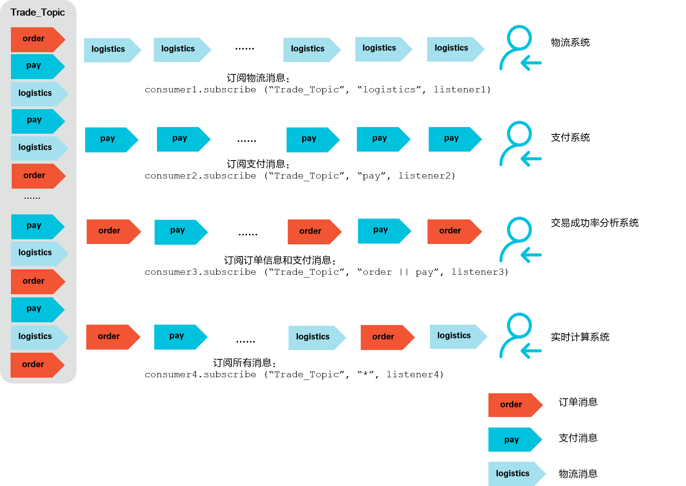

# 消息过滤

&nbsp;

本文描述消息队列 RocketMQ 版的 Consumer 如何根据 Tag 在消息队列 RocketMQ版 服务端完成 message filter，以确保 Consumer 最终只消费到其关注的消息类型。

Tag，即消息标签，用于对某个 Topic 下的消息进行分类。消息队列RocketMQ版的生产者在发送消息时，已经指定消息的Tag，消费者需根据已经指定的Tag来进行订阅。

&nbsp;

## 场景示例

以下图电商交易场景为例，从客户下单到收到商品这一过程会生产一系列消息，以以下消息为例：

- 订单消息
- 支付消息
- 物流消息

这些消息会发送到 **Trade_Topic** Topic中，被各个不同的系统所订阅，以以下系统为例：

- 支付系统：只需订阅支付消息。
- 物流系统：只需订阅物流消息。
- 交易成功率分析系统：需订阅订单和支付消息。
- 实时计算系统：需要订阅所有和交易相关的消息。

过滤示意图如下所示。



&nbsp;

## 示例代码

- 发送消息

  发送消息时，每条消息必须指明Tag。

  ```java
      Message msg = new Message("MQ_TOPIC","TagA","Hello MQ".getBytes());                
  ```

&nbsp;

- 订阅所有Tag

  消费者如需订阅某Topic下所有类型的消息，Tag用星号（*）表示。

  ```java
      consumer.subscribe("MQ_TOPIC", "*", new MessageListener() {
          public Action consume(Message message, ConsumeContext context) {
              System.out.println(message.getMsgID());
              return Action.CommitMessage;
          }
      });                
  ```

&nbsp;

- 订阅单个Tag

  消费者如需订阅某Topic下某一种类型的消息，请明确标明 Tag。

  ```java
      consumer.subscribe("MQ_TOPIC", "TagA", new MessageListener() {
          public Action consume(Message message, ConsumeContext context) {
              System.out.println(message.getMsgID());
              return Action.CommitMessage;
          }
      });                
  ```

&nbsp;

- 订阅多个Tag

  消费者如需订阅某Topic下多种类型的消息，请在多个Tag之间用两个竖线（||）分隔。

  ```java
      consumer.subscribe("MQ_TOPIC", "TagA||TagB", new MessageListener() {
          public Action consume(Message message, ConsumeContext context) {
              System.out.println(message.getMsgID());
              return Action.CommitMessage;
          }
      });                
  ```

&nbsp;

- 错误示例

  同一个消费者多次订阅某个 Topic 下的 Tag，以最后一次订阅的Tag为准。

  ```java
      //如下错误代码中，Consumer只能订阅到 MQ_TOPIC 下 TagB 的消息，而不能订阅 TagA 的消息。
      consumer.subscribe("MQ_TOPIC", "TagA", new MessageListener() {
          public Action consume(Message message, ConsumeContext context) {
              System.out.println(message.getMsgID());
              return Action.CommitMessage;
          }
      });
      consumer.subscribe("MQ_TOPIC", "TagB", new MessageListener() {
          public Action consume(Message message, ConsumeContext context) {
              System.out.println(message.getMsgID());
              return Action.CommitMessage;
          }
      });                
  ```

&nbsp;