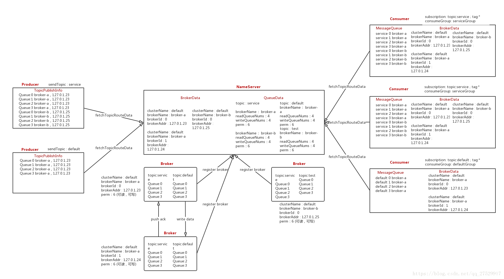
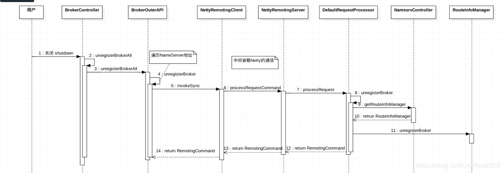

https://blog.csdn.net/ever223/article/details/100547232

## RouteInfoManager

RouteInfoManager作为NameServer数据的载体，记录Broker、Topic、QueueData等信息。
Broker在启动时会将Broker信息、Topic信息、QueueData信息注册到所有的NameServer上，并和所有NameServer节点保持长连接，之后也会定时注册信息；
Producer、Consumer也会和其中一个NameServer节点保持长连接，定时从NameServer中获取Topic路由信息；
四者之间的数据交互如下图。




RouteInfoManager主要具备以下功能：

查询集群的Topic、Broker信息等
删除Topic；
注册Broker；
注销Broker；
获取Topic路由信息，主要供Producer、Consumer使用；
扫描宕掉的Broker，并剔除；
成员变量
topicQueueTable（topic-队列映射表）：记录一个主题的队列分布在哪些Broker上，每个Broker上存在该主题的队列个数；
brokerAddrTable（broker地址映射表）：存储所有broker信息，brokerName为key，BrokerData信息描述每一个broker信息；
clusterAddrTable（集群-broker映射表）：记录每个集群包含哪些broker；
brokerLiveTable（broker地址-broker存活信息映射表）：，记录当前存活的Broker,NamesrvController定时任务每隔10S扫描一次所有的broker,根据心跳包的时间得知broker的状态。因此该表存储的信息不是实时的，当一个Master 宕掉后，消息生产者无法感知，可能继续向Down掉的Master发送消息，导致失败。

```java
// org.apache.rocketmq.namesrv.routeinfo.RouteInfoManager
/**
 *  NameServer与Broker空闲时长，默认2分钟，在2分钟内Nameserver没有收到Broker的心跳包，则关闭该连接。单位（毫秒）
 */
private final static long BROKER_CHANNEL_EXPIRED_TIME = 1000 * 60 * 2;
/**
 * 读写锁，保护非线程安全容器HashMap
 */
private final ReadWriteLock lock = new ReentrantReadWriteLock();
/**
 * topic-队列映射表，记录一个主题的队列分布在哪些Broker上，每个Broker上存在该主题的队列个数
 */
private final HashMap<String/* topic */, List<QueueData>> topicQueueTable;
/**
 * broker地址映射表，存储所有broker信息，brokerName为key，BrokerData信息描述每一个broker信息
 */
private final HashMap<String/* brokerName */, BrokerData> brokerAddrTable;
/**
 * 集群-broker映射表，每个集群包含哪些broker
 */
private final HashMap<String/* clusterName */, Set<String/* brokerName */>> clusterAddrTable;
/**
 * broker地址-broker存活信息映射表，当前存活的Broker,该信息不是实时的
 */
private final HashMap<String/* brokerAddr */, BrokerLiveInfo> brokerLiveTable;
/**
 * broker地址-过滤服务器映射表
 * Filter Server是消息的过滤服务器，一个Broker可以对应多个Filter Server
 */
private final HashMap<String/* brokerAddr */, List<String>/* Filter Server */> filterServerTable;
```


&nbsp;

##### QueueData

QueueData: 队列数据结构

```java
// org.apache.rocketmq.common.protocol.route.QueueData
public class QueueData implements Comparable<QueueData> {
    private String brokerName;      // broker名称
    private int readQueueNums;      // 读队列个数
    private int writeQueueNums;     // 写队列个数
    private int perm;               // 权限操作
    private int topicSynFlag;       // 同步复制还是异步复制
}
```

&nbsp;

##### BrokerData

BrokerData保存着Broker的信息。

```java
// org.apache.rocketmq.common.protocol.route.BrokerData
public class BrokerData implements Comparable<BrokerData> {
    private String cluster;         // 集群名称
    private String brokerName;      // broker名称
    private HashMap<Long/* brokerId */, String/* broker address */> brokerAddrs; // brokerId-broker地址映射

    private final Random random = new Random();

    /**
     * 从注册的地址中选择一个broker地址（优先选择master）
     * 如果没有master地址，则随机选择一个slave地址
     * @return Broker address.
     */
    public String selectBrokerAddr() {
        // MixAll.MASTER_ID = 0
        String addr = this.brokerAddrs.get(MixAll.MASTER_ID);

        if (addr == null) {
            List<String> addrs = new ArrayList<String>(brokerAddrs.values());
            return addrs.get(random.nextInt(addrs.size()));
        }

        return addr;
    }
}
```


&nbsp;

##### BrokerLiveInfo

BrokerLiveInfo保存Broker与NameServer的心跳数据。

```java
// org.apache.rocketmq.namesrv.routeinfo.BrokerLiveInfo
class BrokerLiveInfo {
    private long lastUpdateTimestamp;   // 最近更新时间
    private DataVersion dataVersion;    // 数据版本
    private Channel channel;            // 与该broker连接的通道
    private String haServerAddr;
}
```

&nbsp;

#### 删除Topic

```java
// org.apache.rocketmq.namesrv.routeinfo.RouteInfoManager#deleteTopic
public void deleteTopic(final String topic) {
    try {
        try {
            this.lock.writeLock().lockInterruptibly();
            // 从topic-队列映射表中移除
            this.topicQueueTable.remove(topic);
        } finally {
            this.lock.writeLock().unlock();
        }
    } catch (Exception e) {
        log.error("deleteTopic Exception", e);
    }
}
```

&nbsp;

## 注册Broker

Broker启动时，会加载本地配置中的Topic信息，包括Topic名称、Topic的Queue权限（可读、可写）、Queue的个数等。然后向其配置的所有NameServer节点执行registerBroker，将这些数据注册到NameServer上；
NameServer与Broker之间维持着一个SocketChannel，这是一个长连接。Broker每隔30秒，同样会向其配置的所有的NameServer进行信息注册，这就是Broker和NameServer间的心跳；
NameServer在接受到Broker传递的心跳信息时：若这次心跳是其第一次心跳，那么创建BrokerData，创建BrokerLiveInfo，保存其dataVersion和lastUpdateTimestamp；如果不是第一次，那么更新其lastUpdateTimestamp和dataVersion；
如果这个Broker是Master，且这次心跳信息是该Broker的第一次心跳，那么会创建当前Broker的QueueData。如果不是第一次心跳，但当前Broker的dataVersion与NameServer上保存的不一致(当Broker上新增加了topic时会更新dataVersion，dataVersion主要用当前时间戳表示)，此时会用当前的心跳数据覆盖之前的数据；
如果当前Broker是Slave，那么将Master的地址放入心跳注册结果中，返回给Slave，这样Slave就能与Master进行数据传输；
NameServer维护着与其他组件的SocketChannel对象，针对所有组件(Broker、Producer、Consumer)的长连接注册了ChannelEventListener，监听此SocketChannel的连接事件。当某个SocketChannel出现异常或断开时(注意是长连接断开而不是心跳停止)，会循环遍历所有Broker的长连接，如果发现断开长连接是属于某个Broker的，那么清除此Broker的BrokerData和QueueData，如果不属于Broker，则什么都不做。这样当Producer和Consumer下次请求指定Topic的TopicRouteData时，就不会包含此Broker的的数据了，也就是MessageQueue上不再包含此Broker上的Queue；
因为ChannelEventListener的连接事件处理里只对Broker做相应处理，没有涉及到Producer和Consumer。所以在Broker宕机或者增加时，不会实时通知Producer和Consumer，Producer和Consumer最晚需要30S时间才能感知到这种变化，因为Producer和Consumer更新TopicRouteData的间隔是30S；
NameServer每隔30S对所有Broker的长连接进行扫描，当发现当前时间戳与lastUpdateTimestamp之差超过2min时，就会断开长连接，并清空相应数据；


```java
/**
 * 注册broker
 * @param clusterName   所属集群
 * @param brokerAddr    broker ip地址
 * @param brokerName    broker 名称
 * @param brokerId      broker id， 0 表示master
 * @param haServerAddr
 * @param topicConfigWrapper
 * @param filterServerList
 * @param channel
 * @return
 */
public RegisterBrokerResult registerBroker(
    final String clusterName,
    final String brokerAddr,
    final String brokerName,
    final long brokerId,
    final String haServerAddr,
    final TopicConfigSerializeWrapper topicConfigWrapper,
    final List<String> filterServerList,
    final Channel channel) {
    RegisterBrokerResult result = new RegisterBrokerResult();
    try {
        try {
            // 加写锁
            this.lock.writeLock().lockInterruptibly();
            // 根据集群名获取所有Broker
            Set<String> brokerNames = this.clusterAddrTable.get(clusterName);
            if (null == brokerNames) {
                // 若该集群下无注册的Broker，则初始化列表
                brokerNames = new HashSet<String>();
                this.clusterAddrTable.put(clusterName, brokerNames);
            }
            // 将待注册的Broker名称加入Broker表
            brokerNames.add(brokerName);
            // 是否首次注册
            boolean registerFirst = false;

            // 根据Broker名称从Broker表中获取BrokerData
            BrokerData brokerData = this.brokerAddrTable.get(brokerName);
            if (null == brokerData) {
                // 若不存在，则本次为首次注册
                registerFirst = true;
                // 创建BrokerData，初始化broker地址列表为空
                brokerData = new BrokerData(clusterName, brokerName, new HashMap<Long, String>());
                // 加入Broker表
                this.brokerAddrTable.put(brokerName, brokerData);
            }

            Map<Long, String> brokerAddrsMap = brokerData.getBrokerAddrs();
            //Switch slave to master: first remove <1, IP:PORT> in namesrv, then add <0, IP:PORT>
            //The same IP:PORT must only have one record in brokerAddrTable
            Iterator<Entry<Long, String>> it = brokerAddrsMap.entrySet().iterator();
            // 同一个 IP:PORT 在 brokerAddrTable中只能有一条记录
            while (it.hasNext()) {
                Entry<Long, String> item = it.next();
                // 检查对应的broker地址在broker地址表中是否存在，如果brokerId不一致，则需要先移除掉
                if (null != brokerAddr && brokerAddr.equals(item.getValue()) && brokerId != item.getKey()) {
                    it.remove();
                }
            }
            // 将地址保存
            String oldAddr = brokerAddrsMap.put(brokerId, brokerAddr);
            // 判断是否首次注册
            registerFirst = registerFirst || (null == oldAddr);

            // 是否为master broker
            if (null != topicConfigWrapper
                && MixAll.MASTER_ID == brokerId) {
                // broker的配置变更了或者属于首次注册，注册QueueData
                if (this.isBrokerTopicConfigChanged(brokerAddr, topicConfigWrapper.getDataVersion()) || registerFirst) {
                    ConcurrentMap<String, TopicConfig> tcTable = topicConfigWrapper.getTopicConfigTable();
                    if (tcTable != null) {
                        for (Map.Entry<String, TopicConfig> entry : tcTable.entrySet()) {
                            this.createAndUpdateQueueData(brokerName, entry.getValue());
                        }
                    }
                }
            }

            // 注册broker存活信息
            BrokerLiveInfo prevBrokerLiveInfo = this.brokerLiveTable.put(brokerAddr,
                new BrokerLiveInfo(
                    System.currentTimeMillis(),
                    topicConfigWrapper.getDataVersion(),
                    channel,
                    haServerAddr));
            // 新注册
            if (null == prevBrokerLiveInfo) {
                log.info("new broker registered, {} HAServer: {}", brokerAddr, haServerAddr);
            }

            // 过滤服务器列表是否为空
            if (filterServerList != null) {
                if (filterServerList.isEmpty()) {
                    this.filterServerTable.remove(brokerAddr);
                } else {
                    this.filterServerTable.put(brokerAddr, filterServerList);
                }
            }

            // 待注册的broker不是master，为salve，需要将master的地址返回
            if (MixAll.MASTER_ID != brokerId) {
                // 获取master的地址
                String masterAddr = brokerData.getBrokerAddrs().get(MixAll.MASTER_ID);
                if (masterAddr != null) {
                    // 获取master的存活信息
                    BrokerLiveInfo brokerLiveInfo = this.brokerLiveTable.get(masterAddr);
                    // master存活
                    if (brokerLiveInfo != null) {
                        // 设置该master为HA服务
                        result.setHaServerAddr(brokerLiveInfo.getHaServerAddr());
                        // 设置master地址，这样salve就能和master通信了
                        result.setMasterAddr(masterAddr);
                    }
                }
            }
        } finally {
            // 释放写锁
            this.lock.writeLock().unlock();
        }
    } catch (Exception e) {
        log.error("registerBroker Exception", e);
    }

    return result;
}

/**
 * 指定broker ip的dataVersion是否变更
 * @param brokerAddr
 * @param dataVersion
 * @return
 */
public boolean isBrokerTopicConfigChanged(final String brokerAddr, final DataVersion dataVersion) {
    // 查询数据版本
    DataVersion prev = queryBrokerTopicConfig(brokerAddr);
    // 比较版本是否一致
    return null == prev || !prev.equals(dataVersion);
}

/**
 * 根据 broker ip查询dataVersion
 * @param brokerAddr
 * @return
 */
public DataVersion queryBrokerTopicConfig(final String brokerAddr) {
    // 从存活信息表中查询
    BrokerLiveInfo prev = this.brokerLiveTable.get(brokerAddr);
    if (prev != null) {
        return prev.getDataVersion();
    }
    return null;
}

/**
 * 创建或更新QueueData
 * @param brokerName
 * @param topicConfig
 */
private void createAndUpdateQueueData(final String brokerName, final TopicConfig topicConfig) {
    QueueData queueData = new QueueData();
    // 设置brokerName
    queueData.setBrokerName(brokerName);
    // 设置写队列个数
    queueData.setWriteQueueNums(topicConfig.getWriteQueueNums());
    // 设置读队列个数
    queueData.setReadQueueNums(topicConfig.getReadQueueNums());
    // 设置操作权限
    queueData.setPerm(topicConfig.getPerm());
    // 设置同步、异步标志
    queueData.setTopicSynFlag(topicConfig.getTopicSysFlag());
    // 获取指定topic名称的QueueData列表
    List<QueueData> queueDataList = this.topicQueueTable.get(topicConfig.getTopicName());
    // 若不存在，直接插入
    if (null == queueDataList) {
        queueDataList = new LinkedList<QueueData>();
        queueDataList.add(queueData);
        this.topicQueueTable.put(topicConfig.getTopicName(), queueDataList);
        log.info("new topic registered, {} {}", topicConfig.getTopicName(), queueData);
    } else {
        // 是否需要新增标志
        boolean addNewOne = true;

        Iterator<QueueData> it = queueDataList.iterator();
        while (it.hasNext()) {
            QueueData qd = it.next();
            if (qd.getBrokerName().equals(brokerName)) {
                // 没有变更， 不需要更新
                if (qd.equals(queueData)) {
                    addNewOne = false;
                } else {
                    // 需要更新，先移除
                    log.info("topic changed, {} OLD: {} NEW: {}", topicConfig.getTopicName(), qd,
                        queueData);
                    it.remove();
                }
            }
        }
        // 需要更新
        if (addNewOne) {
            queueDataList.add(queueData);
        }
    }
}
```


&nbsp;

#### 注销Broker

当Broker下线，或者之间的长连接断开后，就会将该 Broker 的信息注销掉。Broker 与 NameServer 交互时序图如下：


```java
/**
 * 注销broker
 * @param clusterName   集群名称
 * @param brokerAddr    broker 地址
 * @param brokerName    broker  名称
 * @param brokerId      broker id
 */
public void unregisterBroker(
    final String clusterName,
    final String brokerAddr,
    final String brokerName,
    final long brokerId) {
    try {
        try {
            // 加写锁
            this.lock.writeLock().lockInterruptibly();
            // 存活信息表中移除broker地址
            BrokerLiveInfo brokerLiveInfo = this.brokerLiveTable.remove(brokerAddr);
            log.info("unregisterBroker, remove from brokerLiveTable {}, {}",
                brokerLiveInfo != null ? "OK" : "Failed",
                brokerAddr
            );
            // filterServerTable移除broker地址
            this.filterServerTable.remove(brokerAddr);
            // 是否从brokerAddrTable移除brokerName标志
            boolean removeBrokerName = false;
            //
            BrokerData brokerData = this.brokerAddrTable.get(brokerName);
            if (null != brokerData) {
                // 移除brokerData中的该broker
                String addr = brokerData.getBrokerAddrs().remove(brokerId);
                log.info("unregisterBroker, remove addr from brokerAddrTable {}, {}",
                    addr != null ? "OK" : "Failed",
                    brokerAddr
                );
                // 如果该brokerName下无机器了，则从brokerAddrTable中移除brokerName
                if (brokerData.getBrokerAddrs().isEmpty()) {
                    this.brokerAddrTable.remove(brokerName);
                    log.info("unregisterBroker, remove name from brokerAddrTable OK, {}",
                        brokerName
                    );
                    // 移除brokerName标志置true
                    removeBrokerName = true;
                }
            }
            // 已经从brokerAddrTable移除了brokerName，则需要将clusterAddrTable中的brokerName也移除掉
            if (removeBrokerName) {
                Set<String> nameSet = this.clusterAddrTable.get(clusterName);
                if (nameSet != null) {
                    // 移除brokerName
                    boolean removed = nameSet.remove(brokerName);
                    log.info("unregisterBroker, remove name from clusterAddrTable {}, {}",
                        removed ? "OK" : "Failed",
                        brokerName);
                    // 该clusterName下无其他broker，则将cluster也整体删掉
                    if (nameSet.isEmpty()) {
                        this.clusterAddrTable.remove(clusterName);
                        log.info("unregisterBroker, remove cluster from clusterAddrTable {}",
                            clusterName
                        );
                    }
                }
                // 移除该brokerName下的所有Topic
                this.removeTopicByBrokerName(brokerName);
            }
        } finally {
            // 释放写锁
            this.lock.writeLock().unlock();
        }
    } catch (Exception e) {
        log.error("unregisterBroker Exception", e);
    }
}

private void removeTopicByBrokerName(final String brokerName) {
    Iterator<Entry<String, List<QueueData>>> itMap = this.topicQueueTable.entrySet().iterator();
    // 遍历topicQueueTable，释放brokerName下的队列
    while (itMap.hasNext()) {
        Entry<String, List<QueueData>> entry = itMap.next();

        String topic = entry.getKey();
        List<QueueData> queueDataList = entry.getValue();
        Iterator<QueueData> it = queueDataList.iterator();
        while (it.hasNext()) {
            QueueData qd = it.next();
            if (qd.getBrokerName().equals(brokerName)) {
                log.info("removeTopicByBrokerName, remove one broker's topic {} {}", topic, qd);
                it.remove();
            }
        }
        // 该topic下的队列为空，则释放topic
        if (queueDataList.isEmpty()) {
            log.info("removeTopicByBrokerName, remove the topic all queue {}", topic);
            itMap.remove();
        }
    }
}
```

