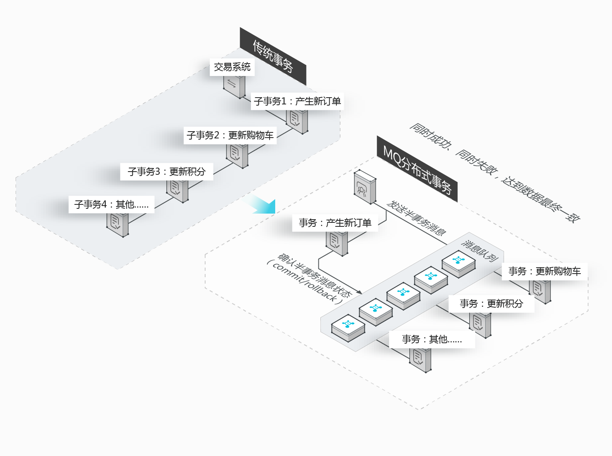

# 事务消息

RocketMQ 提供的分布式事务消息适用于所有对数据最终一致性有强需求的场景。本文介绍 RocketMQ 事务消息的概念、优势、典型场景、交互流程以及使用过程中的注意事项。

&nbsp;

## 概念介绍

- 事务消息：`RocketMQ` 提供类似 X 或 Open XA 的分布式事务功能，通过事务消息能达到分布式事务的最终一致。
- 半事务消息：暂不能投递的消息，发送方已经成功地将消息发送到了 Server，但是 Server 未收到 Producer 对该消息的二次确认，此时该消息被标记成 “暂不能投递” 状态，处于该种状态下的消息即半事务消息。
- 消息回查：由于网络闪断、Producer 应用重启等原因，导致某条事务消息的二次确认丢失，RocketMQ 通过扫描发现某条消息长期处于 “半事务消息” 时，需要主动向消息 Producer 询问该消息的最终状态（`Commit` 或是 `Rollback`），该询问过程即消息回查。

&nbsp;

## 分布式事务消息的优势

RocketMQ 分布式事务消息不仅可以实现应用之间的解耦，又能保证数据的最终一致性。同时，传统的大事务可以被拆分为小事务，不仅能提升效率，还不会因为某一个关联应用的不可用导致整体回滚，从而最大限度保证核心系统的可用性。在极端情况下，如果关联的某一个应用始终无法处理成功，也只需对当前应用进行补偿或数据订正处理，而无需对整体业务进行回滚。



&nbsp;

## 典型场景

在淘宝购物车下单时，涉及到购物车系统和交易系统，这两个系统之间的数据最终一致性可以通过分布式事务消息的异步处理实现。在这种场景下，交易系统是最为核心的系统，需要最大限度地保证下单成功。而购物车系统只需要 RocketMQ 的交易订单消息，做相应的业务处理，即可保证最终的数据一致性。

&nbsp;

## 交互流程

事务消息交互流程如下图所示。


&nbsp;

事务消息发送步骤如下：

1. 发送方将半事务消息发送至 RocketMQ Server。
2.  RocketMQ Server 将消息持久化成功之后，向发送方返回 Ack 确认消息已经发送成功，此时消息为半事务消息。
3. 发送方开始执行本地事务逻辑。
4. 发送方根据本地事务执行结果向服务端提交二次确认（ `Commit` 或是 `Rollback` ），服务端收到Commit状态则将半事务消息标记为可投递，订阅方最终将收到该消息；服务端收到Rollback状态则删除半事务消息，订阅方将不会接受该消息。

&nbsp;

事务消息回查步骤如下：

1. 在断网或者是应用重启的特殊情况下，上述步骤4提交的二次确认最终未到达服务端，经过固定时间后服务端将对该消息发起消息回查。
2. 发送方收到消息回查后，需要检查对应消息的本地事务执行的最终结果。
3. 发送方根据检查得到的本地事务的最终状态再次提交二次确认，服务端仍按照步骤4对半事务消息进行操作。

&nbsp;

## 注意事项

1. 事务消息的 Group ID 不能与其他类型消息的 Group ID 共用。与其他类型的消息不同，事务消息有回查机制，回查时 RocketMQ Server 会根据 Group ID 去查询 client。
2. 通过 `ONSFactory.createTransactionProducer` 创建事务消息的 Producer 时必须指定 `LocalTransactionChecker` 的实现类，处理异常情况下事务消息的回查。
3. 事务消息发送完成本地事务后，可在 `execute` 方法中返回以下三种状态：

- `TransactionStatus.CommitTransaction`：提交事务，允许订阅方消费该消息。

- `TransactionStatus.RollbackTransaction`：回滚事务，消息将被丢弃不允许消费。
- `TransactionStatus.Unknow`：暂时无法判断状态，等待固定时间以后 RocketMQ Server 向发送方进行消息回查。

4. 可通过以下方式给每条消息设定第一次消息回查的最快时间：

```java
Message message = new Message();
// 在消息属性中添加第一次消息回查的最快时间，单位秒。例如，以下设置实际第一次回查时间为120秒~125秒之间
message.putUserProperties(PropertyKeyConst.CheckImmunityTimeInSeconds,"120");
// 以上方式只确定事务消息的第一次回查的最快时间，实际回查时间向后浮动0秒~5秒；如第一次回查后事务仍未提交，后续每隔5秒回查一次
```

&nbsp;

# 收发事务消息

更新时间： 2021-01-06

本文提供使用TCP协议下的Java SDK收发事务消息的示例代码。

RocketMQ 提供类似X 或 Open XA 的分布式事务功能，通过 RocketMQ 事务消息，能达到分布式事务的最终一致。

下列是阿里商业版例子（可借鉴思路）自行看源码，在一定的程度上比开源的有更高的可用性，性能高些： 

```xml
<!-- https://mvnrepository.com/artifact/com.aliyun.openservices/ons-client -->
<dependency>
    <groupId>com.aliyun.openservices</groupId>
    <artifactId>ons-client</artifactId>
    <version>1.8.8.Final</version>
</dependency>
```

&nbsp;

## 事务回查机制说明

- 发送事务消息为什么必须要实现回查 Check 机制？

  当半事务消息发送完成，但本地事务返回状态为 `TransactionStatus.Unknow`，或者应用退出导致本地事务未提交任何状态时，从 Broker 的角度看，这条 Half 状态的消息的状态是未知的。因此 Broker 会定期要求发送方 Check 该 Half 状态消息，并上报其最终状态。

- Check被回调时，业务逻辑都需要做些什么？

  事务消息的 Check 方法里面，应该写一些检查事务一致性的逻辑。RocketMQ 发送事务消息时需要实现 `LocalTransactionChecker` 接口，用来处理 Broker 主动发起的本地事务状态回查请求，因此在事务消息的 Check 方法中，需要完成两件事情：

  1. 检查该半事务消息对应的本地事务的状态（committed 或者 rollback）。
  2. 向 Broker 提交该半事务消息本地事务的状态。

&nbsp;